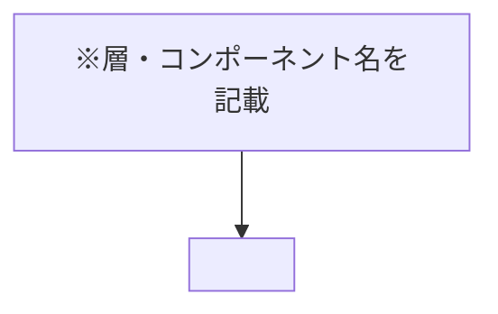
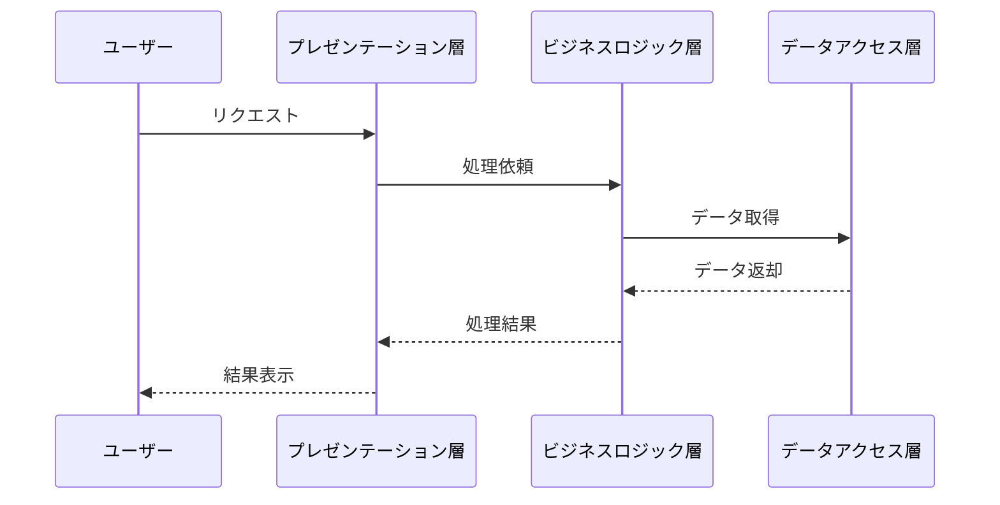
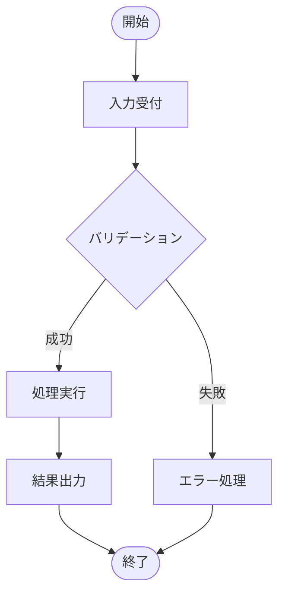
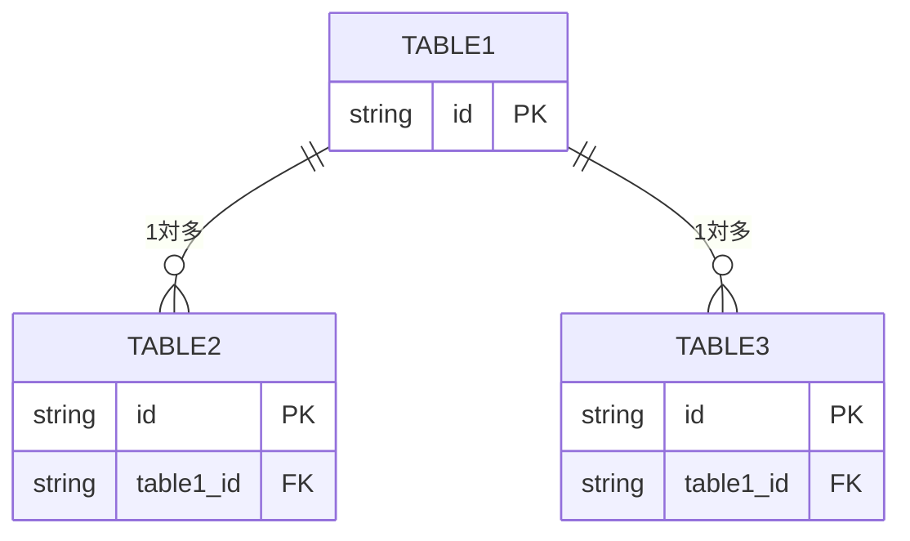
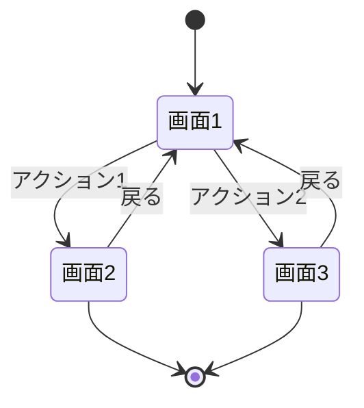

# 設計書: {プロジェクト名}

**プロジェクト名**: {プロジェクト名}  
**作成日**: {YYYY 年 MM 月 DD 日}  
**最終更新**: {YYYY 年 MM 月 DD 日}

> **重要**: **このドキュメントは常に更新**: 設計の変更や追加があった場合は、即座にこのドキュメントを更新してください。ドキュメントは「生きているドキュメント」として扱い、実装内容と常に同期させます。
>
> **用語**: [.agent-skill-chain/source/CONCEPTS.md §用語規約](../../../.agent-skill-chain/source/CONCEPTS.md#用語規約) を参照。

---

## 1. 設計概要

**必須**: 設計方針・原則は [.agent-skill-chain/source/spec/01\_設計原則.md](../../../.agent-skill-chain/source/spec/01_設計原則.md) を**先に参照**した上で、本プロジェクトに**適用するものを選び**記載すること。

### 1.1 設計方針

（spec に基づく設計の基本方針を 1–2 文。空欄のまま提出不可）

### 1.2 設計原則（本プロジェクトで適用するもの）

01\_設計原則の全項目のうち、本プロジェクトで適用するものを選んで記載すること。以下は記載枠（最低 1 件は採用すること）。

- **UNIX哲学**: （適用する場合: 小さく作る・1つのことをうまくやる・シンプルに保つ・組み合わせ可能 等の観点）
- **単一責務**: （適用する場合: 1モジュール1責務の観点）
- **明確な境界**: （適用する場合: UI / API / Domain / Infrastructure 等の境界）
- **CQRS**: （適用する場合: Command=状態変更・Query=状態取得の分離）
- **イベント駆動**: （適用する場合: ユースケース実行後のイベント発行）
- **AIフレンドリー設計**: （適用する場合: 小さなファイル・明確な責務・意図が分かる命名・深すぎないディレクトリ構造）

> **AIフレンドリー設計**: 本プロジェクトで適用する場合は、[01\_設計原則 §AIフレンドリー設計](../../../.agent-skill-chain/source/spec/01_設計原則.md#aiフレンドリー設計)（小さなファイル・明確な責務・意図が分かる命名・深すぎないディレクトリ構造）を参照し、適用観点をメモまたはチェックすること。

---

## 2. アーキテクチャ設計

### 2.1 責務・境界・参照関係

[01\_設計原則 §明確な境界・§単一責務](../../../.agent-skill-chain/source/spec/01_設計原則.md) に従い、コンポーネントの責務・境界・参照関係を明示すること。

#### 2.1.1 責務一覧

| コンポーネント       | 責務（1 文）         |
| -------------------- | -------------------- |
| （コンポーネント名） | （1 文で責務を記載） |

#### 2.1.2 境界

- **入力**: （本機能・本コンポーネント群が受け取る入力）
- **出力**: （本機能・本コンポーネント群が返す出力）
- **他責務との境界**: （他 issue・他サービス・他モジュールとの切り分け。本責務の範囲外とするものを 1–2 文で記載）

#### 2.1.3 参照関係

- （呼び出し元）→（呼び出し先）の形式で依存の向きを記載する。
- 循環参照は持たないこと。他 issue・他サービスとの参照の境界があれば記載する。

### 2.2 システムアーキテクチャ

**必須**: 設計判断は [.agent-skill-chain/source/spec/](../../../.agent-skill-chain/source/spec/)（[00_spec概要.md](../../../.agent-skill-chain/source/spec/00_spec概要.md)、[01\_設計原則.md](../../../.agent-skill-chain/source/spec/01_設計原則.md)、[06\_設計判断の優先順位.md](../../../.agent-skill-chain/source/spec/06_設計判断の優先順位.md)）を**先に**参照すること。テンプレートは特定のアーキテクチャパターンを列挙しない。

- **採用パターン**: （spec に基づき選択したアーキテクチャパターン名を 1 つ記載）
- **根拠**: （spec のどの原則・優先順位に基づいたか、1–2 文）

#### 2.2.1 CQRS（Command/Query 分離）

状態変更と状態取得を分離する場合は、[01\_設計原則 §CQRS](../../../.agent-skill-chain/source/spec/01_設計原則.md#cqrs)（Command=状態変更、Query=状態取得）を参照し、以下を記述すること。

- **Command**: （状態を変更する操作の例・責務）
- **Query**: （状態を取得する操作の例・責務）

#### 2.2.2 アーキテクチャ図（本プロジェクトの構成で記載）

spec に基づき選択したパターンを、**本プロジェクトの層・コンポーネント名**で記載すること。以下は記入用の枠のみ。

### 2.3 コンポーネント構成

上記 2.1 の責務一覧を踏まえたコンポーネントの配置・説明を行う。**境界・単一責務**: 明確な境界（例: UI / API / Domain / Infrastructure）を記述し、各コンポーネント・モジュールは**単一責務**を満たすよう構成すること。[01\_設計原則 §明確な境界・§単一責務](../../../.agent-skill-chain/source/spec/01_設計原則.md) を参照。

{コンポーネントの説明}

### 2.4 データフロー

**イベント駆動**: ユースケース実行後にイベントを発行する場合は、[01\_設計原則 §イベント駆動](../../../.agent-skill-chain/source/spec/01_設計原則.md#イベント駆動) を参照し、イベントは**「起きた事実」**を表す旨に沿って記述すること。発行するイベント名の例（例: UserCreated, OrderPlaced）を記載する項目または注記を設けること。

{データフローの説明}

**以下に示すレイヤー名（プレゼンテーション層・ビジネスロジック層・データアクセス層）は例示である。本プロジェクトの実際の構成名・コンポーネント名に書き換えて使用すること。** Command/Query の分離やイベント発行を表現する場合は、参加者名・メッセージ名で区別して記載すること。

### 2.5 横断設計判断（ADR）

本プロジェクトの**重要判断**（採否が成果物の構造・実現可能性・後続フェーズを左右する判断。例: 技術選定・外部依存の採用・既存資産の変更方針・要件の除外・greenfield プロジェクトのアーキテクチャ/コーディング規約/ディレクトリ構成の決定）は、[EVIDENCE_POLICY.md](../../../.agent-skill-chain/source/EVIDENCE_POLICY.md) の ADR 形式（コンテキスト・検討した選択肢・決定・根拠[evidence_source 付き]・帰結）で記録すること。evidence_source の分類定義は本テンプレートでは複製せず、[CONCEPTS.md §外部根拠の必須化](../../../.agent-skill-chain/source/CONCEPTS.md#外部根拠の必須化external-anchor)（EVIDENCE_POLICY.md 経由）を参照する。重要判断を含まない軽量プロジェクトでは本節を省略してよい（規模比例。EVIDENCE_POLICY.md §節3）。

#### ADR-{連番}: {判断のタイトル}

- **コンテキスト**: {なぜこの判断が必要か}
- **検討した選択肢**: {比較した候補（2 案以上が望ましい）}
- **決定**: {採用した選択肢}
- **根拠**: {決定に至った理由。evidence_source を付記すること}
- **帰結**: {この決定によって何が確定し、何に影響するか}

---

## 3. 機能設計

### 3.1 機能 1: {機能名}

#### 3.1.1 概要

{機能の概要}

#### 3.1.2 処理フロー

{処理フローの説明}

#### 3.1.3 入力・出力

- **入力**: {入力内容}
- **出力**: {出力内容}

#### 3.1.4 エラーハンドリング

{エラー処理の設計}

### 3.2 機能 2: {機能名}

{同様の形式}

---

## 4. データ設計

### 4.1 データモデル

{データモデルの説明}

#### リレーション図

**注意**: 上記のテーブル名とカラムは例です。実際のテーブル名とカラムに置き換えてください。PK は主キー、FK は外部キーを示します。リレーションに関係のないカラムは表示していません。

#### テーブル一覧

| テーブル名   | 説明   | 主キー   |
| ------------ | ------ | -------- |
| {テーブル 1} | {説明} | {主キー} |
| {テーブル 2} | {説明} | {主キー} |

#### テーブル詳細

##### {テーブル 1}

| カラム名   | 型       | NULL | デフォルト        | 説明     | 備考 |
| ---------- | -------- | ---- | ----------------- | -------- | ---- |
| id         | {型}     | NO   | -                 | {説明}   | PK   |
| name       | {型}     | YES  | NULL              | {説明}   |      |
| created_at | datetime | NO   | CURRENT_TIMESTAMP | 作成日時 |      |
| updated_at | datetime | NO   | CURRENT_TIMESTAMP | 更新日時 |      |

##### {テーブル 2}

| カラム名         | 型   | NULL | デフォルト | 説明   | 備考                 |
| ---------------- | ---- | ---- | ---------- | ------ | -------------------- |
| id               | {型} | NO   | -          | {説明} | PK                   |
| {テーブル 1}\_id | {型} | NO   | -          | {説明} | FK → {テーブル 1}.id |
| value            | {型} | YES  | NULL       | {説明} |                      |

#### リレーション

| 親テーブル   | 子テーブル   | 関係   | 説明   |
| ------------ | ------------ | ------ | ------ |
| {テーブル 1} | {テーブル 2} | 1 対多 | {説明} |

### 4.2 データ構造

{データ構造の定義}

---

## 5. API 設計

### 5.1 API 一覧

| エンドポイント     | メソッド   | 説明   |
| ------------------ | ---------- | ------ |
| {エンドポイント 1} | {メソッド} | {説明} |
| {エンドポイント 2} | {メソッド} | {説明} |

### 5.2 API 詳細

#### API1: {API 名}

- **エンドポイント**: {エンドポイント}
- **メソッド**: {メソッド}
- **リクエスト**: {リクエスト形式}
- **レスポンス**: {レスポンス形式}
- **エラー**: {エラー形式}

---

## 6. テスト戦略

テスト戦略の**観点の定義**は [RULES.md のテスト戦略必須要件](../../../.agent-skill-chain/source/RULES.md#テスト戦略必須要件) を、**BDD 形式の定義**は [TEST_BDD_FORMAT.md](../../../.agent-skill-chain/source/TEST_BDD_FORMAT.md) を参照すること。本ドキュメントでは**対象ごとのテスト割当**のみ記載する。

### 6.1 対象ごとのテスト割り当て

各コンポーネント/API/機能について、どのテストレベルで何を担保するかを証跡化する。単体・結合/API・E2E の責務やカバレッジ方針は RULES §テスト戦略必須要件を参照。

| 対象                        | 単体  | 結合/API | E2E   | クリティカル観点 | バリデーション観点 | 未達理由/補足 |
| --------------------------- | ----- | -------- | ----- | ---------------- | ------------------ | ------------- |
| {機能/API/コンポーネント名} | {○/×} | {○/×}    | {○/×} | {内容}           | {内容}             | {内容}        |

### 6.2 監査・レビューでの確認（証跡）

証跡の確認観点は RULES §テスト戦略必須要件および workflow/PHASES.md の監査観点を参照。本設計書 §6.1 の割当表と 03\_実装計画のタスク別テスト観点・BDD が揃っていることを確認する。

---

## 7. UI 設計

### 7.1 画面遷移図

{画面遷移の説明}

### 7.2 画面設計

#### 画面 1: {画面名}

{画面の説明}

---

## 8. セキュリティ設計

### 8.1 認証・認可

{認証・認可の設計}

### 8.2 データ保護

{データ保護の設計}

---

## 9. 非機能要件への対応

### 9.1 パフォーマンス

{パフォーマンスへの対応}

### 9.2 可用性

{可用性への対応}

---

## 10. 参考資料

### プロジェクトドキュメント

- [`01_要件定義.md`](./01_要件定義.md) - 要件定義

### その他の参考資料

- {その他の参考資料}

---

## 11. 前のステップ

この設計書は、以下のドキュメントを基に作成されています：

- **前**: [`01_要件定義.md`](./01_要件定義.md) - 要件定義フェーズ

---

## 12. 次のステップ

この設計書の承認後、以下のドキュメントを作成します：

- **次**: [`03_実装計画.md`](./03_実装計画.md) - 実装計画フェーズ
