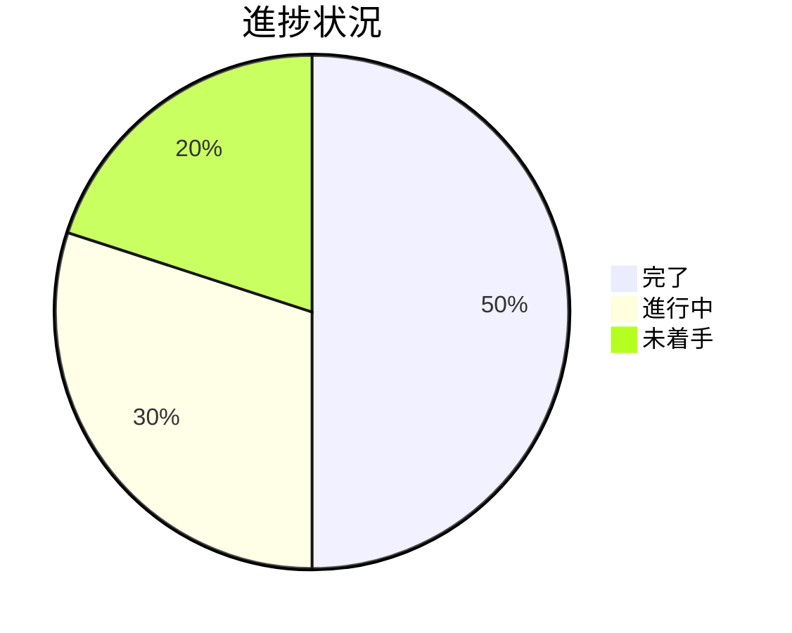

# Issue 一覧: {プロジェクト名}

**プロジェクト名**: {プロジェクト名}  
**作成日**: {YYYY 年 MM 月 DD 日}  
**最終更新**: {YYYY 年 MM 月 DD 日}

> **重要**: **このドキュメントは常に更新**: issue（またはタスク）の進捗状況、ステータス、優先度などの変更があった場合は、即座にこのドキュメントを更新してください。ドキュメントは「生きているドキュメント」として扱い、実装内容と常に同期させます。
>
> **用語**: [.agent-skill-chain/source/CONCEPTS.md §用語規約](../../../.agent-skill-chain/source/CONCEPTS.md#用語規約) を参照。

---

## Issue 一覧

| Issue 名 | 概要   | 優先度     | ステータス           | リンク                                      |
| -------- | ------ | ---------- | -------------------- | ------------------------------------------- |
| {issue1} | {概要} | {高/中/低} | {未着手/進行中/完了} | [詳細](./90_issues/{issue1}/00_要求定義.md) |
| {issue2} | {概要} | {高/中/低} | {未着手/進行中/完了} | [詳細](./90_issues/{issue2}/00_要求定義.md) |

**Issue 詳細は各 issue ディレクトリ（`90_issues/{issue}/`）を参照すること。** 本ファイルは一覧・進捗・依存関係の index とする。

---

## 進捗状況

### 全体進捗

- **完了**: {完了数} / {総数}
- **進行中**: {進行中数}
- **未着手**: {未着手数}

**進捗状況の可視化**（必要に応じて）:

**注意**: 上記の数値は例です。実際の進捗状況に合わせて数値を更新してください。

### 優先度別進捗

- **高優先度**: {完了数} / {総数}
- **中優先度**: {完了数} / {総数}
- **低優先度**: {完了数} / {総数}

---

## 参考資料

### プロジェクトドキュメント

このプロジェクトの全体ドキュメント：

- [`00_要求定義.md`](./00_要求定義.md) - 要求定義
- [`01_要件定義.md`](./01_要件定義.md) - 要件定義
- [`02_設計.md`](./02_設計.md) - 設計
- [`03_実装計画.md`](./03_実装計画.md) - 実装計画

### その他の参考資料

- {その他の参考資料}
