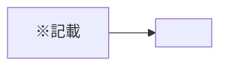

{追加,更新,削除,その他}: {PR タイトル}

# PR メッセージ: {プロジェクト名}

**用途**: GitHub 等の PR 本文に貼る**簡潔な**メッセージ用。詳細な要件・定義・チェックリストはリポジトリ内の **99_PR_review.md** で実施すること。

> **重要**:
>
> - **図(mermaid)を 1 つ以上**作成すること。
> - **絶対ルール**: PR 本文では**内部参照（.agent-skill-chain/runtime/ やリポジトリ内パス）を記載しない**。許可するのは **GitHub Issue/PR の URL** および **外部サイトの URL** のみ。
> - 用語: [.agent-skill-chain/source/CONCEPTS.md §用語規約](../../../.agent-skill-chain/source/CONCEPTS.md#用語規約) を参照。

---

# {PR タイトル}

## 概要

（この PR の目的と実装内容を 2–3 文で記載。関連 Issue/マイルストーンは URL で貼る）

---

## 変更ファイル

（git diff に基づく変更ファイル一覧。主要なもののみでも可）

- `（ファイルパス）`
- `（ファイルパス）`

---

## 図（mermaid を 1 つ以上）

（変更内容が分かるクラス図・シーケンス図・ワークフロー図・ER 図のいずれか。日本語で記載）

---

## テスト結果

（実行結果の概要。例: 単体 N 件通過、E2E シナリオ X 通過。カバレッジ等は外部 URL があれば記載）

---

## レビュー観点（確認してほしい点）

- [ ] 要件の充足
- [ ] テストの適切性
- [ ] （本 PR で特にもう 1 点あれば記載）

---

## 参考資料

（**GitHub Issue/PR の URL または外部サイトの URL のみ**。リポジトリ内へのリンクは記載しない）

- （URL）
- （URL）
