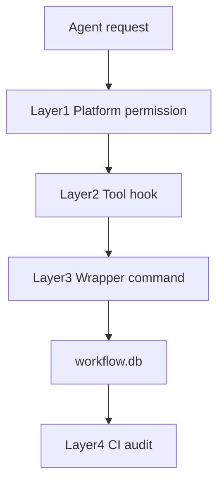

# enforcement — 強制の正本

**強制の目的**: 「理解させる」ではなく **「逸脱できないようにする」**。経路を限定し、違反操作を止め、正しい I/O のみを通し、完了を証跡で縛る。設計は [DESIGN.md](DESIGN.md)（強制の4層・物理／契約／配備／完了）。

hooks で矯正するもの／しないものの正本をここに置く。setup が .claude/・.cursor/・CI へ展開する。

---

## 絶対強制（サブ委譲）

**メイン（orchestrator）の直接実作業は例外なく禁止とする（絶対強制）。** いかなる理由・規模・内容であっても、メインが Write/Edit/Shell 等で成果物を直接作成・編集・実行することは許容しない。

- **Runtime（条件付き・新規配備は既定 on）**: **ロール（`AGENT_ROLE=orchestrator` または stdin JSON 等）が渡る環境では、PreToolUse は orchestrator による Write/Edit/StrReplace/Shell/Delete 等を必ず exit 2（block）で拒否する**（拒否時に「必ずサブに委譲すること」を案内する）。この runtime hook 配線自体は、**新規配備（`ASC_MODE=new`）では `init`/`setup` が既定で自動配線する**（opt-out は `enforce off`）。既存の再配備・本パッケージ自己適用では配線を変更しない（[SETUP.md §enforcement（新規セットアップ既定 on・opt-out 可）](../SETUP.md) 参照）。**ロールが渡らない環境では案内のみ exit 0 とし、CI（audit.sh #25 等）で事後補完する**（hooks の物理限界。詳細は §Layer2・§「Runtime reject が効く条件」）。
- **CI**: audit.sh は **失敗条件 #25（メインが実作業を直接行った）を必須チェックに含め**、該当する証跡・整合性違反を検出したら FAIL とする。#25 は成果物変更に対応する委譲・証跡が対象差分と時系列的に対応していないときに FAIL する**間接検出**であり、変更者（orchestrator か sub か）の同一性までは識別しない（#12/#13 と PreToolUse の orchestrator reject で補完する。対応表・#25 を参照）。**時系列突合**: workflow.db は累積型であるため、証跡の有無を単純な件数（COUNT）のみで判定すると、過去のどこかで対象 command が 1 件でも記録されていればそれ以降のあらゆる差分で恒久的に PASS してしまう。check_25 は対象差分（GIT_RANGE）に含まれる最古コミットの日時を基準に、workflow_log の対象 command の最新 ts_utc がそこから許容窓（既定 48 時間・`MAIN_WORK_GATE_TOLERANCE_SECONDS` で上書き可）を超えて過去でないことを検証する。
- **例外**: 認めない。委譲手段がプラットフォームで利用できない場合は「委譲計画のみ返し実作業は行わない」（CORE §依頼タイプ別振る舞い）。軽作業・小規模・「1 ファイルだけ」等を理由にメインが実作業することは禁止である。
- **verify-and-close 実行時は 04_review.md を必ず作成する（絶対強制）**: verify-and-close を実行したら、**必ず** issue 直下に 04_review.md ファイルを作成する。memo にレビューを書いて 04 を省略することは禁止。省略した場合は失敗条件 #3 で **必ず FAIL** とする。commands/verify-and-close.md の OUTPUT・DoD および run_command の Constraints に従う。

---

## 強制の 4 層と現状

| 層 | 担い手 | 役割 | 現状 |
|----|--------|------|------|
| **Layer1 プラットフォーム権限** | 実行環境 | ロール別のツール許可・拒否 | プラットフォーム依存。設定で orchestrator を Read のみにできる場合は推奨。 |
| **Layer2 Tool hook** | PreToolUse.sh | ツール実行前に違反なら exit 2（block） | **新規配備（`ASC_MODE=new`）では `init`/`setup` が既定で配線（on）**。既存の再配備・本パッケージ自己適用では配線を変更しない（`enforce on`/`off` で手動着脱可）。配線が入っている環境で、プラットフォームがツール名・対象パス・コマンド・ロールをフックに渡す場合は exit 2 で拒否（.agent-skill-chain/runtime 直接編集・許可外 Shell・sqlite3 直接・orchestrator の Write/Edit 等）。渡されない場合は案内のみ exit 0（CI 補完）。 |
| **Layer3 Wrapper command** | write-workflow-log.sh | DB 書き込みはラッパー経由のみ | 実装済。書記は sqlite3 直接禁止、本ラッパーのみ使用。 |
| **Layer4 CI audit** | audit.sh | 証跡・順序・品質・sidecar 等の事後検知 | 実装済。push/merge 前に reject。 |

- **runtime**: プラットフォームが `CLAUDE_TOOL_NAME` / `CLAUDE_FILE_PATH` / `CLAUDE_COMMAND` / `AGENT_ROLE`（または同等）を渡す場合 **強い**（その場で reject）。渡さない場合は **弱い**（案内のみ）。
- **CI**: **強い**。audit.sh が証跡・順序・整合性を検証し、違反時は reject。

| Runtime reject が効く条件 | 効かない条件 | CI で補完する条件 |
|---------------------------|--------------|---------------------|
| プラットフォームがツール名・対象パス・コマンド・ロールをフックに渡す場合。PreToolUse が exit 2（block）で拒否できる。 | 上記を渡さない場合。案内のみ exit 0。 | audit.sh で証跡・順序・CONTRACT 違反を事後検知し reject。 |

**PreToolUse は完全物理強制ではない。** Hook はツール名・コマンド文字列等しか受け取れないため、例えば `bash -c "..."` の内容までは完全には検出できない。そのため runtime guard と CI audit の二段構えが正しい設計である。

**PreToolUse による reject は、Hook が取得可能なメタデータ（ツール名・対象パス・コマンド・ロール）の範囲でのみ有効である。** **取得可能なメタデータ範囲で runtime reject し、残りは CI 監査で補完する** と表現を統一する。

### 4 層の流れ（Mermaid）



### 系統A・系統C（拡張仕様・抽象仕様）

品質ゲートのモデルティア切り下げ検知（系統A）と、進行役の Read/Grep 過大読込抑制（系統C）の抽象仕様を以下に追記する。**本節の記載は抽象仕様（対象・fail-open 方針・false positive 回避方針）の確定までを扱い、hook スクリプトの実装コード自体は本節の対象外**（実コードの実装・配備は将来の別 issue に委ねる）。

- **系統A（品質ゲートのモデルティア切り下げ検知）**
  - **対象**: 委譲パケットの宣言ティア明記行（[MODEL_SELECTION.md](../MODEL_SELECTION.md) の委譲時のティア明記に従い記載される値）と、実際に指定された model パラメータ。委譲パケットが監査・verify-and-close 等の品質ゲート相当の作業を含み、宣言ティアが top 相当であるにもかかわらず実際の model パラメータが下位ティアである場合を自己矛盾として検知対象に含める。
  - **fail-open 方針**: 誤検知が疑われる場合はブロックせず警告に留める。既存の `PreToolUse-model-tier.sh`（system-graph 側の先行実装）と同じ設計方針を踏襲する。
  - **false positive 回避方針**: 「品質ゲート相当」の判定パターン・具体閾値・スクリプト実体は `.agent-skill-chain/project/` に委ねる（コアに具体値を持ち込まない）。
- **系統C（進行役の Read/Grep 過大読込抑制）**
  - **対象**: orchestrator セッションの Read/Grep 呼び出し履歴。直近呼び出し件数が閾値（`.agent-skill-chain/project/` 定義）を超過した場合を対象とする。
  - **fail-open 方針**: 閾値超過時もブロックせず、警告と要約読込（索引化・スライス渡し）への誘導に留める。既存の `PreToolUse-context-economy.sh`（system-graph 側の先行実装）と同じ設計方針を踏襲する。
  - **false positive 回避方針**: 具体閾値は `.agent-skill-chain/project/` に委ねる（コアに具体値を持ち込まない）。

系統A・C はいずれも既存 `PreToolUse.sh` の stdin JSON 契約・exit code 規約（違反=2/許可=0）と矛盾しない。fail-open 方針のため、判定できない場合は既存契約と同様に案内のみ exit 0 に倒す想定である。対応する失敗条件の行は下記「失敗条件 → 実装の所在 → 実装状態 → 強制レベル 対応表」に追加する。

### 系統E（サブエージェント作業記録のリアルタイム強制・抽象仕様）

サブエージェントが作業を完了する時点で、書記（write-workflow-log）による workflow.db への記録が済んでいるかを `SubagentStop` 相当の hook イベントで**その場で**検査する抽象仕様を以下に追記する。**本節の記載は抽象仕様（対象・高信頼判定条件・fail-open 条件・既存 CI 事後検知との関係）の確定までを扱い、hook スクリプトの実装コード自体は本節の対象外**（実コードの実装・配備は将来の別 issue に委ねる）。評価根拠の正本は該当 issue の 02_設計.md §2.5.2 とし、本節では重複させず結論のみを記載する。

- **対象**: サブエージェント終了（`SubagentStop` 相当のイベント）時点の `last_assistant_message`（完了報告パターンとの一致有無）と、当該サブエージェント起動時刻以降の workflow_log への INSERT 有無。`SubagentStop` の入力には workflow_log の該当行と一意に紐付くキー（issue_id・document_id 等）が含まれないため、厳密な 1:1 突合はできない前提に立つ。
- **高信頼判定条件（block 対象）**: 次の 2 条件を **AND** で満たす場合に限り「未記録」を高信頼で判定し、終了をブロック（exit 2 相当）する。
  1. `last_assistant_message` が完了報告パターンに一致する。
  2. 当該サブエージェント起動時刻以降、workflow_log への INSERT が **0 件**である。
- **fail-open 条件**: 上記 2 条件を高信頼で確認できない場合（完了報告パターン不一致、または起動時刻・workflow_log 突合に必要な情報が取得できない等の判定材料不足）は、終了をブロックせず exit 0 で許可する。既存の `PreToolUse-model-tier.sh`（系統A）・`PreToolUse-context-economy.sh`（系統C）と同じ「fail-open・高信頼ケースのみ block」方針を踏襲する。
- **既存 audit.sh 事後検知との関係（補完であり置き換えではない）**: 既存 audit.sh の失敗条件 **#5**（書記未実行）・**#9**（04_review と証跡の不整合）・**#18**（04 変更に verify ログなし）・**#19**（成果物変更にログなし）は、いずれも push/merge 前の**事後的パターンマッチ**による間接検知である。系統Eはこれらを**置き換えるものではなく補完**する。系統Eは「その場で気付かせる即応性」を担い、CI 側（#5/#9/#18/#19）は「厳密な因果・順序監査」を担う、二層構成である（本 README §強制の 4 層と現状 の runtime／CI 二段構えと同型）。
- **本 issue のスコープ確定**: 系統Eは本節の抽象仕様の記載までを対象とし、**`SubagentStop` を用いた具体的な hook スクリプトの実装・配備は本 issue の範囲外**である（要否・時期は将来の別 issue に委ねる）。

## ツール別強制力マトリクス

**正本はここ（enforcement/README）1 か所**。README.md からは参照のみ（重複させない）。上の「強制の 4 層」が**層**の観点であるのに対し、本節は**ツール別**にどの強制力区分かを示す。`.agent-skill-chain/source/` を単一の正本とし各 AI ツールへ段階的に配備するが、**強制力はツールごとに異なり、最終保証は CI audit が担う**。

強制力を 3 区分で分類する。

- **runtime 強制あり**: ツール実行前に物理的に違反を止められる（exit 2 等）。
- **CI のみ**: ツール側では止められず、CI（audit.sh）の事後検知・reject が唯一の強制点。
- **advisory のみ**: ルール配布・方針適用で「逸脱しにくくする」が、その場で物理ブロックはしない（最終保証は CI）。

| ツール | 強制力区分 | 手段 | 備考 |
|--------|-----------|------|------|
| **Claude Code** | runtime 強制あり（新規配備は既定 on・既存/自己適用は現状維持） | PreToolUse hook で exit 2 物理ブロック | **新規配備（`ASC_MODE=new`）では配線を `init`/`setup` が既定で自動実行**（opt-out は `enforce off`）。既存の再配備・本パッケージ自己適用では touch しない。配線済み環境でロール・ツール名・対象パス・コマンドが hook に渡る場合に有効（渡らない場合は案内のみ exit 0 → CI 補完）。 |
| **Cursor** | advisory のみ | `agents-core.mdc` によるルール配布・一部誘導 | ルールで orchestrator の許可ツールを誘導するが物理ブロックではない。 |
| **Gemini** | advisory のみ | 方針・プロンプト適用（予定） | 配備手段は今後整備。 |
| **Copilot** | advisory のみ | リポジトリルール適用（予定） | 配備手段は今後整備。 |
| **Codex** | advisory のみ | `AGENTS.md` 適用（予定） | 配備手段は今後整備。 |
| **CI（全ツール共通）** | CI のみ（最後の砦） | `audit.sh` による事後検知・push/merge 前 reject | **最終保証はここ**。ツール側の区分によらず、全ツール共通の最終強制層。 |

- **「最終保証は CI audit」**: runtime 強制が効かない／advisory に留まるツールでも、CI audit が証跡・順序・整合性を検証し違反を reject するため、**最後の砦として全ツール共通に効く**。
- 既存の 4 層表（Layer1〜4）とは観点が異なる（層 vs ツール）。重複させず相互参照する（本節＝ツール別の正本、4 層表＝層別の正本）。
- **本リポジトリ（自己拡張・ドッグフーディング環境）における暫定例外**: 上記は消費者環境向けの一般原則である。本リポジトリ自身の CI（`self-enforce.yml`）は、暫定的な事情により audit step を意図的に非ブロッキング運用としている。理由・解消条件・申し送りの詳細は本節で重複記載せず `.agent-skill-chain/project/自己拡張ワークフロー.md` を参照する（正本はそちら 1 か所）。

---

### write-workflow-log.sh バイパス耐性（C-4・二防御分離）

書記経路（`write-workflow-log.sh` の単独実行）への偽装を、**パス正規化**と **AGENT_ROLE 出所制御**の 2 つの別防御で塞ぐ。

#### C-4a パス正規化（PreToolUse の R5 判定）

- **判定方式**: コマンド第 1 トークンを `realpath`（無ければ `readlink -f`、無ければ `cd+pwd`）で**正規化済み絶対パス**へ解決し、**許可正本パス＝実行 cwd 起点の配備先 `${AGENTS_ROOT}/scripts/write-workflow-log.sh` を realpath 解決した値**と一致することを要求する。
- **許可正本パスは固定文字列にしない**（実行時 realpath 解決値）。消費者環境では `write-workflow-log.sh` は `init` 後に消費者リポの `.agent-skill-chain/source/scripts/` 配下へ配備されるため、開発リポの絶対パス固定では消費者の正当経路を誤 block してしまう。よって実行時算出値と比較する。
- これにより、相対パス（`./...`）は正規化で同一判定へ収れんし allow、**symlink で別実体を指す同名**は実体 realpath 不一致で block、`bash -c "..."` は第 1 トークンが `bash` になり不一致で block する。R4（複合シェル禁止）・R6（sqlite3 直接禁止）の既存挙動・順序は維持する。

#### C-4b AGENT_ROLE 偽装耐性（env 出所制御・主防御は runtime hook）

- **主防御は runtime hook（PreToolUse）の env 出所制御**である。`AGENT_ROLE=scribe` を主張する呼び出しは、**実 nonce**（settings の env `AGENTS_SCRIBE_NONCE`・hook 起動時に env 継承）が、**期待 nonce**と一致する場合に**のみ** scribe として扱う。**期待 nonce は実 nonce と別出所**にする: `enforce on` が生成して `${AGENTS_ROOT}/.scribe-nonce` ファイル（`0600`）へ書き、hook は期待値を**このファイルから**読む（ファイルが無い環境のみ env `AGENTS_EXPECTED_SCRIBE_NONCE` にフォールバック＝後方互換）。nonce 不一致の scribe 主張は `unknown` へ降格し `write-workflow-log.sh` 実行を block する（nonce 未配線環境では従来挙動）。
- **AGENT_ROLE をシェルで手動 `export` して scribe を騙ることは契約違反**である。期待 nonce はファイル（`0600`）出所のため、env だけを掌握した相手が実 nonce と env 期待 nonce を同値に揃えても、ファイル値を書けない限り一致できず block される。
- **限界（正直化・完全防御ではない）**: この出所制御は**素朴な手動 `export` を遮断**するに留まる。Claude Code の hook env は settings で配線されるため、**env 空間全体（および `0600` ファイルの読取）まで掌握できる相手への完全な防御ではない**。最終保証は CI audit ＋ 外部証跡（NDJSON export / 署名 / append-only）が担う。
- **CI audit の限界（既知の残存リスク・正直記述）**: `audit.sh` は AGENT_ROLE 偽装 INSERT を**完全には検知できない**。`workflow_log` の行には「誰が AGENT_ROLE を設定したか」の出所情報が無く、`schema.sql` の `CHECK (actor_role='scribe')` / `CHECK (delegated_by_role='orchestrator')` により**全行が必ず `scribe`/`orchestrator` で記録される**ため、偽装者が `AGENT_ROLE=scribe` で INSERT した行も `actor_role='scribe'` となり、audit #12（`actor_role != 'scribe'`）・#13（`delegated_by_role NOT IN('orchestrator')`）は PASS（非検知）になる。「#12/#13/#25 が env 偽装を事後検知する」という主張は現状の audit.sh では成立しない。
- **CI の位置づけ（補強）**: env 偽装の事後検知の主経路は、上記の runtime hook 出所制御（主防御）と、`agents-md export` で NDJSON を外部（Git append-only・コミット署名）へ保全して突合する**外部証跡補強**である。`agents-md doctor` の hash チェーン検証（`gen_entry_hash` 共有関数で再計算・`prev_hash` の dangling 検出）と `PRAGMA integrity_check` は、逐次改ざん・行削除の**痕跡**を `[NG]` として示すが、DB 丸ごと差し替えには不完全であり、外部証跡で補う（過剰設計化させない `[WARN]`/`[NG]` の痕跡提示に留める）。

---

## 配置するファイル一覧

| 配置先（enforcement 内） | 配置するファイル | 展開先（setup 後） |
|--------------------------|------------------|---------------------|
| **claude/** | PreToolUse.sh, PostToolUse.sh | .claude/hooks/ |
| **cursor/** | agents-core.mdc（CORE/LOAD_POLICY 読了義務・証跡プレフィックス・orchestrator 許可ツールのみ） | .cursor/ |
| **ci/** | audit.sh（証跡・CONTRACT 違反の検出） | CI ワークフローから参照 |
| **（直下）** | PROTECTED_PATHS.txt（成果物パス参照用。PreToolUse のパス別拒否に拡張可能） | 参照のみ（コピーしない） |

上記ファイルを本ディレクトリに配置する。setup 脚本は本ディレクトリを参照して .claude/・.cursor/・CI へ展開する。配置するファイルが無い場合は、setup は展開先のディレクトリのみ作成する。

**系統D（`.agent-skill-chain/project/` 優先の hooks overlay 配備・抽象仕様）**: 上表の `claude/`（配置先）は `.agent-skill-chain/source/enforcement/claude/` を指すが、採用先プロジェクトの `.agent-skill-chain/project/enforcement/claude/` に同名ファイル（例: `PreToolUse.sh`）が存在する場合、setup 相当の配備処理は `.claude/hooks/` への展開時に **`.agent-skill-chain/project/` 側のファイルを優先して配備する**（ファイル単位のオーバーライド。fail-open の余地はない決定的規則）。両ディレクトリのいずれにも当該ファイルが無い場合は、既定動作（上記「配置するファイルが無い場合は、setup は展開先のディレクトリのみ作成する」）を踏襲する。設計思想（同名ファイルの優先解決規則）は [DESIGN.md §系統D](DESIGN.md#系統d-hooks-overlay-配備の設計思想agent-skill-chainproject-優先) を参照。**本節の記載は抽象仕様であり、overlay 配備処理の実装コード自体は本節の対象外**（実コードの実装・配備は将来の別 issue に委ねる）。

**subagent-guard の実体（CI guard）**: PR/Push 時に失敗条件の一部を検出する subagent-guard は `.agent-skill-chain/runtime/templates/github/scripts/subagent-guard.sh`（git 追跡される配布テンプレ）に実体がある。enforcement 正本（`.agent-skill-chain/source/`）は実体を移設せず、この実体パスへの参照でトレーサビリティを確保する。subagent-guard が検査するのは (1) 内部参照禁止（#6 相当）(2) ログ frontmatter 禁止 (3) `.agent-skill-chain/runtime/**/logs/` 廃止 の 3 点のみであり、#22–#24 は実装しない（§失敗条件 #22–#24・対応表を参照）。`.github/workflows/` から本スクリプトを呼ぶことで CI guard として有効化する。

**成果物パス（PROTECTED_PATHS）**: 成果物パス（docs/, src/, app/, components/ 等）は [enforcement/PROTECTED_PATHS.txt](PROTECTED_PATHS.txt) で定義する。PreToolUse で orchestrator がこれらのパスに Write/Edit することを拒否する場合は、その設定を読む形に拡張できる。現状は orchestrator の全 Write/Edit を拒否しているため、パス別設定は未使用。

**配備済み hook と正本の乖離検知（アップグレード運用ルール）**: `.claude/hooks/`（配置先。上表参照）は各採用先で `.gitignore` 対象の生成物であり、正本 `enforcement/claude/*.sh` を修正しても、配備済み環境で `upgrade`（`agents-md upgrade` または `setup.sh` 再実行）を行わない限り自動追従しない。**正本 `enforcement/claude/` 配下（`PreToolUse.sh`・`PostToolUse.sh` 等）を修正した場合、配備済みの各採用先では `upgrade` を実行し `.claude/hooks/` を同期させること。** 同期を怠ると、正本側で修正済みの既知バグ（例: allowlist 未追従による orchestrator 完全ロックアウト）が配備済み環境に残ったままになり、再発しうる。乖離の有無は [`scripts/check-hook-drift.sh`](../scripts/check-hook-drift.sh)（`bash .agent-skill-chain/source/scripts/check-hook-drift.sh [project_root]`）で read-only に確認できる。正本と配備物を sha256 で比較し、一致すれば `[OK]`（終了コード 0）、不一致・未配備なら `[DRIFT]`（終了コード 1）、`.claude/hooks/` 自体が無い（enforcement 未 opt-in）環境では `[INFO]`（終了コード 0）を返す。**本スクリプトは検知のみを行い、実際の同期（`.claude/` への書き込み・`upgrade` の実行）は行わない**（同期は利用者が明示的に `upgrade` を実行して行う）。

**orchestrator allowlist の project 拡張点（opt-in・fail-closed 保全）**: PreToolUse の R2 orchestrator allowlist は fail-closed（明示許可ツールのみ通す）である。消費先固有のツールを追加したい場合、コア正本を編集せずに `.agent-skill-chain/project/orchestrator-allowlist.txt`（ユーザー資産・setup が touch しない）へ 1 行 1 ツール名で opt-in できる。hook（`PreToolUse.sh` の `is_in_project_allowlist()`）はこのファイルを **`source` せずデータとして** read し、R2 の `*)` default に落ちた未知ツール名が厳密一致で列挙されている場合のみ許可する。`#` コメント可・空行可・先頭末尾 trim（内部空白は collapse しない）・厳密文字種 `^[A-Za-z][A-Za-z0-9_]*$` 検証で注入/難読化行を無視し、ファイル不在・空・全行不正は fail-closed（default 拒否）。`Bash`・`Edit|Write|...` は case のより手前で明示 block されるため拡張では覆せない（名前一致の保証）。ただし `*)` に落ちる MCP 書込/実行ツール（`mcp__*` 系）を opt-in すると orchestrator が書込/実行の等価権限を得る余地が残る（能力ベースの残余リスク・人間 PR レビュー前提）。雛形は `enforcement/claude/orchestrator-allowlist.example.txt`。使い方・警告・更新経路ガバナンスの正本は [SETUP.md §orchestrator allowlist の project 拡張（opt-in）](../SETUP.md) を参照。

**audit.sh が実施する必須チェック**: 一覧の正本は §失敗条件と差し戻し の失敗条件対応表（`実装状態` = `実装済み` の行）を参照。#22–#24（自立進行ルール違反・高リスク操作の事前確認省略）は audit.sh・subagent-guard いずれも未実装であり、AI の自律判断・人手監査に委ねる（詳細は同表・§「自立進行ルール違反の検出」を参照）。

**走査スコープ（複数ディレクトリ対応）**: audit.sh の find ベースの走査は単一の `WORKFLOW_DIR` ではなく走査ディレクトリ「リスト」で回す。環境変数 `WORKFLOW_DIRS`（コロン区切り）を指定した場合はその値を**そのまま採用（置換）**し、未指定時の既定リストは `WORKFLOW_DIR`（既定 `.agent-skill-chain/runtime`）＋`docs/maintainer/workflow`（実在時のみ）とする。実在しないディレクトリは除外し重複は 1 回に正規化する。`docs/maintainer/workflow` が存在しない汎用消費者では `.agent-skill-chain/runtime` のみとなる。

**CI 強制対象外（人手監査）**: /clear 境界・safe-clear invariant、別セッション引継ぎの質、**fresh サブ分割義務およびその収束保証・退行防止継承**は実行コンテキスト依存のため現状 CI で機械強制せず、PHASES 監査観点（人手レビュー）で担保する（機械強制の要否・実装は別 issue へ申し送り）。#29（実装前 04 検知）が対象とするのは「実装前 04 の誤生成」のみであり、上記の /clear 境界・引継ぎ・fresh サブ分割義務／収束は #29 の対象外（CI 非強制・人手監査）である。

---

## workflow.db の扱い

workflow.db は **証跡ログの本則ストレージ**である。

ただし以下を必ず守る。

- workflow.db は Git 管理対象に含めない
- workflow.db-wal / workflow.db-shm も Git 管理対象外
- DB は setup 時に生成する（.agent-skill-chain/source/scripts/setup.sh の init_workflow_db）
- DB への書き込みは **scribe agent のみ**（.agent-skill-chain/source/scripts/write-workflow-log.sh を必ず使用。sqlite3 直接実行禁止）
- SQL 操作は INSERT のみ許可

理由:

SQLite WAL モードでは

- workflow.db-wal
- workflow.db-shm

が生成される。

これらを Git に含めると

- 不整合
- 再現性崩壊
- CI 判定不安定

が発生するため。テンプレート・OSS 配布では workflow.db の実体を **絶対に含めない**。

### 証跡の因果関係（順序監査）

**「証跡がある」だけでは「正しい経路を通った」ことの証明にならない。** ログの存在と実行経路の正当性を結びつけるため、以下を守る。

- **workflow_log は scribe のみ**が書く。actor_role=scribe, delegated_by_role=orchestrator を記録する（推奨スキーマ）。
- すべてのログは **親ログ（parent_entry_id）** を持つチェーンとする。verify-and-close は単独出現禁止。
- **verify-and-close** の親は implement-feature または design-feature であること。順序違反は audit で FAIL。
- 成果物変更には対応するログが必要。04_review.md 変更時は verify-and-close ログが、.agent-skill-chain/runtime/docs 配下の成果物変更時は implement-feature / design-feature / verify-and-close のいずれかのログが存在すること。
- ログがあるだけでは不十分で、**順序と対応関係**まで audit する（audit.sh #12–#19）。

---

## 矯正するもの（物理強制の例）

**「04 作成のみで書記未実行」の防止**: 04_review.md が issue 直下に存在するにもかかわらず、workflow.db に対応する verify-and-close の書記ログ（write-workflow-log 経由）が存在しない場合は、失敗条件 #9「04_review と証跡の不整合」として **必ず FAIL** とする。これは、メインが「レビュー作成」を verify-and-close の実行としてではなく、「04_review を作成せよ」という成果物のみの委譲として解釈した結果、skill chain の最終 step（write-workflow-log）が実行されないケースを想定したものである。再発防止のため、run_command §Constraints で「レビュー作成依頼は verify-and-close を command として委譲し、skill chain を最後まで（書記含む）実行させること」を**必須**とし、04_review のみ作成して書記を省略する運用を禁止する。

**現状の実装について**: PreToolUse.sh と PostToolUse.sh 自体の挙動は「**配線が入っている環境で実行された場合**、プラットフォームがツール名・対象パス・コマンド・ロール等のメタデータをフックに渡すなら違反時に exit 2（block）で実行をブロックし、渡さないなら案内メッセージの出力のみで exit 0 で終了する（違反をその場では止めない）」という契約である。**この配線自体は、新規配備（`ASC_MODE=new`）では `init`/`setup` が既定で自動実行する**（`.claude/settings.json` へ既定 on。opt-out は `enforce off`）。既存の再配備（`ASC_MODE=match`）・本パッケージ自己適用（`ASC_MODE=own`）では配線を変更しない（現状維持。[SETUP.md §enforcement（新規セットアップ既定 on・opt-out 可）](../SETUP.md) 参照）。メタデータの有無とフック契約の詳細は、本 README の「強制の 4 層と現状」§Layer2・「Runtime reject が効く条件」（上記 Line 14 / 23 付近）および [DESIGN.md](DESIGN.md) を参照すること。メタデータが渡されない環境ではその場で違反を止められないため、**CI（audit.sh）で事後検知する構成**とする。必要なメタデータ／フック契約の詳細は **DESIGN.md** および本節に記載されている。上記を参照すること。

**試験運用では「hooks で止める」を前提にしないこと。** ルール違反をその場で止める仕組みではなく、**後から検知する仕組み**である。本当に守らせる中心は **audit / pre-push / CI** とする。強制を高めるには、**フックだけで止めない**・**呼び出し経路を細くする**・**ロール識別を task 契約で外部化する**・**CI で最終確定する** の 4 本柱で組む（DESIGN.md の思想と整合）。

- **メインの直接実作業を塞ぐ（絶対強制）**: 実作業は **command 経由・ROLE: 付き Task の委譲** のみ許可する。orchestrator が自分で設計・実装・レビュー本文を書く経路は、**ロールが渡る環境では例外なく拒否**する（hooks で検知可能な範囲で必ず exit 2）。ロールが渡らない環境では案内のみ exit 0 とし CI で補完する。**「必ずサブに委譲する」** を強制し、規模・内容にかかわらずメインが Write/Edit/Shell で成果物を直接作成・編集した場合は違反とする（失敗条件 #25）。CI では成果物変更に委譲・証跡の対応がない場合に FAIL とする（間接検出。変更者同一性は未識別＝対応表参照）。
- **PreToolUse（または Cursor 用 agents-core.mdc）の責務**: メイン（orchestrator）セッションによる **00/01/02/03/04 やコードへの直接 Write/Edit/Shell** は、**ロールが渡る環境ではブロックする**。プラットフォームが AGENT_ROLE（または同等）を渡す場合、orchestrator の Write/Edit/StrReplace/Shell/Delete は **必ず exit 2 で拒否**する。渡らない環境では案内のみ exit 0。agents-core.mdc では「メインは 00/01/02/03/04 およびソースコードを**例外なく**直接編集・作成してはならない」と記載する。ブロックできない環境では CI/audit で事後検知し reject する。
- **物理強制の限界**: メインの直接 Write/Edit/Shell は PreToolUse またはプラットフォーム権限でブロックする。ブロックできない環境では CI（audit.sh）で 03→04 等の事後検知で reject する。**PreToolUse でメインの Write/Edit/Shell をブロックできない環境では、CI（audit.sh）で 03 存在かつ 04 欠如等の事後検知で reject する。書記以外の sqlite3 実行禁止は、プラットフォームの権限設定または CI で確認する。** **orchestrator の理想形は Read のみとし、ファイル更新は worker 経由のみとする。** プラットフォームで権限差を付けられる場合は orchestrator に Write/Edit/Shell を許可しない。**orchestrator が 00/01/02/03/04 やコードを直接変更した場合は、証跡（implement-feature / design-feature / verify-and-close のログ）との対応で検知する。** platform が編集者ロールを渡す場合は、orchestrator による成果物直接編集を audit で FAIL にできる。
- フェーズゲート・command 実行前の読了（run_command と command ファイル）。
- **scribe 未実行の次 Task 拒否**: 検証・クローズ command で write-workflow-log を経ずに次に進むことを防ぐ（hooks / CI で証跡の有無を確認）。
- 証跡未実行の検出。証跡は**本則 workflow.db**、memo は過渡的・例外のみ。**ログは書記のみ**が書き込む。workflow.db 以外へのログ書き込み・書記以外の workflow.db 書き込みは禁止（CORE）。
- **timestamp 付き memo ファイルの作成経路の固定**: `.agent-skill-chain/runtime/{issue}/memo/` 以下の `YYYYMMDD_HHMMSS_*.md` は、write-workflow-log capability または `.agent-skill-chain/source/scripts/new-workflow-memo.sh` 等、**システム時計からプレフィックスを生成する専用スクリプト経由でのみ**作成する。メインが自由入力でプレフィックス付きファイル名を指定して Write/Edit する経路は hooks / CI で検知・拒否する。
- **R1 の保護範囲は memo・workflow.db\* に絞られた carve-out（issue ドキュメントは Edit/Write 可）**: `.agent-skill-chain/runtime/` 配下への直接 Write/Edit（R1）は、memo（上記のタイムスタンプ規約対象）と `workflow.db`/`workflow.db-wal`/`workflow.db-shm` に対しては全 ROLE 一律で block し続ける。一方、`00_要求定義.md` 等の issue ドキュメント（固定 basename allowlist: `00_要求定義.md`・`00_システム理解.md`・`01_要件定義.md`・`02_設計.md`・`03_実装計画.md`・`04_review.md`・`05_最終確認チェックリスト.md`・`90_issues.md`・`99_PR.md`・`99_PR_review.md`）は、これらの保護を必要としないため Edit/Write を allow する（既存 `.gitignore` 厳密一致例外と同型の carve-out。詳細は [DESIGN.md](DESIGN.md) を参照）。orchestrator（main）自身の直接編集は、この carve-out の有無に関わらず R2 により引き続き block される。
- CI で CONTRACT 違反・証跡欠落を検出したら reject する（audit.sh 等）。
- **自立進行ルール違反の検出**（#22・#23）: 通常の作業依頼に対し、メインが毎回ユーザーへ許可確認を前提とする、または「指示文案だけを返して実作業 command を実行しない」場合を違反として扱う（高リスク操作を除く）。audit.sh・subagent-guard いずれも未実装（機械検出不能・AI の自律判断＋人手監査に委ねる）。詳細・判定ルールは §失敗条件と差し戻し #22・#23 を参照。
- **高リスク操作の事前確認省略**（#24）: 高リスク操作（大量削除・外部サービスへの書き込み等）を事前のユーザー明示確認なしに実行した場合は違反とみなす。audit.sh・subagent-guard いずれも未実装（機械検出不能・AI の自律判断＋人手監査に委ねる）。詳細は §失敗条件と差し戻し #24 を参照。

**ローカルで push 前に audit を実行するには**、pre-push フックで audit.sh を呼ぶことを推奨する。採用先では `git push` 前に `enforcement/ci/audit.sh`（またはプロジェクトルートからの相対パス）を実行し、失敗時は push を中止する。例: `.git/hooks/pre-push` から `./.agent-skill-chain/source/enforcement/ci/audit.sh .` を実行する。ci/ に pre-push.example を同梱しているので、採用先で pre-push にコピーして利用できる。

### CI における DB 系チェックの構造的 SKIP と実効的な検知経路

workflow.db は Git 非追跡（本節冒頭のとおり）かつ、ローカルでの実際の実行証跡を積み上げる**累積型のローカルストア**である。したがって CI のクリーンな checkout（`actions/checkout` 等によるゼロからの取得）には workflow.db の実体が存在しえない。これは設定漏れや不具合ではなく、「workflow.db は Git 管理対象に含めない」という設計そのものから必然的に導かれる構造的な帰結である。

その結果、DB 系チェック（`#3` 04_review 未更新、`#8`–`#25` の DB 品質・整合性・因果・順序監査、`#29` 実装前 04 検知、`#31`–`#35` の各種ゲート検知）は、**CI 上では常に SKIP される**。sqlite3/DB が存在しない環境を誤って FAIL させない fail-open 設計（本節冒頭・失敗条件対応表を参照）が働くためであり、これ自体は意図した安全側の挙動だが、結果として「CI が最後の砦」であるはずのこれらのチェックは、workflow.db を CI に持ち込まない限り CI 単独では実効性を持たない。

- **CI ログ上の可視化**: audit.sh は実行冒頭で workflow.db・sqlite3 の有無を判定し、`SKIP-SUMMARY:`（不在時）または `[audit] INFO:`（存在時）で始まる 1 行を必ず出力する。加えて、DB 不在で SKIP された各チェックは個別に `SKIP: #<番号> ...` 行を出力する。CI ログを `SKIP-SUMMARY` または `SKIP:` で検索すれば、当該 CI 実行で DB 系チェックが発火したか SKIP されたかを一目で確認できる。
- **実効的な検知経路**: 上記の構造的 SKIP を補う実効的な検知経路は、**ローカルの pre-push フック**である（本節冒頭の案内を参照。`ci/pre-push.example` を `.git/hooks/pre-push` へコピーして導入する）。pre-push フックはローカルの workflow.db をそのまま参照できるため、DB 系チェックが実際に発火する。ただし pre-push フックは各開発者環境での**任意導入**であり、`git push --no-verify` で迂回可能という限界がある（絶対強制ではない）。pre-push フックの必須化・自動配備は本節の対象外（別途の改善課題）。
- **DB の CI アーティファクト化を採用しない理由**: workflow.db は「ローカルで実際に行われた作業の実行証跡」を記録するものであり、CI のクリーンな checkout 上でゼロから正当な内容を再構築することは原理的にできない（CI にはローカル作業の実施証跡そのものが存在しないため）。したがって「CI で DB 系チェックを有効化する」ための現実的な手段は無く、本節の対応は「構造的に SKIP されることを正本に明記し、実効的な検知経路（ローカル pre-push）を明示する」ことに限定する。

## 矯正しないもの

- 設計品質・要件の妥当性・テスト十分性・レビュー品質（これらは各 capability skill の責務）。

---

## 失敗条件と差し戻し

**目的**: 違反時に「何を失敗とみなすか」「どこへ差し戻すか」を一意にし、CI および subagent-guard の判定ルールとして参照できるようにする。運用者に一目で分かる形で列挙する。上記「矯正するもの」と整合する。

### ゲート共通の前提（SKIP・grandfather・env トグル）

複数のゲート（主に #29・#32–#36）に共通する前提を 1 か所にまとめる。各行のセルは本ノートを参照し、ゲート固有の値（`*_EFFECTIVE_FROM` の既定日時・トグル名・非交差の相手番号）のみを個別に記載する（重複させない）。

- **grandfather（遡及適用しない）**: 各ゲートは issue ディレクトリ名の `YYYYMMDD_HHMMSS_` プレフィックスが、そのゲート固有の `*_EFFECTIVE_FROM` 環境変数（既定値はゲートごとに異なる。各行を参照）**未満**なら SKIP する。
- **env 無効化トグル**: 各ゲート固有の `*_GATE_ENABLED=false`（`0`/`no`/`off` も可）を設定すると、他のどの判定よりも先にそのゲート単体を SKIP する（既定はすべて `true`）。
- **共通 SKIP 条件（fail-open）**: 次のいずれかに該当する場合は SKIP する。workflow.db／sqlite3 が存在しない（DB 非採用環境）。`close/`・`templates/`・`90_issues/` 配下（完了済み・雛形・親集約先のため対象外）。非 git ツリー、または対象コミットの日時が解析不能。
- **設定方法（配布先向け具体例）**: `*_GATE_ENABLED`・`*_GATE_EFFECTIVE_FROM` 系の env は、audit.sh の実行時に参照できる場所であればどこで設定してもよい。代表的な設定先は次の 2 通り。
  - **シェル環境変数として設定する場合**: ローカルで `audit.sh`（または pre-push フック経由）を実行するシェルで `export GITHUB_ISSUE_GATE_ENABLED=false` のように export する。その場限りではなく恒常的に効かせたい場合は、`.bashrc`/`.zshrc` や CI 起動前のセットアップスクリプトなど、シェル起動のたびに読み込まれる箇所に記載して永続化する。
  - **CI（GitHub Actions）で設定する場合**: audit.sh を呼ぶワークフローファイル（例: `.github/workflows/audit.yml`）の `env:` ブロックに直接記載するか、リポジトリまたは Organization の **Settings → Secrets and variables → Actions → Variables** に登録し、ワークフロー内で次のように参照する。
    ```yaml
    env:
      GITHUB_ISSUE_GATE_ENABLED: ${{ vars.GITHUB_ISSUE_GATE_ENABLED }}
    ```
  - 有効/無効そのものの判断（このゲートを無効化すべきかどうか）は消費者環境ごとの運用方針に委ねる。判断の正本は `.agent-skill-chain/project/自己拡張ワークフロー.md §8`（`GITHUB_ISSUE_GATE_ENABLED` の例）を参照。本項目は「設定すると決めた場合に、どこに書けば実際に効くか」という汎用的な設定手段のみを示す（判断そのものは代行しない）。

### 失敗条件 → 実装の所在 → 実装状態 → 強制レベル 対応表（レジストリ・正本）

各失敗条件に「概要」「実装の所在（どのスクリプトのどの関数/行）」「実装状態」「強制レベル（runtime reject / CI FAIL / 案内のみ / 未実装）」「差し戻し先（要点）」を一意に対応づける**単一レジストリ**。**「絶対強制」「例外なく拒否」「subagent-guard で検出」等の宣言は、本表でどの層・どの条件下で reject/FAIL するかへ具体化する。**

`実装状態` は次の統制語彙のいずれかを取る:
- `実装済み` — audit.sh または subagent-guard または PreToolUse に実体があり現に発火する。
- `推奨（未強制）` — 記録が推奨されるが機械強制なし（#21）。
- `未実装（人手監査）` — 機械検出が本質的に不能につき AI の自律判断・人手監査に委ねる（#22–#24・#30）。hooks のメタデータ・git 差分・DB のいずれにも痕跡が乗らないため（詳細は §「自立進行ルール違反の検出」）。
- `未実装（抽象仕様のみ・将来hook）` — 抽象仕様（対象・fail-open 方針・false positive 回避方針）のみ確定済みで、hook 実体は将来の別 issue（系統A・系統C・系統E）。

| # / 対象 | 概要 | 実装の所在 | 実装状態 | 強制レベル | 差し戻し先（要点） |
|----------|------|------------|----------|------------|---------------------|
| #1 必須参照 | LOAD_POLICY や command/skill で定めた必須読了ファイルの参照有無。本 #1 は起動時必須コア（CORE / LOAD_POLICY / PHASES。audit.sh §2 はこれらに加え requirement-discovery 用の TEMPLATES.md の存在も確認する）の**存在による間接検証**であり、実際に読んだかは検証しない（self-report 依存・読了の完全機械検証は原理的に不能）。読了義務範囲の縮小（コア明確化）により、検証対象と「実際に読むべき最小集合」が一致し相対的実効性が向上する。 | audit.sh §2（必須ファイル存在で代用） | 実装済み | CI FAIL（間接） | 03_実装計画 or 該当 issue |
| #2 02/03 テスト観点不足 | 02/03 に BDD/単体テスト観点の記載が無い | audit.sh check（テスト観点未記載） | 実装済み | CI FAIL | 03_実装計画 or 該当 issue |
| #3 04 未更新 | 実装後 verify-and-close 未実行で 04_review 未作成/未更新［絶対強制］ | audit.sh check 3 | 実装済み | CI FAIL | verify-and-close 再実行し 04 作成 |
| #4 docs 更新要否未記載 | 04 に docs 更新要否の記載が無い | audit.sh check（docs 更新要否未記載） | 実装済み | CI FAIL | 04 に追記 or 03/該当 issue |
| #5 書記未実行 | write-workflow-log を経ずに次へ進行 | audit.sh check 3 / check 9 | 実装済み | CI FAIL（存在ベース間接・chain 順序は未監査） | verify-and-close 再実行（書記委譲） |
| #6 内部参照禁止 | PR 本文に repo 内部リンクを記載 | audit.sh §6 ＋ `.agent-skill-chain/runtime/templates/github/scripts/subagent-guard.sh` §3 | 実装済み | CI FAIL | PR 本文修正・push 再試行 |
| #7 TODO/FIXME 残存 | 重要パス（*.md、templates 除く）に TODO/FIXME 残存 | audit.sh check（重要パス TODO/FIXME） | 実装済み | CI FAIL | 該当ファイルで解消 |
| #8–#11 DB 品質/整合 | workflow.db 品質違反・証跡不整合・sidecar 追跡・整合性不良 | audit.sh §8–§11 | 実装済み | CI FAIL（sqlite3/DB 不在は SKIP） | verify-and-close 再実行 or DB 再生成/.gitignore 追加 |
| #12–#19 因果・順序 | actor_role/delegated_by/changed_files_json/review_path/parent/親順序/04 変更・成果物変更ログの欠落 | audit.sh check_*（新スキーマ時） | 実装済み | CI FAIL（旧スキーマは SKIP） | write-workflow-log の各引数を正しく渡し再実行 |
| #20/#20+ document_id | document_id を持つ成果物に workflow_log 該当行なし、または既存 document_id の変更 | audit.sh check_document_id_linked | 実装済み | CI FAIL（DB/列不在は SKIP） | document_id を書記に渡し再実行 |
| #21 issue_id/review_id 未記録 | 新スキーマで issue_id/review_id が NULL（推奨） | audit.sh（監査任意・check 関数なし） | 推奨（未強制） | 案内のみ（推奨） | 該当 command 再実行時に ISSUE_ID/REVIEW_ID を付与（任意） |
| #25 メイン直接作業 | メインがサブ委譲せず直接 Write/Edit/Shell 実行［絶対強制］ | audit.sh check_25 ＋ #12/#13 補完 | 実装済み | CI FAIL（間接・変更者同一性は未識別。時系列突合・許容窓 48h 既定・`MAIN_WORK_GATE_TOLERANCE_SECONDS` で上書き可） | 03 or CORE/AGENTS 再確認し委譲し直す |
| #26 コメント外部参照 | コメント/docstring に外部参照（章節番号・PR/issue 番号等）を記載 | audit.sh check_code_comment_external_ref | 実装済み | CI FAIL（src 不在は無検出） | CODE_COMMENT_RULES に従い修正 |
| #27 04 両リスト | 04 に敵対的観点・must-preserve の両リスト欠落 | audit.sh check_review_dual_lists | 実装済み | CI FAIL（非 git は SKIP） | 04 に両リスト追記し verify-and-close 再実行 |
| #28 誤配置 | issue ドキュメントが gitignore 配下に誤配置 | audit.sh check_issue_doc_in_gitignored_path | 実装済み | CI FAIL（非 git は SKIP） | project 上書き先へ移動 |
| #29 実装前 04 | implement/verify ログ 0 件なのに 04 存在 | audit.sh check_review_before_implement | 実装済み | CI FAIL（DB 不採用は SKIP） | 04 削除し memo へ、実装完了後 verify-and-close 再実行 |
| #31 システム仕様書レビュー証跡欠落 | 04 §docs 更新に要/不要の内容記載なし | audit.sh check_docs_review_evidence | 実装済み | CI FAIL（DB 不採用・docs/ 非採用・実装変更ログ 0 件は SKIP） | 04 に参照/根拠を追記 |
| #32 実装前 review-docs 未実行 | implement ログありなのに review-docs ログ 0 件 | audit.sh check_reviewdocs_before_implement | 実装済み | CI FAIL（共通前提ノート参照＋`REVIEWDOCS_GATE_EFFECTIVE_FROM` 既定 `20260712_000000`。#29 と非交差。**＋当該 issue の 00 frontmatter `mode: quick` は SKIP（免除。full/standard/mode 欠落は従来どおり）**） | review-docs 実行後 implement-feature 再実行（quick は不要） |
| #33 close 移動未実施 | verify-and-close 証跡ありなのに close/ 未移動 | audit.sh check_close_move_pending | 実装済み | CI FAIL（共通前提ノート参照＋`CLOSE_MOVE_GATE_EFFECTIVE_FROM` 既定 `20260712_000000`・猶予日数 `CLOSE_MOVE_GRACE_DAYS` 既定 `3`。#32 と非交差） | close/ へ `git mv` |
| #34 実装前 GitHub Issue 起票ゲート未通過 | implement ログありなのに `github_issue` 未記録・理由なし declined | audit.sh check_github_issue_before_implement | 実装済み | CI FAIL（実 Issue 記録 or 理由付き declined なら PASS。共通前提ノート参照＋`GITHUB_ISSUE_GATE_ENABLED`・`GITHUB_ISSUE_GATE_EFFECTIVE_FROM` 既定 `20260712_000000`・GitHub 非採用環境は SKIP。#32 と非交差。**＋`mode: quick` は SKIP（免除。full/standard/mode 欠落は従来どおり）**） | 起票 or declined 理由記録（quick は不要） |
| #35 実装前ブランチ紐づけ未記録 | implement ログありなのに `branch` 未記録 | audit.sh check_branch_linkage_before_implement | 実装済み | CI FAIL（共通前提ノート参照＋`BRANCH_LINK_GATE_ENABLED`・`BRANCH_LINK_GATE_EFFECTIVE_FROM` 既定 `20260713_000000`。#34 の写像だが declined 概念なし・github.com remote 不要。#34 と非交差。**mode は参照しない＝quick モードでも発火**（規模非依存で維持）） | 00 frontmatter に `branch` 記録 |
| #36 PR 紐づけ未記録 | PR 本文に `Closes/Refs #<番号>` 無し | audit.sh check_pr_issue_linkage | 実装済み | CI FAIL（共通前提ノート参照＋`PR_LINK_GATE_ENABLED`・`PR_LINK_GATE_EFFECTIVE_FROM` 既定 `20260713_000000`。`PR_BODY` 未設定＝ローカル/push は SKIP。#6 の写像・#34 と非交差） | PR 本文に追記し push 再試行 |
| #37 docs 作業用issueフォルダ参照禁止 | docs/ 配下の仕様書が作業用 issue フォルダへのパス参照を含む | audit.sh check_docs_transient_issue_ref | 実装済み | CI FAIL（close/ は対象外） | 要約・安定参照へ張り替え |
| #38 モデルティア明記義務の機械検証 | モデルティア記録の有無を検査 | audit.sh check_model_tier_recorded | 実装済み | CI FAIL（`workflow_log` 行単位で `model_tier` が空/null/`~`（ティア未明記）・`tier_rationale` が空（根拠未明記）・`model_tier=fable` かつ `tier_exception` が空（無申告 fable）なら FAIL。`MODEL_TIER_GATE_ENABLED=false`（最優先ガード）・sqlite3/DB/`workflow_log` 不在・`model_tier` カラム不在・非空 `model_tier` 行が皆無（tier 未使用）は SKIP。`issue_path` basename プレフィックスが `MODEL_TIER_GATE_EFFECTIVE_FROM`（既定 `20260714_000000`）未満・非プレフィックス/空 `issue_path` は素通り。明記の有無のみ検査し `MODEL_TIER_TABLE.md` と照合しない。#3〜#37 と検査対象カラムが重ならず非交差） | 委譲時に選定ティアと根拠（fable 時は例外申告も）を書記へ `MODEL_TIER`/`TIER_RATIONALE`/`TIER_EXCEPTION` として渡し、`workflow_log` へ記録する。プロジェクト全体で tier ゲートが不要な場合は `MODEL_TIER_GATE_ENABLED=false` を設定する。 |
| orchestrator の Write/Edit/Shell 拒否 | orchestrator が成果物へ直接 Write/Edit/Shell | PreToolUse.sh（ロール判定 → block 関数）。**委譲先 subagent（`IS_SUBAGENT=1`）は worker として実作業を許可し main のみ block**。`.agent-skill-chain/runtime/` 直下は R1（path 軸・全 ROLE 一律）で別途 block（非対称は意図的）。 | 実装済み | runtime reject（条件付き：ロール伝達時 exit 2／未伝達時 案内 exit 0）＋ CI 補完 | サブへ委譲し直す |
| ログ frontmatter 禁止 / `logs/` 廃止 | PR にログ frontmatter を記載、または `logs/` を使用 | `.agent-skill-chain/runtime/templates/github/scripts/subagent-guard.sh` §1 / §2 | 実装済み | CI FAIL | 該当箇所を修正 |
| #22 自立進行（許可確認） | 通常依頼で毎回許可確認し command を実行しない | （未実装） | 未実装（人手監査） | 未実装・runtime/人手監査 | 該当 issue の 03 or AGENTS/RULES |
| #23 自立進行（指示文案だけ） | 指示文案のみ返し実作業 command を実行しない | （未実装） | 未実装（人手監査） | 未実装・runtime/人手監査 | 同上 |
| #24 高リスク確認省略 | 高リスク操作を事前確認なしに実行 | （未実装） | 未実装（人手監査） | 未実装・runtime/人手監査 | 該当 issue/AGENTS/RULES/enforcement |
| 系統A 品質ゲートのモデルティア切り下げ検知 | 宣言ティアと実際の model パラメータの自己矛盾検知（抽象仕様のみ） | （未実装・抽象仕様のみ確定。hook 実体は本 issue 範囲外） | 未実装（抽象仕様のみ・将来hook） | fail-open（advisory のみ・具体閾値は `.agent-skill-chain/project/`） | （将来 hook 化・現状対応不要） |
| 系統C 進行役の Read/Grep 過大読込抑制 | orchestrator の Read/Grep 過大読込を抑制（抽象仕様のみ） | （未実装・抽象仕様のみ確定。hook 実体は本 issue 範囲外） | 未実装（抽象仕様のみ・将来hook） | fail-open（advisory のみ・具体閾値は `.agent-skill-chain/project/`） | 同上 |
| 系統E サブエージェント作業記録のリアルタイム強制 | サブ終了時の書記未記録をその場検知（抽象仕様のみ） | （未実装・抽象仕様のみ確定。hook 実体は本 issue 範囲外） | 未実装（抽象仕様のみ・将来hook） | fail-open（高信頼判定時のみ block 相当・それ以外は既存 audit.sh #5/#9/#18/#19 で補完） | 同上 |
| #30 AGENT_CONDUCT §3 進捗の実証違反 | 未検証を検証済みと報告・失敗を隠蔽 | （未実装） | 未実装（人手監査） | 未実装・runtime/人手監査 | 報告撤回し再報告 |

> **subagent-guard の実体**: 上表で参照する subagent-guard は `.agent-skill-chain/runtime/templates/github/scripts/subagent-guard.sh`（git 追跡される配布テンプレ）にある。enforcement 正本（`.agent-skill-chain/source/`）からの実体パス参照によりトレーサビリティを確保する。subagent-guard が検査するのは内部参照禁止（#6 相当）・ログ frontmatter 禁止・`logs/` 廃止の 3 点のみであり、#22–#24 は実装しない（§配置するファイル一覧・#22–#24 を参照）。

### 失敗とみなす条件（判定ルール）一覧

次のいずれかに該当する場合は **失敗** とする。audit.sh および subagent-guard が同一のルールを参照する。

| # | 失敗条件 | 説明 | 差し戻し先 |
|---|----------|------|------------|
| 1 | **必須参照ファイル未読** | LOAD_POLICY や command/skill で定めた必須読了ファイルを参照していない。証跡・実行経路の前提が満たされない。**間接検証（存在確認）である旨の詳細は上記レジストリ #1 行を参照**（重複記載しない）。 | 03_実装計画 または 該当 issue |
| 2 | **02/03 のテスト観点不足** | 02_設計 §6 または 03_実装計画のタスク別テスト観点（BDD/単体テスト仕様）が記載されていない。RULES・PHASES の DoD に反する。 | 03_実装計画 または 該当 issue |
| 3 | **04_review 未更新［絶対強制］** | 実装・レビュー完了とみなすべきタイミングで 04_review.md が未作成または未更新。**verify-and-close を実行したが 04_review.md を issue 直下に作成しなかった場合も本項に該当**。memo のみでレビュー証跡を残し 04 を省略した場合も FAIL。 | 該当 issue で verify-and-close を再実行し、**必ず** 04_review.md を作成・更新する。 |
| 4 | **docs 更新要否未記載** | 実装・設計変更に伴うシステム仕様書（docs/）の更新要否が判定・記載されていない。04_review §11 および DOCS_RULES で求められる記載が欠落している。 | 04_review に追記 または 03/該当 issue |
| 5 | **ログ記録未実施** | 検証・クローズ command で write-workflow-log（書記）を経ずに次に進んでいる。書記以外の workflow.db 書き込みまたはログ省略。CORE 違反。**強制レベル＝CI による存在ベースの間接検出**（audit.sh check 3／check 9 が「04_review.md の存在」「workflow_log 該当行の存在」で事後検知する。skill chain の最終 step として実行された順序そのものは監査しない＝chain 順序は監査対象外）。 | verify-and-close を再実行（書記委譲を含む） |
| 6 | **PR テンプレ違反（内部参照禁止）** | PR メッセージにリポジトリ内（.agent-skill-chain/runtime/ や docs/ 等）へのリンクを記載している。.agent-skill-chain/runtime/templates/99_PR.md の「絶対ルール」違反。 | PR 本文を修正（内部リンク削除） |
| 7 | **TODO/FIXME 残存** | .agent-skill-chain/runtime（走査対象ディレクトリ）配下の重要パス（*.md、templates 除く）に TODO または FIXME が残っている。 | 該当ファイルで解消または範囲外へ移動 |
| 8 | **workflow.db 品質違反** | 許可 command 外の値・summary 空・ts_utc 形式異常。 | verify-and-close を再実行（書記委譲を含む） |
| 9 | **04_review と証跡の不整合** | 04_review が存在するが workflow.db に該当証跡がない。 | verify-and-close を再実行（書記委譲を含む） |
| 10 | **workflow.db sidecar の Git 追跡** | workflow.db-wal / workflow.db-shm が Git 管理対象に入っている。証跡の信頼性・別環境での破損の原因となる。 | .agent-skill-chain/runtime/.gitignore に workflow.db, workflow.db-wal, workflow.db-shm を追加し、追跡から外す |
| 11 | **workflow.db 整合性不良** | PRAGMA integrity_check が ok でない。証跡 DB の破損。 | DB を再生成または修復。scribe は write-workflow-log.sh のみ使用すること |
| 12 | **actor_role 違反** | workflow_log の actor_role が scribe 以外。ログは書記のみが書く。 | verify-and-close を再実行（書記委譲）。write-workflow-log.sh で ACTOR_ROLE=scribe を付与 |
| 13 | **delegated_by_role 違反** | workflow_log の delegated_by_role が orchestrator 以外。 | 同上。DELEGATED_BY_ROLE=orchestrator を付与 |
| 14 | **implement-feature に changed_files_json 欠如** | implement-feature ログに changed_files_json が空または無い。 | 該当 command を再実行し、変更ファイルを JSON で記録 |
| 15 | **verify-and-close に review_path 欠如** | verify-and-close ログに review_path が無い。 | verify-and-close 再実行時に REVIEW_PATH を指定 |
| 16 | **verify-and-close に parent 欠如** | verify-and-close が単独で記録されている（parent_entry_id 無し）。 | 正しい順序で command を実行し、PARENT_ENTRY_ID を渡す |
| 17 | **verify-and-close の親が implement/design でない** | 親ログが implement-feature または design-feature でない。 | 順序を守り直して記録 |
| 18 | **04 変更に verify ログなし** | 04_review.md が変更されたのに verify-and-close ログが無い。 | verify-and-close を実行して書記に記録させる |
| 19 | **成果物変更にログなし** | .agent-skill-chain/runtime/docs 配下の成果物が変更されたのに該当 command のログが無い。 | 該当 command を実行して書記に記録させる |
| 20 | **document に document_id があるのに workflow_log にその document_id が無い** | 成果ドキュメント（00/01/02/03/04）の frontmatter に document_id が付与されているのに、workflow_log にその document_id の行が 1 件も存在しない。証跡と成果物の紐付け不整合。 | 該当 document の document_id を書記に渡して verify-and-close 等を再実行し、write-workflow-log でログを記録する。 |
| 21 | **新スキーマで workflow_log に issue_id / review_id が推奨されるが記録されていない**（推奨・監査は任意） | workflow_log に issue_id カラムが存在する新スキーマの DB において、implement-feature や verify-and-close のログに issue_id または review_id が NULL のままである。ID 参照による証跡の整合性のため推奨。 | 該当 command を再実行する際に ISSUE_ID（00 の frontmatter から取得）・REVIEW_ID（04 の document_id）を渡して書記に記録する。 |
| 22 | **自立進行ルール違反（通常依頼での過度な許可確認）** | issue 作成・要件定義・設計・実装計画・実装・レビュー等の通常の作業依頼に対して、メインが run_command を用いた自律的な委譲を行わず、「サブを起動してよいか」「この方針で進めてよいか」等を毎回ユーザーに確認してからでないと command を実行しない。`AGENTS.md` §自立進行ルール 違反。**強制レベル＝未実装（CI 非強制・runtime/人手監査）**: audit.sh・subagent-guard いずれでも未実装。許可確認の有無は成果物・git 差分・ツールメタデータに痕跡を残さず機械検出が不能。 | 該当 issue の 03_実装計画 または AGENTS/RULES 等に差し戻し、自立進行ルールに沿うよう実行方針を修正する。 |
| 23 | **自立進行ルール違反（通常依頼で指示文案だけを返す）** | 自立進行ルールが有効な通常の作業依頼に対して、「サブへの指示文案だけを返して実作業 command を実行しない」挙動をとっている（説明モードが明示されていないにもかかわらず）。特にドキュメントレビュー依頼については、PHASES.md §レビュー成果物の配置ルール に記載の「memo への記録＋指摘がなくなるまでの反復＋書記委譲」を省略し、レビュー本文だけを返している場合を含む。**書記委譲を「推奨」「検討してください」とだけ記載してユーザーに委ねて終了し、実際には書記に依頼していない場合も本号に該当する。** ドキュメントレビュー「完了」の定義は run_command §実装前のドキュメントレビュー および PHASES §レビュー成果物の配置ルール に従い、memo＋修正反復＋書記委譲のすべてを実施するまで完了とみなしてはならない。**強制レベル＝未実装（CI 非強制・runtime/人手監査）**: audit.sh・subagent-guard いずれでも未実装。「指示文案だけ返したか」は成果物・git 差分・ツールメタデータに痕跡を残さず機械検出が不能。 | 該当 issue の 03_実装計画 または AGENTS/RULES 等に差し戻し、実作業 command を実行する委譲フローに修正する。ドキュメントレビュー依頼については、PHASES.md のドキュメントレビュー運用に従い、少なくとも 1 回以上の memo 作成と書記委譲を含むフローに修正する。 |
| 24 | **高リスク操作に対する事前確認省略** | RULES / CORE / enforcement で定義された高リスク操作（大量削除・外部サービスへの書き込み等）に該当する command・capability を、事前のユーザー明示確認なしに実行している。**強制レベル＝未実装（CI 非強制・runtime/人手監査）**: audit.sh・subagent-guard いずれでも未実装。高リスク前の明示確認の有無は git 差分・ツールメタデータ・DB のいずれにも痕跡を残さず機械検出が不能。 | 該当 issue および AGENTS/RULES/enforcement の該当セクションに差し戻し、高リスク操作前にユーザー確認を必須とする運用・実装に修正する。 |
| 25 | **メインが実作業を直接行った（サブ委譲の省略）［絶対強制］** | 作業依頼に対し、メインが phase 判定 → command 選択 → サブ委譲を行わず、自ら Write/Edit/Shell 等でファイル作成・編集・コマンド実行を行った。AGENTS.md・CORE §メインがやってはいけないこと 違反。**例外なく**規模・内容を問わず違反とする。audit で必須チェックする。**強制レベル＝成果物変更に対応する委譲・証跡が対象差分と時系列的に対応していないとき FAIL する間接検出**であり、**変更者（orchestrator か sub か）の同一性までは識別しない**。**時系列突合**: 対象差分（GIT_RANGE）に含まれる最古コミットの committer date を基準に、workflow_log の対象 command（implement-feature/design-feature/verify-and-close/review-docs/create-pr-review-issue）の最新 ts_utc がそこから許容窓（既定 48 時間・`MAIN_WORK_GATE_TOLERANCE_SECONDS` で上書き可）を超えて過去でないことを要求する。**対象差分と無関係な過去のログが 1 件でも存在すれば恒久的に PASS してしまう単純な件数判定の弱点を解消**（workflow.db は累積型のため、時系列的な対応関係を見ない件数判定のみでは検知が弱くなる）。コミット日時が取得できない場合は従来どおり件数のみの判定にフォールバックする（fail-open 寄りの安全側）。runtime の PreToolUse による orchestrator reject（ロール伝達時）と #12（actor_role=scribe）・#13（delegated_by_role=orchestrator）の監査で補完する。 | 該当 issue の 03_実装計画 または CORE/AGENTS を再確認し、以降は**必ず** run_command 等でサブに委譲してから実作業を行うよう差し戻す。 |
| 26 | **コメント外部参照禁止違反** | プロジェクトのソースコードのコメント/docstring に外部参照（仕様ドキュメント名・章節番号・PR/issue/タスク番号）が記述されている。陳腐化を招くため CODE_COMMENT_RULES §2 で禁止。コード参照（ファイルパス・シンボル）は許可（誤検出しない）。 | 該当コメントを CODE_COMMENT_RULES に従い修正（コード/シンボル参照へ張り替え、または外部参照を伴わない自然文へ）。 |
| 27 | **04_review 両リスト欠落** | 04_review.md に「敵対的観点」リストと「must-preserve（不変条件）」リストの両方が記載されていない（片方欠落も含む）。REVIEW_DUAL_LENS §3 の証跡要求違反でレビュー未完了。検査対象は Git 差分で変更された 04_review.md。 | 04_review.md に敵対的観点リストと must-preserve リストの両方を記載し、verify-and-close を再実行する。 |
| 28 | **issue ドキュメントの誤配置（gitignore 配下）** | issue ドキュメント(00〜04)が git 追跡対象外（gitignore 配下）のパスに存在＝誤配置。`git check-ignore` の exit 0 のみ FAIL（非 git ツリーは SKIP）。 | issue ドキュメントを `.agent-skill-chain/project/` の上書き先（本リポは `docs/maintainer/workflow/`）へ移動し、`.agent-skill-chain/runtime/<issue>/`（gitignore 配下）から除去。CLAUDE.md §issue 作成標準フローのポインタを確認。 |
| 29 | **実装前 04** | workflow.db 採用かつ当該 issue（issue_path 前方一致）に implement-feature/verify-and-close ログが 0 件なのに 04_review.md が存在＝実装前に 04 を作成。既存 #3（04 欠落）の逆方向で非交差。DB 不採用は SKIP・前方一致で完了済み issue は誤 FAIL しない。 | 実装前なら 04_review.md を削除し memo にレビュー証跡を残す。実装完了後に verify-and-close を実行して 04 を再生成。 |
| 30 | **AGENT_CONDUCT §3 進捗の実証違反** | [AGENT_CONDUCT.md §3 進捗の実証](../AGENT_CONDUCT.md) が定める「未検証を未検証と明言する」「テスト失敗は出力ごと報告する」「捏造された進捗報告をしない」に反し、ツール結果と突合していない主張を検証済みとして報告した、またはテスト失敗・スキップした手順を隠して完了と言い切った。**強制レベル＝未実装（CI 非強制・runtime/人手監査）**: audit.sh・subagent-guard いずれでも未実装。#22–#24 と同型で、思考プロセスの質そのものは成果物・git 差分・ツールメタデータに痕跡を残さず機械検出が不能。[AGENT_CONDUCT.md §機構的強制の非対象](../AGENT_CONDUCT.md) が定める構造的代替（REVIEW_DUAL_LENS 両リスト・CLOSEOUT malformed 自己検証・document_id 紐付け）で部分的に補完する。 | 該当報告を撤回し、各主張をツール結果と突合したうえで再報告する。未検証の項目は未検証と明言し、AGENT_CONDUCT.md §3 に従い言い切りとヘッジを混同しない。 |
| 31 | **システム仕様書レビュー証跡欠落** | workflow.db 採用・`docs/` 採用・当該 issue に implement-feature/verify-and-close ログが 1 件以上ある（実装変更を伴う）にもかかわらず、変更された 04_review.md の「§docs 更新」に、要＝`docs/00_review/` レビュー記録への参照、または不要＝更新不要と判定した根拠、のいずれの**内容**も記載されていない。既存 #5（docs 更新要否未記載＝記載の**有無**を検査）とは非交差（#31 は記載の**内容**を検査する）。sqlite3/workflow_log 不在・`docs/` 非採用・実装変更ログ 0 件・`templates/`/`close/` 配下は SKIP。 | 04_review.md §docs 更新に、要の場合は対応する `docs/00_review/YYYYMMDD_HHMMSS_review.md` への参照を、不要の場合は根拠を追記し、verify-and-close を再実行する。 |
| 32 | **実装前 review-docs 未実行** | workflow.db 採用かつ当該 issue（issue_path 前方一致・basename 末尾一致）に implement-feature ログが 1 件以上あるのに review-docs ログが 0 件（＝design-feature 完了後・実装着手前の必須ゲートである review-docs を経ずに実装した）。既存 #29 とは implement ログ件数（0 件 vs 1 件以上）で排他・非交差。**共通前提ノート参照**（grandfather: `REVIEWDOCS_GATE_EFFECTIVE_FROM` 既定 `20260712_000000`）。存在監査のみであり、review-docs と implement-feature の厳密な時刻順序は監査しない。**mode ガード**: 当該 issue の 00_要求定義.md frontmatter `mode: quick` なら SKIP（免除。full/standard/mode 欠落は従来どおり FAIL 判定）。 | 実装着手前に review-docs（実装前ドキュメントレビュー）を実行し、memo 証跡＋書記委譲を完了させたうえで、必要なら implement-feature を再実行する（quick モードは本ゲート自体が不要）。 |
| 33 | **close 移動未実施**（`check_close_move_pending`） | workflow.db 採用かつ当該 issue（issue_path 前方一致・basename 末尾一致）に verify-and-close ログの最新 ts_utc が存在する（＝レビューフェーズ完了済み）にもかかわらず `close/` へ未移動（`04_review.md` が `close/`・`templates/`・`90_issues/` 配下以外に find される）。**共通前提ノート参照**（grandfather: `CLOSE_MOVE_GATE_EFFECTIVE_FROM` 既定 `20260712_000000`）＋猶予日数 `CLOSE_MOVE_GRACE_DAYS`（既定 `3`。経過日数がこれ以下なら SKIP）。既存 #32（review-docs 未実行）とは走査対象・判定内容で非交差。close 移動という状態変更自体（`git mv`）は本項の対象外（検知のみ）。 | 該当 issue のリンク補正・移動前検証（[.agent-skill-chain/project/自己拡張ワークフロー.md §完了 issue の close 移動](../../project/自己拡張ワークフロー.md)）を実施したうえで、`close/<issue>/` へ移動し（`git mv`）、audit を再実行する。 |
| 34 | **実装前 GitHub Issue 起票ゲート未通過**（#34） | workflow.db 採用かつ当該 issue（issue_path 前方一致・basename 末尾一致）に implement-feature ログが 1 件以上あるのに、`github_issue` が有効な記録でない＝null/空/`~`、または理由なしの declined（`"declined:"` のみ）。値が実 Issue 参照（非空値）または理由付き declined（`"declined: <非空の理由>"`）なら PASS（**デフォルト起票＋理由付き記録による代替経路あり**＝免除ではなく代替記録）。#32（review-docs ログの有無）とは検知対象が異なり非交差。**共通前提ノート参照**（grandfather: `GITHUB_ISSUE_GATE_EFFECTIVE_FROM` 既定 `20260712_000000`／トグル `GITHUB_ISSUE_GATE_ENABLED`）＋GitHub 非採用環境（`git remote` に github.com 無し）は SKIP。declined の理由妥当性は機械検知対象外（人手監査）。**mode ガード**: 当該 00_要求定義.md frontmatter `mode: quick` なら SKIP（免除。full/standard/mode 欠落は従来どおり）。 | 起票する場合は GitHub Issue を起票（無ければ新規）またはリンクし `github_issue` へ番号を記録する。起票しない場合は `"declined: <理由>"` を記録する。ゲート不要なら `GITHUB_ISSUE_GATE_ENABLED=false` を設定する。そのうえで必要なら implement-feature を再実行する（quick モードは本ゲート自体が不要）。 |
| 35 | **実装前ブランチ紐づけ未記録**（`check_branch_linkage_before_implement`） | workflow.db 採用かつ当該 issue（issue_path 前方一致・basename 末尾一致）に implement-feature ログが 1 件以上あるのに、00_要求定義.md frontmatter の `branch` が空/null/`~`/キー無し（値が非空なら PASS・実ブランチ名との一致照合は行わない）。既存 #34（`github_issue` の記録）の写像だが declined 概念が無く github.com remote も要求しない点が差分＝#34 と非交差。**共通前提ノート参照**（grandfather: `BRANCH_LINK_GATE_EFFECTIVE_FROM` 既定 `20260713_000000`／無効化トグル `BRANCH_LINK_GATE_ENABLED` 既定 `true`）。**本ゲートは mode を一切参照しない**（quick モードでも規模非依存で発火・#32/#34 との差分）。 | 00_要求定義.md frontmatter の `branch` に対応 feature ブランチ名を記録する（具体手順は `.agent-skill-chain/project/自己拡張ワークフロー.md`）。そのうえで必要なら implement-feature を再実行する。 |
| 36 | **PR 紐づけ未記録**（`check_pr_issue_linkage`） | CI で `PR_BODY` が渡されたとき（PR イベント）に限り、PR 本文へ有効な GitHub Issue 参照（`Closes/Fixes/Resolves/Refs/References #<番号>` または `<owner>/<repo>#<番号>`）が 1 件以上含まれれば PASS。無ければ差分内 workflow issue のうち実 Issue 参照を持つ（declined/grandfather/null 以外の）issue が 1 件以上残れば FAIL、残らなければ SKIP。**`PR_BODY` 未設定（ローカル・push）は SKIP＝ローカルと CI で挙動が異なる**。既存 #6 の写像。`github_issue` が null/空の issue は除外する（#34 の責務であり非交差）。**共通前提ノート参照**（grandfather: `PR_LINK_GATE_EFFECTIVE_FROM` 既定 `20260713_000000`／トグル `PR_LINK_GATE_ENABLED`）。1PR=1issue 原則・複数 issue まとめ PR も許容。 | PR 本文へ `Closes #<番号>` または `Refs #<番号>` を追記する（具体手順は `.agent-skill-chain/project/自己拡張ワークフロー.md`）。push を再試行。 |
| 37 | **システム仕様書の作業用 issue フォルダ参照禁止**（`check_docs_transient_issue_ref`） | docs/ 配下のシステム仕様書（*.md）が、作業用 issue フォルダ（`.agent-skill-chain/runtime/{issue}/` または `docs/maintainer/workflow/{issue}/`。日時プレフィックス `YYYYMMDD_` を含むパスに限定）への直接パス参照を含むと FAIL（DOCS_NOISE_RULES (iv-b)）。汎用ディレクトリ参照・`close/` 配下（完了後の永続パス）・作業用 issue ドキュメント自身は誤検知しない。git/sqlite3 非依存。 | 該当ソースコード/仕様書の参照を要約＋安定参照（見出しやコード内シンボル）へ張り替え、audit を再実行する。 |
| 38 | **モデルティア明記義務の機械検証未通過**（`check_model_tier_recorded`） | workflow.db 採用時・`workflow_log` の行単位で委譲時のモデルティア記録の有無を検査する。次のいずれかで FAIL: `model_tier` が空/null/`~`（ティア未明記）、`tier_rationale` が空（根拠未明記）、`model_tier=fable`（大小文字不問）かつ `tier_exception` が空（無申告 fable・#34 の理由付き declined 同型で空虚なバイパスを防ぐ）。明記の**有無のみ**を検査し、役割→ティアの正しさ（`MODEL_TIER_TABLE.md` の対応）とは**照合しない**（二重管理を避ける・内容妥当性は人手/AI レビューに委ねる）。**多層ガード fail-open**: `MODEL_TIER_GATE_ENABLED`（既定 `true`・`false`/`0`/`no`/`off` で無効化）が立つ場合は最優先で SKIP、sqlite3/workflow.db/`workflow_log` 不在・`model_tier` カラム不在（スキーマ未マイグレーション＝tier 未採用）・非空 `model_tier` 行が皆無（tier 未使用＝非 Claude/未採用運用）はいずれも SKIP。各行は `issue_path` basename の `YYYYMMDD_HHMMSS_` プレフィックスが `MODEL_TIER_GATE_EFFECTIVE_FROM`（既定 `20260714_000000`・env 上書き可）**未満**なら grandfather として素通り、非プレフィックス/空 `issue_path` も判定不能として素通り（誤 FAIL を出さない安全側）。既存 #3〜#37 とは検査対象カラム（`model_tier`/`tier_rationale`/`tier_exception`）が重ならず**非交差**。fable の例外理由の内容妥当性は機械検知の対象外（AI 自律判断＋人手監査）。 | 委譲時に選定ティアと根拠（fable 時は例外申告も）を書記へ `MODEL_TIER`/`TIER_RATIONALE`/`TIER_EXCEPTION` として渡し、`workflow_log` へ記録する。プロジェクト全体で tier ゲートが不要な場合は `MODEL_TIER_GATE_ENABLED=false` を設定する。 |

### 差し戻し先の固定

失敗時は **04_review には差し戻さない**（04 が原因の記載不足の場合は 04 に追記する場合を除く）。次へ差し戻す。

| 失敗条件 | 修正対象ファイル・作業 | 再実行コマンド・手順 |
|----------|------------------------|----------------------|
| #1 必須参照ファイル未読 | 03_実装計画 または 該当 issue 内の参照・読了を補完 | 該当 command を再実行。LOAD_POLICY 等を読了後に進める。 |
| #2 02/03 のテスト観点不足 | 03_実装計画 または 該当 issue に BDD/単体テスト観点を追記 | 該当 command を再実行。 |
| #3 04_review 未更新 | 該当 issue 配下で 04_review.md を作成・更新 | verify-and-close を再実行（書記委譲を含む）。 |
| #4 docs 更新要否未記載 | 04_review に追記 または 03/該当 issue に記載 | 04 を更新後、必要なら verify-and-close を再実行。 |
| #5 ログ記録未実施 | （記録漏れの是正） | verify-and-close を再実行（書記委譲を含む）。 |
| #6 PR テンプレ違反 | PR 本文からリポジトリ内部リンクを削除 | push を再試行。 |
| #7 TODO/FIXME 残存 | 該当ファイルで解消または範囲外へ移動 | audit を再実行。 |
| #8 workflow.db 品質違反 | （記録内容の是正） | verify-and-close を再実行（書記委譲を含む）。 |
| #9 04_review と証跡の不整合 | （証跡の補完） | verify-and-close を再実行（書記委譲を含む）。 |
| #10 workflow.db sidecar の Git 追跡 | .agent-skill-chain/runtime/.gitignore に workflow.db, workflow.db-wal, workflow.db-shm を追加 | `git rm --cached` で追跡から外し、push。 |
| #11 workflow.db 整合性不良 | DB を再生成または修復。write-workflow-log.sh のみ使用 | 修復後、必要なら verify-and-close を再実行。 |
| #12 actor_role 違反 | （記録時の環境変数是正） | verify-and-close を再実行。ACTOR_ROLE=scribe を付与。 |
| #13 delegated_by_role 違反 | （記録時の環境変数是正） | 同上。DELEGATED_BY_ROLE=orchestrator を付与。 |
| #14 implement-feature に changed_files_json 欠如 | 該当 command の記録内容を補完 | implement-feature を再実行し、CHANGED_FILES_JSON を渡して書記に記録。 |
| #15 verify-and-close に review_path 欠如 | （記録時の環境変数是正） | verify-and-close を再実行。REVIEW_PATH を指定。 |
| #16 verify-and-close に parent 欠如 | （順序の是正） | 正しい順序で command を実行し、PARENT_ENTRY_ID を渡して再記録。 |
| #17 verify の親が implement/design でない | （順序の是正） | 順序を守り直して記録。 |
| #18 04 変更に verify ログなし | （証跡の補完） | verify-and-close を実行して書記に記録させる。 |
| #19 成果物変更にログなし | （証跡の補完） | 該当 command（implement-feature 等）を実行して書記に記録させる。 |
| #20 document_id のログなし | （証跡の補完） | 該当 document の document_id を書記に渡し、verify-and-close 等を再実行して write-workflow-log で記録する。 |
| #21 issue_id/review_id 未記録（推奨） | （記録内容の補完） | 該当 command を再実行し、ISSUE_ID・REVIEW_ID を渡して書記に記録する。 |
| #25 メインが実作業を直接行った | CORE/AGENTS を再確認。該当作業をサブに委譲し直す。 | phase 判定 → command 選択 → run_command でサブへ委譲。メインは実作業を行わない。 |
| #26 コメント外部参照禁止違反 | 該当ソースコードのコメント/docstring を CODE_COMMENT_RULES に従い修正 | コメントを修正後、audit を再実行。 |
| #27 04_review 両リスト欠落 | 04_review.md に敵対的観点リストと must-preserve リストの両方を追記 | verify-and-close を再実行（書記委譲を含む）。 |
| #28 issue ドキュメントの誤配置 | issue ドキュメントを `.agent-skill-chain/project/` の上書き先（本リポは `docs/maintainer/workflow/`）へ移動し、`.agent-skill-chain/runtime/<issue>/` から除去 | 移動後 audit を再実行。CLAUDE.md §issue 作成標準フローのポインタを確認。 |
| #29 実装前 04 | 実装前に作成された 04_review.md を削除し memo にレビュー証跡を移す | 実装完了後に verify-and-close を実行して 04 を再生成。 |
| #31 システム仕様書レビュー証跡欠落 | 04_review.md §docs 更新に、要の場合は対応する `docs/00_review/` レビュー記録への参照、不要の場合は根拠を追記 | verify-and-close を再実行（書記委譲を含む）。 |
| #32 実装前 review-docs 未実行 | 該当 issue の 00/01/02/03 に対して review-docs（実装前ドキュメントレビュー）を実行し、memo 証跡＋書記委譲を完了させる | review-docs を実行して書記に記録させたうえで、implement-feature を再実行（既に実装済みの場合は再実行不要。証跡の補完のみ）。 |
| #33 close 移動未実施 | 移動前検証（相対リンク補正・[.agent-skill-chain/project/自己拡張ワークフロー.md §完了 issue の close 移動](../../project/自己拡張ワークフロー.md) 参照）を完了させ、当該トップレベル issue を `close/<issue>/` へ移動する | `git mv` で close/ へ移動後、audit を再実行して FAIL が解消したことを確認する。 |
| #34 実装前 GitHub Issue 起票ゲート未通過 | 起票する場合は対応する GitHub Issue を起票（無ければ新規）またはリンク（既存があれば）し `github_issue` へ番号を記録する。起票しない場合は `github_issue` へ `"declined: <理由>"` 形式で理由を記録する（具体手順は `.agent-skill-chain/project/自己拡張ワークフロー.md`） | 記録後、implement-feature を再実行（既に実装済みの場合は再実行不要。証跡の補完のみ）。 |
| #35 実装前ブランチ紐づけ未記録 | 00_要求定義.md frontmatter の `branch` に対応 feature ブランチ名を記録する（具体手順は `.agent-skill-chain/project/自己拡張ワークフロー.md`） | 記録後、implement-feature を再実行（既に実装済みの場合は再実行不要。証跡の補完のみ）。 |
| #36 PR 紐づけ未記録 | PR 本文へ対応 GitHub Issue の `Closes #<番号>` または `Refs #<番号>` を追記する（`github_issue` が `declined:` の issue は対象外。具体手順は `.agent-skill-chain/project/自己拡張ワークフロー.md`） | PR 本文を修正して push を再試行。 |
| #37 システム仕様書の作業用issueフォルダ参照禁止 | 該当ソースコード/仕様書の参照を、作業用 issue フォルダへの直接パス参照から要約＋安定参照（見出しやコード内シンボル）へ張り替える | 修正後、audit を再実行する。 |
| #38 モデルティア明記義務の機械検証未通過 | 委譲時に選定ティア・根拠（fable 時は例外申告）を書記へ `MODEL_TIER`/`TIER_RATIONALE`/`TIER_EXCEPTION` として渡して `workflow_log` へ記録する。tier ゲート自体が不要な環境では `MODEL_TIER_GATE_ENABLED=false` を設定する | 記録後 audit を再実行して FAIL 解消を確認。 |
| #39 ルート起点 unbounded find の `.worktree` prune 欠落（ベストエフォート lint） | 新規にルート起点 `find "$PROJECT_ROOT"` を書く場合は `-path '*/.worktree' -prune -o …` を必ず入れて `.worktree/` 配下を走査除外する（既存の `$_wfd`/`$WORKFLOW_DIR`/`close` スコープの find は対象外） | 修正後、audit を再実行する。ゲート自体が不要な環境は該当シェルが無ければ SKIP。 |
| #40 非準拠ブランチ名の事後検知（Tier2・grandfather 救済） | ブランチ名を命名規則 `<type>/<YYYYMMDD_HHMMSS>/<name>`（type=feature/bugfix/hotfix/release/chore）へ是正する。`gh pr checkout` 由来等の外部名や既存名は `.agent-skill-chain/project/worktree-naming-grandfather.txt` へ追記して救済（Tier3 allowlist）。ゲート全体の無効化は env `WORKTREE_NAMING_AUDIT_ENABLED=false` | 是正/追記後 audit を再実行して FAIL 解消を確認。baseline 不在時は SKIP（初回導入前）。 |

- **03_実装計画.md** — 必須ファイル未参照・テスト観点未記載など、計画・仕様の欠損が原因のとき。
- **該当 issue ドキュメント** — 当該 issue の .agent-skill-chain/runtime/{issue}/ 内の 02_設計・03_実装計画や、issue 本文で補完すべきとき。
- **04_review.md に追記** — docs 更新要否など、04 の記載不足のみで補えるとき。
- **verify-and-close の再実行** — ログ記録未実施のとき。書記委譲を含めて再度実行する。
- **workflow.db sidecar の追跡解除** — #10 のとき。.agent-skill-chain/runtime/.gitignore に workflow.db, workflow.db-wal, workflow.db-shm を追加し、必要なら `git rm --cached` で追跡から外す。
- **workflow.db の再生成・修復** — #11 のとき。scribe は write-workflow-log.sh のみ使用する。
- **証跡の因果・順序の是正** — #12–#19 のとき。write-workflow-log.sh に ACTOR_ROLE=scribe, DELEGATED_BY_ROLE=orchestrator, PARENT_ENTRY_ID, REVIEW_PATH, CHANGED_FILES_JSON を正しく渡し、command の実行順序と成果物の対応を満たす。
- **issue_id/review_id の記録** — #21 のとき。ISSUE_ID（00 の frontmatter）、REVIEW_ID（04 の document_id）を渡して write-workflow-log で記録する。
- **メイン実作業禁止の是正** — #25 のとき。該当タスクを run_command によりサブに委譲し直し、メインは phase 判定・command 選択・委譲・結果確認のみ行うように CORE/AGENTS を再読して差し戻す。

修正後、再度 04_review（verify-and-close）に進む。CI や subagent-guard は上記判定ルールで reject し、差し戻し先を明示する。
