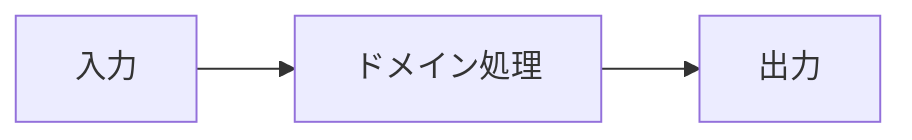

# 図表設計ガイド

## 適用判断

文章や短い表より、関係、順序、状態、境界を明確にできる場合だけMermaidを使う。図だけを正本にせず、目的、前提、重要な不変条件を本文でも説明する。図を使わない場合は「文章または表の方が明確」と記録すればよい。

| 表現したい内容 | 推奨する図 |
|---|---|
| 構造、責務、依存関係 | `flowchart` |
| 要求・応答、認証、外部連携の順序 | `sequenceDiagram` |
| ライフサイクル、モード、状態遷移 | `stateDiagram-v2` |
| エンティティと関連 | `erDiagram` |
| 日付自体が制約となる計画 | `gantt` |

## 記載規則

- ノードIDはASCIIで安定させ、表示ラベルを日本語にする。
- 1図1目的とし、巨大な1図へ詰め込まない。
- 責務境界、信頼境界、失敗経路は必要に応じて視覚的に区別する。
- 実在する秘密情報、個人情報、認証情報、内部ホスト名を記載しない。
- 仮の構成を確定事項のように描かない。未確定箇所は本文で明示する。

## 記入枠

- 図の目的:
- 図で答える問い:
- 前提:
- 図に含めない範囲:
- 本文で補足する不変条件:

