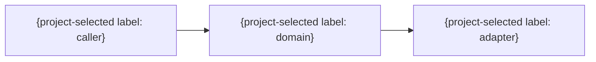

# 02 設計

> この文書は、00・01の要求と要件を満たす責務、境界、依存方向、失敗時の安全性を定義する。`成果物用語と責務境界`は`.agent-skill-chain/docs/01_開発ワークフロー.md`を正本とし、要求・要件・受け入れ条件を設計都合で再定義しない。該当しない節は削除せず、対象外理由を1文で記録する。

## 0. 管理情報と追跡

| 項目 | 内容 |
|---|---|
| 件名・正本 | （件名、GitHub Issue等） |
| 要求・要件の版 | （URL、SHA、ダイジェスト） |
| 作成・更新日 | （ISO 8601形式） |
| 対象コンテキスト | （名称） |
| 仕様影響 | updated / no-spec-impact / unknown |

## 1. 設計方針

### 1.0 開発考慮事項の適用判定（必須）

| ID | 考慮事項 | 判定 | 理由 | 設計・検証証拠 |
|---|---|---|---|---|
| DC-PRIVACY | Privacy/Security by Design | applicable / not-applicable | （範囲を限定した理由） | （信頼境界、データ分類、脅威・検証） |
| DC-OBSERVABILITY | Secure Logging・Observability・運用可能性 | applicable / not-applicable | （範囲を限定した理由） | （PII/secret除外、相関、アクセス、保持、rotation・容量、監視、復旧） |
| DC-UX | Human-Centered UI/UX・アクセシビリティ | applicable / not-applicable | （範囲を限定した理由） | （利用flow、状態・error、keyboard/touch、支援技術） |
| DC-TOKENS | Design System・Design/Layout Token | applicable / not-applicable | （範囲を限定した理由） | （意味token、component state、breakpoint、layout不変条件） |

### 1.1 設計目標

- （満たす要件と品質特性）

### 1.2 設計対象外

- （採用しない機能・基盤・抽象化と理由）

### 1.3 適用する原則

| 原則 | この設計での適用方法 | 証拠 |
|---|---|---|
| UNIX・単一責務 | （1部品1責務、明示入出力、合成） | （構成） |
| DDD | （コンテキスト、モデル、不変条件） | （節） |
| BDD/TDD | （AC→SCN→失敗→実装） | （追跡表） |
| Zero Trust | （入力、同一性、状態、権限） | （境界） |

## 2. システムコンテキストと責務

### 2.1 境界づけられたコンテキスト

| コンテキスト | 責務 | 所有モデル | 入力 | 出力 | 対象外 |
|---|---|---|---|---|---|
| （名称） | （1文） | （モデル） | （入力） | （出力） | （境界） |

### 2.2 コンポーネント

| コンポーネント | 単一責務 | 依存先 | 外部処理 | テスト接合部 |
|---|---|---|---|---|
| （名称） | （1文） | （内向き依存） | （有無） | （注入点） |

### 2.3 依存方向と循環防止

- 呼び出し元 → 呼び出し先:
- 許可しない依存:
- 外部プロセスを呼べる境界:
- 循環を検出する方法:

| node | 依存先 | authority/evidence | topological順 | cycle反例SCN |
|---|---|---|---:|---|
| （安定ASCII ID） | （下流node） | （外部attestation等） | 1 | SCN-... |

candidate自己評価、tracked artifact自己SHA、相互参照をedgeとして許可しない。rollback/retryは単調revision、上限、終了条件を別途定義する。

### 2.4 図表の判断

- Mermaid: 必要 / 不要
- 図で答える問い、または不要理由:
- 必要な場合は`.agent-skill-chain/templates/common/00_図表設計ガイド.md`に従い、同期時は図と判断をIssue本文へ記載する。

## 3. 操作と入出力

| 操作 | 種別 | 入力 | 出力 | 状態変更 | 失敗 |
|---|---|---|---|---|---|
| （操作名） | 読み取り / 書き込み | （形式・制約） | （形式） | （対象） | （エラー） |

- コマンドと照会を分離する箇所:
- 合成可能な最小単位:
- 冪等性:
- 再試行可能性:

## 4. ドメインモデルとデータ

- 参照するドメイン用語IDと標準語:
- 設計中に発見した未定義語・意味変更（ある場合は01へ戻した版）:
- API・CLI、データ、UI、ログ・診断で標準語を維持する方法:

### 4.1 モデル

| モデル | 対応用語ID | 属性 | 不変条件 | 生成・変更主体 | 永続化 |
|---|---|---|---|---|---|
| （名称） | TERM-... | （主要属性） | INV-... | （主体） | （方式） |

### 4.2 識別子・UUID（必要な場合だけ）

- 採用 / 非採用:
- 対象と一意性の範囲:
- 形式・生成主体・生成時点:
- 正規形・比較・直列化:
- 列挙耐性・情報漏えい:
- 移行・ロールバック:
- 詳細は`.agent-skill-chain/templates/common/01_識別子設計ガイド.md`に従い、同期時は識別子方針をIssue本文へ記載する。

### 4.3 データ整合性

- 原子的に変更する単位:
- 同時実行時の競合:
- 重複・再実行:
- 部分失敗の扱い:
- 保存期間・削除・監査:

## 5. 信頼境界、安全性、権限

| 境界 | 信頼しない入力・状態 | 検証 | 拒否時の動作 | 再検証時点 |
|---|---|---|---|---|
| （境界） | （対象） | （方法） | （安全側動作） | 書き込み直前 |

- 認証:
- 操作単位の承認:
- 候補変更自身で緩和できないポリシー:
- 秘密情報の入力・保存・伏字化:
- パストラバーサル、Unicode、シンボリックリンク:
- TOCTOU対策:

## 6. 失敗、復旧、ロールバック

| 失敗 | 検知 | 利用者への結果 | 保持する状態 | 復旧 | ロールバック |
|---|---|---|---|---|---|
| （失敗） | （検知方法） | （明示エラー） | （証拠・作業場所） | （手順） | （手順） |

- 不明状態で拒否する条件:
- 再開地点を決める証拠:
- 不可逆操作と別承認:

## 7. 外部インターフェース（該当時）

| API・CLI・ファイル・イベント | 契約 | 入力検証 | 認証・承認 | タイムアウト・再試行 | 互換性 |
|---|---|---|---|---|---|
| （名称） | （形式） | （方法） | （条件） | （方針） | （版） |

## 8. UIと表示契約（該当時）

- UIの有無:
- 利用者・主要task・利用環境:
- empty/loading/error/success/disabled状態と回復導線:
- 画面・状態・主要操作:
- アクセシビリティと検証基準:
- keyboard、touch、focus、読み上げ、色以外の状態識別:
- レスポンシブ条件:
- design token・layout token・component stateの正本:
- `docs/specs/17_デザイン/`の要否と理由:
- `docs/specs/18_レイアウト/`の要否と理由:

## 9. 観測可能性

- 成功・失敗の記録:
- ログへ含める相関情報:
- ログへ含めない個人情報・秘密情報と伏字化・構造化境界:
- ログの閲覧権限、改竄対策、保持期間、rotation・容量上限、削除:
- メトリクス・警告:
- trace・外形監視・alertと障害対応への接続:
- 診断コマンド:

## 10. テスト戦略と接合部

| 対象 | {project policyが選択したtest layerごとの担保} | 模擬する外部境界 | 重要な失敗系 |
|---|---|---|---|
| （責務・契約） | （選択層と担保内容） | （注入点） | （ケース） |

- 実ワークスペース・実リモート・他worktreeを保護する方法:
- path traversal、Unicode、atomicity、remote誤認、secret、TOCTOUの割当:
- 性能・負荷確認（対象外なら理由）:

## 11. 仕様整合性と追跡

| 要件ID | 設計要素 | シナリオID | 更新する仕様 |
|---|---|---|---|
| FR-01 | （責務・操作） | SCN-... | `docs/specs/...` |

- `no-spec-impact`の場合の限定的根拠:
- 任意の`related_adrs`:
- ADRサブシステムを実装しないことの確認:

## 12. 代替案、残存リスク、未決事項

| 項目 | 採用・不採用 | 根拠 | 残存リスク・決定権者 |
|---|---|---|---|
| （案） | （判定） | （事実） | （内容） |

## 13. policy hook（該当時だけ）

変更がpolicy境界へ触れる場合だけ、trusted入力、staged migration、override拘束、offline保留、rollbackの参照先を記録する。詳細契約はproject policyと設計添付へ分離する。
