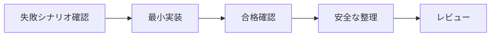

# 03 実装計画

> 設計を、先に失敗を確認できる小さな実装単位へ分解する。日付自体が制約でない限りGanttを必須にせず、依存順と完了条件を優先する。

## 0. 管理情報と実装条件

| 項目 | 内容 |
|---|---|
| 件名・正本 | （件名、GitHub Issue等） |
| 設計の版 | （URL、SHA、ダイジェスト） |
| 基点 | （リモート、既定ブランチ、基点SHA） |
| 専用ブランチ・worktree | （名称、絶対パス） |
| 作成・更新日 | （ISO 8601形式） |
| 停止点 | PR作成後 / その他 |

## 1. 実装方針と順序

- 最小実装の方針:
- 既存変更を保持する方法:
- 旧資産を復元・実行しない範囲:
- 実装順の根拠:

図が不要な場合は、依存順を次の表だけで示す。

## 2. 受け入れ条件・シナリオ・実装の追跡

| AC ID | SCN ID | テスト層 | 先に観測する失敗 | 実装箇所 | 最終確認 |
|---|---|---|---|---|---|
| AC-01 | SCN-... | 単体 / 結合 / E2E | （失敗内容） | （ファイル・責務） | （コマンド・結果） |

## 3. 失敗テストの初期証拠

| SCN ID | 実行日時 | 実行コマンド | 期待した失敗 | 実際の失敗 | 証拠保存先 |
|---|---|---|---|---|---|
| SCN-... | （日時） | （コマンド） | （理由） | （終了値・要約） | （ログ・CI） |

## 4. 実装タスク

### T01 （単一責務のタスク名）

- 目的:
- 変更対象:
- 入力・出力:
- 依存タスク:
- 対応要件・シナリオ:
- 先に失敗を確認する方法:
- 最小実装:
- 整理可能な範囲:
- 仕様更新:
- 完了条件:
- ロールバック・再開地点:

### T02 （単一責務のタスク名）

（T01と同じ項目で記載する）

## 5. Gherkinテスト計画

> 単体・結合・E2Eの起票はすべて、日本語の`Feature / Scenario / Given / When / Then`と一意のSCN IDで記載する。テストコードは起票の実行定義であり、起票そのものをJavaScriptの`test()`等へ分散させない。

### 5.1 単体

| SCN ID | 対象責務 | 正常・異常・境界・悪用・回帰 | 模擬境界 |
|---|---|---|---|
| SCN-UNIT-... | （対象） | （観点） | （なし / 模擬対象） |

### 5.2 結合

| SCN ID | 結合する責務・契約 | 観測結果 | 一時環境 |
|---|---|---|---|
| SCN-INT-... | （対象） | （結果） | （一時リポジトリ等） |

### 5.3 E2E

| SCN ID | 利用者操作 | 最終結果 | 外部処理の扱い |
|---|---|---|---|
| SCN-E2E-... | （操作） | （結果） | 模擬 / 読み取り専用 |

### 5.4 安全性の必須観点

- [ ] パストラバーサルとシンボリックリンク脱出
- [ ] Unicode制御文字と正規化
- [ ] 同時作成と原子性
- [ ] リポジトリ・リモート誤認
- [ ] 秘密情報の混入と伏字化
- [ ] TOCTOU
- [ ] 実ワークスペース、実リモート、他worktreeを変更しない

対象外がある場合は、項目ごとに理由を記録する。

## 6. 検証コマンド

| 検証 | コマンド | 合格条件 |
|---|---|---|
| 日本語文書形式 | （コマンド） | 0件の違反 |
| Gherkin形式 | （コマンド） | 全SCN ID・全層が有効 |
| 型検査 | （コマンド） | エラー0件 |
| 単体 | （コマンド） | 失敗0件 |
| 結合 | （コマンド） | 失敗0件 |
| E2E | （コマンド） | 失敗0件 |
| 既存テスト一式 | （コマンド） | 失敗0件 |
| 配布物 | （コマンド） | 開発専用資産0件 |
| ShellCheck | （変更したシェルだけ。対象外なら理由） | 違反0件 |

## 7. 仕様更新

| 変更 | `docs/specs/`更新先 | 要件・SCN・テストの追跡 |
|---|---|---|
| （振る舞い・構造） | （パス） | （ID） |

- `no-spec-impact`の場合の限定的根拠:
- UI有無と条件付きトークンの判断:
- 新規プロジェクト / 既存導入の判断:

## 8. レビュー計画

| ラウンド | 対象 | 肯定観点 | 敵対観点 | 完了条件 |
|---:|---|---|---|---|
| 1 | 全差分・全評価基準 | 正しさ、価値、実現可能性、整合性、保守性 | 反例、失敗、境界、悪用、安全性、損失、復旧、範囲 | 指摘確定 |
| 2 | 未解決Critical/High、修正差分、隣接範囲 | 修正の有効性 | 回避・回帰の有無 | 停止指摘解消 |
| 3 | 収束状態 | 最終整合性 | 残存リスク | 全指摘分類とAI裁定 |

## 9. 提出、ロールバック、再開

- コミット単位:
- push先:
- PR本文の関連付け（自動終了しない表現）:
- マージ、Issue終了、ブランチ削除、release、公開、cleanupの権限分離:
- ロールバック手順:
- 失敗時に保持するworktree・ブランチ・証拠:
- 次回の再開地点:

## 10. 進捗

| タスク | 状態 | コミット | テスト結果 | 仕様 | 備考 |
|---|---|---|---|---|---|
| T01 | 未着手 / 進行中 / 完了 | （SHA） | （結果） | （更新先） | （内容） |
