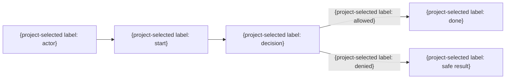

# 業務・利用者フロー

| 業務ID | 業務 | 主体 | 開始条件 | 完了条件 | 例外 |
|---|---|---|---|---|---|
| BUS-001 | {業務} | {主体} | {条件} | {条件} | {例外} |

## ユースケース詳細

**対応関係の正本は`15_要件追跡/00_追跡表.md`とし、ここへ複製しない。** 今回届ける単位のユースケースだけを詳細化する。

- UC-001 目的: {この業務で達成する結果}
- 主体・権限: {主体と必要な権限}
- 起動: {画面操作 / API / CLI / イベント / 時刻}
- 前提条件: {成立していなければ開始しない条件}
- 事後条件: {業務として成立した結果。受付や画面操作の成功と混同しない}
- 主フロー: {手順}
- 代替フロー: {条件と手順}
- 失敗フロー: {条件、保持される状態、利用者の再開手段}
- 業務規則・受け入れ例: {BR-...、SCN-...}

## 業務規則

| 規則ID | 規則 | 適用条件 | 例外 | 根拠 |
|---|---|---|---|---|
| BR-001 | {規則} | {条件} | {例外} | {根拠} |
