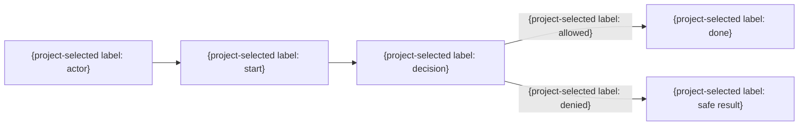

# 業務・利用者フロー

| 業務ID | 業務 | 主体 | 開始条件 | 完了条件 | 例外 |
|---|---|---|---|---|---|
| BUS-001 | {業務} | {主体} | {条件} | {条件} | {例外} |

## 業務規則

| 規則ID | 規則 | 適用条件 | 例外 | 根拠 |
|---|---|---|---|---|
| BR-001 | {規則} | {条件} | {例外} | {根拠} |
