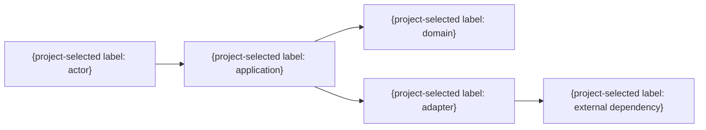

# 全体アーキテクチャ

## 共通既定値

- ドメイン規則は外部I/Oへ依存させない。
- アプリケーション層がユースケースを合成し、外部境界をアダプターへ閉じ込める。
- 依存方向は外側から内側への一方向とし、循環依存を認めない。

| コンポーネントID | 責務 | 入力 | 出力 | 許可依存 | 禁止依存 |
|---|---|---|---|---|---|
| CMP-001 | {単一責務} | {入力} | {出力} | {依存先} | {依存先} |
