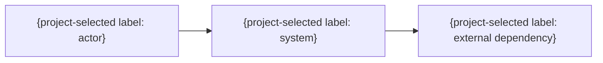

# システムコンテキスト

```mermaid
flowchart LR
  actor_node["{project-selected label: actor}"] --> system_node["{project-selected label: system}"]
  system_node --> external_node["{project-selected label: external dependency}"]
```

| 接続先 | 目的 | 契約 | データ | 信頼区分 | 障害時 |
|---|---|---|---|---|---|
| {名称} | {目的} | {API等} | {データ} | 信頼しない / 条件付き | {縮退} |
