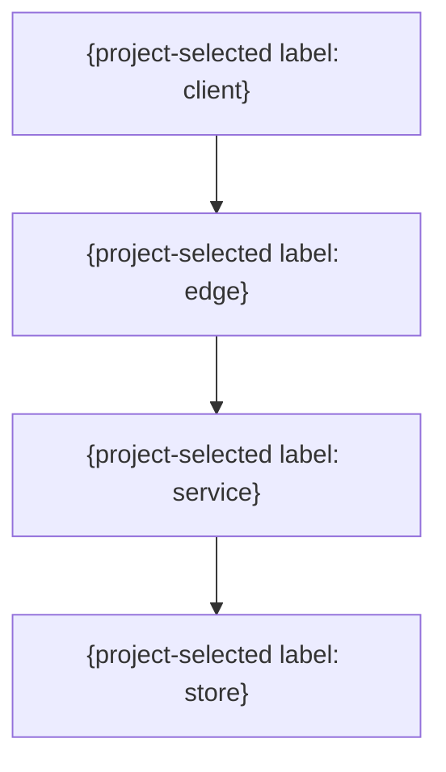

# 配置・依存

| 配置単位 | 実行環境 | 責務 | 依存 | スケール | 障害分離 |
|---|---|---|---|---|---|
| {単位} | {環境} | {責務} | {依存} | {方式} | {境界} |

```mermaid
flowchart TB
  client_node["{project-selected label: client}"] --> edge_node["{project-selected label: edge}"]
  edge_node --> service_node["{project-selected label: service}"]
  service_node --> store_node["{project-selected label: store}"]
```
