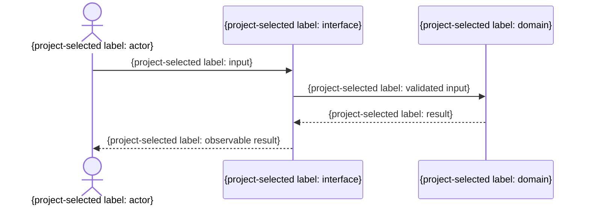

# FN-XXX 個別機能仕様

- 目的: {利用者価値}
- 関連要件: {REQ-{domain}-...}
- 関連ユースケース: {UC ID。対応の正本は`15_要件追跡/00_追跡表.md`}
- 主体・権限: {主体・権限}
- 前提条件: {条件}
- 入力: {形式・制約}
- 出力: {形式・制約}
- 正常時: {振る舞い}
- 失敗時: {状態・表示・変更されないもの}
- 不変条件: {条件}
- 互換性: {方針}
- 対象外: {範囲}

図が必要ならproject policyが選択した表示言語を注入し、主体、境界、検証済み入出力を示す。次の図は構造だけを示すhookであり、表示名とmessageは置換する。

| 受け入れ条件 | SCN ID | test layer |
|---|---|---|
| {条件} | SCN-... | {project選択test layer、全層を1層1行} |
