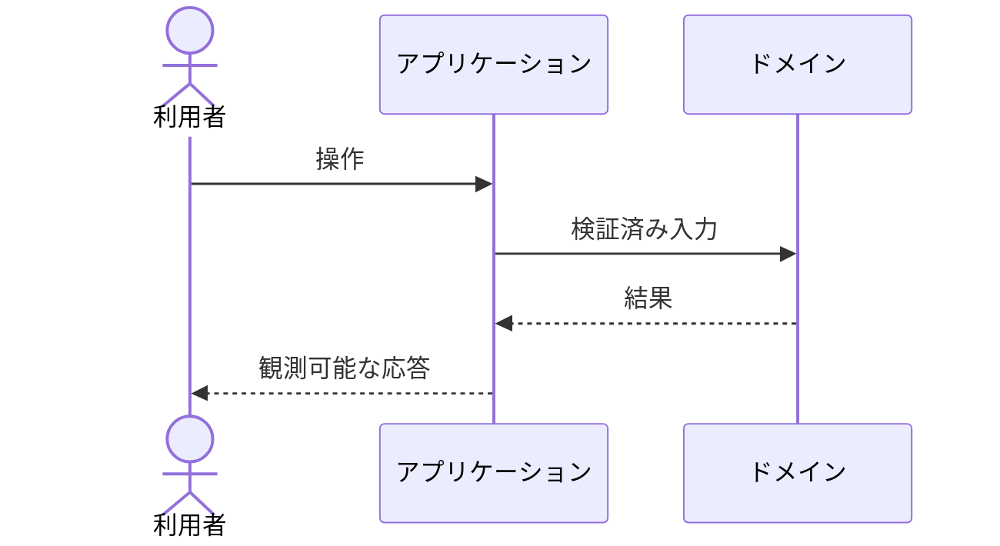

# FN-XXX 個別機能仕様

- 目的: {利用者価値}
- 関連要件: {FR-...}
- 主体・権限: {主体・権限}
- 前提条件: {条件}
- 入力: {形式・制約}
- 出力: {形式・制約}
- 正常時: {振る舞い}
- 失敗時: {状態・表示・変更されないもの}
- 不変条件: {条件}
- 互換性: {方針}
- 対象外: {範囲}

| 受け入れ条件 | SCN ID | テスト層 |
|---|---|---|
| {条件} | SCN-... | 単体 / 結合 / E2E |
