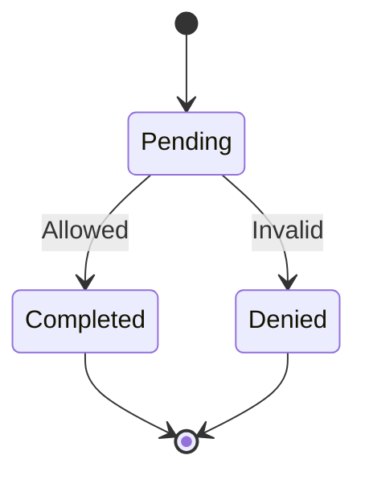

# 状態遷移

```mermaid
stateDiagram-v2
  [*] --> Pending
  Pending --> Completed: Allowed
  Pending --> Denied: Invalid
  Completed --> [*]
  Denied --> [*]
```

| 現在状態 | 操作 | ガード条件 | 次状態 | 副作用 | 失敗時 |
|---|---|---|---|---|---|
| {状態} | {操作} | {条件} | {状態} | {変更} | 状態を変更しない |
