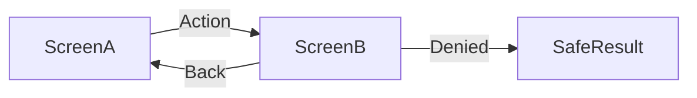

# 画面遷移

```mermaid
flowchart LR
  ScreenA -->|Action| ScreenB
  ScreenB -->|Back| ScreenA
  ScreenB -->|Denied| SafeResult
```

| 遷移元 | 操作 | 条件・権限 | 遷移先 | データ保持 | 失敗時 |
|---|---|---|---|---|---|
| SCR-001 | {操作} | {条件} | SCR-002 | {保持} | {表示・遷移} |
