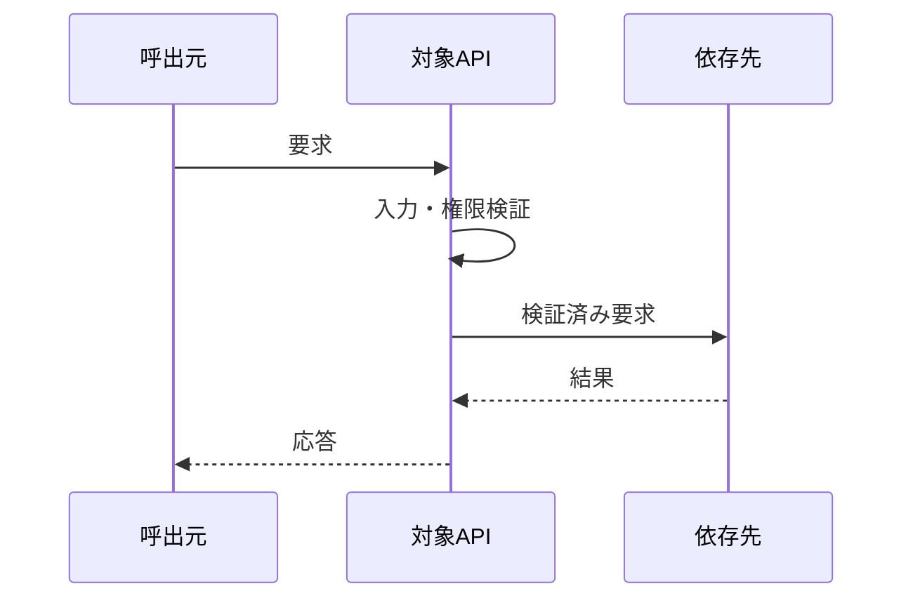

# API-XXX 個別API仕様

- 目的: {目的}
- 呼出元・呼出先: {主体}
- 契約版: {版}
- 認証・認可: {方式・権限}
- 冪等性: {条件}

| 項目 | 位置 | 型 | 必須 | 制約 | 秘密区分 |
|---|---|---|---|---|---|
| {名称} | path / query / header / body | {型} | 必須 / 任意 | {制約} | 公開 / 内部 / 機密 |

| 結果 | 状態・終了値 | 応答 | 再試行 | 副作用 |
|---|---|---|---|---|
| 成功 | {値} | {形式} | 不要 | {変更} |
| {失敗} | {値} | {形式} | 可 / 不可 | 変更しない |

