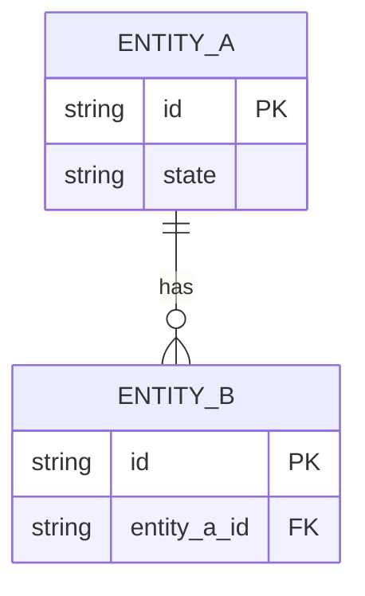

# データモデル

```mermaid
erDiagram
  ENTITY_A ||--o{ ENTITY_B : has
  ENTITY_A {
    string id PK
    string state
  }
  ENTITY_B {
    string id PK
    string entity_a_id FK
  }
```

| エンティティ | 責務 | 正本 | 識別子 | 不変条件 |
|---|---|---|---|---|
| {名称} | {責務} | {場所} | {形式} | {条件} |
