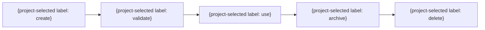

# データライフサイクル

| データ | 生成 | 利用 | 共有 | 保存 | アーカイブ | 削除 | 法的根拠・同意 |
|---|---|---|---|---|---|---|---|
| {DATA ID} | {条件} | {目的} | {相手} | {期間} | {条件} | {手順} | {根拠} |

上表を生成・利用・共有・保存・アーカイブ・削除・法的根拠の完全な契約とする。次の図は主要な状態遷移だけを示す部分図であり、共有と保存の契約を省略または無効化しない。

