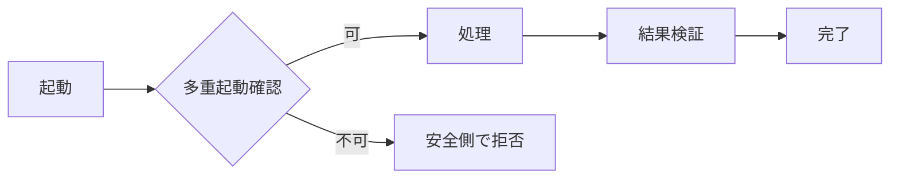

# JOB-XXX 個別ジョブ仕様

- 目的: {目的}
- 起動条件・時刻・タイムゾーン: {条件}
- 多重起動: 拒否 / 待機 / 並列。条件: {条件}
- 入力と確定時点: {内容}
- 処理単位・トランザクション: {単位}
- 正常終了・部分成功・失敗: {状態}
- 再実行・再開位置・冪等性: {仕様}
- タイムアウト・中止・ロールバック: {仕様}
- 監視・通知・証拠: {仕様}

