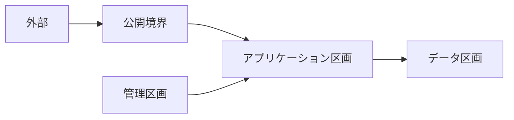

# 論理ネットワーク

```mermaid
flowchart LR
  internet[外部] --> edge[公開境界]
  edge --> appZone[アプリケーション区画]
  appZone --> dataZone[データ区画]
  admin[管理区画] --> appZone
```

| 通信ID | 送信元 | 宛先 | 方向 | プロトコル・ポート | 認証・暗号化 | 用途 | 既定拒否 |
|---|---|---|---|---|---|---|---|
| NET-001 | {区画} | {区画} | inbound / outbound | {契約} | {方式} | {用途} | はい |
