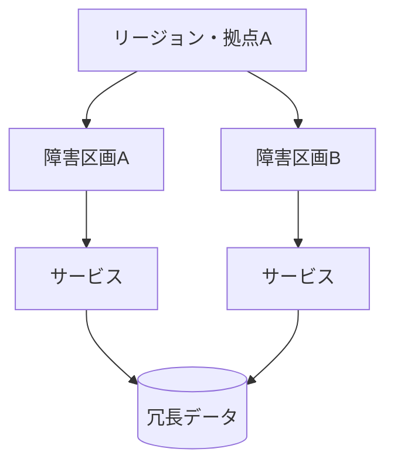

# 物理・配備構成

```mermaid
flowchart TB
  regionA[リージョン・拠点A] --> zoneA[障害区画A]
  regionA --> zoneB[障害区画B]
  zoneA --> serviceA[サービス]
  zoneB --> serviceB[サービス]
  serviceA --> store[(冗長データ)]
  serviceB --> store
```

| ノードID | 配置 | 役割 | 台数・スケール | 冗長化 | 障害影響 | 復旧 |
|---|---|---|---|---|---|---|
| NODE-001 | {場所} | {役割} | {条件} | {方式} | {範囲} | {方式} |
