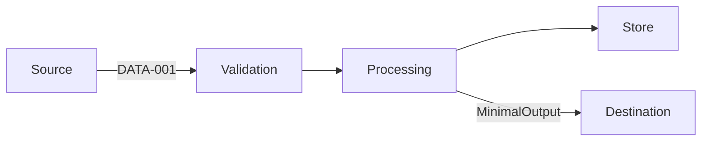

# データフロー

```mermaid
flowchart LR
  Source -->|DATA-001| Validation
  Validation --> Processing
  Processing --> Store
  Processing -->|MinimalOutput| Destination
```

| フローID | データ | 送信元 | 境界・検証 | 宛先 | 暗号化 | 保持 | 監査 |
|---|---|---|---|---|---|---|---|
| FLOW-001 | {DATA ID} | {元} | {検証} | {先} | 保存時 / 通信時 | {期間} | {証拠} |
