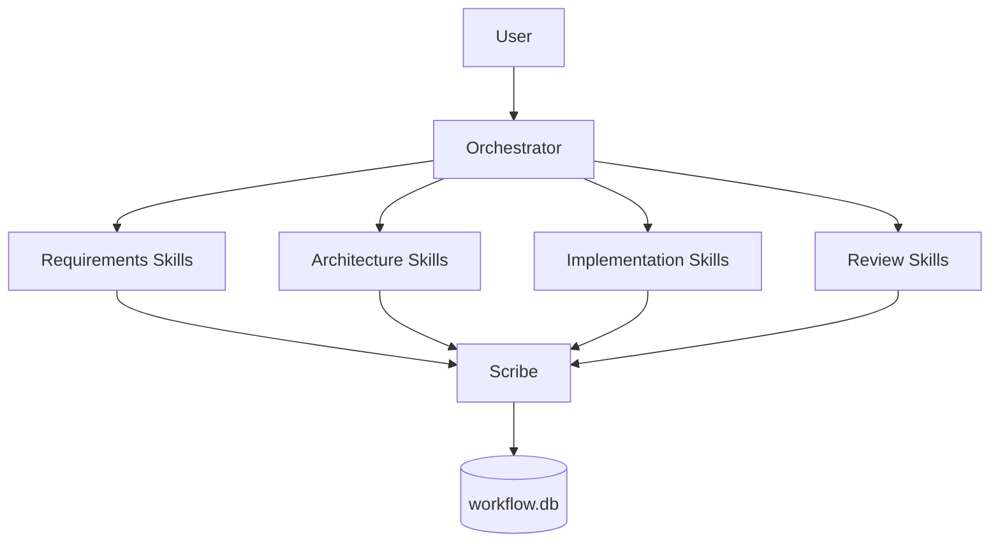
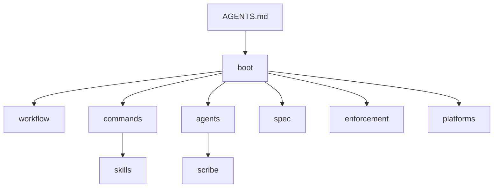

# .agents — 構成と索引

本ディレクトリは AI 実行契約・能力（skills）中心のワークフロー・command（skill chain）・委譲の正本を格納する。入口はプロジェクトルートの AGENTS.md。**実行契約の正本は [boot/CORE.md](boot/CORE.md)**。

**優先順位**: プロジェクト固有のルールは **.agents-project/** に置く。**.agents-project が .agents より最優先**される。同名・同目的のルールは .agents-project を採用し、無い場合は本 .agents に従う（CORE §ルールの優先順位）。

中心は skill（能力）。phase は gate、command は skill を束ねる実行単位、agents はオーケストレーションのみ。

- **使い方**: [GETTING_STARTED.md](GETTING_STARTED.md) でメイン・サブの役割と 1 issue の回し方を確認する。

---

## AGENTS アーキテクチャ（概要）

### 読む順番と責務の流れ（1 図で固定）

入口は AGENTS.md。boot を読んだうえで、workflow / commands / skills / agents / scribe / spec / enforcement / platforms へ進む。

---

## ファイル名と直下の構成

- **ファイル名**: .agents 直下のファイル名は**英語**とする。ツール・スクリプト・クロス環境での参照のしやすさのため。
- **フラットでよい理由**: 直下には**入口となる少数のドキュメントのみ**を置く。索引（本表）から一覧でき、サブディレクトリ（boot / workflow / commands / skills 等）に責務別の詳細を分けている。数が増えた場合はサブディレクトリでまとめる。

---

## 何を知りたいときに何を読むか

| 知りたいこと | 読むファイル |
|--------------|---------------|
| 絶対制約・読了義務 | boot/CORE.md |
| いつ何を読むか・command/capability のトリガー | boot/LOAD_POLICY.md |
| フェーズ・成果物・DoD（phase = gate） | workflow/PHASES.md |
| command を実行するとき（skill chain の実行） | commands/{command}.md と skills/agent/run_command.md |
| 特定 capability を使うとき | skills/{domain}/{capability}/ |
| 思想・判断の問い・既知の注意点 | CONCEPTS.md |
| command / skill の共通入出力契約（filter 化） | IO_CONTRACT.md |
| システム開発の基本・設計原則・設計判断の優先順位 | spec/（要求・設計の前に参照） |
| 実行・ドキュメント・テスト要約 | RULES.md |
| テストコードの BDD 形式・Given/When/Then インライン | TEST_BDD_FORMAT.md |
| オーケストレーション・誰がいつ command を回すか | agents/README.md |
| 強制の方針・hooks の配置・強制の4層 | enforcement/README.md、enforcement/DESIGN.md |
| 成果物のテンプレート・どの command/capability が使うか | workflow/TEMPLATES.md |
| スキルのプラットフォーム別形式・配置（Claude/Cursor/Gemini） | platforms/SKILLS.md |
| ログ・書記 | scribe/README.md |
| workflow.db 配置・スキーマ | ledger/README.md, ledger/schema.md |
| プラットフォーム入口・設定の差分 | platforms/README.md |
| 人間向け案内 | human/README.md |
| **プロジェクト固有・最優先** | **プロジェクトルートの .agents-project/**（本 .agents より優先。詳細は CORE §ルールの優先順位） |
| セットアップ・スモークテスト | SETUP.md |
| 基盤の肥大化防止・メタレイヤー | META_LAYER.md |
| セットアップ脚本 | scripts/setup-agents-spec.sh（本 .agents をプロジェクトに配備） |
