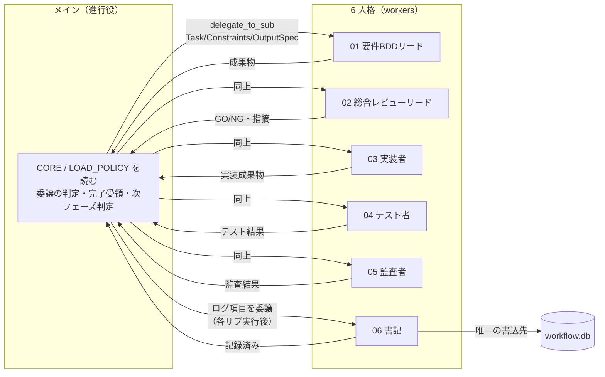
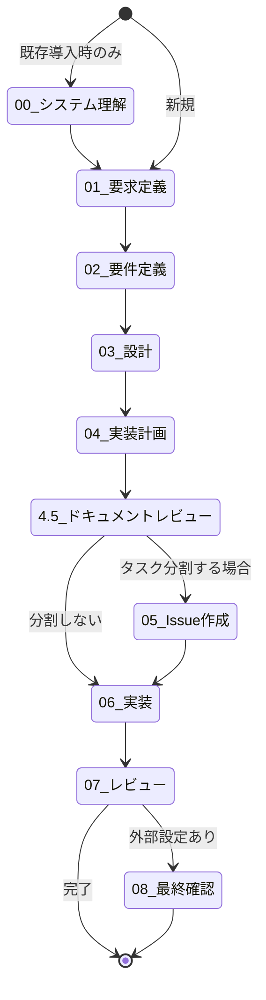

# .agents ディレクトリ構成

> プロジェクトに **AGENTS-spec をコピーしたらすぐ使える** ように、役割別にサブディレクトリで整理している。
> **責務**: **.agents/README.md = .agents/ 配下の内部構造ガイド**。プロジェクトルート入口・人間と AI の導線は [AGENTS.md](../AGENTS.md) を参照。**定義しない**: 絶対制約・読込順（boot）、実行基盤差分（platforms）、判断観点の細則（RULES）。

---

## エージェント関係とワークフロー（図）

### エージェントの関係

メイン（進行役）が CORE / LOAD_POLICY に従い、フェーズごとに 6 人格のいずれかに **delegate_to_sub** で委譲する。各サブ実行後は必ず書記にログ項目を委譲し、書記のみが **workflow.db** に記録する（.workflow/\*\*/logs/ は廃止）。



- **委譲の入口**: [delegate_to_sub](../skills/agent/delegate_to_sub.md) のみ。直接呼び出し禁止。
- **フェーズ→worker 対応**: [LOAD_POLICY 4](../boot/LOAD_POLICY.md) および [workers/README](../workers/README.md) を参照。

### フェーズの状態遷移（システム開発の進め方）

各フェーズは順次進行し、**前フェーズの完了条件を満たすまで次に進まない**。00 は既存プロジェクト導入時のみ。4.5 は必須。05・08 は条件付き。



| フェーズ                     | 必須成果物                              | 主な委譲先                    |
| ---------------------------- | --------------------------------------- | ----------------------------- |
| 00 システム理解              | 00\_システム理解.md                     | （メインまたは要件BDDリード） |
| 01 要求定義                  | 00\_要求定義.md                         | 要件BDDリード                 |
| 02 要件定義                  | 01\_要件定義.md                         | 要件BDDリード                 |
| 03 設計                      | 02\_設計.md                             | 要件BDDリード・実装者         |
| 04 実装計画                  | 03\_実装計画.md                         | 実装者・テスト者→監査者       |
| 4.5 ドキュメント徹底レビュー | memo（レビュー結果・指摘ゼロで3回以上） | メインが実施                  |
| 05 Issue作成                 | 90_issues.md 等                         | （タスク分割時のみ）          |
| 06 実装                      | 実装成果物・テスト通過                  | 実装者・テスト者              |
| 07 レビュー                  | 04_review.md                            | 総合レビューリード・監査者    |
| 08 最終確認                  | 05\_最終確認チェックリスト.md           | 外部設定が必要な場合のみ      |

詳細は [WORKFLOW](WORKFLOW.md) を参照。

---

## ディレクトリ構成（正規形）

```text
.agents/
├── README.md                    # 本ファイル（構成説明・コピー手順）
├── boot/                        # 入口（メインが最初に読む）
│   ├── CORE.md                  # 絶対制約・SILENT MODE・委譲・トレーサビリティ
│   ├── LOAD_POLICY.md           # いつ何を読むか・フェーズ→worker
│   ├── TOOLS.md                 # 使えるツール要約
│   ├── EXECUTION_CONTRACT.md    # 委譲の入出力（Task/Constraints/OutputSpec）
│   ├── MEMORY_POLICY.md         # 記憶 2 層（raw/curated）・サニタイズ
│   └── SUBAGENT.md              # サブに渡す最小ルール・注入順序（1ファイル統合）
├── workers/                     # 6 人格の定義（IN/OUT）
│   ├── README.md                # 一覧・フェーズ→worker 概要
│   └── 01_要件BDDリード.md 〜 06_書記.md
├── capabilities/                # 権限境界（誰が何を書けるか）
│   └── POLICY.md                # 書記以外の workflow.db 書込禁止。書記は workflow.db のみ（logs/ 廃止）
├── ledger/                      # ログ保存（workflow.db）
│   ├── README.md                # 配置・.gitignore 条件
│   ├── schema.sql               # DDL
│   └── ワークフローログ_SQLiteスキーマ.md  # 必須項目・ペイロード仕様
├── skills/                      # 委譲・ドキュメント等のスキル
│   └── agent/
│       └── delegate_to_sub.md   # Task/Constraints/OutputSpec の組み立て
├── WORKFLOW.md                  # ワークフロー・成果物・監査（統合）
├── CONCEPTS.md                  # 思想・概念・哲学・観点（統合）
├── RULES.md                     # 実行・ドキュメント・テスト・レビュー（統合。旧 rules/ は _archive/rules/）
├── scribe/                      # 書記・ログ委譲（トレーサビリティ）
│   ├── 書記役とログ委譲.md
│   └── CONTRACT.md              # 書記が受け取るログのスキーマ（親→書記で固定）
├── _archive/                    # 過去版・詳細（必要時のみ）rules, enforcement, prompts, guide, platform, reference 等
└── human/                       # 人間向け（AI は参照しない）
    ├── 人間向け_開発規約.md
    └── 人間向け_実装原則.md
```

---

## 強制力を高める（Cursor 利用時）

AI に規約を確実に守らせたい場合、[CURSOR_RULE_AGENTS_BOOT.md](./CURSOR_RULE_AGENTS_BOOT.md) に記載のルール本文をプロジェクトの **`.cursor/rules/`** にコピーする。Cursor が常にそのルールをコンテキストに含めるため、4 ファイル（CORE / LOAD_POLICY / WORKFLOW / CONCEPTS）未読のまま作業を始めることを防ぎやすくなる。

---

## プロジェクトへのコピー（すぐ使える状態にする）

**方法 A（推奨・コピペするだけ）**: AGENTS-spec フォルダをプロジェクトにコピーし、ルートに入口ファイルを 1 つ置く。

1. **AGENTS-spec フォルダをプロジェクトルートにコピーする**（中に `.agents/` と `.workflow/templates/` が含まれた状態）。
2. **`AGENTS-spec/COPY_TO_PROJECT_ROOT_AGENTS.md` をプロジェクトルートに `AGENTS.md` としてコピーする。**
3. プロジェクトルートの `.workflow/` に issue 用ディレクトリを作成する。テンプレートは `AGENTS-spec/.workflow/templates/` を参照する。
4. **workflow.db を使う場合**: プロジェクトの `.gitignore` に `workflow.db` を追加する。

**方法 B（中身をルートに展開）**: 規約の中身だけをプロジェクトルートに展開する。

1. **AGENTS-spec の `.agents/` をそのままプロジェクトルートの `.agents/` にコピーする。**
2. **ルートに `AGENTS.md` と `CLAUDE.md` を置く**（AGENTS-spec のものをコピーまたは参照）。
3. **`.agents-project/`** を用意する場合、プロジェクト固有ルールのみ置く。`.agents-project/` は `.agents/` より優先される（AGENTS.md の規約どおり）。
4. **workflow.db を使う場合**: プロジェクトの `.gitignore` に `workflow.db` を追加する（[ledger/README.md](./ledger/README.md)、[workers/README.md](./workers/README.md) 参照）。
5. **テンプレート**: `.workflow/templates/` は AGENTS-spec の `.workflow/templates/` をコピーして使用する。

---

## 参照の起点

- **メインの入口**: 実行前契約に従い、[CORE.md](./boot/CORE.md) → [LOAD_POLICY.md](./boot/LOAD_POLICY.md) → [WORKFLOW.md](./WORKFLOW.md) → [CONCEPTS.md](./CONCEPTS.md) の 4 つを必ず読了してから作業する。**強制力アップ**: [CURSOR_RULE_AGENTS_BOOT.md](./CURSOR_RULE_AGENTS_BOOT.md) を `.cursor/rules/` にコピーすると未読で作業開始することを防ぎやすい。
- **委譲**: [boot/EXECUTION_CONTRACT.md](./boot/EXECUTION_CONTRACT.md)、[skills/agent/delegate_to_sub.md](./skills/agent/delegate_to_sub.md)、[workers/README.md](./workers/README.md)。
- **トレーサビリティ**: [scribe/書記役とログ委譲.md](./scribe/書記役とログ委譲.md)、[ledger/README.md](./ledger/README.md)。
- **ハード制約・フェーズ**: [RULES.md](./RULES.md)、[WORKFLOW.md](./WORKFLOW.md)。

すべての参照パスは **この構成を前提とした相対パス** で記載している。コピー後はパス変更不要。
