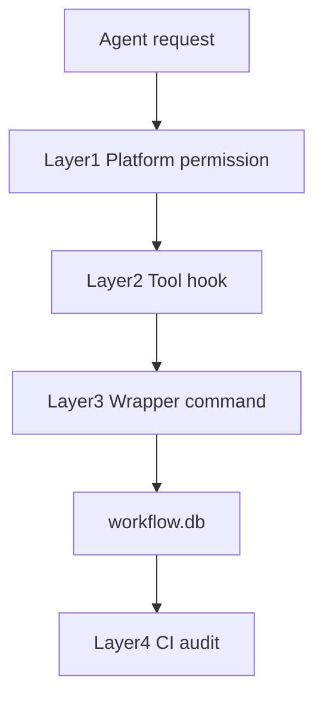

# enforcement — 強制の正本

**強制の目的**: 「理解させる」ではなく **「逸脱できないようにする」**。経路を限定し、違反操作を止め、正しい I/O のみを通し、完了を証跡で縛る。設計は [DESIGN.md](DESIGN.md)（強制の4層・物理／契約／配備／完了）。

hooks で矯正するもの／しないものの正本をここに置く。setup が .claude/・.cursor/・CI へ展開する。

---

## 強制の 4 層と現状

| 層 | 担い手 | 役割 | 現状 |
|----|--------|------|------|
| **Layer1 プラットフォーム権限** | 実行環境 | ロール別のツール許可・拒否 | プラットフォーム依存。設定で orchestrator を Read のみにできる場合は推奨。 |
| **Layer2 Tool hook** | PreToolUse.sh | ツール実行前に違反なら exit 1 | **プラットフォームがツール名・対象パス・コマンド・ロールをフックに渡す場合に有効**。.workflow 直接編集・許可外 Shell・sqlite3 直接・orchestrator の Write/Edit を拒否。渡されない場合は案内のみ exit 0。 |
| **Layer3 Wrapper command** | write-workflow-log.sh | DB 書き込みはラッパー経由のみ | 実装済。書記は sqlite3 直接禁止、本ラッパーのみ使用。 |
| **Layer4 CI audit** | audit.sh | 証跡・順序・品質・sidecar 等の事後検知 | 実装済。push/merge 前に reject。 |

- **runtime**: プラットフォームが `CLAUDE_TOOL_NAME` / `CLAUDE_FILE_PATH` / `CLAUDE_COMMAND` / `AGENT_ROLE`（または同等）を渡す場合 **強い**（その場で reject）。渡さない場合は **弱い**（案内のみ）。
- **CI**: **強い**。audit.sh が証跡・順序・整合性を検証し、違反時は reject。

| Runtime reject が効く条件 | 効かない条件 | CI で補完する条件 |
|---------------------------|--------------|---------------------|
| プラットフォームがツール名・対象パス・コマンド・ロールをフックに渡す場合。PreToolUse が exit 1 で拒否できる。 | 上記を渡さない場合。案内のみ exit 0。 | audit.sh で証跡・順序・CONTRACT 違反を事後検知し reject。 |

**PreToolUse は完全物理強制ではない。** Hook はツール名・コマンド文字列等しか受け取れないため、例えば `bash -c "..."` の内容までは完全には検出できない。そのため runtime guard と CI audit の二段構えが正しい設計である。

**PreToolUse による reject は、Hook が取得可能なメタデータ（ツール名・対象パス・コマンド・ロール）の範囲でのみ有効である。** **取得可能なメタデータ範囲で runtime reject し、残りは CI 監査で補完する** と表現を統一する。

### 4 層の流れ（Mermaid）

### write-workflow-log.sh の堅牢化（任意）

- **理想**: 許可する実行は **正規化した絶対パス**（例: プロジェクトルートからの `.agents/scripts/write-workflow-log.sh` の絶対パス）のみに限定すると、`./write-workflow-log.sh` などの偽物実行を防げる。
- **現状**: コマンド文字列に `write-workflow-log.sh` が含まれるかで判定している。通常運用では十分であるが、厳密化する場合は絶対パス比較・シンボリックリンク解消を検討する。

---

## 配置するファイル一覧

| 配置先（enforcement 内） | 配置するファイル | 展開先（setup 後） |
|--------------------------|------------------|---------------------|
| **claude/** | PreToolUse.sh, PostToolUse.sh | .claude/hooks/ |
| **cursor/** | agents-core.mdc（CORE/LOAD_POLICY 読了義務・証跡プレフィックス・orchestrator 許可ツールのみ） | .cursor/ |
| **ci/** | audit.sh（証跡・CONTRACT 違反の検出） | CI ワークフローから参照 |
| **（直下）** | PROTECTED_PATHS.txt（成果物パス参照用。PreToolUse のパス別拒否に拡張可能） | 参照のみ（コピーしない） |

上記ファイルを本ディレクトリに配置する。setup 脚本は本ディレクトリを参照して .claude/・.cursor/・CI へ展開する。配置するファイルが無い場合は、setup は展開先のディレクトリのみ作成する。

**成果物パス（PROTECTED_PATHS）**: 成果物パス（docs/, src/, app/, components/ 等）は [enforcement/PROTECTED_PATHS.txt](PROTECTED_PATHS.txt) で定義する。PreToolUse で orchestrator がこれらのパスに Write/Edit することを拒否する場合は、その設定を読む形に拡張できる。現状は orchestrator の全 Write/Edit を拒否しているため、パス別設定は未使用。

**audit.sh が実施する必須チェック**: (1) 必須ファイル存在 (2) 04_review 未更新（verify-and-close 未実行） (3) テスト観点未記載 (4) docs 更新要否未記載 (5) memo プレフィックス・timestamp 乖離 (6) PR 内部参照禁止 (7) 重要パス内の TODO/FIXME 残存 (8) workflow.db 品質監査 (9) 成果物と証跡の対応 (10) workflow.db の WAL/SHM sidecar が Git 追跡されていないこと (11) workflow.db 整合性チェック (12)–(19) 証跡の因果・順序監査（新スキーマ時: actor_role=scribe, delegated_by=orchestrator, implement に changed_files_json, verify に review_path/parent、成果物変更とログの対応）。(21) 新スキーマ時は workflow_log の issue_id・review_id の記録を推奨（監査で警告とするかは任意）。

---

## workflow.db の扱い

workflow.db は **証跡ログの本則ストレージ**である。

ただし以下を必ず守る。

- workflow.db は Git 管理対象に含めない
- workflow.db-wal / workflow.db-shm も Git 管理対象外
- DB は setup 時に生成する（.agents/scripts/setup-agents-spec.sh の init_workflow_db）
- DB への書き込みは **scribe agent のみ**（.agents/scripts/write-workflow-log.sh を必ず使用。sqlite3 直接実行禁止）
- SQL 操作は INSERT のみ許可

理由:

SQLite WAL モードでは

- workflow.db-wal
- workflow.db-shm

が生成される。

これらを Git に含めると

- 不整合
- 再現性崩壊
- CI 判定不安定

が発生するため。テンプレート・OSS 配布では workflow.db の実体を **絶対に含めない**。

### 証跡の因果関係（順序監査）

**「証跡がある」だけでは「正しい経路を通った」ことの証明にならない。** ログの存在と実行経路の正当性を結びつけるため、以下を守る。

- **workflow_log は scribe のみ**が書く。actor_role=scribe, delegated_by_role=orchestrator を記録する（推奨スキーマ）。
- すべてのログは **親ログ（parent_entry_id）** を持つチェーンとする。verify-and-close は単独出現禁止。
- **verify-and-close** の親は implement-feature または design-feature であること。順序違反は audit で FAIL。
- 成果物変更には対応するログが必要。04_review.md 変更時は verify-and-close ログが、.workflow/docs 配下の成果物変更時は implement-feature / design-feature / verify-and-close のいずれかのログが存在すること。
- ログがあるだけでは不十分で、**順序と対応関係**まで audit する（audit.sh #12–#19）。

---

## 矯正するもの（物理強制の例）

**現状の実装について**: PreToolUse.sh と PostToolUse.sh は、**デフォルトでは案内メッセージの出力のみで exit 0 で終了する**（違反をその場では止めない）。一方、プラットフォームがツール名・対象パス・コマンド・ロール等のメタデータをフックに渡す環境で実行される場合は、**違反時に exit 1 を返して実行をブロックする**。メタデータの有無とフック契約の詳細は、本 README の「強制の 4 層と現状」§Layer2・「Runtime reject が効く条件」（上記 Line 14 / 23 付近）および [DESIGN.md](DESIGN.md) を参照すること。メタデータが渡されない環境ではその場で違反を止められないため、**CI（audit.sh）で事後検知する構成**とする。必要なメタデータ／フック契約の詳細は **DESIGN.md** および本節に記載されている。上記を参照すること。

**試験運用では「hooks で止める」を前提にしないこと。** ルール違反をその場で止める仕組みではなく、**後から検知する仕組み**である。本当に守らせる中心は **audit / pre-push / CI** とする。強制を高めるには、**フックだけで止めない**・**呼び出し経路を細くする**・**ロール識別を task 契約で外部化する**・**CI で最終確定する** の 4 本柱で組む（DESIGN.md の思想と整合）。

- **メインの直接実作業を塞ぐ**: 実作業は **command 経由・ROLE: 付き Task の委譲** のみ許可する。orchestrator が自分で設計・実装・レビュー本文を書く経路は拒否する（hooks で検知可能な範囲で）。
- **PreToolUse（または Cursor 用 agents-core.mdc）の責務**: メインセッションによる **00/01/02/03/04 やコードへの直接 Write/Edit** はブロックする、または拒否条件に該当することを仕様として持つ。実装は hooks（.cursor の agents-core.mdc 等）で「メインは 00/01/02/03/04 およびソースコードを直接編集・作成してはならない」と記載し、ブロックできない環境では CI/audit で事後検知（例: 03 があるのに 04 がない場合は verify-and-close 未実行として reject）する。
- **物理強制の限界**: メインの直接 Write/Edit/Shell は PreToolUse またはプラットフォーム権限でブロックする。ブロックできない環境では CI（audit.sh）で 03→04 等の事後検知で reject する。**PreToolUse でメインの Write/Edit/Shell をブロックできない環境では、CI（audit.sh）で 03 存在かつ 04 欠如等の事後検知で reject する。書記以外の sqlite3 実行禁止は、プラットフォームの権限設定または CI で確認する。** **orchestrator の理想形は Read のみとし、ファイル更新は worker 経由のみとする。** プラットフォームで権限差を付けられる場合は orchestrator に Write/Edit/Shell を許可しない。**orchestrator が 00/01/02/03/04 やコードを直接変更した場合は、証跡（implement-feature / design-feature / verify-and-close のログ）との対応で検知する。** platform が編集者ロールを渡す場合は、orchestrator による成果物直接編集を audit で FAIL にできる。
- フェーズゲート・command 実行前の読了（run_command と command ファイル）。
- **scribe 未実行の次 Task 拒否**: 検証・クローズ command で write-workflow-log を経ずに次に進むことを防ぐ（hooks / CI で証跡の有無を確認）。
- 証跡未実行の検出。証跡は**本則 workflow.db**、memo は過渡的・例外のみ。**ログは書記のみ**が書き込む。workflow.db 以外へのログ書き込み・書記以外の workflow.db 書き込みは禁止（CORE）。
- **timestamp 付き memo ファイルの作成経路の固定**: `.workflow/{issue}/memo/` 以下の `YYYYMMDD_HHMMSS_*.md` は、write-workflow-log capability または `.agents/scripts/new-workflow-memo.sh` 等、**システム時計からプレフィックスを生成する専用スクリプト経由でのみ**作成する。メインが自由入力でプレフィックス付きファイル名を指定して Write/Edit する経路は hooks / CI で検知・拒否する。
- CI で CONTRACT 違反・証跡欠落を検出したら reject する（audit.sh 等）。

**ローカルで push 前に audit を実行するには**、pre-push フックで audit.sh を呼ぶことを推奨する。採用先では `git push` 前に `enforcement/ci/audit.sh`（またはプロジェクトルートからの相対パス）を実行し、失敗時は push を中止する。例: `.git/hooks/pre-push` から `./.agents/enforcement/ci/audit.sh .` を実行する。ci/ に pre-push.example を同梱しているので、採用先で pre-push にコピーして利用できる。

## 矯正しないもの

- 設計品質・要件の妥当性・テスト十分性・レビュー品質（これらは各 capability skill の責務）。

---

## 失敗条件と差し戻し

**目的**: 違反時に「何を失敗とみなすか」「どこへ差し戻すか」を一意にし、CI および subagent-guard の判定ルールとして参照できるようにする。運用者に一目で分かる形で列挙する。上記「矯正するもの」と整合する。

### 失敗とみなす条件（判定ルール）一覧

次のいずれかに該当する場合は **失敗** とする。audit.sh および subagent-guard が同一のルールを参照する。

| # | 失敗条件 | 説明 | 差し戻し先 |
|---|----------|------|------------|
| 1 | **必須参照ファイル未読** | LOAD_POLICY や command/skill で定めた必須読了ファイルを参照していない。証跡・実行経路の前提が満たされない。 | 03_実装計画 または 該当 issue |
| 2 | **02/03 のテスト観点不足** | 02_設計 §6 または 03_実装計画のタスク別テスト観点（BDD/単体テスト仕様）が記載されていない。RULES・PHASES の DoD に反する。 | 03_実装計画 または 該当 issue |
| 3 | **04_review 未更新** | 実装・レビュー完了とみなすべきタイミングで 04_review.md が未作成または未更新。verify-and-close の成果物が欠けている。 | 該当 issue（04 を作成・更新） |
| 4 | **docs 更新要否未記載** | 実装・設計変更に伴うシステム仕様書（docs/）の更新要否が判定・記載されていない。04_review §11 および DOCS_RULES で求められる記載が欠落している。 | 04_review に追記 または 03/該当 issue |
| 5 | **ログ記録未実施** | 検証・クローズ command で write-workflow-log（書記）を経ずに次に進んでいる。書記以外の workflow.db 書き込みまたはログ省略。CORE 違反。 | verify-and-close を再実行（書記委譲を含む） |
| 6 | **PR テンプレ違反（内部参照禁止）** | PR メッセージにリポジトリ内（.workflow/ や docs/ 等）へのリンクを記載している。.workflow/templates/99_PR.md の「絶対ルール」違反。 | PR 本文を修正（内部リンク削除） |
| 7 | **TODO/FIXME 残存** | .workflow 配下の重要パス（*.md、templates 除く）に TODO または FIXME が残っている。 | 該当ファイルで解消または範囲外へ移動 |
| 8 | **workflow.db 品質違反** | 許可 command 外の値・summary 空・ts_utc 形式異常。 | verify-and-close を再実行（書記委譲を含む） |
| 9 | **04_review と証跡の不整合** | 04_review が存在するが workflow.db に該当証跡がない。 | verify-and-close を再実行（書記委譲を含む） |
| 10 | **workflow.db sidecar の Git 追跡** | workflow.db-wal / workflow.db-shm が Git 管理対象に入っている。証跡の信頼性・別環境での破損の原因となる。 | .workflow/.gitignore に workflow.db, workflow.db-wal, workflow.db-shm を追加し、追跡から外す |
| 11 | **workflow.db 整合性不良** | PRAGMA integrity_check が ok でない。証跡 DB の破損。 | DB を再生成または修復。scribe は write-workflow-log.sh のみ使用すること |
| 12 | **actor_role 違反** | workflow_log の actor_role が scribe 以外。ログは書記のみが書く。 | verify-and-close を再実行（書記委譲）。write-workflow-log.sh で ACTOR_ROLE=scribe を付与 |
| 13 | **delegated_by_role 違反** | workflow_log の delegated_by_role が orchestrator 以外。 | 同上。DELEGATED_BY_ROLE=orchestrator を付与 |
| 14 | **implement-feature に changed_files_json 欠如** | implement-feature ログに changed_files_json が空または無い。 | 該当 command を再実行し、変更ファイルを JSON で記録 |
| 15 | **verify-and-close に review_path 欠如** | verify-and-close ログに review_path が無い。 | verify-and-close 再実行時に REVIEW_PATH を指定 |
| 16 | **verify-and-close に parent 欠如** | verify-and-close が単独で記録されている（parent_entry_id 無し）。 | 正しい順序で command を実行し、PARENT_ENTRY_ID を渡す |
| 17 | **verify-and-close の親が implement/design でない** | 親ログが implement-feature または design-feature でない。 | 順序を守り直して記録 |
| 18 | **04 変更に verify ログなし** | 04_review.md が変更されたのに verify-and-close ログが無い。 | verify-and-close を実行して書記に記録させる |
| 19 | **成果物変更にログなし** | .workflow/docs 配下の成果物が変更されたのに該当 command のログが無い。 | 該当 command を実行して書記に記録させる |
| 20 | **document に document_id があるのに workflow_log にその document_id が無い** | 成果ドキュメント（00/01/02/03/04）の frontmatter に document_id が付与されているのに、workflow_log にその document_id の行が 1 件も存在しない。証跡と成果物の紐付け不整合。 | 該当 document の document_id を書記に渡して verify-and-close 等を再実行し、write-workflow-log でログを記録する。 |
| 21 | **新スキーマで workflow_log に issue_id / review_id が推奨されるが記録されていない**（推奨・監査は任意） | workflow_log に issue_id カラムが存在する新スキーマの DB において、implement-feature や verify-and-close のログに issue_id または review_id が NULL のままである。ID 参照による証跡の整合性のため推奨。 | 該当 command を再実行する際に ISSUE_ID（00 の frontmatter から取得）・REVIEW_ID（04 の document_id）を渡して書記に記録する。 |

### 差し戻し先の固定

失敗時は **04_review には差し戻さない**（04 が原因の記載不足の場合は 04 に追記する場合を除く）。次へ差し戻す。

| 失敗条件 | 修正対象ファイル・作業 | 再実行コマンド・手順 |
|----------|------------------------|----------------------|
| #1 必須参照ファイル未読 | 03_実装計画 または 該当 issue 内の参照・読了を補完 | 該当 command を再実行。LOAD_POLICY 等を読了後に進める。 |
| #2 02/03 のテスト観点不足 | 03_実装計画 または 該当 issue に BDD/単体テスト観点を追記 | 該当 command を再実行。 |
| #3 04_review 未更新 | 該当 issue 配下で 04_review.md を作成・更新 | verify-and-close を再実行（書記委譲を含む）。 |
| #4 docs 更新要否未記載 | 04_review に追記 または 03/該当 issue に記載 | 04 を更新後、必要なら verify-and-close を再実行。 |
| #5 ログ記録未実施 | （記録漏れの是正） | verify-and-close を再実行（書記委譲を含む）。 |
| #6 PR テンプレ違反 | PR 本文からリポジトリ内部リンクを削除 | push を再試行。 |
| #7 TODO/FIXME 残存 | 該当ファイルで解消または範囲外へ移動 | audit を再実行。 |
| #8 workflow.db 品質違反 | （記録内容の是正） | verify-and-close を再実行（書記委譲を含む）。 |
| #9 04_review と証跡の不整合 | （証跡の補完） | verify-and-close を再実行（書記委譲を含む）。 |
| #10 workflow.db sidecar の Git 追跡 | .workflow/.gitignore に workflow.db, workflow.db-wal, workflow.db-shm を追加 | `git rm --cached` で追跡から外し、push。 |
| #11 workflow.db 整合性不良 | DB を再生成または修復。write-workflow-log.sh のみ使用 | 修復後、必要なら verify-and-close を再実行。 |
| #12 actor_role 違反 | （記録時の環境変数是正） | verify-and-close を再実行。ACTOR_ROLE=scribe を付与。 |
| #13 delegated_by_role 違反 | （記録時の環境変数是正） | 同上。DELEGATED_BY_ROLE=orchestrator を付与。 |
| #14 implement-feature に changed_files_json 欠如 | 該当 command の記録内容を補完 | implement-feature を再実行し、CHANGED_FILES_JSON を渡して書記に記録。 |
| #15 verify-and-close に review_path 欠如 | （記録時の環境変数是正） | verify-and-close を再実行。REVIEW_PATH を指定。 |
| #16 verify-and-close に parent 欠如 | （順序の是正） | 正しい順序で command を実行し、PARENT_ENTRY_ID を渡して再記録。 |
| #17 verify の親が implement/design でない | （順序の是正） | 順序を守り直して記録。 |
| #18 04 変更に verify ログなし | （証跡の補完） | verify-and-close を実行して書記に記録させる。 |
| #19 成果物変更にログなし | （証跡の補完） | 該当 command（implement-feature 等）を実行して書記に記録させる。 |
| #20 document_id のログなし | （証跡の補完） | 該当 document の document_id を書記に渡し、verify-and-close 等を再実行して write-workflow-log で記録する。 |
| #21 issue_id/review_id 未記録（推奨） | （記録内容の補完） | 該当 command を再実行し、ISSUE_ID・REVIEW_ID を渡して書記に記録する。 |

- **03_実装計画.md** — 必須ファイル未参照・テスト観点未記載など、計画・仕様の欠損が原因のとき。
- **該当 issue ドキュメント** — 当該 issue の .workflow/{issue}/ 内の 02_設計・03_実装計画や、issue 本文で補完すべきとき。
- **04_review.md に追記** — docs 更新要否など、04 の記載不足のみで補えるとき。
- **verify-and-close の再実行** — ログ記録未実施のとき。書記委譲を含めて再度実行する。
- **workflow.db sidecar の追跡解除** — #10 のとき。.workflow/.gitignore に workflow.db, workflow.db-wal, workflow.db-shm を追加し、必要なら `git rm --cached` で追跡から外す。
- **workflow.db の再生成・修復** — #11 のとき。scribe は write-workflow-log.sh のみ使用する。
- **証跡の因果・順序の是正** — #12–#19 のとき。write-workflow-log.sh に ACTOR_ROLE=scribe, DELEGATED_BY_ROLE=orchestrator, PARENT_ENTRY_ID, REVIEW_PATH, CHANGED_FILES_JSON を正しく渡し、command の実行順序と成果物の対応を満たす。
- **issue_id/review_id の記録** — #21 のとき。ISSUE_ID（00 の frontmatter）、REVIEW_ID（04 の document_id）を渡して write-workflow-log で記録する。

修正後、再度 04_review（verify-and-close）に進む。CI や subagent-guard は上記判定ルールで reject し、差し戻し先を明示する。
