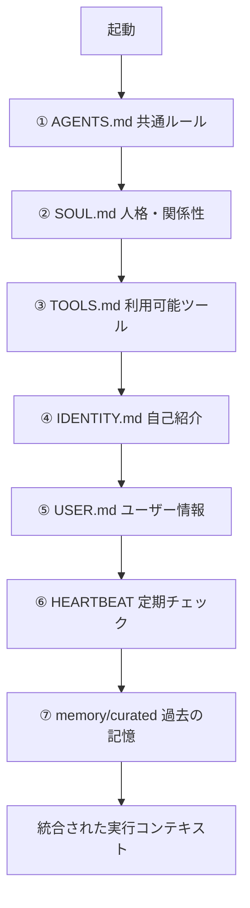
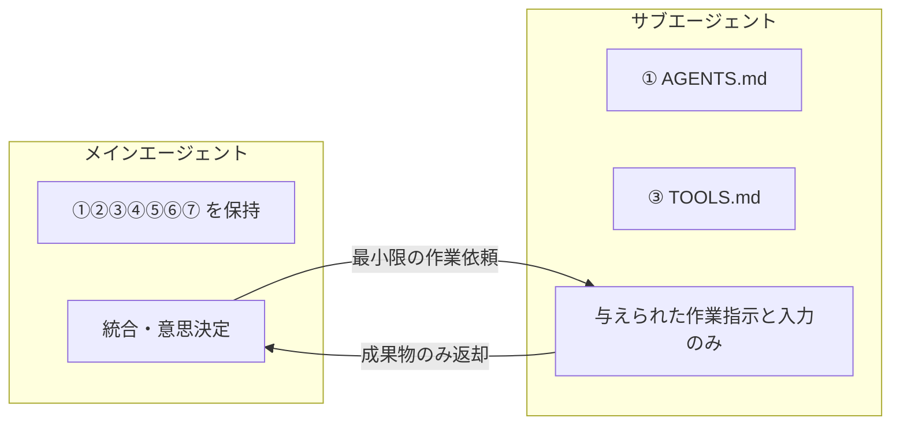

# 設計メモ - 人格・サブ委譲・記憶（評価反映）

> 設計評価に基づく落とし穴の明文化・推奨追加設計・図解。実装は [boot/](../boot/)、[workers/README](../workers/README.md)、[skills/agent/delegate_to_sub.md](../skills/agent/delegate_to_sub.md) に反映済み。

---

## 前提の共有

- **人格＝起動時に読み込むコンテキスト（ファイル群）で決まる** — LLM は「今回渡されたテキスト」から振る舞いを決める。読ませるもの・読む順番・常時ロード範囲で別人格になる、は正しい。
- **長期記憶は外部化が前提** — モデル内部に保持されない。`memory/*.md` や ledger 等の外部ストアに置き、**必要なときに取り出して今回のコンテキストに再投入**して初めて効く。
- **サブは最小コンテキストの作業マシン** — ①＋③のみ渡す。例外は **ロールに閉じる**（書記＝ログ仕様だけ、監査＝チェックリストだけなど）。アドホックに「今回は渡す」にしない → [workers/README ホワイトリスト](../workers/README.md)。

---

## 落とし穴（押さえておくこと）

1. **サブは「記憶を渡さない」だけでは無知にならない**  
   依頼文にユーザー情報・背景を書いた瞬間にサブは知る。  
   → 渡すのは「最小限の作業指示＋入力データ」だけ。背景・意図は原則書かない（[EXECUTION_CONTRACT](../boot/EXECUTION_CONTRACT.md)、[delegate_to_sub](../skills/agent/delegate_to_sub.md) で固定）。

2. **記憶はファイル以外にも混入する**  
   ログ・成果物・会話から memory に流れ込む。  
   → 取り込み前にサニタイズ（要約・抽象化・PII 除去）を挟み、2 層（raw / curated）で管理（[MEMORY_POLICY](../boot/MEMORY_POLICY.md)）。

3. **順番より「衝突ルール」が大事**  
   例: 「常に簡潔に」vs「監査ログは詳細に」、「強い口調」vs「丁寧に」。  
   → 優先順位ルールを明文化（[CORE 4.5 衝突時の優先順位](../boot/CORE.md)）。

---

## サブを「派遣社員」にするときの失敗と対策

①＋③だけ渡すと起きやすい失敗と、その対策（反映済み）。

| 失敗 | 対策 |
|------|------|
| **目的が欠けて「正しいけどズレた成果物」** | **毎回、作業契約（contract）を添付**。ゴール・入力・制約・受け入れ条件の 4 項目。→ [EXECUTION_CONTRACT](../boot/EXECUTION_CONTRACT.md) |
| **一貫性が壊れる（前提が分からず流儀がブレる）** | ① に出力フォーマットを固定。テンプレ群で形式を統一。 |
| **重要なユーザー事情が必要なタスクで詰まる** | サブに USER.md は渡さず、メインが**タスク用に要約して** Constraints にだけ載せる（例: 「Next.js App Router + SCSS Modules 必須、Tailwind 不可」）。 |

**運用の固定化（必ず守る 3 点）**: (1) サブには ①+③+そのタスクの Skill 1 つ+作業契約まで、例外はロールに閉じる。(2) 背景は原則書かない、必要なら 1〜2 文。(3) USER.md 全文・memory 全文は渡さず、メインが要約して Constraints へ。→ [CORE の「2. 委譲」](../boot/CORE.md)。

**壊れない設計の流れ**: メイン → delegate_to_sub（入力を正規化）→ SUBAGENT_PACK（最小コンテキスト注入）→ サブ実行（readonly or スコープ限定）→ 結果を親へ返却 → 書記サブへ委譲 → logs/ に 1 件記録。**B と C で「毎回同じ形に整形してから渡す」**ことが鍵。

**最小読込保証・呼び出し経路の強制**:

- **SUBAGENT_PACK**: 注入順序を固定（SUBAGENT_MINIMUM → TOOLS → 役割 1 つ → Task payload）。毎回同じ形で渡す。→ [boot/SUBAGENT_PACK](../boot/SUBAGENT_PACK.md)
- **delegate_to_sub を唯一の入口に**: サブの直接呼び出し禁止。親→delegate の入力は JSON または 3 ブロックで正規化。呼び出し前チェック（artifacts 空なら渡さない等）を実施。→ [delegate_to_sub](../skills/agent/delegate_to_sub.md)
- **強制の仕組み**: Claude Code は PreToolUse で logs 以外 Write 拒否。Cursor は入口一本化＋役割制約。→ [enforcement/](../enforcement/README.md)
- **書記契約**: 親→書記で渡すログのスキーマを [scribe/CONTRACT](../scribe/CONTRACT.md) で固定。

**落とし穴と対策（読み込み順・役割分担だけでは解決しない部分）**:

| 落とし穴 | 対策（反映済み） |
|----------|------------------|
| サブがユーザー前提を知らずにミスる（命名規約・禁止事項・ドキュメントルール等） | **Task Contract（今回の必須前提）** を毎回添付。目的・成果物形式・禁止事項・参照してよいパス・Done 条件を契約に含める。USER を渡さず事故だけ防止。→ [EXECUTION_CONTRACT](../boot/EXECUTION_CONTRACT.md) |
| 読む順番だけでは競合時の優先が決まらない | **衝突時の優先順位** を固定。サブは親が渡した Task Contract が最優先。MEMORY は「参照」であって「規則」ではない。→ [LOAD_POLICY の「0. 読み込み順＝優先順位」](../boot/LOAD_POLICY.md) |
| memory が「人格」より「誤差」になりやすい（古い方針・例外の一般化） | memory は**事実ログと決定事項ログ**に分ける。**規則は rules/ にしか置かない**。最新優先 or 有効期限。→ [MEMORY_POLICY](../boot/MEMORY_POLICY.md) |

---

## 推奨追加設計（反映済み）

- **A) 作業契約（contract）を毎回添付**  
  ゴール・入力・制約・受け入れ条件の 4 項目。コピペ用 Markdown テンプレ・サブ返却フォーマット（判断理由/リスク/次アクション任意）→ EXECUTION_CONTRACT / delegate_to_sub に反映済み。

- **B) memory の 2 層化**  
  raw（短期・一次） / curated（長期・サニタイズ済み）。昇格前にサニタイズ必須 → MEMORY_POLICY に反映済み。

- **C) HEARTBEAT は「点検項目」だけ**  
  判断は書かず Yes/No のチェックのみ。判断はメインの統合フェーズで行う。  
  （HEARTBEAT を導入する場合は本則に従う。）

- **D) 読み込み順＝優先順位**  
  衝突時は「後に読んだもの」が勝つ。明示順位の例: AGENTS > CORE > TOOLS > ROLE > USER > MEMORY。→ [LOAD_POLICY の「0. 読み込み順＝優先順位」](../boot/LOAD_POLICY.md)。

- **E) memory のスコープ分離**  
  `memory/user/`（ユーザー固有）・`memory/project/`（プロジェクト固有）・`memory/global/`（汎用）で取り違え防止。→ [MEMORY_POLICY](../boot/MEMORY_POLICY.md)。

- **F) サブに渡してよい情報のホワイトリスト**  
  「渡さない」だけだと例外が増えて崩れがちなので、「このロールはこれだけ渡す」を固定。→ [workers/README](../workers/README.md)。

---

## 図解

### 読み込みと合成の流れ（①〜⑦ を前提とした場合）

### メイン／サブの情報境界

---

## 参照

- 絶対制約・衝突ルール: [boot/CORE.md](../boot/CORE.md)
- 実行契約・受け渡しテンプレ: [boot/EXECUTION_CONTRACT.md](../boot/EXECUTION_CONTRACT.md)
- 記憶 2 層・サニタイズ: [boot/MEMORY_POLICY.md](../boot/MEMORY_POLICY.md)
- 委譲手順: [skills/agent/delegate_to_sub.md](../skills/agent/delegate_to_sub.md)
