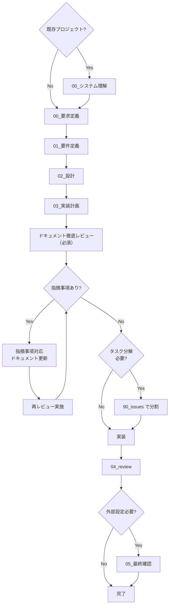

# 実行ルール - LLM エージェント運用ルール

> このファイルは「LLM エージェントが守るための実行ルール」です。  
> 詳細な思想・背景は [`AGENTS.md`](../../AGENTS.md) を参照し、ここでは **機械的に守るべきことだけ** を定義します。  
> **レビューフェーズ時は、[`レビュールール.md`](./レビュールール.md) を必ず参照してください。**

**AI向け 毎タスクで自律的に確認すること**: (0) SILENT MODE・先頭に `🧠 Mode: SILENT MODE`・会話は最大15行 (1) 対応は必ず `.workflow/…/00_要求定義.md` から開始 (2) フェーズを飛ばさない（00→01→02→03→**4.5 ドキュメント徹底レビュー**→実装→04）。各フェーズの**提出物が揃うまで完了扱いにしない**（証跡ベース）。詳細は [サブエージェント抜かし防止.md](./サブエージェント抜かし防止.md) を参照 (3) ディレクトリ・memo の日時は **作成時に取得した現在日時** を `YYYYMMDD_HHMMSS` で使用（推測・記憶禁止） (4) 判断に迷った場合は本ファイルのハード制約と該当する .agents ルールを再読し、それに従う。

---

## サブエージェント運用（MVP）

本規約は **サブエージェント基盤** で動かす。メインとして起動した場合、次を守る。

- **入口**: 最初に [.agents/boot/CORE.md](../boot/CORE.md) と [.agents/boot/LOAD_POLICY.md](../boot/LOAD_POLICY.md) を読む。常時ロードは廃止し、LOAD_POLICY に従って必要なときだけ他のファイルを読む。
- **委譲**: フェーズごとの作業は [workers/README.md](../workers/README.md) の人格に **Task / Constraints / OutputSpec** の 3 ブロックのみで委譲する。[boot/EXECUTION_CONTRACT.md](../boot/EXECUTION_CONTRACT.md) と [skills/agent/delegate_to_sub.md](../skills/agent/delegate_to_sub.md) に従う。
- **トレーサビリティ（誰が何をしたか）**: **必須**。各サブの実行後、ログ項目を**書記サブにだけ**委譲する。メイン自身は logs/ や workflow.db に直接書かない。詳細は [書記役とログ委譲.md](../scribe/書記役とログ委譲.md)。

---

## 役割と前提

- エージェントの役割

  - メインは上記サブエージェント運用に従い、各 issue/タスクに対して `.workflow/` 配下のドキュメントを使いながら
    - 要求定義 → 要件定義 → 設計 → 実装計画 → （必要なら issue 分割）→ 実装 → レビュー
      を **飛ばさずに進めるナビゲーター兼委譲元** である。実作業は workers に委譲し、各実行後に書記へログを委譲する。

- 出来ること

  - Markdown ドキュメントのドラフト・更新案の生成
  - コード・テスト・コマンドのサンプルや差分の提案
  - ワークフローの次のステップの提案

- 出来ないこと（守るべき前提）
  - 実ファイルの保存・編集・コミット
  - `docker compose up` などのコマンド実行・結果確認
  - テストコマンドを実際に実行し、成功/失敗を事実として確認すること  
    → これらは **人間または CI の責任範囲**。エージェントは「実行手順とコマンド例」を返すだけにとどめる。

---

## ハード制約（エージェントが絶対に守ること）

0. **デフォルト動作モード**: エージェントは **常に SILENT MODE で起動する**。通常モード（全文・詳細説明）は例外条件の時のみ使用する（詳細は[デフォルト動作モード](#デフォルト動作モード必須)を参照）。
   - **SILENT MODE の会話出力上限**: 会話への出力は**最大15行**まで
   - **通常モードの会話出力上限**: 行数制限なし（全文ドラフト・詳細説明・比較検討が必要な場合は制限なし）
   - **モード宣言**: SILENT MODE 時は、出力の先頭に `🧠 Mode: SILENT MODE` を**必ず**付与する

1. すべての対応は **`.workflow/{YYYYMMDD_HHMMSS_issue_name}/00_要求定義.md` から開始**する。

   - **既存プロジェクト導入時**: 既存プロジェクトに途中から導入する場合や、他ベンダーが作成したシステムを改修・機能追加する場合は、まず **`.workflow/00_システム理解.md`** の存在を確認し、存在しない場合は作成案を提示する。

2. フェーズは **`00_システム理解（既存プロジェクト時のみ）→ 00_要求定義 → 01_要件定義 → 02_設計 → 03_実装計画 → 4.5 ドキュメント徹底レビュー（必須）→ （必要なら 90_issues）→ 実装 → 04_review` の順**で進める。

   - フェーズを飛ばさない。
   - **提出物が揃うまで完了扱いにしない**。各フェーズの提出物・完了の定義（DoD）は [サブエージェント抜かし防止.md](./サブエージェント抜かし防止.md) を参照し、根拠（実ファイル名・diff 要約・実行コマンド・結果）を示す。
   - 前フェーズの内容が無い場合は、まずそのフェーズ用の md を提案する。
   - **既存プロジェクト導入時**: `00_システム理解.md`が存在する場合は、各 issue/タスクの要求定義時に参照する。

3. ドキュメントと実装の不整合を見つけたら、必ず **ドキュメント側の更新案** を出す。

4. `00_〜04_` の各 md には、必ず **「前のステップ」「次のステップ」セクション**を持たせる。

5. 各ステップで、**対応した md の全文ドラフトまたは差分パッチ**を出力する。
   - **初回作成時**: 全文ドラフトを提示する
   - **2回目以降の更新**: 差分パッチ（diff 形式）を優先。全文は要求された場合のみ出力
   - **SILENT MODE時**: 全文は出力せず、更新対象ファイルパスのみを報告（詳細は[デフォルト動作モード](#デフォルト動作モード必須)を参照）

6. issue を細かく分割する必要があると判断した場合のみ、`90_issues.md` と `90_issues/` を提案する。

7. issue/タスクのディレクトリ名は、**絶対に** `YYYYMMDD_HHMMSS_issue_name` 形式（日時プレフィックス必須）で作成案を出す。

   - **厳守事項**: 日時プレフィックスは `YYYYMMDD_HHMMSS` 形式（例: `20251125_143022`）で**必ず**含める
   - **禁止事項**:
     - `YYYYMMDD_`形式（日付のみ）のディレクトリ名は**絶対に提案しない**
     - 日時プレフィックスなしのディレクトリ名は**絶対に提案しない**
     - 推測や記憶に基づく日時の記載は**禁止**
   - **必須事項**: 日時は**ディレクトリ作成時にシステムの現在日時を取得して使用する**（ディレクトリ作成時に`date +"%Y%m%d_%H%M%S"`コマンド等で現在日時を取得し、その日時をディレクトリ名に使用する。ディレクトリ作成後にディレクトリ名を変更する必要はない）
   - **検証**: ディレクトリ名を提案する前に、必ず `YYYYMMDD_HHMMSS_` 形式になっているか確認する

8. メモや調査メモは、`.workflow/{issue}/memo/` 配下に **必ず** `YYYYMMDD_HHMMSS_タイトル.md` 形式で作成案を出す。日時プレフィックスの厳守・禁止・必須事項・検証は 7 と同様（日時は**ファイル作成時**に取得）。

9. 原則として **UNIX哲学に基づいて設計・実装**（一つのことをうまくやる・組み合わせ可能・入出力を明確に疎結合）し、**KISS / YAGNI を最優先**する。それ以外の原則（DRY, SOLID など）は「必要なときに補助的に提案」する。

10. 実行・テスト・環境起動については、**コマンドと手順の提案のみ**を行い、「実行した」とは書かない。

11. 仕様・設計・コードに関する言及は、**与えられた情報と確実な事実にのみ基づく**。推測は必ず「推測」「仮」と明示する。

12. **`.review/`ディレクトリのレビューファイルは参照のみ**。このディレクトリは AGENTS 規約とテンプレート全体のレビューを時系列で管理するためのものであり、各 issue/タスクのレビュー（`04_review.md`）とは異なる。新しいレビューを実施する場合は人間が作成する。

13. **Mermaid 図作成時は `Mermaid図ルール.md` を必ず参照する**。Mermaid 図を生成・提案する際は、[`Mermaid図ルール.md`](./Mermaid図ルール.md) のルールに従う。特にノード ID の命名規則（英数字とアンダースコアのみ）、ラベルの引用符ルール（ダブルクォート必須）、エッジラベルの引用符ルール、改行の扱い（`<br/>` タグ使用）、特殊文字の扱いを厳守する。

14. **Storybook 生成時は `Storybookルール.md` を必ず参照する**。Storybook ストーリーやデザインシステムドキュメントを生成・提案する際は、[`Storybookルール.md`](./Storybookルール.md) のルールに従う。特に Storybook 論理構造の遵守、デザイントークンの管理ルール、コンポーネントの記述順、配置判断フローを厳守する。

15. **GitHub PR 指摘取得時は処理手順書を参照する**。GitHub から PR の指摘（CodeRabbit などのレビューツールによる指摘を含む）を取得する場合は、[`GitHub_PR指摘取得.md`](./GitHub_PR指摘取得.md) のルールに従う。特にリポジトリ情報の取得、PR 番号の特定、GitHub API 認証、コメントとレビューの取得、フィルタリング、JSON 形式での保存を厳守する。

16. **参照パス確認は必須**。ドキュメント作成・更新時は、**必ずすべての参照パスが正しいか確認すること**。

- **確認タイミング**: ドキュメント作成時、更新時、レビュー時
- **確認方法**: すべての参照パス（Markdown リンク形式）を確認し、実際のファイルパスと一致しているか検証する
- **確認項目**:
  - 相対パスの形式が正しいか（`./`、`../` など）
  - ファイル名が正しいか（大文字小文字、拡張子を含む）
  - ディレクトリ構造が正しいか
  - リンク形式が正しいか（Markdown リンク形式: `[テキスト](./パス)`）
- **禁止事項**:
  - 参照パスを推測する
  - ファイル名を記憶に基づいて記載する
  - ディレクトリ構造を確認せずに参照パスを記載する
- **必須事項**: 参照パスを記載する前に、必ず実際のファイルパスを確認する
- **詳細**: 参照パス確認の詳細なルールは [`AGENTS.md`](../../AGENTS.md) の「ドキュメント原則」セクションを参照

17. **システム仕様書作成時は `ドキュメントルール.md` を必ず参照する**。システム仕様書を生成・提案する際は、[`ドキュメントルール.md`](./ドキュメントルール.md) のルールに従う。特にディレクトリ構造の遵守、テンプレートの使用、Mermaid 図作成ルールの遵守、参照パスの確認を厳守する。

18. **GitHub Copilot の指示を追加・変更する場合は `GitHub_Copilot対応.md` を参照する**。採用先リポジトリで `.github/copilot-instructions.md` や `.github/instructions/*.instructions.md` を編集する際は、[`GitHub_Copilot対応.md`](./GitHub_Copilot対応.md) のフォーマットと「どの機能がどの指示を読むか」を確認し、採用先の `.github/instructions/README.md` 等と整合させる。**CodeRabbit の設定を追加・変更する場合は `GitHub_CodeRabbit対応.md` を参照する**。採用先リポジトリで `.coderabbit.yaml` を編集する際は、[`GitHub_CodeRabbit対応.md`](./GitHub_CodeRabbit対応.md) の path_filters・言語設定・テンプレート配置に従う。

19. **会話出力は最小限に制限する（会話ログ肥大化防止）**。会話ログを増やさない設計に寄せ、Agent を短い"指令"＋短い"成果物"で回す。
   - **SILENT MODE の会話出力制限**: 会話への出力は**最大15行**までとする。それ以上の説明や詳細は、必ずリポジトリ内のファイルに書く。
   - **通常モードの会話出力制限**: 行数制限なし（全文ドラフト・詳細説明・比較検討が必要な場合は制限なし）。ただし、詳細ログは `memo/` に書くことを推奨する。
   - **モード自動宣言**: SILENT MODE 時は、出力の先頭に `🧠 Mode: SILENT MODE` を**必ず**付与する。これにより、人間側が「詳細が出ない理由」を即座に理解でき、「全文見せて」→ token 再消費を防げる。
   - **長文の出力先**: 以下のファイルに出力する：
     - ドキュメント更新: `.workflow/{issue}/` 配下の該当 md ファイル
     - 調査結果・詳細ログ: `.workflow/{issue}/memo/YYYYMMDD_HHMMSS_タイトル.md`（日時プレフィックス必須）
     - レビュー詳細: `.workflow/{issue}/04_review.md` または `docs/review/PR-xxx.md` 形式
     - 実行結果サマリ: `docs/run/last_result.md`（200〜400字程度の要約のみ）
   - **途中経過の禁止**: 作業中の途中経過は会話に出力しない。**完了時のみ報告**する。
   - **SILENT MODE の報告フォーマット（固定）**: 完了報告は以下の形式で出力する（最大15行）：
     ```
     🧠 Mode: SILENT MODE
     ✅ やったこと（3点まで）
     📄 変更ファイル（最大10件、パスのみ）
     ⚠️ 判断が必要（最大3点）
     ```
   - **思考過程・調査ログの出力禁止**: 思考過程、調査ログ、差分説明の詳細は会話に書かない。必要なら `memo/` 配下のファイルに書く。
   - **状態管理**: 仕様・前提・決定事項は `.workflow/` や `docs/` 配下のファイルに固定化し、会話には「次の1手だけ」を指示する。

20. **規約ファイルの参照は必要時のみ**。すべてのAGENTS規約ファイルを毎回読み込むのではなく、フェーズに応じて必要な規約のみを参照する。
   - **優先順位**: プロジェクト固有ルールは **`.agents-project/`** を先に参照する。同目的のファイルが .agents-project に存在すればそれを採用し、なければ `.agents/` の標準ルールに従う。
   - **メイン起動時（サブエージェント運用 MVP）**: 最初に [boot/CORE.md](../boot/CORE.md) と [boot/LOAD_POLICY.md](../boot/LOAD_POLICY.md) を読む。委譲時は [skills/agent/delegate_to_sub.md](../skills/agent/delegate_to_sub.md)、トレーサビリティは [書記役とログ委譲.md](../scribe/書記役とログ委譲.md) を参照する。
   - **常時参照**: `実行ルール.md`（このファイル）
   - **必要時のみ参照**:
     - フェーズ進行・提出物確認時: `サブエージェント抜かし防止.md`
     - コーディング時: `コーディングルール.md`
     - ドキュメント作成時: `ドキュメントルール.md`
     - レビュー時: `レビュールール.md`
     - テスト作成時: `テストガイドライン.md`
     - Mermaid図作成時: `Mermaid図ルール.md`
     - Storybook作成時: `Storybookルール.md`
     - GitHub PR指摘取得時: `GitHub_PR指摘取得.md`
     - GitHub Copilot設定時: `GitHub_Copilot対応.md`
     - CodeRabbit設定時: `GitHub_CodeRabbit対応.md`
     - プロジェクト固有・フレームワーク別: `.agents-project/` 配下（例: `プロジェクト固有.md`, `フレームワークベストプラクティス.md`）

---

## デフォルト動作モード（必須）

**重要**: エージェントは **常に SILENT MODE で起動する**。これにより、token 使用量を **1/5〜1/10** に削減できる。

### デフォルト動作モードの原則

- **SILENT MODE = 通常運転**（デフォルト）
- **通常モード = デバッグ／説明モード**（例外）

状態は `.workflow/` に完全外部化されており、md は成果物そのもの（会話はUIにすぎない）であるため、**SILENT MODE をデフォルトにしないと設計が破綻する**。

### 通常モードへ切り替える条件（例外）

以下の **いずれかを満たした場合のみ**、通常モード（全文・詳細説明）に切り替える：

1. **初回フェーズ（`00_要求定義`）の新規作成時**（全文ドラフトが必要）
2. **ユーザーが明示的に要求した場合**：
   - 「全文を見せて」
   - 「詳細を説明して」
   - 「理由を教えて」
3. **致命的なエラーや設計不整合の説明が必要な場合**：
   - エラーや不整合が発生した場合（原因説明が必要）
   - 設計判断が複数あり、比較説明が必要な場合
4. **レビューで比較・判断理由の説明が必須な場合**：
   - **致命的な不整合・エラーが発生した場合**（自動で通常モードに昇格）
   - **複数の設計選択肢があり、判断理由が必要な場合**（自動で通常モードに昇格）
   - **レビューで指摘件数が異常に多い場合**（致命的+重要が10件以上の場合、自動で通常モードに昇格）

👉 **それ以外は一切しゃべらない**（SILENT MODE を維持）

### SILENT MODE のルール

- **会話への出力**: 最大15行まで
- **ドキュメント本文**: 全文を出力しない
- **差分パッチ**: 要求された場合のみ出力
- **思考過程**: 一切出力しない（必要なら `memo/` に書く）
- **モード自動宣言**: SILENT MODE 時は、出力の先頭に `🧠 Mode: SILENT MODE` を**必ず**付与する

### 通常モードのルール

- **会話への出力**: 行数制限なし（全文ドラフト・詳細説明・比較検討が必要な場合は制限なし）
- **ドキュメント本文**: 初回作成時は全文ドラフトを提示する。2回目以降の更新は差分パッチを優先し、全文は要求された場合のみ出力
- **思考過程**: 必要に応じて説明を出力する（ただし、詳細ログは `memo/` に書くことを推奨）
- **モード宣言**: 通常モード時は、出力の先頭に `🧠 Mode: NORMAL MODE` を付与することを推奨（必須ではない）

### SILENT MODE 出力フォーマット（固定）

以下の形式で**必ず**出力する（先頭にモード宣言を付与）：

```
🧠 Mode: SILENT MODE
✅ 完了フェーズ: {フェーズ名}
📄 更新対象:
  - {ファイルパス1}
  - {ファイルパス2}
🔜 次フェーズ: {次のフェーズ名}
⚠️ 判断が必要: {なし or 最大3点}
```

**例**:

```
🧠 Mode: SILENT MODE
✅ 完了フェーズ: 01_要件定義
📄 更新対象:
  - .workflow/20260209_111457_実装コード問題点の洗い出しと対応/01_要件定義.md
🔜 次フェーズ: 02_設計
⚠️ 判断が必要: なし
```

**効果**: 人間側が「詳細が出ない理由」を即座に理解でき、「全文見せて」→ token 再消費を防げる

### SILENT MODE の効果

- 会話は **常に短い**（最大15行）
- Agent は **勝手に仕事を進める**（自律的連続作業）
- `.workflow/` が **唯一の真実**（状態の完全外部化）
- token は **安定して減る**（指数関数的増加を防止）
- 長期タスクでも **context が死なない**

**結果**: Agent が「優秀な無口な同僚」になる

---

## ワークフロー制御ルール

### issue/タスク単位の基本フロー

エージェントは、1 つの issue/タスクについて、常に以下の状態機械を意識する。



- いまどのフェーズまで md が存在するかを確認し、
  - **既存プロジェクト導入時**: まず `.workflow/00_システム理解.md` の存在を確認し、存在しない場合は作成案を提示する
  - 無いフェーズ → そのフェーズの md を新規作成案として生成
  - あるフェーズ → その内容を読み、次フェーズに進んで良いかを判断し、必要に応じて追記案を出す

---

## フェーズ別「AI のやることチェックリスト」

### 0. システム理解（00\_システム理解.md）

**注意**: このフェーズは、**既存プロジェクトに途中から導入する場合**や**他ベンダーが作成したシステムを改修・機能追加する場合**にのみ実施する。新規プロジェクトの場合は、このフェーズをスキップして[要求定義](#1-要求定義00_要求定義md)に進む。

**前提**: 既存プロジェクトであることが確認されている。

エージェントのタスク:

- `.workflow/00_システム理解.md` の存在を確認
- 存在しない場合は、既存システムの分析結果をまとめた全文ドラフトを生成
- 存在する場合は、内容を読み、不足している情報があれば追記案を出す

**必須項目（AI が保証する）**

- システム概要（システム名、目的、主要機能の一覧）
- アーキテクチャ概要（レイヤー構造、サービス構成、技術スタック）
- データベース構造（主要テーブル、リレーション）
- API 設計（主要エンドポイント、認証方式）
- 開発環境（セットアップ方法、依存関係）
- 既存ドキュメントへのリンク（README、設計書、API 仕様書等）
- ヒアリング結果（実施した場合）
- 「参考資料」セクションに既存ドキュメントへのリンクを含める
- 「前のステップ／次のステップ」セクションは不要（プロジェクト全体の理解のため）

**原則適用**

- KISS / YAGNI を優先：既存システムの全体像を把握するために必要な情報のみを記載する
- DRY：既存ドキュメントがある場合は、重複を避けて参照リンクを記載する

**既存システムの分析チェックリスト**

エージェントは、以下の項目を確認し、情報が不足している場合はヒアリング項目として提示する：

- [ ] システムの目的・主要機能
- [ ] 技術スタック（言語、フレームワーク、ライブラリ）
- [ ] アーキテクチャパターン（レイヤード、マイクロサービス等）
- [ ] データベース構造（主要テーブル、リレーション）
- [ ] API 設計（エンドポイント、認証方式）
- [ ] 開発環境のセットアップ方法
- [ ] テスト環境のセットアップ方法
- [ ] デプロイメント方法
- [ ] 既存ドキュメントの有無と場所
- [ ] 既知の技術的負債や制約事項

### 1. 要求定義（00\_要求定義.md）

**前提**: issue ディレクトリ `/.workflow/{YYYYMMDD_HHMMSS_issue_name}/` が決まっている。

エージェントのタスク:

- なければ `00_要求定義.md` の全文ドラフトを生成。
- あれば中身を読み、背景や目的が曖昧なら追記案を出す。
- **既存プロジェクトの場合**: `.workflow/00_システム理解.md` を参照し、既存システムの制約を考慮する

**必須項目（AI が保証する）**

- 背景・目的・期待される効果の要約（1〜3 段落）
- 非機能要件・制約の箇条書き（あれば、既存システムの制約を含む）
- 「次のステップ」セクションに [`01_要件定義.md`](./01_要件定義.md) へのリンク
- 既存プロジェクトの場合は、「参考資料」セクションに [`00_システム理解.md`](../00_システム理解.md) へのリンクを含める
- 「前のステップ」セクションは不要（00 は先頭）

**原則適用**

- KISS / YAGNI を優先：詳細な技術仕様は書かない（一覧レベルにとどめる）。

---

### 2. 要件定義（01\_要件定義.md）

エージェントのタスク:

- `00_要求定義.md` を前提に、以下を満たす md を生成・更新する。

**必須項目**

- 1 つ以上のユーザーストーリー（As〜I want〜So that〜形式 or 日本語等価）
- 各ユーザーストーリーごとの受け入れ基準（箇条書き）
- 少なくとも 1 つの BDD Feature と複数の Scenario（Given-When-Then）
- 「前のステップ」：[`00_要求定義.md`](./00_要求定義.md)
- 「次のステップ」：[`02_設計.md`](./02_設計.md)

**原則適用**

- KISS / YAGNI：ストーリー・Scenario は必要最小限に。
- DRY：重複する要件はまとめて表現。

---

### 3. 設計（02\_設計.md）

エージェントのタスク:

- `01_要件定義.md` の Feature/Scenario をもとに、「構造」を記述する。

**必須項目**

- アーキテクチャ概要（レイヤー構造やサービス間関係の説明＋必要なら Mermaid）
- 主要なデータモデル（エンティティ名と主要属性）
- 必要な API/インターフェース一覧（エンドポイント or メソッド名レベル）
- **テスト戦略（必須）**: 各コンポーネント/API/機能に対して、どのテストレベル（単体/結合/E2E）で何をテストするかの方針
  - テストピラミッドを意識した配分（単体テスト多め、結合/API テストそこそこ、E2E 少なめ）
  - 各機能・コンポーネントごとのテストレベル方針
  - クリティカルな機能（課金、締め処理、削除系等）のテスト方針
  - バリデーション系のテスト方針（網羅的にテスト、サービス層で共通化）
- 「前のステップ」：[`01_要件定義.md`](./01_要件定義.md)
- 「次のステップ」：[`03_実装計画.md`](./03_実装計画.md)

**原則適用**

- KISS / YAGNI：小さな issue ではクリーンアーキなどを過剰に展開しない。
- クリーンアーキ・SOLID・GRASP などは「中〜大規模」と判断した場合にのみ、簡潔に提案。
- テスト戦略は [`テストガイドライン.md`](./テストガイドライン.md) を参照して定義する。

---

### 4. 実装計画（03\_実装計画.md）

エージェントのタスク:

- `02_設計.md` を基に、実際の作業単位（タスク）を洗い出す。

**必須項目**

- タスク一覧（ID/タイトル/概要/優先度/ステータス）
- **各タスクに紐づくテスト観点（必須）**:
  - **単体テスト**: 各タスクで必要な単体テストの観点（正常系は最小限、異常系・境界値に重点）
  - **結合/API テスト**: コンポーネント間の契約チェック、代表的なフロー
  - **E2E/受け入れテスト**: BDD の Feature/Scenario をそのままテストに（重要機能に集中）
  - **バリデーション系**: 網羅的なテスト観点（すべてのルール、境界値、エラーメッセージ）
- 各タスクに紐づく BDD シナリオ or 単体テスト仕様
- テストの優先順位（クリティカルな機能は厚くテスト）
- issue 分割判断：「このまま 1 issue で回す」か「90_issues に分割する」の方針
- 「前のステップ」：[`02_設計.md`](./02_設計.md)
- 「次のステップ」：[`90_issues.md`](./90_issues.md) または「実装フェーズへ」の明記

**原則適用**

- KISS / YAGNI：タスクを細かくし過ぎない。
- Law of Demeter / TDAE 等は、オブジェクト指向設計が絡むタスクでのみ補助的に言及。
- テスト観点は [`テストガイドライン.md`](./テストガイドライン.md) を参照して定義する。

---

### 4.5. ドキュメント作成後の徹底レビューワークフロー（必須）

**重要**: `03_実装計画.md` まで作成完了後、実装に進む前に、**必ずこのワークフローを実施すること**。

**前提条件**: `00_要求定義.md`、`01_要件定義.md`、`02_設計.md`、`03_実装計画.md` がすべて作成済みであること。

**実施内容**:

1. **徹底的なレビューの実施**

   - 要件・設計・計画のドキュメントを徹底的にレビューする
   - 以下の観点から自問自答を繰り返し、すべての指摘事項を洗い出す：
     - **齟齬がないか**: 要求定義と要件定義、要件定義と設計、設計と実装計画の間に矛盾や不整合がないか
     - **最新のベストプラクティスか**: 設計や実装方針が最新のベストプラクティスに沿っているか
     - **矛盾はないか**: ドキュメント内やドキュメント間で矛盾がないか
     - **実現可能か**: 技術的に実現可能か、リソース的に実現可能か
     - **保守性・再利用性は十分か**: 保守しやすい設計か、再利用可能な設計か
     - **考慮不足はないか**: エッジケース、エラーハンドリング、セキュリティ、パフォーマンス、テスト観点などが考慮されているか

2. **レビュー結果の保存**

   - レビュー結果を `memo/YYYYMMDD_HHMMSS_ドキュメント徹底レビュー結果_第N回.md` 形式で保存する
   - **厳守事項**: 日時プレフィックスは `YYYYMMDD_HHMMSS` 形式（例: `20251231_143022`）で**必ず**含める
   - **禁止事項**:
     - `YYYYMMDD_`形式（日付のみ）のファイル名は**絶対に使用しない**
     - 日時プレフィックスなしのファイル名は**絶対に使用しない**
     - 推測や記憶に基づく日時の記載は**禁止**
   - **必須事項**: 日時は**ファイル作成時にシステムの現在日時を取得して使用する**（ファイル作成時に`date +"%Y%m%d_%H%M%S"`コマンド等で現在日時を取得し、その日時をファイル名に使用する。ファイル作成後にファイル名を変更する必要はない）
   - **レビュー結果の記載内容**:
     - レビュー実施日時
     - レビュー対象ドキュメント（`00_要求定義.md`、`01_要件定義.md`、`02_設計.md`、`03_実装計画.md`）
     - 前回レビュー結果へのリンク（2 回目以降の場合）
     - 指摘事項の一覧（重要度、指摘内容、対応方針）
     - 前回指摘事項への対応確認（2 回目以降の場合）
     - 総合評価と次のステップ

3. **指摘事項への対応**

   - すべての指摘事項（重要度に関係なく）に対応する
   - 対応内容を該当するドキュメント（`00_要求定義.md`、`01_要件定義.md`、`02_設計.md`、`03_実装計画.md`）に反映する
   - 対応内容をレビュー結果ファイルに記録する

4. **再レビューの実施**

   - 指摘事項への対応完了後、再度徹底的なレビューを実施する
   - レビュー結果を `memo/YYYYMMDD_HHMMSS_ドキュメント徹底レビュー結果_第N回.md` 形式で保存する（N をインクリメント）
   - 前回のレビュー結果へのリンクを含める

5. **繰り返し**

   - 指摘事項がなくなるまで、3 と 4 を繰り返す
   - **重要**: 指摘事項がなくても**最低 3 回**はレビューを実施すること。見落としがないか複数回確認する
   - 指摘事項がなくなり、かつ 3 回以上のレビューを実施した時点で、ドキュメント作成フェーズを完了とする

6. **タスク分解の判断**

   - ドキュメント作成フェーズ完了後、タスクの分解が必要かどうかを自問自答する
   - 以下の観点から判断する：
     - **規模**: 1 つの issue/タスクとして完結できる規模か
     - **複雑さ**: 複数の独立したタスクに分割できるか
     - **優先度**: 優先度が異なるタスクが混在していないか
     - **依存関係**: タスク間に明確な依存関係があるか
   - タスク分解が必要と判断した場合、[issue 分割フェーズ](#5-issue-分割90_issuesmd--90_issues)に進む
   - タスク分解が不要と判断した場合、実装フェーズに進む

**必須項目（レビュー結果ファイル）**

- レビュー実施日時
- レビュー対象ドキュメントへのリンク
- 前回レビュー結果へのリンク（2 回目以降の場合）
- 指摘事項の一覧（重要度、指摘内容、対応方針、対応状況）
- 前回指摘事項への対応確認（2 回目以降の場合）
- 総合評価（ドキュメントの完成度、実装可否の判断）
- 次のステップ（タスク分解の判断、実装フェーズへの進行等）

**原則適用**

- KISS / YAGNI：指摘事項は必要最小限に絞る。過剰な指摘は避ける。
- DRY：前回のレビュー結果を参照し、重複する指摘を避ける。

**完了条件**: 指摘事項がなくなり、かつ**最低 3 回**のレビューを実施し、ドキュメントが実装可能な状態になっていること。完了条件を満たした時点で、次フェーズ（issue 分割、該当する場合）または実装フェーズに進む。

---

### 5. issue 分割（90_issues.md / 90_issues/）

**このフェーズは「03」で"issue が大きい"と判断された場合にのみ実施する。**

エージェントのタスク:

- `03_実装計画.md` のタスク群を、
  - 「別ディレクトリとして切り出すべき塊」ごとに整理して
  - `90_issues.md` に一覧として書き、
  - 必要なら `90_issues/{連番}_{nested_issue_name}/` 毎に 00〜03 の md ひな形を提案。
  - **連番の付け方**: 優先度順（高 → 中 → 低）に連番（2 桁）を付与する（例: `01_SSHポートの制限`、`02_Stateロック・暗号化の設定`）

**`90_issues.md` 必須項目**

- 子 issue/タスクの一覧（名前／概要／優先度／ステータス）
- 親 issue の各ドキュメントへのリンク
  - [`00_要求定義.md`](./00_要求定義.md)
  - [`01_要件定義.md`](./01_要件定義.md)
  - [`02_設計.md`](./02_設計.md)
  - [`03_実装計画.md`](./03_実装計画.md)
- 「前のステップ／次のステップ」セクションは **作らない**（管理ファイルのため）

---

### 6. 実装フェーズ（コード＋ドキュメント更新案）

**重要**: テスト作成・レビューについては、必ず [`テストガイドライン.md`](./テストガイドライン.md) を参照すること。

エージェントのタスク:

- コード・テストのドラフトやリファクタ案を出すとき、**セットでドキュメント更新案も出す**。

**守るべきこと**

- **タスク単位での実装進行（必須）**: 実装計画書（`03_実装計画.md`）に記載された各タスクについて、以下の順序で進行する：
  1. **タスクの実装**: タスクに記載された実装内容を実装する
  2. **追加テストやテストコードの修正の確認**: 実装内容に応じて、追加テストが必要か、既存テストコードの修正が必要かを確認する
  3. **テスト実行**: 実装したタスクに関連するすべてのテストを実行する（実行すべきコマンド例と期待される成功条件を示す）
     - **注意**: タスク単位でのテスト実行は、実装したタスクに関連するテストのみを実行する。プロジェクト全体のテスト実行は、レビューフェーズ（`04_review.md`）で実施する。
  4. **関連ドキュメント更新**: 実装内容、テスト結果、進捗状況を `03_実装計画.md` に反映し、必要に応じて `02_設計.md`/`01_要件定義.md` も更新する
  5. **次のタスクへの進行**: **すべてのテストがパスした場合のみ**、次のタスクに進む。テストが失敗した場合は、バグ修正を行い、再度テストを実行する
- **実装環境の確認**: 実装開始前に、必ず開発環境が立ち上がっているか確認すること。実装中に問題が発生した場合も、再度確認すること。採用先で [`.agents-project/プロジェクト固有.md`](../.agents-project/プロジェクト固有.md) 等を用意している場合は、その記載に従う（例: d-pops では Makefile の `make up` で開発環境を起動）。
- **テスト作成時は [`テストガイドライン.md`](./テストガイドライン.md) を必ず参照**
  - 正常系は動いて当たり前：異常系・境界値に重点を置く
  - バリデーション系は網羅的にテスト
  - 運用保守に耐えうるテスト設計（実装の詳細に依存しない、値の変更に強い）
- テストファーストを想定した順序で提案する：
  1. 対象シナリオ・テスト観点の整理
  2. テストコードのドラフト
  3. 実装コードのドラフト
- **テストコード内での BDD 形式コメント必須**: すべてのテストコード内で、BDD 形式（Given-When-Then-And）のコメントを記載する
  - **Given**: テストの前提条件（初期状態、準備データ等）
  - **When**: テスト対象の動作（実行する操作、関数呼び出し等）
  - **Then**: 期待される結果（アサーション、期待値等）
  - **And**: 追加の前提条件や期待結果（複数の条件がある場合）
  - **記載形式**: コメントとして `// Given: ...`, `// When: ...`, `// Then: ...`, `// And: ...` の形式で記載
  - **目的**: テストの意図を明確化し、保守性と可読性を向上させる
- **テスト作成時の規約**: テストを作成する際は、必ず該当リポジトリのテストフォーマット規約に従う。採用先で [`.agents-project/プロジェクト固有.md`](../.agents-project/プロジェクト固有.md) を用意している場合はその記載を参照：
  - d-pops-dx-api: `d-pops-dx-api/d-pops-dx-api/code/tests/README.md`
  - d-pops-dx-web: `d-pops-dx-web/d-pops-dx-web/backend/tests/README.md`
- **テスト実行方法**: 採用先のルールに従う（例: docker compose 経由で実行する等）。[`.agents-project/プロジェクト固有.md`](../.agents-project/プロジェクト固有.md) を用意している場合はその記載を参照
- テスト・実装に変更を提案したら、その変更が反映されるよう
  - `03_実装計画.md`
  - 必要に応じて `02_設計.md`/`01_要件定義.md`
    の修正案を一緒に提示する。
- 「テストを実行した」「すべて成功した」とは書かず、
  - 実行すべきコマンド例
  - 期待される成功条件
    を示す。
- **フレームワークのベストプラクティスを遵守**: 採用先で [`.agents-project/フレームワークベストプラクティス.md`](../.agents-project/フレームワークベストプラクティス.md) を用意している場合は参照し、フレームワークのベストプラクティスに従う（Laravel / Next.js 等）。
- **プロジェクト固有の規約を遵守**: 採用先で [`.agents-project/プロジェクト固有.md`](../.agents-project/プロジェクト固有.md) を用意している場合は必ず参照し、プロジェクト固有の規約に従う。

---

### 7. レビュー（04_review.md）

**重要**: **レビュー実施時は、[`レビュールール.md`](./レビュールール.md) を必ず参照してください**。関連するテストやコードだけでなく、**プロジェクト全体のすべてのテストやコードを徹底的に調査する**ことが必須です。

エージェントのタスク:

- コードレビュー・テスト結果・ドキュメントの整合性チェックの観点を列挙し、
- `04_review.md` を作成・更新する。

**必須項目**

- レビュー対象の概要（どのファイル／どの機能か）
- 指摘事項の一覧（ID／内容／対応方針／対応状況）
- 再テストが必要な項目があれば明記
- 「前のステップ」：[`03_実装計画.md`](./03_実装計画.md)
- 「次のステップ」：不要（完了、または最終確認フェーズへ）

**徹底的な品質調査（必須）**

レビュー実施時は、以下の項目を**すべて**徹底的に調査すること：

1. **コード品質調査（必須）**

   - すべてのファイルに対してリントを実行（実装範囲に関係なく、プロジェクト全体）
   - すべてのファイルに対して型チェックを実行（実装範囲に関係なく、プロジェクト全体）
   - すべてのリントエラー・警告を確認
   - すべての型エラーを確認
   - コードフォーマットを確認
   - コーディング規約に準拠しているか確認

2. **テスト品質調査（必須）**

   - すべてのテストを実行（単体テスト、結合テスト、E2E テスト、実装範囲に関係なく、プロジェクト全体）
   - すべてのテスト結果を確認（成功/失敗/スキップ）
   - 失敗したテストの詳細を確認（テストファイル名、テストケース名、失敗理由、スタックトレース）
   - テストカバレッジを測定（実装範囲に関係なく、プロジェクト全体）
   - すべてのテストファイルを確認（実装範囲に関係なく、プロジェクト全体）
   - テストコードの品質を確認（可読性、保守性、適切なアサーション、BDD 形式コメント）

3. **コードレビュー（必須）**

   - 実装範囲に関係なく、プロジェクト全体のコードを確認
   - コードの可読性、保守性、パフォーマンス、セキュリティを確認
   - 設計書との整合性を確認
   - 依存関係を確認

4. **ドキュメントの確認（必須）**

   - すべてのワークフロードキュメントを確認
   - 実装内容とドキュメントの整合性を確認
   - ドキュメントが最新の状態になっているか確認
   - すべてのコードファイルのコメントを確認
   - **システム仕様書（`docs/`）の確認（必須）**: 実装内容がシステム仕様書に反映されているか確認し、必要に応じて更新する（詳細は [`ドキュメントルール.md`](./ドキュメントルール.md) の「Issue 完了時のシステム仕様書更新チェック」セクションを参照）

5. **セキュリティ確認（必須）**
   - 認証・認可の実装を確認
   - 入力検証を確認
   - データ保護を確認
   - セキュリティ脆弱性を確認

**禁止事項**:

- ❌ 実装範囲に関連するファイルのみを確認する
- ❌ エラーや警告が報告されたファイルのみを確認する
- ❌ テスト結果のサマリーのみを確認する
- ❌ ドキュメントの表面的な確認のみを行う

**詳細**: [`レビュールール.md`](./レビュールール.md) を参照してください。

**レビュー時の動作モード（重要）**

レビューは**基本的に SILENT MODE で実施**するが、以下の条件を満たす場合は**自動で通常モードに昇格**する：

### レビュー時の自動昇格条件

以下の **いずれかを満たした場合**、レビュー中でも通常モードに切り替える：

1. **致命的な不整合・エラーが発生した場合**：
   - ビルドエラー、型エラー、テスト失敗など
   - 設計書と実装の重大な不整合
2. **指摘件数が異常に多い場合**：
   - 致命的+重要が10件以上の場合
   - 軽微が50件以上の場合
3. **複数の設計選択肢があり、判断理由が必要な場合**：
   - 複数の修正案があり、比較説明が必要
   - 設計判断の理由を説明する必要がある

### レビュー時の会話出力ルール

**SILENT MODE 時**（デフォルト）:
- **会話では以下のみ出力**（最大15行）：
  - 指摘件数（致命的/重要/軽微の内訳）
  - 致命的な指摘の有無と概要（最大3点）
  - `04_review.md` へのリンク
- **各指摘の詳細・根拠・修正案は `04_review.md` にのみ記載**

**通常モード時**（自動昇格後）:
- 致命的な指摘の詳細説明を会話に出力
- 設計判断の理由を会話に説明
- 修正案の比較を会話に提示

- **思考過程・調査ログは会話に書かない**：
  - 必要なら `.workflow/{issue}/memo/YYYYMMDD_HHMMSS_レビュー調査ログ.md` に書く

**レビュー会話出力フォーマット（固定）**:

```
✅ レビュー完了
📊 指摘件数: 致命的{件数} / 重要{件数} / 軽微{件数}
⚠️ 致命的な指摘:
  - {指摘1の概要}
  - {指摘2の概要}
📄 詳細: .workflow/{issue}/04_review.md
```

**指摘への対応**

- エージェントは、
  - 指摘を反映したコード案
  - 更新すべき md の差分案
    をセットで提示する。
  - **ただし、会話には「対応完了」とファイルパスのみ**を出力し、詳細は `04_review.md` に記載する。

---

### 8. 最終確認（05\_最終確認チェックリスト.md）

**注意**: このフェーズは、**コードでは対応できない外部設定**（GTM 管理画面、GA4 管理画面、AWS Amplify コンソール、その他の外部サービス設定）が必要な場合のみ実施する。すべてのプロジェクトで必要とは限らない。

**前提**: 実装フェーズとレビューフェーズが完了し、すべてのテストが通過していること。

エージェントのタスク:

- コード実装完了後、外部設定が必要な項目を洗い出し
- `05_最終確認チェックリスト.md` を作成・更新する
- 各 Issue ごとに、コード実装完了後に必要な外部設定をチェックリスト形式で記載

**必須項目**

- 各 Issue ごとのチェックリスト（Issue 名、概要、外部設定項目）
- 設定カテゴリ（環境変数、GTM 設定、GA4 設定、AWS Amplify 設定等）
- 各設定項目の確認方法と設定方法
- 重要な注意事項や注意点
- 「参考資料」セクションにプロジェクトドキュメントへのリンクを含める
- 「前のステップ／次のステップ」セクションは不要（最終確認チェックリストのため）

**原則適用**

- KISS / YAGNI を優先：外部設定が必要な項目のみを記載する
- DRY：既存ドキュメントがある場合は、重複を避けて参照リンクを記載する

---

## ドキュメント更新ルール（AI 視点）

エージェントは、**何かを変えた/変えさせたら必ずどこかの md を更新案として返す。**

- 実装計画を変えた → `03_実装計画.md` の更新案必須
- 設計を変えた → `02_設計.md` の更新案必須
- 要件を変えた → `01_要件定義.md` の更新案必須
- 要求そのものが変わった → `00_要求定義.md` の更新案必須
- システム理解が深まった → `00_システム理解.md` の更新案必須（既存プロジェクトの場合）
- 外部設定の確認結果 → `05_最終確認チェックリスト.md` の更新案必須（外部設定が必要な場合）
- バグや課題のメモ → `memo/YYYYMMDD_HHMMSS_*.md` の新規案（**絶対に必ず日時プレフィックス必須**、形式: `YYYYMMDD_HHMMSS_タイトル.md`）
  - **厳守事項**: 日時プレフィックスは `YYYYMMDD_HHMMSS` 形式（例: `20251125_143022`）で**必ず**含める
  - **禁止事項**:
    - `YYYYMMDD_`形式（日付のみ）のファイル名は**絶対に提案しない**
    - 日時プレフィックスなしのファイル名は**絶対に提案しない**
    - 推測や記憶に基づく日時の記載は**禁止**
  - **必須事項**: 日時は**ファイル作成時にシステムの現在日時を取得して使用する**（ファイル作成時に`date +"%Y%m%d_%H%M%S"`コマンド等で現在日時を取得し、その日時をファイル名に使用する。ファイル作成後にファイル名を変更する必要はない）
  - **検証**: ファイル名を提案する前に、必ず `YYYYMMDD_HHMMSS_` 形式になっているか確認する
- **参照パス確認は必須**: ドキュメント更新時は、**必ずすべての参照パスが正しいか確認すること**
  - **確認タイミング**: ドキュメント作成時、更新時、レビュー時
  - **確認方法**: すべての参照パス（Markdown リンク形式）を確認し、実際のファイルパスと一致しているか検証する
  - **確認項目**:
    - 相対パスの形式が正しいか（`./`、`../` など）
    - ファイル名が正しいか（大文字小文字、拡張子を含む）
    - ディレクトリ構造が正しいか
    - リンク形式が正しいか（Markdown リンク形式: `[テキスト](./パス)`）
  - **禁止事項**:
    - 参照パスを推測する
    - ファイル名を記憶に基づいて記載する
    - ディレクトリ構造を確認せずに参照パスを記載する
    - ファイルが存在しないのに参照パスを記載する
  - **必須事項**: 参照パスを記載する前に、必ず実際のファイルパスを確認する
  - **詳細**: 参照パス確認の詳細なルールは [`AGENTS.md`](../../AGENTS.md) の「ドキュメント原則」セクションを参照

**注意**: `.review/`ディレクトリのレビューファイルは、AGENTS 規約とテンプレート全体のレビューを時系列で管理するためのものです。各 issue/タスクのレビュー（`04_review.md`）とは異なります。エージェントは `.review/`ディレクトリのレビューファイルを参照のみとして使用し、新しいレビューを実施する場合は人間が作成します。

---

## 入出力イメージ（運用側とのプロトコル例）

※これはエージェントと人間がどうやりとりするかの"推奨例"であり、実装環境に合わせて変えてよい。

### 入力の例

- 「この issue の 00/01 はもう書いてある。02\_設計から見直して欲しい」
  - → `02_設計.md` の現行内容を渡す
- 「新しい issue『Next.js 移行』を一式作って」
  - → issue 名だけ渡す（日時はディレクトリ作成時にシステムの現在日時を取得して使用する）
- **SILENT MODE の指示例**:
  - 「次へ」「続けて」「このまま進めて」「SILENT MODEで」
  - 「01_要件定義完了後、02_設計に進んで」
  - 「詳細は不要、サマリのみ」

### 出力の例

- エージェントは常に、**フェーズごとの結果をまとめて返す**
- **重要**: SILENT MODE 時は会話への出力を**最大15行**までに制限する。通常モード時は行数制限なし（全文ドラフト・詳細説明・比較検討が必要な場合は制限なし）。詳細ログは `memo/` に書くことを推奨する。
- **モード宣言**: SILENT MODE 時は、出力の先頭に `🧠 Mode: SILENT MODE` を**必ず**付与する（テンプレート側でも必須化）。通常モード時は `🧠 Mode: NORMAL MODE` を付与することを推奨（必須ではない）

**会話出力の形式（完了報告時のみ）**:

**通常モード**（初回作成時・詳細説明が必要な場合）:

```
🧠 Mode: NORMAL MODE

✅ やったこと
- 02_設計.md を新規作成（全文ドラフト）
- アーキテクチャ設計、データベース設計、API設計を記載

📄 変更ファイル
- .workflow/{issue}/02_設計.md（全文ドラフトを提示）

⚠️ 判断が必要
- タスク01の優先度を高に変更するか検討
- API設計の認証方式について、JWTとOAuth2のどちらを採用するか

（以下、02_設計.md の全文ドラフト）
...
```

**SILENT MODE**（連続フェーズ進行時）:

```
🧠 Mode: SILENT MODE
✅ 完了フェーズ: 01_要件定義
📄 更新対象:
  - .workflow/20260209_111457_実装コード問題点の洗い出しと対応/01_要件定義.md
🔜 次フェーズ: 02_設計
⚠️ 判断が必要: なし
```

**レビュー時**:

```
✅ レビュー完了
📊 指摘件数: 致命的0 / 重要2 / 軽微5
⚠️ 致命的な指摘: なし
📄 詳細: .workflow/{issue}/04_review.md
```

**ファイル出力の例**:

- `02_設計.md` の全文 or 差分（会話には「更新しました」とだけ報告）
- 更新が必要な他の md（`03_実装計画.md`など）の案（会話には「更新が必要です」とだけ報告）
- 必要なら `memo/YYYYMMDD_HHMMSS_タイトル.md` の新規作成案（**絶対に必ず日時プレフィックス必須**、形式: `YYYYMMDD_HHMMSS_タイトル.md`）
  - **厳守事項**: 日時プレフィックスは `YYYYMMDD_HHMMSS` 形式（例: `20251125_143022`）で**必ず**含める
  - **禁止事項**:
    - `YYYYMMDD_`形式（日付のみ）のファイル名は**絶対に提案しない**
    - 日時プレフィックスなしのファイル名は**絶対に提案しない**
    - 推測や記憶に基づく日時の記載は**禁止**
  - **必須事項**: 日時は**ファイル作成時にシステムの現在日時を取得して使用する**（ファイル作成時に`date +"%Y%m%d_%H%M%S"`コマンド等で現在日時を取得し、その日時をファイル名に使用する。ファイル作成後にファイル名を変更する必要はない）
  - **検証**: ファイル名を提案する前に、必ず `YYYYMMDD_HHMMSS_` 形式になっているか確認する
- 実行コマンド例（※実際の実行はしない）

**禁止事項**:

- ❌ SILENT MODE 時に会話に長文の説明を書く（15行を超える説明はファイルに書く）
- ❌ 思考過程や調査ログを会話に書く（`memo/` 配下のファイルに書く）
- ❌ 途中経過を会話に報告する（完了時のみ報告）
- ❌ 差分の詳細説明を会話に書く（ファイルに書いた差分を参照するだけ）

### 参照パス確認のチェックリスト（出力前に必須）

ドキュメントを出力する前に、**必ず以下のチェックリストを確認すること**：

- [ ] **すべての参照パスが Markdown リンク形式**（`[テキスト](./パス)`）になっているか
- [ ] **相対パスの形式が正しいか**（`./`、`../` など）
- [ ] **ファイル名が正しいか**（大文字小文字、拡張子を含む）
- [ ] **ディレクトリ構造が正しいか**（実際のディレクトリ構造と一致しているか）
- [ ] **参照先のファイルが実際に存在するか**（存在しないファイルへの参照は記載しない）
- [ ] **参照パスを推測せず、実際のファイルパスを確認したか**（記憶や推測に基づく記載は禁止）

---

## 原則の扱いまとめ（AI 視点）

- **必ず守る軸**

  - フェーズ順
  - `.workflow/` 配下の構成
  - 00〜04 の相互リンク
  - ドキュメントとの同期
  - `.review/`ディレクトリのレビューファイルは参照のみ（各 issue/タスクのレビューは `04_review.md` を使用）

- **常に意識する思考様式**

  - UNIX哲学（一つのことをうまくやる・組み合わせ可能・入出力を明確に疎結合）
  - KISS（シンプルに）
  - YAGNI（今いらないものは作らない）

- **状況に応じて"提案"として使う原則**
  - DRY / SOLID / GRASP / Law of Demeter / CoC / PoLA / TDAE / クリーンアーキテクチャ
  - これらは「こうすると良さそうです」として補足説明で出すレベルにとどめる。

---

**最終更新**: 2026 年 02 月 09 日（通常モードの行数制限を撤廃、レビュー規約にスコープ定義のガードレール追加、`# type: ignore`を原則禁止に変更し例外を制度化、SILENT MODEをデフォルト動作モードに変更、差分優先ルール追加、レビュー出力ルール明確化）
