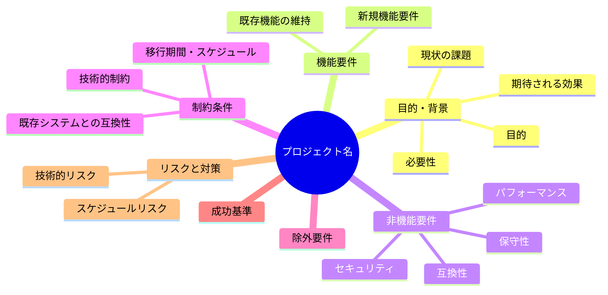
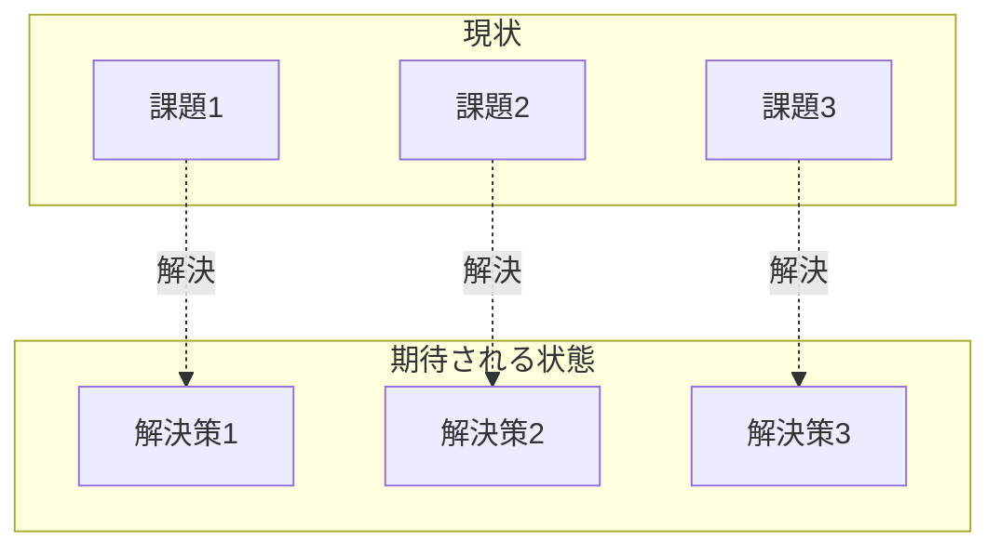

# 要求定義書: {プロジェクト名}

**プロジェクト名**: {プロジェクト名}  
**作成日**: {YYYY 年 MM 月 DD 日}  
**最終更新**: {YYYY 年 MM 月 DD 日}

> **重要**:
>
> - 要求定義書は、プロジェクトの全体像を把握するためのものです。詳細な技術仕様や実装方法は要件定義書以降で記載します。必要最低限の情報に収めることを心掛けてください。
> - **このドキュメントは常に更新**: 要求の変更や追加があった場合は、即座にこのドキュメントを更新してください。ドキュメントは「生きているドキュメント」として扱い、実装内容と常に同期させます。
>
> **注意**: このテンプレートでは「プロジェクト名」という用語を使用していますが、実際には「issue/タスク名」でも問題ありません。プロジェクトの規模や管理方法に応じて、適切な用語を使用してください。プロジェクトという概念を使わず、issue/タスクのみで管理する場合は、「プロジェクト名」を「issue/タスク名」に置き換えて使用してください。

---

## 要求定義の全体像

**注意**:

- 上記の「プロジェクト名」は例です。実際のプロジェクト名に置き換えてください。
- マインドマップは全体像を把握するためのものです。主要なセクション名程度に留め、詳細は記載しないでください。

---

## 1. 目的・背景

### 1.1 目的

{何を実現するかを明確に記載（1-2 文で簡潔に）}

### 1.2 背景

- **現状の課題**:

  - {課題 1}
  - {課題 2}

- **必要性**:
  - {必要性 1}
  - {必要性 2}

### 1.3 期待される効果

- **効果 1**: {説明}
- **効果 2**: {説明}

**現状と期待される状態の比較**（必要に応じて）:

---

## 2. 機能要件

### 2.1 既存機能の維持（該当する場合）

{既存機能を維持する場合の記載（機能の一覧程度で詳細は不要）}

### 2.2 新規機能要件

{新規に実現する機能の記載（機能名と目的程度で詳細は不要）}

---

## 3. 非機能要件

### 3.1 パフォーマンス

- {パフォーマンス要件}

### 3.2 セキュリティ

- {セキュリティ要件}

### 3.3 互換性

- {互換性要件}

### 3.4 保守性

- {保守性要件}

---

## 4. 制約条件

### 4.1 技術的制約

- {技術的制約}

### 4.2 既存システムとの互換性

- {互換性要件}

### 4.3 移行期間・スケジュール

- {期間・スケジュール制約}

---

## 5. 除外要件

{本プロジェクトの対象外とする機能・要件}

---

## 6. 成功基準

{プロジェクトが成功したと判断する基準}

---

## 7. リスクと対策

### 7.1 技術的リスク

- **リスク**: {リスク内容}
  - **対策**: {対策内容}

### 7.2 スケジュールリスク

- **リスク**: {リスク内容}
  - **対策**: {対策内容}

---

## 8. 参考資料

### プロジェクトドキュメント

- 既存プロジェクトの場合は、[`00_システム理解.md`](../00_システム理解.md) - システム理解を参照

### その他の参考資料

- {参考資料 1}
- {参考資料 2}

---

## 9. 次のステップ

この要求定義書の承認後、以下のドキュメントを作成します：

- **次**: [`01_要件定義.md`](./01_要件定義.md) - 要件定義フェーズ
