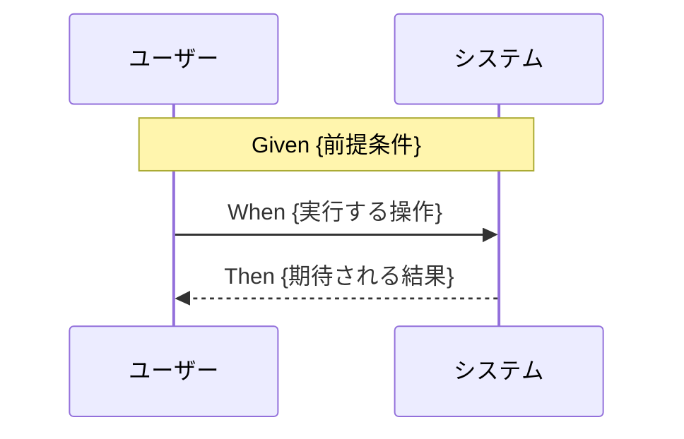

# 要件定義書: {プロジェクト名}

**プロジェクト名**: {プロジェクト名}  
**作成日**: {YYYY 年 MM 月 DD 日}  
**最終更新**: {YYYY 年 MM 月 DD 日}

> **重要**: **このドキュメントは常に更新**: 要件の変更や追加があった場合は、即座にこのドキュメントを更新してください。ドキュメントは「生きているドキュメント」として扱い、実装内容と常に同期させます。
>
> **注意**: このテンプレートでは「プロジェクト名」という用語を使用していますが、実際には「issue/タスク名」でも問題ありません。プロジェクトの規模や管理方法に応じて、適切な用語を使用してください。プロジェクトという概念を使わず、issue/タスクのみで管理する場合は、「プロジェクト名」を「issue/タスク名」に置き換えて使用してください。

---

## 1. 概要

### 1.1 システム概要

{システムの概要説明}

### 1.2 用語集

| 用語     | 説明   |
| -------- | ------ |
| {用語 1} | {説明} |
| {用語 2} | {説明} |

---

## 2. 機能要件

### 2.1 ユーザーストーリー

#### ストーリー 1: {ストーリー名}

- **As a** {ユーザー種別}
- **I want to** {やりたいこと}
- **So that** {目的}

**受け入れ基準**:

- {基準 1}
- {基準 2}

#### ストーリー 2: {ストーリー名}

{同様の形式}

### 2.2 BDD ユースケース

#### ユースケース 1: {ユースケース名}

{ユースケースの説明}

**シナリオ 1: {シナリオ名}**

```gherkin
Feature: {ユースケース名}
  Scenario: {シナリオ名}
    Given {前提条件}
    When {実行する操作}
    Then {期待される結果}
```

**処理フロー**（必要に応じて）:



**シナリオ 2: {シナリオ名}**

```gherkin
Feature: {ユースケース名}
  Scenario: {シナリオ名}
    Given {前提条件}
    When {実行する操作}
    Then {期待される結果}
```

#### ユースケース 2: {ユースケース名}

{同様の形式}

### 2.3 ビジネスルール

- {ルール 1}
- {ルール 2}

---

## 3. 非機能要件

### 3.1 パフォーマンス要件

- {要件 1}
- {要件 2}

### 3.2 セキュリティ要件

- {要件 1}
- {要件 2}

### 3.3 ユーザビリティ要件

- {要件 1}
- {要件 2}

### 3.4 可用性要件

- {要件 1}
- {要件 2}

---

## 4. 外部インターフェース要件

### 4.1 API 要件

- {API 要件 1}
- {API 要件 2}

### 4.2 データ形式要件

- {データ形式要件}

---

## 5. 制約事項

- {制約 1}
- {制約 2}

---

## 6. 参考資料

### プロジェクトドキュメント

- [`00_要求定義.md`](./00_要求定義.md) - 要求定義

### その他の参考資料

- {その他の参考資料}

---

## 7. 前のステップ

この要件定義書は、以下のドキュメントを基に作成されています：

- **前**: [`00_要求定義.md`](./00_要求定義.md) - 要求定義フェーズ

---

## 8. 次のステップ

この要件定義書の承認後、以下のドキュメントを作成します：

- **次**: [`02_設計.md`](./02_設計.md) - 設計フェーズ
