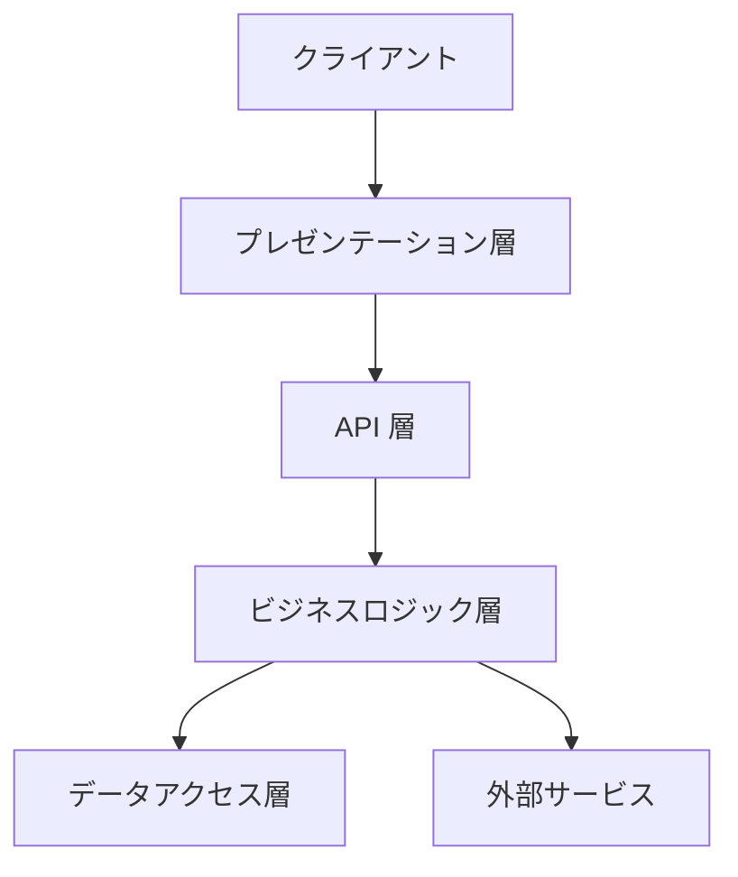
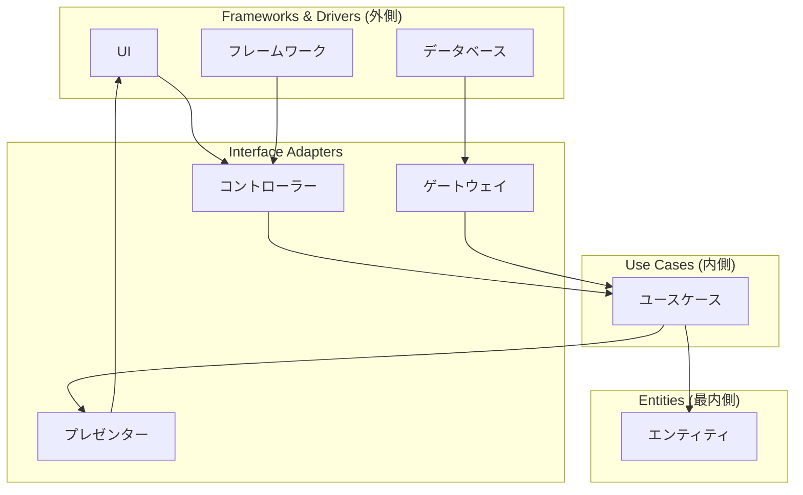
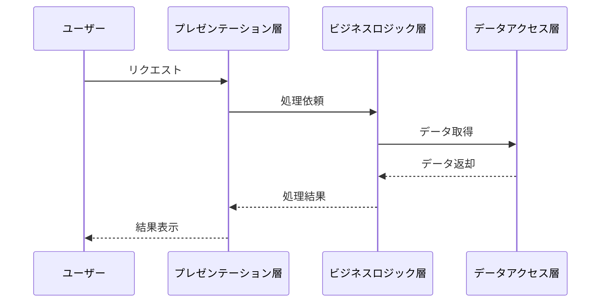
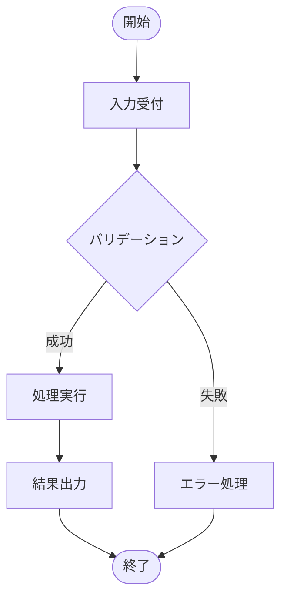
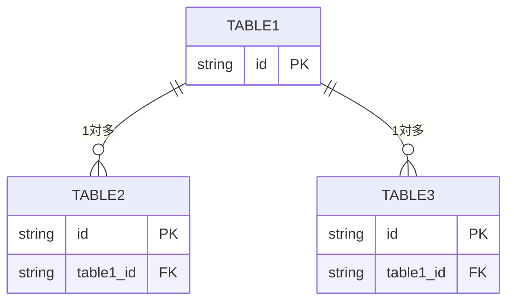
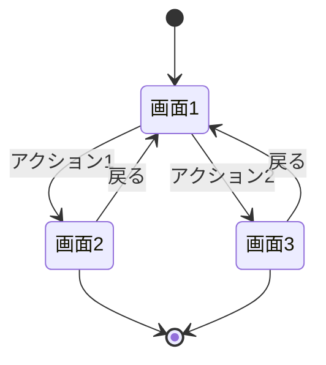

# 設計書: {プロジェクト名}

**プロジェクト名**: {プロジェクト名}  
**作成日**: {YYYY 年 MM 月 DD 日}  
**最終更新**: {YYYY 年 MM 月 DD 日}

> **重要**: **このドキュメントは常に更新**: 設計の変更や追加があった場合は、即座にこのドキュメントを更新してください。ドキュメントは「生きているドキュメント」として扱い、実装内容と常に同期させます。
>
> **注意**: このテンプレートでは「プロジェクト名」という用語を使用していますが、実際には「issue/タスク名」でも問題ありません。プロジェクトの規模や管理方法に応じて、適切な用語を使用してください。プロジェクトという概念を使わず、issue/タスクのみで管理する場合は、「プロジェクト名」を「issue/タスク名」に置き換えて使用してください。

---

## 1. 設計概要

### 1.1 設計方針

{設計の基本方針}

### 1.2 設計原則

- {原則 1}
- {原則 2}

---

## 2. アーキテクチャ設計

### 2.1 システムアーキテクチャ

{アーキテクチャの説明}

**アーキテクチャパターンの選択**:

- **レイヤードアーキテクチャ**: シンプルなプロジェクトに適している
- **クリーンアーキテクチャ**: 中規模以上のプロジェクト、特にビジネスロジックが複雑な場合に推奨
- **マイクロサービスアーキテクチャ**: 大規模な分散システムに適している

**注意**: プロジェクトの規模や複雑さに応じて、適切なアーキテクチャパターンを選択してください。過剰な設計は避け、シンプルさを優先します。

#### レイヤードアーキテクチャ（シンプルなプロジェクト）

#### クリーンアーキテクチャ（中規模以上のプロジェクト）

### 2.2 コンポーネント構成

{コンポーネントの説明}

### 2.3 データフロー

{データフローの説明}

---

## 3. 機能設計

### 3.1 機能 1: {機能名}

#### 3.1.1 概要

{機能の概要}

#### 3.1.2 処理フロー

{処理フローの説明}

#### 3.1.3 入力・出力

- **入力**: {入力内容}
- **出力**: {出力内容}

#### 3.1.4 エラーハンドリング

{エラー処理の設計}

### 3.2 機能 2: {機能名}

{同様の形式}

---

## 4. データ設計

### 4.1 データモデル

{データモデルの説明}

#### リレーション図

**注意**: 上記のテーブル名とカラムは例です。実際のテーブル名とカラムに置き換えてください。PK は主キー、FK は外部キーを示します。リレーションに関係のないカラムは表示していません。

#### テーブル一覧

| テーブル名   | 説明   | 主キー   |
| ------------ | ------ | -------- |
| {テーブル 1} | {説明} | {主キー} |
| {テーブル 2} | {説明} | {主キー} |

#### テーブル詳細

##### {テーブル 1}

| カラム名   | 型       | NULL | デフォルト        | 説明     | 備考 |
| ---------- | -------- | ---- | ----------------- | -------- | ---- |
| id         | {型}     | NO   | -                 | {説明}   | PK   |
| name       | {型}     | YES  | NULL              | {説明}   |      |
| created_at | datetime | NO   | CURRENT_TIMESTAMP | 作成日時 |      |
| updated_at | datetime | NO   | CURRENT_TIMESTAMP | 更新日時 |      |

##### {テーブル 2}

| カラム名         | 型   | NULL | デフォルト | 説明   | 備考                 |
| ---------------- | ---- | ---- | ---------- | ------ | -------------------- |
| id               | {型} | NO   | -          | {説明} | PK                   |
| {テーブル 1}\_id | {型} | NO   | -          | {説明} | FK → {テーブル 1}.id |
| value            | {型} | YES  | NULL       | {説明} |                      |

#### リレーション

| 親テーブル   | 子テーブル   | 関係   | 説明   |
| ------------ | ------------ | ------ | ------ |
| {テーブル 1} | {テーブル 2} | 1 対多 | {説明} |

### 4.2 データ構造

{データ構造の定義}

---

## 5. API 設計

### 5.1 API 一覧

| エンドポイント     | メソッド   | 説明   |
| ------------------ | ---------- | ------ |
| {エンドポイント 1} | {メソッド} | {説明} |
| {エンドポイント 2} | {メソッド} | {説明} |

### 5.2 API 詳細

#### API1: {API 名}

- **エンドポイント**: {エンドポイント}
- **メソッド**: {メソッド}
- **リクエスト**: {リクエスト形式}
- **レスポンス**: {レスポンス形式}
- **エラー**: {エラー形式}

---

## 6. UI 設計

### 6.1 画面遷移図

{画面遷移の説明}

### 6.2 画面設計

#### 画面 1: {画面名}

{画面の説明}

---

## 7. セキュリティ設計

### 7.1 認証・認可

{認証・認可の設計}

### 7.2 データ保護

{データ保護の設計}

---

## 8. 非機能要件への対応

### 8.1 パフォーマンス

{パフォーマンスへの対応}

### 8.2 可用性

{可用性への対応}

---

## 9. 参考資料

### プロジェクトドキュメント

- [`01_要件定義.md`](./01_要件定義.md) - 要件定義

### その他の参考資料

- {その他の参考資料}

---

## 10. 前のステップ

この設計書は、以下のドキュメントを基に作成されています：

- **前**: [`01_要件定義.md`](./01_要件定義.md) - 要件定義フェーズ

---

## 11. 次のステップ

この設計書の承認後、以下のドキュメントを作成します：

- **次**: [`03_実装計画.md`](./03_実装計画.md) - 実装計画フェーズ
