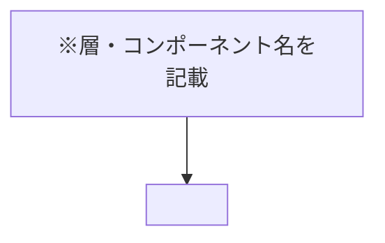
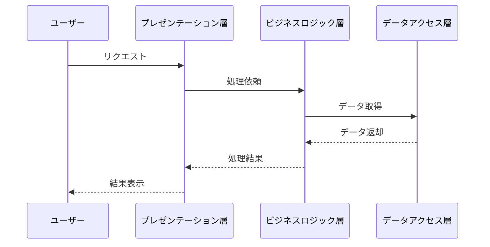
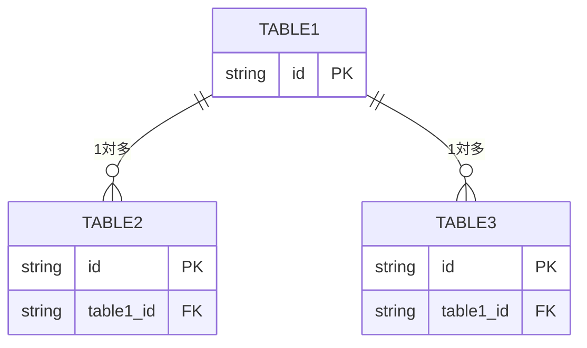
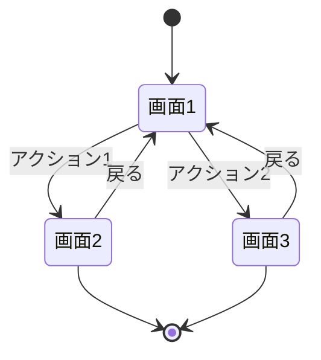

# 設計書: {プロジェクト名}

**プロジェクト名**: {プロジェクト名}  
**作成日**: {YYYY 年 MM 月 DD 日}  
**最終更新**: {YYYY 年 MM 月 DD 日}

> **重要**: **このドキュメントは常に更新**: 設計の変更や追加があった場合は、即座にこのドキュメントを更新してください。ドキュメントは「生きているドキュメント」として扱い、実装内容と常に同期させます。
>
> **用語**: [.agents/CONCEPTS.md §用語規約](../../.agents/CONCEPTS.md#用語規約) を参照。

---

## 1. 設計概要

**必須**: 設計方針・原則は [.agents/spec/01_設計原則.md](../../.agents/spec/01_設計原則.md) を参照した上で、本プロジェクトに適用するものを記載すること。

### 1.1 設計方針

（spec に基づく設計の基本方針を 1–2 文。空欄のまま提出不可）

### 1.2 設計原則（本プロジェクトで適用するもの）

- （spec から採用した原則を列挙。最低 1 件）
- 

---

## 2. アーキテクチャ設計

### 2.1 システムアーキテクチャ

**必須**: 設計判断は [.agents/spec/](../../.agents/spec/)（[00_spec概要.md](../../.agents/spec/00_spec概要.md)、[01_設計原則.md](../../.agents/spec/01_設計原則.md)、[06_設計判断の優先順位.md](../../.agents/spec/06_設計判断の優先順位.md)）を**先に**参照すること。テンプレートは特定のアーキテクチャパターンを列挙しない。

- **採用パターン**: （spec に基づき選択したアーキテクチャパターン名を 1 つ記載）
- **根拠**: （spec のどの原則・優先順位に基づいたか、1–2 文）

#### アーキテクチャ図（本プロジェクトの構成で記載）

spec に基づき選択したパターンを、**本プロジェクトの層・コンポーネント名**で記載すること。以下は記入用の枠のみ。

```mermaid
flowchart TD
    A[※層・コンポーネント名を記載] --> B[ ]
```

### 2.2 コンポーネント構成

{コンポーネントの説明}

### 2.3 データフロー

{データフローの説明}

**以下に示すレイヤー名（プレゼンテーション層・ビジネスロジック層・データアクセス層）は例示である。本プロジェクトの実際の構成名・コンポーネント名に書き換えて使用すること。**

```mermaid
sequenceDiagram
    participant U as ユーザー
    participant P as プレゼンテーション層
    participant B as ビジネスロジック層
    participant D as データアクセス層

    U->>P: リクエスト
    P->>B: 処理依頼
    B->>D: データ取得
    D-->>B: データ返却
    B-->>P: 処理結果
    P-->>U: 結果表示
```

---

## 3. 機能設計

### 3.1 機能 1: {機能名}

#### 3.1.1 概要

{機能の概要}

#### 3.1.2 処理フロー

{処理フローの説明}

```mermaid
flowchart TD
    Start([開始]) --> Input[入力受付]
    Input --> Validate{バリデーション}
    Validate -->|成功| Process[処理実行]
    Validate -->|失敗| Error[エラー処理]
    Process --> Output[結果出力]
    Output --> End([終了])
    Error --> End
```

#### 3.1.3 入力・出力

- **入力**: {入力内容}
- **出力**: {出力内容}

#### 3.1.4 エラーハンドリング

{エラー処理の設計}

### 3.2 機能 2: {機能名}

{同様の形式}

---

## 4. データ設計

### 4.1 データモデル

{データモデルの説明}

#### リレーション図

```mermaid
erDiagram
    TABLE1 {
        string id PK
    }
    TABLE2 {
        string id PK
        string table1_id FK
    }
    TABLE3 {
        string id PK
        string table1_id FK
    }
    TABLE1 ||--o{ TABLE2 : "1対多"
    TABLE1 ||--o{ TABLE3 : "1対多"
```

**注意**: 上記のテーブル名とカラムは例です。実際のテーブル名とカラムに置き換えてください。PK は主キー、FK は外部キーを示します。リレーションに関係のないカラムは表示していません。

#### テーブル一覧

| テーブル名   | 説明   | 主キー   |
| ------------ | ------ | -------- |
| {テーブル 1} | {説明} | {主キー} |
| {テーブル 2} | {説明} | {主キー} |

#### テーブル詳細

##### {テーブル 1}

| カラム名   | 型       | NULL | デフォルト        | 説明     | 備考 |
| ---------- | -------- | ---- | ----------------- | -------- | ---- |
| id         | {型}     | NO   | -                 | {説明}   | PK   |
| name       | {型}     | YES  | NULL              | {説明}   |      |
| created_at | datetime | NO   | CURRENT_TIMESTAMP | 作成日時 |      |
| updated_at | datetime | NO   | CURRENT_TIMESTAMP | 更新日時 |      |

##### {テーブル 2}

| カラム名         | 型   | NULL | デフォルト | 説明   | 備考                 |
| ---------------- | ---- | ---- | ---------- | ------ | -------------------- |
| id               | {型} | NO   | -          | {説明} | PK                   |
| {テーブル 1}\_id | {型} | NO   | -          | {説明} | FK → {テーブル 1}.id |
| value            | {型} | YES  | NULL       | {説明} |                      |

#### リレーション

| 親テーブル   | 子テーブル   | 関係   | 説明   |
| ------------ | ------------ | ------ | ------ |
| {テーブル 1} | {テーブル 2} | 1 対多 | {説明} |

### 4.2 データ構造

{データ構造の定義}

---

## 5. API 設計

### 5.1 API 一覧

| エンドポイント     | メソッド   | 説明   |
| ------------------ | ---------- | ------ |
| {エンドポイント 1} | {メソッド} | {説明} |
| {エンドポイント 2} | {メソッド} | {説明} |

### 5.2 API 詳細

#### API1: {API 名}

- **エンドポイント**: {エンドポイント}
- **メソッド**: {メソッド}
- **リクエスト**: {リクエスト形式}
- **レスポンス**: {レスポンス形式}
- **エラー**: {エラー形式}

---

## 6. テスト戦略

テスト戦略の**観点の定義**は [RULES.md のテスト戦略必須要件](../../.agents/RULES.md#テスト戦略必須要件) を、**BDD 形式の定義**は [TEST_BDD_FORMAT.md](../../.agents/TEST_BDD_FORMAT.md) を参照すること。本ドキュメントでは**対象ごとのテスト割当**のみ記載する。

### 6.1 対象ごとのテスト割り当て

各コンポーネント/API/機能について、どのテストレベルで何を担保するかを証跡化する。単体・結合/API・E2E の責務やカバレッジ方針は RULES §テスト戦略必須要件を参照。

| 対象 | 単体 | 結合/API | E2E | クリティカル観点 | バリデーション観点 | 未達理由/補足 |
|------|------|----------|-----|------------------|--------------------|---------------|
| {機能/API/コンポーネント名} | {○/×} | {○/×} | {○/×} | {内容} | {内容} | {内容} |

### 6.2 監査・レビューでの確認（証跡）

証跡の確認観点は RULES §テスト戦略必須要件および workflow/PHASES.md の監査観点を参照。本設計書 §6.1 の割当表と 03_実装計画のタスク別テスト観点・BDD が揃っていることを確認する。

---

## 7. UI 設計

### 7.1 画面遷移図

{画面遷移の説明}

```mermaid
stateDiagram-v2
    [*] --> 画面1
    画面1 --> 画面2: アクション1
    画面1 --> 画面3: アクション2
    画面2 --> 画面1: 戻る
    画面3 --> 画面1: 戻る
    画面2 --> [*]
    画面3 --> [*]
```

### 7.2 画面設計

#### 画面 1: {画面名}

{画面の説明}

---

## 8. セキュリティ設計

### 8.1 認証・認可

{認証・認可の設計}

### 8.2 データ保護

{データ保護の設計}

---

## 9. 非機能要件への対応

### 9.1 パフォーマンス

{パフォーマンスへの対応}

### 9.2 可用性

{可用性への対応}

---

## 10. 参考資料

### プロジェクトドキュメント

- [`01_要件定義.md`](./01_要件定義.md) - 要件定義

### その他の参考資料

- {その他の参考資料}

---

## 11. 前のステップ

この設計書は、以下のドキュメントを基に作成されています：

- **前**: [`01_要件定義.md`](./01_要件定義.md) - 要件定義フェーズ

---

## 12. 次のステップ

この設計書の承認後、以下のドキュメントを作成します：

- **次**: [`03_実装計画.md`](./03_実装計画.md) - 実装計画フェーズ
