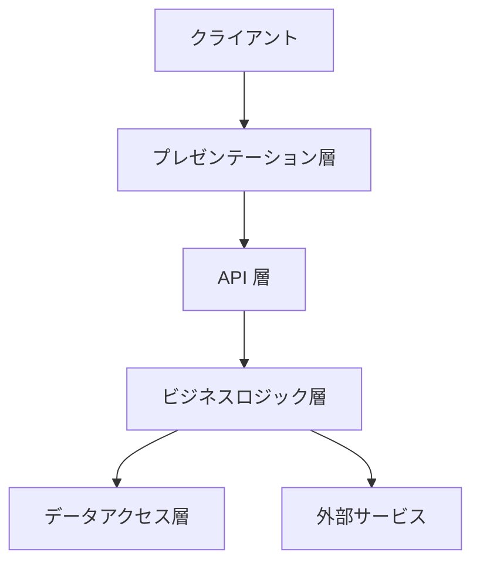
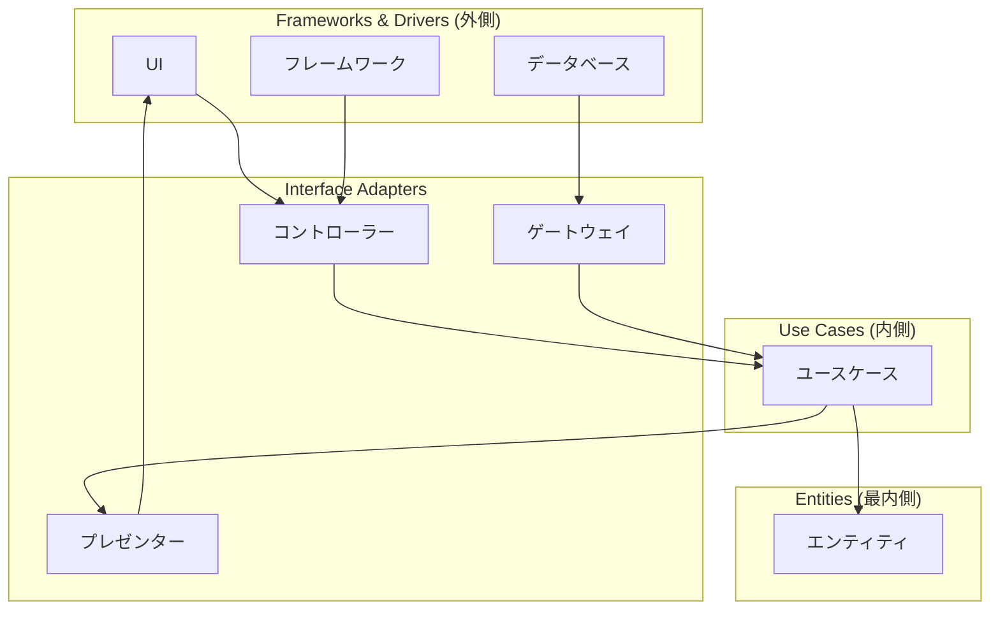
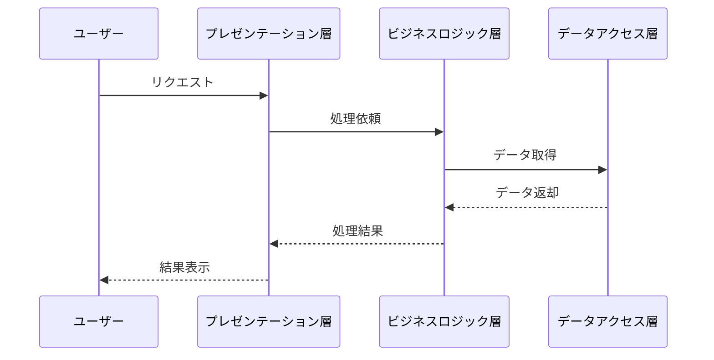
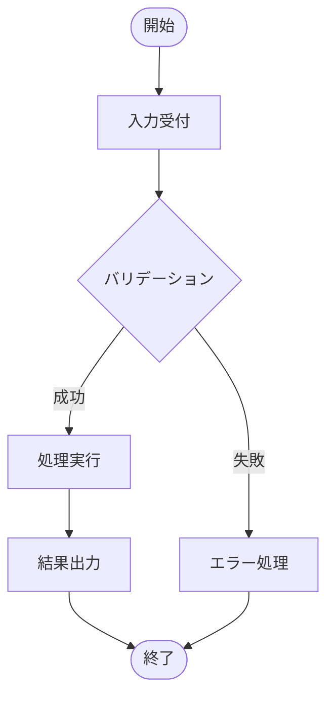
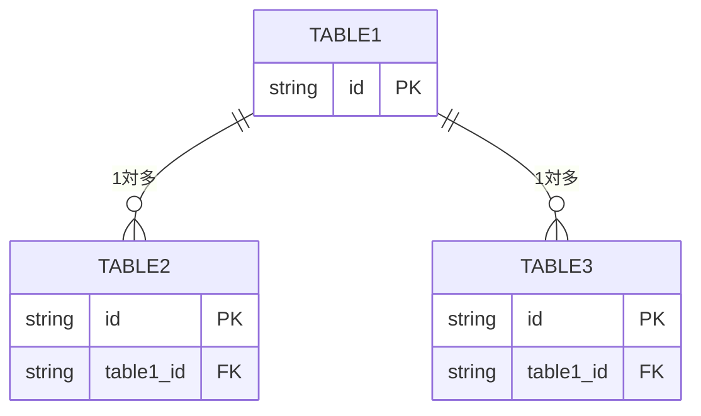
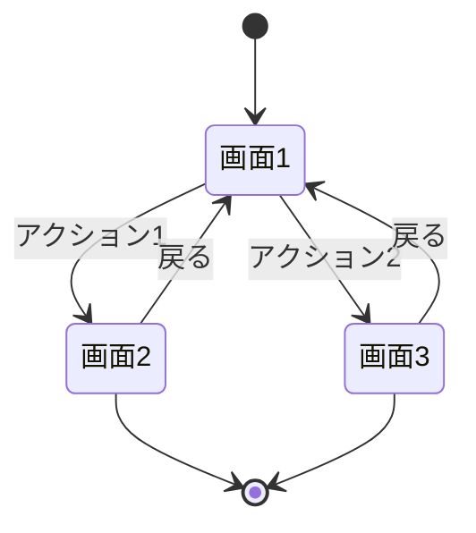

# 設計書: {プロジェクト名}

**プロジェクト名**: {プロジェクト名}  
**作成日**: {YYYY 年 MM 月 DD 日}  
**最終更新**: {YYYY 年 MM 月 DD 日}

> **重要**: **このドキュメントは常に更新**: 設計の変更や追加があった場合は、即座にこのドキュメントを更新してください。ドキュメントは「生きているドキュメント」として扱い、実装内容と常に同期させます。
>
> **注意**: このテンプレートでは「プロジェクト名」という用語を使用していますが、実際には「issue/タスク名」でも問題ありません。プロジェクトの規模や管理方法に応じて、適切な用語を使用してください。プロジェクトという概念を使わず、issue/タスクのみで管理する場合は、「プロジェクト名」を「issue/タスク名」に置き換えて使用してください。

---

## 1. 設計概要

### 1.1 設計方針

{設計の基本方針}

### 1.2 設計原則

- {原則 1}
- {原則 2}

---

## 2. アーキテクチャ設計

### 2.1 システムアーキテクチャ

{アーキテクチャの説明}

**アーキテクチャパターンの選択**:

- **レイヤードアーキテクチャ**: シンプルなプロジェクトに適している
- **クリーンアーキテクチャ**: 中規模以上のプロジェクト、特にビジネスロジックが複雑な場合に推奨
- **マイクロサービスアーキテクチャ**: 大規模な分散システムに適している

**注意**: プロジェクトの規模や複雑さに応じて、適切なアーキテクチャパターンを選択してください。過剰な設計は避け、シンプルさを優先します。

#### レイヤードアーキテクチャ（シンプルなプロジェクト）


```mermaid
flowchart TD
    A[クライアント] --> B[プレゼンテーション層]
    B --> C[API 層]
    C --> D[ビジネスロジック層]
    D --> E[データアクセス層]
    D --> F[外部サービス]
```

#### クリーンアーキテクチャ（中規模以上のプロジェクト）


```mermaid
flowchart TD
    subgraph "Frameworks & Drivers (外側)"
        UI[UI]
        DB[データベース]
        FW[フレームワーク]
    end
    subgraph "Interface Adapters"
        C[コントローラー]
        P[プレゼンター]
        G[ゲートウェイ]
    end
    subgraph "Use Cases (内側)"
        UC[ユースケース]
    end
    subgraph "Entities (最内側)"
        E[エンティティ]
    end

    UI --> C
    DB --> G
    FW --> C
    C --> UC
    G --> UC
    UC --> E
    UC --> P
    P --> UI
```

### 2.2 コンポーネント構成

{コンポーネントの説明}

### 2.3 データフロー

{データフローの説明}


```mermaid
sequenceDiagram
    participant U as ユーザー
    participant P as プレゼンテーション層
    participant B as ビジネスロジック層
    participant D as データアクセス層

    U->>P: リクエスト
    P->>B: 処理依頼
    B->>D: データ取得
    D-->>B: データ返却
    B-->>P: 処理結果
    P-->>U: 結果表示
```

---

## 3. 機能設計

### 3.1 機能 1: {機能名}

#### 3.1.1 概要

{機能の概要}

#### 3.1.2 処理フロー

{処理フローの説明}


```mermaid
flowchart TD
    Start([開始]) --> Input[入力受付]
    Input --> Validate{バリデーション}
    Validate -->|成功| Process[処理実行]
    Validate -->|失敗| Error[エラー処理]
    Process --> Output[結果出力]
    Output --> End([終了])
    Error --> End
```

#### 3.1.3 入力・出力

- **入力**: {入力内容}
- **出力**: {出力内容}

#### 3.1.4 エラーハンドリング

{エラー処理の設計}

### 3.2 機能 2: {機能名}

{同様の形式}

---

## 4. データ設計

### 4.1 データモデル

{データモデルの説明}

#### リレーション図


```mermaid
erDiagram
    TABLE1 {
        string id PK
    }
    TABLE2 {
        string id PK
        string table1_id FK
    }
    TABLE3 {
        string id PK
        string table1_id FK
    }
    TABLE1 ||--o{ TABLE2 : "1対多"
    TABLE1 ||--o{ TABLE3 : "1対多"
```

**注意**: 上記のテーブル名とカラムは例です。実際のテーブル名とカラムに置き換えてください。PK は主キー、FK は外部キーを示します。リレーションに関係のないカラムは表示していません。

#### テーブル一覧

| テーブル名   | 説明   | 主キー   |
| ------------ | ------ | -------- |
| {テーブル 1} | {説明} | {主キー} |
| {テーブル 2} | {説明} | {主キー} |

#### テーブル詳細

##### {テーブル 1}

| カラム名   | 型       | NULL | デフォルト        | 説明     | 備考 |
| ---------- | -------- | ---- | ----------------- | -------- | ---- |
| id         | {型}     | NO   | -                 | {説明}   | PK   |
| name       | {型}     | YES  | NULL              | {説明}   |      |
| created_at | datetime | NO   | CURRENT_TIMESTAMP | 作成日時 |      |
| updated_at | datetime | NO   | CURRENT_TIMESTAMP | 更新日時 |      |

##### {テーブル 2}

| カラム名         | 型   | NULL | デフォルト | 説明   | 備考                 |
| ---------------- | ---- | ---- | ---------- | ------ | -------------------- |
| id               | {型} | NO   | -          | {説明} | PK                   |
| {テーブル 1}\_id | {型} | NO   | -          | {説明} | FK → {テーブル 1}.id |
| value            | {型} | YES  | NULL       | {説明} |                      |

#### リレーション

| 親テーブル   | 子テーブル   | 関係   | 説明   |
| ------------ | ------------ | ------ | ------ |
| {テーブル 1} | {テーブル 2} | 1 対多 | {説明} |

### 4.2 データ構造

{データ構造の定義}

---

## 5. API 設計

### 5.1 API 一覧

| エンドポイント     | メソッド   | 説明   |
| ------------------ | ---------- | ------ |
| {エンドポイント 1} | {メソッド} | {説明} |
| {エンドポイント 2} | {メソッド} | {説明} |

### 5.2 API 詳細

#### API1: {API 名}

- **エンドポイント**: {エンドポイント}
- **メソッド**: {メソッド}
- **リクエスト**: {リクエスト形式}
- **レスポンス**: {レスポンス形式}
- **エラー**: {エラー形式}

---

## 6. テスト戦略

**重要**: テスト戦略の定義は必須です。各コンポーネント/API/機能に対して、どのテストレベル（単体/結合/E2E）で何をテストするかの方針を定義してください。詳細は **RULES のテスト戦略** または **本設計書 §6** を参照してください。

### 6.1 テストレベル方針（カバレッジ100%・理由記載）

各テストレベル（単体/結合/API/E2E）でのカバレッジ方針と、未達時の理由記載ルールを定義します。

- **カバレッジ方針**: {原則として100%とする / 対象範囲ごとに記載}
- **未達時の理由記載**: {やむを得ず未達とする場合は理由を必ず記載する。記載場所: 本節または 03_実装計画の該当タスク}
- **理由記載の例**: {レガシー部分・外部モック不可・コスト対効果 等}

#### テストピラミッド

```
        E2E/シナリオ
      （少ないが重要なハッピーパス＋主要バッドパス）

    ────────────────────────

    結合/APIテスト
    （そこそこ）

    ────────────────────────

    単体テスト
    （多い：高速・細かい）
```

| レベル | 責務 | カバレッジ・理由記載 |
|--------|------|----------------------|
| 単体 | 関数・メソッド・コンポーネント単位。BDD で仕様書レベルを網羅。 | {原則100%。未達時は理由記載必須} |
| 結合/API | バックエンド API をブラックボックスで検証。 | {原則100%。未達時は理由記載必須} |
| E2E | フロントエンドの主要フローを端末から検証。 | {主要シナリオ網羅。未達時は理由記載必須} |

### 6.2 単体テストの網羅（正常系・異常系・境界値・回帰・結合）

単体テストでは次を BDD（Feature/Scenario または Given-When-Then）で仕様書レベルで網羅する。

- **正常系**: {期待どおりの入力で期待どおりの結果となること}
- **異常系**: {不正入力・エラー条件で期待どおりのエラーまたはフォールバックとなること}
- **境界値**: {境界付近の値（最小・最大・0・空など）で期待どおりとなること}
- **回帰**: {既存の振る舞いが変更で壊れていないこと（既存テストで担保）}
- **結合**: {他モジュール・サービスとの境界（モック/スタブで制御）で期待どおりとなること}

バリデーション系は上記に加え、すべてのバリデーションルール・境界値・エラーメッセージをテストする。

### 6.3 API ブラックボックステスト

- API エンドポイントごとに、正常・異常・境界を**ブラックボックス**でテストする（内部実装に依存しない入出力検証）。
- リクエスト・レスポンス・ステータスコード・エラーメッセージを仕様に照らして検証する。
- {対象 API 一覧または 5. API 設計との対応表}

### 6.4 E2E 網羅

- フロントエンドの主要ユーザーシナリオ（ログイン、主要画面遷移、クリティカル操作）を E2E でカバーする。
- {主要シナリオ一覧または 7. UI 設計との対応}

### 6.5 監査・レビューでの確認（証跡・チェックリスト）

| 確認観点 | 証跡 | チェックリスト例 |
|----------|------|------------------|
| カバレッジ100% or 理由記載 | カバレッジレポート、または 02/03 内の「未達理由」記載 | 全レベルでカバレッジが100%である、または理由が明記されているか |
| 単体の BDD 網羅 | 01 要件定義の Feature/Scenario、03 のタスク別テスト観点、テストコード内の Given/When/Then | 正常系・異常系・境界値・回帰・結合が BDD で記載され実装されているか |
| API ブラックボックス | API テスト一覧・実行結果 | 全 API がブラックボックステストでカバーされているか |
| E2E 網羅 | E2E シナリオ一覧・実行結果 | 主要フローが E2E でカバーされているか |

---

## 7. UI 設計

### 7.1 画面遷移図

{画面遷移の説明}


```mermaid
stateDiagram-v2
    [*] --> 画面1
    画面1 --> 画面2: アクション1
    画面1 --> 画面3: アクション2
    画面2 --> 画面1: 戻る
    画面3 --> 画面1: 戻る
    画面2 --> [*]
    画面3 --> [*]
```

### 7.2 画面設計

#### 画面 1: {画面名}

{画面の説明}

---

## 8. セキュリティ設計

### 8.1 認証・認可

{認証・認可の設計}

### 8.2 データ保護

{データ保護の設計}

---

## 9. 非機能要件への対応

### 9.1 パフォーマンス

{パフォーマンスへの対応}

### 9.2 可用性

{可用性への対応}

---

## 10. 参考資料

### プロジェクトドキュメント

- [`01_要件定義.md`](./01_要件定義.md) - 要件定義

### その他の参考資料

- {その他の参考資料}

---

## 11. 前のステップ

この設計書は、以下のドキュメントを基に作成されています：

- **前**: [`01_要件定義.md`](./01_要件定義.md) - 要件定義フェーズ

---

## 12. 次のステップ

この設計書の承認後、以下のドキュメントを作成します：

- **次**: [`03_実装計画.md`](./03_実装計画.md) - 実装計画フェーズ
