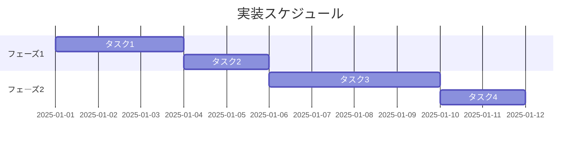
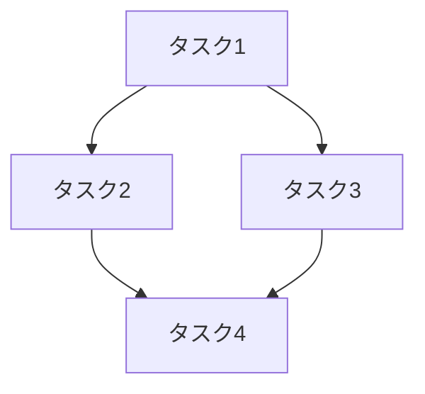

# 実装計画書: {プロジェクト名}

**プロジェクト名**: {プロジェクト名}  
**作成日**: {YYYY 年 MM 月 DD 日}  
**最終更新**: {YYYY 年 MM 月 DD 日}

> **重要**: **このドキュメントは常に更新**: 実装計画の変更、進捗状況の更新、バグの記録などがあった場合は、即座にこのドキュメントを更新してください。ドキュメントは「生きているドキュメント」として扱い、実装内容と常に同期させます。
>
> **注意**: このテンプレートでは「プロジェクト名」という用語を使用していますが、実際には「issue/タスク名」でも問題ありません。プロジェクトの規模や管理方法に応じて、適切な用語を使用してください。プロジェクトという概念を使わず、issue/タスクのみで管理する場合は、「プロジェクト名」を「issue/タスク名」に置き換えて使用してください。

---

## 1. 実装概要

### 1.1 実装方針

{実装の基本方針}

### 1.2 実装順序

{実装の優先順位と順序}



---

## 2. タスク分解

**注意**: このセクションでは「タスク」という用語を使用していますが、**issue とタスクは必要に応じて置き換え可能**です。プロジェクトの規模や管理方法に応じて、適切な粒度で使い分けてください。大きなプロジェクトでは「issue」、小さなプロジェクトでは「タスク」として管理することが多いです。

### 2.1 タスク 1: {タスク名}

#### 2.1.1 概要

{タスクの概要}

#### 2.1.2 実装内容

- {実装内容 1}
- {実装内容 2}

#### 2.1.3 テスト観点

**重要**: 各タスクに紐づくテスト観点の定義は必須です。詳細は [`AGENTS_TEST_GUIDELINES.md`](../AGENTS_TEST_GUIDELINES.md) を参照してください。

##### 単体テスト

- **正常系**: {代表的なケース 1〜2 個程度}
- **異常系・境界値**: {すべてのエラーケース、境界値}
  - {具体的なテスト観点 1}
  - {具体的なテスト観点 2}

##### 結合/API テスト

- コンポーネント間の契約チェック
- 代表的なフロー（正常パターン数個＋主要なエラーケース）

##### E2E/受け入れテスト

- BDD の Feature/Scenario をそのままテストに（重要機能に集中）

##### バリデーション系（該当する場合）

- すべてのバリデーションルール
- 境界値（最小値、最大値、0、NULL 等）
- エラーメッセージ

詳細は [`AGENTS_TEST_GUIDELINES.md`](../AGENTS_TEST_GUIDELINES.md) を参照してください。

#### 2.1.4 単体テスト仕様

**BDD 形式のテストケース**:

```gherkin
Feature: {テスト対象}
  Scenario: {テストケース名}
    Given {前提条件}
    When {実行する操作}
    Then {期待される結果}
```

**テストコード例**（プロジェクトで使用する言語・フレームワークに応じて記述。`typescript`、`python`、`php` など、実際の言語名に置き換えてください）:

```typescript
// Given: {前提条件の説明}
// When: {実行する操作の説明}
// Then: {期待される結果の説明}
```

#### 2.1.5 依存関係

- {依存タスク 1}
- {依存タスク 2}



#### 2.1.6 見積もり

- **工数**: {時間}
- **優先度**: {高/中/低}

### 2.2 タスク 2: {タスク名}

{同様の形式}

---

## 3. 実装スケジュール

### 3.1 マイルストーン

| マイルストーン     | 期日   | 成果物   |
| ------------------ | ------ | -------- |
| {マイルストーン 1} | {期日} | {成果物} |
| {マイルストーン 2} | {期日} | {成果物} |

### 3.2 実装フェーズ

#### フェーズ 1: {フェーズ名}

- **期間**: {期間}
- **タスク**: {タスク一覧}

---

## 4. テスト計画

**重要**: テスト計画の詳細は [`AGENTS_TEST_GUIDELINES.md`](../AGENTS_TEST_GUIDELINES.md) を参照してください。

### 4.1 テストの優先順位

- クリティカルな機能は厚くテスト
- 影響範囲が広い箇所は回帰テストに必ず含める

### 4.2 単体テスト

- **正常系**: 最小限（代表的なケース 1〜2 個程度）
- **異常系・境界値**: 重点的にテスト（すべてのエラーケース、境界値）

### 4.3 結合/API テスト

- コンポーネント間の契約チェック
- 代表的なフロー（正常パターン数個＋主要なエラーケース）

### 4.4 E2E/受け入れテスト

- BDD の Feature/Scenario をそのままテストに（重要機能に集中）

### 4.5 バリデーション系のテスト

- すべてのバリデーションルールを網羅的にテスト
- 境界値（最小値、最大値、0、NULL 等）を重点的にテスト
- エラーメッセージも確認

詳細は [`AGENTS_TEST_GUIDELINES.md`](../AGENTS_TEST_GUIDELINES.md) を参照してください。

---

## 5. リスク管理

### 5.1 実装リスク

- **リスク**: {リスク内容}
  - **対策**: {対策内容}

---

## 6. 参考資料

### プロジェクトドキュメント

- [`02_設計.md`](./02_設計.md) - 設計

### その他の参考資料

- {その他の参考資料}

---

## 7. 前のステップ

この実装計画書は、以下のドキュメントを基に作成されています：

- **前**: [`02_設計.md`](./02_設計.md) - 設計フェーズ

---

## 8. 次のステップ

この実装計画書の承認後、以下のいずれかのステップに進みます：

- **プロジェクトを複数の issue（またはタスク）に分割する場合**: [`90_issues.md`](./90_issues.md) - Issue 作成フェーズ
- **プロジェクトが 1 つの issue（またはタスク）である場合**: 実装フェーズ（execution）に直接進む

**注意**: issue とタスクは必要に応じて置き換え可能です。プロジェクトの規模や管理方法に応じて、適切な粒度で使い分けてください。
