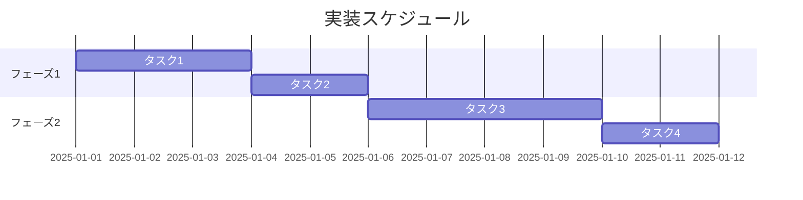
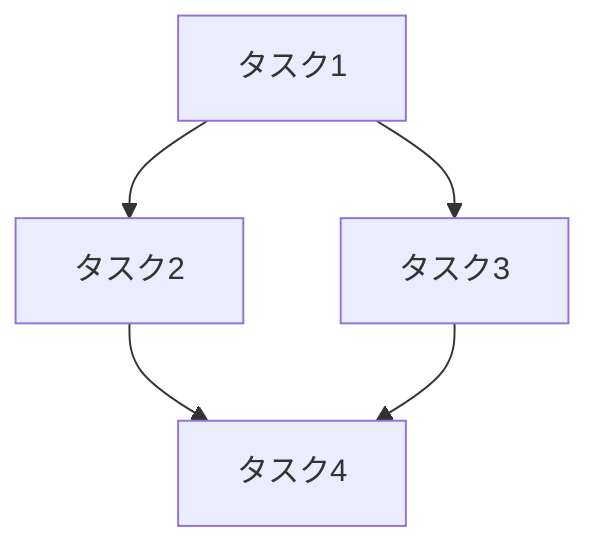

# 実装計画書: {プロジェクト名}

**プロジェクト名**: {プロジェクト名}  
**作成日**: {YYYY 年 MM 月 DD 日}  
**最終更新**: {YYYY 年 MM 月 DD 日}

> **重要**: **このドキュメントは常に更新**: 実装計画の変更、進捗状況の更新、バグの記録などがあった場合は、即座にこのドキュメントを更新してください。ドキュメントは「生きているドキュメント」として扱い、実装内容と常に同期させます。
> **必須項目**: 「必須」と明記した欄は空欄・抽象語のみで提出しないこと。テスト観点・BDD 仕様は具体ケースを 1 件以上記載すること。
>
> **用語**: [.agents/CONCEPTS.md §用語規約](../../.agents/CONCEPTS.md#用語規約) を参照。

---

## 1. 実装概要

### 1.1 実装方針（必須）

（実装の基本方針を 1–2 文で記載。02_設計の方針と整合させる。空欄不可）

### 1.2 実装順序（必須: 1 件以上）

（タスク名と優先順位を列挙。または Gantt で開始日・終了日を記載。最低 1 タスク）


```mermaid
gantt
    title 実装スケジュール
    dateFormat YYYY-MM-DD
    section フェーズ1
    タスク1 :a1, 2025-01-01, 3d
    タスク2 :a2, after a1, 2d
    section フェーズ2
    タスク3 :b1, after a2, 4d
    タスク4 :b2, after b1, 2d
```

---

## 2. タスク分解

**用語**: [.agents/CONCEPTS.md §用語規約](../../.agents/CONCEPTS.md#用語規約) を参照。

**必須**: 各タスクには **「テスト観点」（2.x.3）** と **「単体テスト仕様（BDD）」（2.x.4）** を必ず記載すること。テスト観点の定義は **02_設計 §6** および **RULES のテスト戦略・[TEST_BDD_FORMAT.md](../../.agents/TEST_BDD_FORMAT.md)** を参照し、本ドキュメントでは**タスクごとの具体ケース**のみ記載する。

### 2.1 タスク 1: {タスク名}

#### 2.1.1 概要（必須）

（タスクの目的を 1 文で記載。空欄不可）

#### 2.1.2 実装内容（必須: 1 件以上）

- （実装する内容を列挙。最低 1 件）
- 

#### 2.1.3 テスト観点（必須）

**参照**: 観点の定義は [02_設計 §6](./02_設計.md) および [RULES のテスト戦略・TEST_BDD_FORMAT](../../.agents/RULES.md#テスト戦略必須要件) を参照。以下には**本タスクの具体ケース**のみ記載する。

##### 単体（本タスクの具体ケース・必須 1 件以上）

- （正常系の具体ケースを 1 件以上。例: 「入力 X のとき Y を返す」）
- （異常系・境界値は該当時のみ。未達時は「該当なし」と記載可）

##### 結合/API（本タスクの具体ケース・該当時は必須 1 件以上）

- （エンドポイントまたは契約ごとの具体ケース。該当なしの場合は「該当なし」と記載）

##### E2E/受け入れ（本タスクの具体ケース・未達時は理由記載）

- （主要シナリオの具体ケース。未達の場合は理由を 1 文で記載）

##### バリデーション（該当する場合の具体ケース）

- （該当時は具体ケースを記載。該当なしの場合は「該当なし」）

#### 2.1.4 単体テスト仕様（BDD）（必須）

**BDD 形式のテストケース（高レベル仕様）**:

```gherkin
Feature: {テスト対象}
  Scenario: {テストケース名}
    Given {前提条件}
    When {実行する操作}
    Then {期待される結果}
```

**テストコード例（必須: インラインコメントで Given/When/Then を明記）**

プロジェクトで使用する言語・フレームワークに応じて記述してください（`typescript`、`python`、`php` など）。**重要**: テストコード内の各ブロックに `// Given:`、`// When:`、`// Then:` のインラインコメントを必ず記載すること（[TEST_BDD_FORMAT.md](../../.agents/TEST_BDD_FORMAT.md) §1）。

```typescript
// Given: {前提条件の説明}
// When: {実行する操作の説明}
// Then: {期待される結果の説明}
```

#### 2.1.5 依存関係

- {依存タスク 1}
- {依存タスク 2}


```mermaid
graph TD
    A[タスク1] --> B[タスク2]
    A --> C[タスク3]
    B --> D[タスク4]
    C --> D
```

#### 2.1.6 見積もり

- **工数**: {時間}
- **優先度**: {高/中/低}

### 2.2 タスク 2: {タスク名}

{同様の形式}

---

## テスト観点

（本実装計画全体のテスト観点の要約。各タスクの §2.x.3 に具体ケースを記載すること。監査で本セクションの存在と内容が検査される。）

---

## 単体テスト

（単体テストの方針・対象の要約。各タスクの §2.x.4 に BDD 仕様を記載すること。）

---

## BDD

（BDD シナリオの一覧または参照。Given/When/Then 形式は TEST_BDD_FORMAT に従うこと。）

---

## 3. 実装スケジュール

### 3.1 マイルストーン

| マイルストーン     | 期日   | 成果物   |
| ------------------ | ------ | -------- |
| {マイルストーン 1} | {期日} | {成果物} |
| {マイルストーン 2} | {期日} | {成果物} |

### 3.2 実装フェーズ

#### フェーズ 1: {フェーズ名}

- **期間**: {期間}
- **タスク**: {タスク一覧}

---

## 4. テスト計画

テスト観点・レベル・BDD 形式の定義は **02_設計 §6** および **RULES のテスト戦略・TEST_BDD_FORMAT** を参照。本実装計画では各タスクの **§2.x.3（テスト観点）** にタスクごとの具体ケースを記載し、§2.x.4 に BDD 仕様を記載する。

### 4.1 テストの優先順位

- クリティカルな機能は厚くテスト
- 影響範囲が広い箇所は回帰テストに必ず含める

---

## 5. リスク管理

### 5.1 実装リスク

- **リスク**: {リスク内容}
  - **対策**: {対策内容}

---

## 6. 参考資料

### プロジェクトドキュメント

- [`02_設計.md`](./02_設計.md) - 設計

### その他の参考資料

- {その他の参考資料}

---

## 7. 前のステップ

この実装計画書は、以下のドキュメントを基に作成されています：

- **前**: [`02_設計.md`](./02_設計.md) - 設計フェーズ

---

## 8. 次のステップ

この実装計画書の承認後、以下のいずれかのステップに進みます：

- **プロジェクトを複数の issue（またはタスク）に分割する場合**: [`90_issues.md`](./90_issues.md) - Issue 作成フェーズ
- **プロジェクトが 1 つの issue（またはタスク）である場合**: 実装フェーズ（execution）に直接進む

**用語**: [.agents/CONCEPTS.md §用語規約](../../.agents/CONCEPTS.md#用語規約) を参照。
