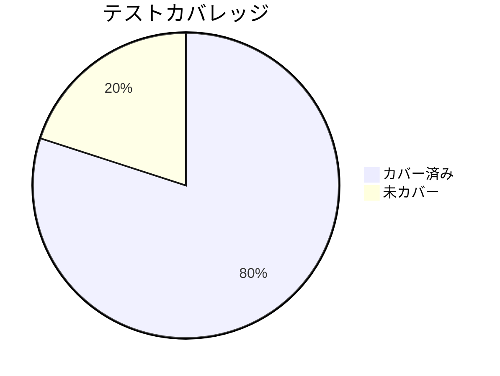

# レビュー書: {プロジェクト名}

**プロジェクト名**: {プロジェクト名}  
**作成日**: {YYYY 年 MM 月 DD 日}  
**最終更新**: {YYYY 年 MM 月 DD 日}

> **重要**: **このドキュメントは常に更新**: レビューで発見した問題点や改善提案、対応内容などがあった場合は、即座にこのドキュメントを更新してください。ドキュメントは「生きているドキュメント」として扱い、実装内容と常に同期させます。
>
> **注意**: このテンプレートでは「プロジェクト名」という用語を使用していますが、実際には「issue/タスク名」でも問題ありません。プロジェクトの規模や管理方法に応じて、適切な用語を使用してください。プロジェクトという概念を使わず、issue/タスクのみで管理する場合は、「プロジェクト名」を「issue/タスク名」に置き換えて使用してください。
>
> **必須**: **レビュー実施時は、[`AGENTS_REVIEW_RULE.md`](../../AGENTS_REVIEW_RULE.md) を必ず参照してください**。関連するテストやコードだけでなく、**プロジェクト全体のすべてのテストやコードを徹底的に調査する**ことが必須です。

---

## 1. レビュー概要

### 1.1 レビュー目的

{実装内容の確認、品質保証、デプロイ前の最終チェック等の目的}

### 1.2 レビュー対象

- **実装範囲**: {実装した機能・タスクの範囲}
- **レビュー期間**: {開始日} ～ {終了日}
- **レビュー担当者**: {担当者名}

---

## 2. 実装内容の確認

**注意**: このセクションでは「タスク」という用語を使用していますが、**issue とタスクは必要に応じて置き換え可能**です。プロジェクトの規模や管理方法に応じて、適切な粒度で使い分けてください。

### 2.1 実装完了タスク（または Issue）

| タスク名   | 実装内容   | 実装日 | 担当者   | ステータス    |
| ---------- | ---------- | ------ | -------- | ------------- |
| {タスク 1} | {実装内容} | {日付} | {担当者} | {完了/要修正} |
| {タスク 2} | {実装内容} | {日付} | {担当者} | {完了/要修正} |

### 2.2 実装内容の詳細

#### タスク 1: {タスク名}

- **実装内容**: {実装した内容の詳細}
- **変更ファイル**: {変更したファイル一覧}
- **実装方法**: {実装方法の説明}
- **確認事項**: {確認が必要な項目}

#### タスク 2: {タスク名}

{同様の形式}

---

## 3. テスト結果の確認

### 3.1 単体テスト

#### テスト実行結果

- **実行日**: {日付}
- **テストファイル数**: {数}
- **テストケース数**: {数}
- **成功**: {数}
- **失敗**: {数}
- **スキップ**: {数}

#### テストカバレッジ

**注意**: 上記の数値は例です。実際のテストカバレッジに合わせて数値を更新してください。

#### 失敗したテスト（該当する場合）

| テストファイル | テストケース | 失敗理由 | 対応状況      |
| -------------- | ------------ | -------- | ------------- |
| {ファイル名}   | {ケース名}   | {理由}   | {対応中/完了} |

### 3.2 統合テスト

{統合テストの結果}

### 3.3 E2E テスト

{E2E テストの結果}

---

## 4. コードレビュー

### 4.1 コード品質

#### コードスタイル

- **リント結果**: {エラー数} / {警告数}
- **フォーマット**: {問題あり/問題なし}
- **型チェック**: {エラー数} / {警告数}

#### コードレビュー観点

| 観点           | 確認内容   | 結果        | コメント   |
| -------------- | ---------- | ----------- | ---------- |
| 可読性         | {確認内容} | {OK/要修正} | {コメント} |
| 保守性         | {確認内容} | {OK/要修正} | {コメント} |
| パフォーマンス | {確認内容} | {OK/要修正} | {コメント} |
| セキュリティ   | {確認内容} | {OK/要修正} | {コメント} |

### 4.2 指摘事項

#### 指摘 1: {指摘内容}

- **重要度**: {高/中/低}
- **指摘内容**: {詳細}
- **対応状況**: {未対応/対応中/完了}
- **対応方法**: {対応方法}

#### 指摘 2: {指摘内容}

{同様の形式}

---

## 5. ドキュメントの確認

### 5.1 ドキュメント更新状況

| ドキュメント                         | 更新状況          | 確認者   | 確認日 |
| ------------------------------------ | ----------------- | -------- | ------ |
| [`00_要求定義.md`](./00_要求定義.md) | {更新済み/未更新} | {確認者} | {日付} |
| [`01_要件定義.md`](./01_要件定義.md) | {更新済み/未更新} | {確認者} | {日付} |
| [`02_設計.md`](./02_設計.md)         | {更新済み/未更新} | {確認者} | {日付} |
| [`03_実装計画.md`](./03_実装計画.md) | {更新済み/未更新} | {確認者} | {日付} |

### 5.2 ドキュメントの整合性

- **実装と設計の整合性**: {整合している/要修正}
- **要件と実装の整合性**: {整合している/要修正}
- **コメント**: {コメント}

---

## 6. パフォーマンス確認

### 6.1 パフォーマンステスト結果

{パフォーマンステストの結果}

### 6.2 ボトルネックの確認

{ボトルネックの有無と対応状況}

---

## 7. セキュリティ確認

### 7.1 セキュリティチェック

| 項目       | 確認内容   | 結果        | コメント   |
| ---------- | ---------- | ----------- | ---------- |
| 認証・認可 | {確認内容} | {OK/要修正} | {コメント} |
| データ保護 | {確認内容} | {OK/要修正} | {コメント} |
| 入力検証   | {確認内容} | {OK/要修正} | {コメント} |

---

## 8. デプロイ準備

### 8.1 デプロイチェックリスト

- [ ] すべてのテストが通過している
- [ ] コードレビューが完了している
- [ ] ドキュメントが更新されている
- [ ] マイグレーションスクリプトが準備されている
- [ ] 環境変数の設定が確認されている
- [ ] バックアップ計画が準備されている

### 8.2 デプロイ計画

- **デプロイ予定日**: {日付}
- **デプロイ方法**: {方法}
- **ロールバック計画**: {計画}

---

## 9. 課題と改善点

### 9.1 発見された課題

- **課題 1**: {課題内容}
  - **影響範囲**: {影響範囲}
  - **対応方法**: {対応方法}

### 9.2 改善提案

- **改善 1**: {改善内容}
  - **効果**: {期待される効果}

---

## 9. システム仕様書の更新

> **重要**: Issue 完了時（レビューフェーズ完了時）に、**必ずシステム仕様書（`docs/`）の更新が必要か確認し、必要に応じて加筆修正を行うこと**。詳細は [`AGENTS_DOCS_RULES.md`](../../AGENTS_DOCS_RULES.md) の「Issue 完了時のシステム仕様書更新チェック」セクションを参照。

### 9.1 システム仕様書の確認結果

#### 実装内容の確認

- **実装した機能**: {実装した機能の一覧}
- **実装した画面**: {実装した画面の一覧}
- **実装したデータ構造**: {実装したデータ構造の一覧}
- **実装した API**: {実装した API の一覧}

#### システム仕様書との整合性確認

- **システム概要**: {整合性の確認結果}
- **画面設計**: {整合性の確認結果}
- **データ設計**: {整合性の確認結果}
- **機能設計**: {整合性の確認結果}

### 9.2 システム仕様書の更新状況

#### 更新が必要な項目

| セクション     | 更新内容   | 更新状況          | 更新日 |
| -------------- | ---------- | ----------------- | ------ |
| {セクション名} | {更新内容} | {更新済み/未更新} | {日付} |

#### 更新が不要な項目

- {更新が不要な項目の理由}

### 9.3 システム仕様書の更新内容

#### 更新したセクション

##### 01_システム概要

- **更新内容**: {更新内容の詳細}
- **更新理由**: {更新が必要だった理由}
- **更新日**: {日付}

##### 02_画面設計

- **更新内容**: {更新内容の詳細}
- **更新理由**: {更新が必要だった理由}
- **更新日**: {日付}

##### 03_データ設計

- **更新内容**: {更新内容の詳細}
- **更新理由**: {更新が必要だった理由}
- **更新日**: {日付}

##### 04_機能設計

- **更新内容**: {更新内容の詳細}
- **更新理由**: {更新が必要だった理由}
- **更新日**: {日付}

### 9.4 更新履歴の記録

システム仕様書の更新履歴は、`docs/README.md` の「更新履歴」セクションに記録されています。

---

## 10. レビュー結果

### 10.1 総合評価

- **実装品質**: {評価}
- **テスト品質**: {評価}
- **ドキュメント品質**: {評価}
- **総合評価**: {評価}

### 10.2 承認状況

- **レビュー承認者**: {承認者名}
- **承認日**: {日付}
- **承認コメント**: {コメント}

---

## 11. 参考資料

### プロジェクトドキュメント

このプロジェクトの全体ドキュメント：

- [`00_要求定義.md`](./00_要求定義.md) - 要求定義
- [`01_要件定義.md`](./01_要件定義.md) - 要件定義
- [`02_設計.md`](./02_設計.md) - 設計
- [`03_実装計画.md`](./03_実装計画.md) - 実装計画

### その他の参考資料

- {その他の参考資料}

---

## 12. 前のステップ

このレビュー書は、以下のドキュメントを基に作成されています：

- **前**: [`03_実装計画.md`](./03_実装計画.md) - 実装計画フェーズ

---

## 13. 次のステップ

このレビュー書の承認後、以下のいずれかのステップに進みます：

- **外部設定が必要な場合**: [`05_最終確認チェックリスト.md`](./05_最終確認チェックリスト.md) - 最終確認フェーズ
- **外部設定が不要な場合**: issue/タスク完了

**注意**: すべてのプロジェクトで最終確認チェックリストが必要とは限りません。コード実装のみで完了するプロジェクトの場合は、このステップをスキップして構いません。
