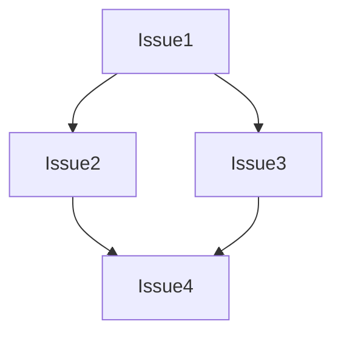
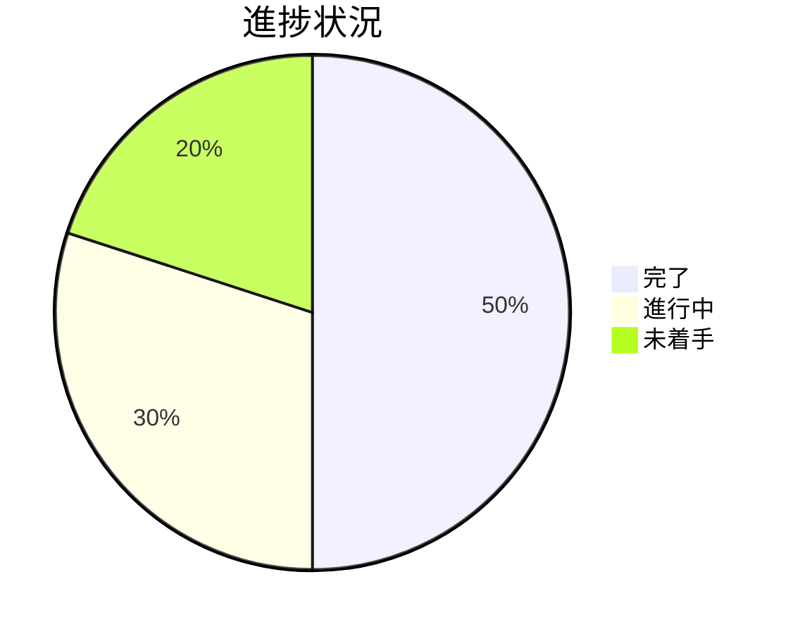

# Issue 一覧: {プロジェクト名}

**プロジェクト名**: {プロジェクト名}  
**作成日**: {YYYY 年 MM 月 DD 日}  
**最終更新**: {YYYY 年 MM 月 DD 日}

> **重要**: **このドキュメントは常に更新**: issue（またはタスク）の進捗状況、ステータス、優先度などの変更があった場合は、即座にこのドキュメントを更新してください。ドキュメントは「生きているドキュメント」として扱い、実装内容と常に同期させます。
>
> **注意**: このテンプレートでは「プロジェクト名」という用語を使用していますが、実際には「issue/タスク名」でも問題ありません。プロジェクトの規模や管理方法に応じて、適切な用語を使用してください。プロジェクトという概念を使わず、issue/タスクのみで管理する場合は、「プロジェクト名」を「issue/タスク名」に置き換えて使用してください。

---

## Issue とタスクについて

**重要**: このドキュメントでは「issue」という用語を使用していますが、**issue とタスクは必要に応じて置き換え可能**です。

- **issue**: プロジェクトを分割する際の大きな単位。複数のタスクを含むことがある。
- **タスク**: 実装計画書（`03_実装計画.md`）で定義される個別の作業単位。
- **使い分け**: プロジェクトの規模や管理方法に応じて、適切な粒度で使い分けること。小さなプロジェクトでは「タスク」、大きなプロジェクトでは「issue」として管理することが多い。

必要に応じて、このドキュメント内の「issue」を「タスク」に置き換えて使用しても構いません。

---

## Issue 一覧

| Issue 名 | 概要   | 優先度     | ステータス           | リンク                                      |
| -------- | ------ | ---------- | -------------------- | ------------------------------------------- |
| {issue1} | {概要} | {高/中/低} | {未着手/進行中/完了} | [詳細](./90_issues/{issue1}/00_要求定義.md) |
| {issue2} | {概要} | {高/中/低} | {未着手/進行中/完了} | [詳細](./90_issues/{issue2}/00_要求定義.md) |

---

## Issue 詳細

### Issue1: {issue 名}

- **概要**: {概要}
- **優先度**: {高/中/低}
- **ステータス**: {未着手/進行中/完了}
- **担当者**: {担当者名}
- **見積もり**: {時間}
- **詳細**: [要求定義](./90_issues/{issue1}/00_要求定義.md)

### Issue2: {issue 名}

{同様の形式}

**Issue（またはタスク）間の依存関係**（必要に応じて）:

---

## 進捗状況

### 全体進捗

- **完了**: {完了数} / {総数}
- **進行中**: {進行中数}
- **未着手**: {未着手数}

**進捗状況の可視化**（必要に応じて）:

**注意**: 上記の数値は例です。実際の進捗状況に合わせて数値を更新してください。

### 優先度別進捗

- **高優先度**: {完了数} / {総数}
- **中優先度**: {完了数} / {総数}
- **低優先度**: {完了数} / {総数}

---

## 参考資料

### プロジェクトドキュメント

このプロジェクトの全体ドキュメント：

- [`00_要求定義.md`](./00_要求定義.md) - 要求定義
- [`01_要件定義.md`](./01_要件定義.md) - 要件定義
- [`02_設計.md`](./02_設計.md) - 設計
- [`03_実装計画.md`](./03_実装計画.md) - 実装計画

### その他の参考資料

- {その他の参考資料}
