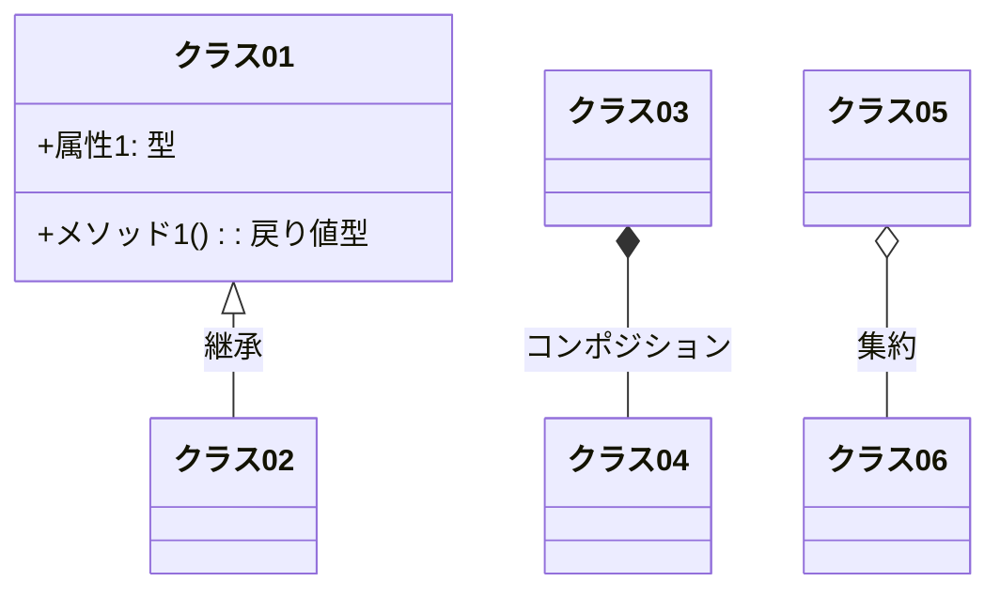
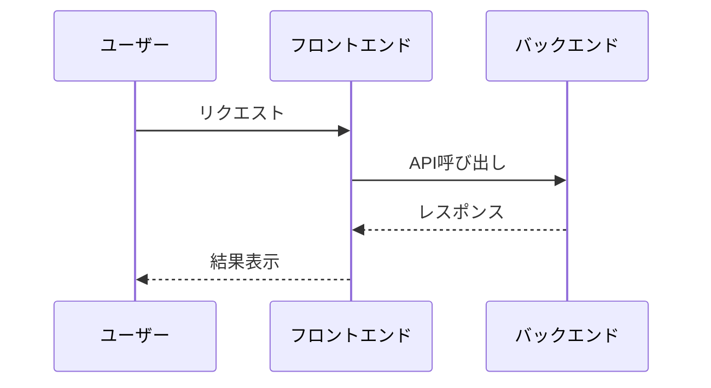
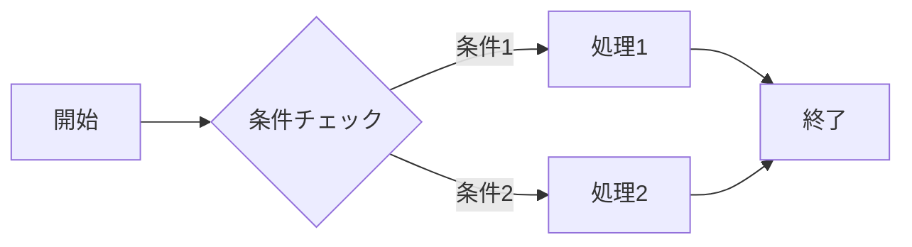
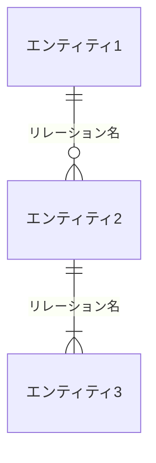

{追加,更新,削除,その他}: {PR タイトル}

# PR メッセージ: {プロジェクト名}

**プロジェクト名**: {プロジェクト名}  
**作成日**: {YYYY 年 MM 月 DD 日}  
**最終更新**: {YYYY 年 MM 月 DD 日}

> **重要**:
>
> - このテンプレートは、issue/タスク完了後に PR メッセージを作成する際に使用します。
> - **git diff で出た変更と添付ファイルがあれば添付ファイルを参考に PR でまとめる**
> - **図(mermaid)を必ず作成すること**
> - **メタ認知プロンプトは必ず生成すること**
> - **レビュワーはエンジニアではない可能性があり、エンジニアではない場合は、コードを読むのではなく直接ブラウザを操作してテストします。そのため、テスト内容に気をつけてください。**
> - **参考資料は、適切にリンクを貼ってください。**
>
> **注意**: このテンプレートでは「プロジェクト名」という用語を使用していますが、実際には「issue/タスク名」でも問題ありません。プロジェクトの規模や管理方法に応じて、適切な用語を使用してください。プロジェクトという概念を使わず、issue/タスクのみで管理する場合は、「プロジェクト名」を「issue/タスク名」に置き換えて使用してください。

---

# {PR タイトル}

## 概要

> この PR の目的と実装内容を簡潔に説明してください。  
> 関連するマイルストーンや課題へのリンクを含めてください。

{この PR の目的と実装内容を簡潔に説明}

---

## 要件と制約

### 機能要件

> チェックリスト形式で実装する機能の要件を記載してください。

- [ ] {機能要件 1}
- [ ] {機能要件 2}
- [ ] {機能要件 3}

### 非機能要件

> チェックリスト形式で下記を記載してください。

- [ ] **パフォーマンス**: {具体的な指標や目標があれば記載してください。}
- [ ] **セキュリティ**: {具体的な指標や目標があれば記載してください。}
- [ ] **ユーザビリティ**: {具体的な指標や目標があれば記載してください。}
- [ ] **アクセシビリティ**: {具体的な指標や目標があれば記載してください。}

### 制約条件

> その他の制約条件があれば記載してください。

- {制約条件 1}
- {制約条件 2}

---

## 定義

### 画面

> 画面名を記載してください。  
> 実装した画面の概要を記載してください。  
> 画面の URL: URL があれば記載してください。  
> 主要な機能をリスト形式で記載してください。

- **画面名**: {画面名}
- **概要**: {画面の概要}
- **URL**: {画面の URL}
- **主要な機能**:
  - {機能 1}
  - {機能 2}

### コンポーネント

> コンポーネント名を記載してください。  
> コンポーネントの概要を記載してください。  
> プロパティ: プロパティがあれば記載してください。

- **コンポーネント名**: {コンポーネント名}
- **概要**: {コンポーネントの概要}
- **プロパティ**: {プロパティの説明}

### API

> API 名を記載してください。  
> API の概要を記載してください。  
> API の URL: URL があれば記載してください。  
> プロパティ: プロパティがあれば記載してください。

- **API 名**: {API 名}
- **概要**: {API の概要}
- **URL**: {API の URL}
- **プロパティ**: {プロパティの説明}

### 機能

> 機能名を記載してください。  
> 機能の概要を記載してください。  
> 機能の URL: URL があれば記載してください。  
> プロパティ: プロパティがあれば記載してください。

- **機能名**: {機能名}
- **概要**: {機能の概要}
- **URL**: {機能の URL}
- **プロパティ**: {プロパティの説明}

---

## 実装内容

> 実装した機能や変更内容を記載してください。

{実装した機能や変更内容の説明}

### 変更ファイル

> 変更したファイル一覧を記載してください。  
> **重要**: git diff で出た変更と添付ファイルがあれば添付ファイルを参考に PR でまとめる

- `{ファイルパス1}`
- `{ファイルパス2}`

### アーキテクチャ図

> 実装内容を理解しやすくするため、アーキテクチャ図を記載してください。  
> **重要**: 図(mermaid)を必ず作成すること。関連する図は、日本語で記載してください。

#### クラス図（該当する場合）

#### シーケンス図（該当する場合）

#### ワークフロー図（該当する場合）

#### ER 図（該当する場合）

> **注意**: ER 図はリレーションのみ記載し、テーブル設計は table 形式で記載すること。

---

## テスト

### TDD

#### ユニットテスト (単体テスト)

> ユニットテスト概要をチェックリスト形式で記載してください。  
> **注意**: チェックは入れないでください。

- [ ] {テストケース 1}
- [ ] {テストケース 2}
- [ ] {テストケース 3}

### BDD

#### シナリオテスト (結合テスト)

> シナリオテスト概要をチェックリスト形式で記載してください。  
> **重要**: レビュワーはエンジニアではない可能性があり、エンジニアではない場合は、コードを読むのではなく直接ブラウザを操作してテストします。そのため、テスト内容に気をつけてください。  
> **注意**: チェックは入れないでください。

- [ ] **シナリオ 1**: {シナリオ名}
  - [ ] {ステップ 1}: {ブラウザでの操作手順}
  - [ ] {ステップ 2}: {期待される結果}
- [ ] **シナリオ 2**: {シナリオ名}
  - [ ] {ステップ 1}: {ブラウザでの操作手順}
  - [ ] {ステップ 2}: {期待される結果}

---

## テスト結果

> テストの実行結果の概要を記載してください。  
> カバレッジレポートへのリンクがあれば、添付してください。

{テストの実行結果の概要}

---

## スクリーンショット・動画

> UI の変更を含む場合は、スクリーンショットや動画を添付してください。

{スクリーンショットや動画の説明}

---

## レビュー事項

> レビュー者に対して確認して欲しい項目をチェックリスト形式で記載してください。  
> **注意**: チェックは入れないでください。レビュー者が確認するための項目です。

- [ ] **要件の充足**: 実装内容が要件を満たしているか
- [ ] **コーディング規約の遵守**: コーディング規約に沿っているか
- [ ] **テストの適切性**: テストが適切に書かれているか
- [ ] **パフォーマンス**: パフォーマンスに問題がないか
- [ ] **セキュリティ**: セキュリティ上の問題がないか
- [ ] **ユーザビリティ**: ユーザビリティに問題がないか
- [ ] **アクセシビリティ**: アクセシビリティに配慮されているか
- [ ] **ドキュメントの整合性**: 実装とドキュメントが整合しているか

---

## 留意事項

> マージ前に確認すべき事項や、デプロイ時の留意点などがあれば記載してください。

{マージ前に確認すべき事項や、デプロイ時の留意点}

---

## 参考資料

> 実装にあたって参考にした資料やリンクがあれば記載してください。  
> **重要**: 参考資料は、適切にリンクを貼ってください。

- {参考資料 1}
- {参考資料 2}
