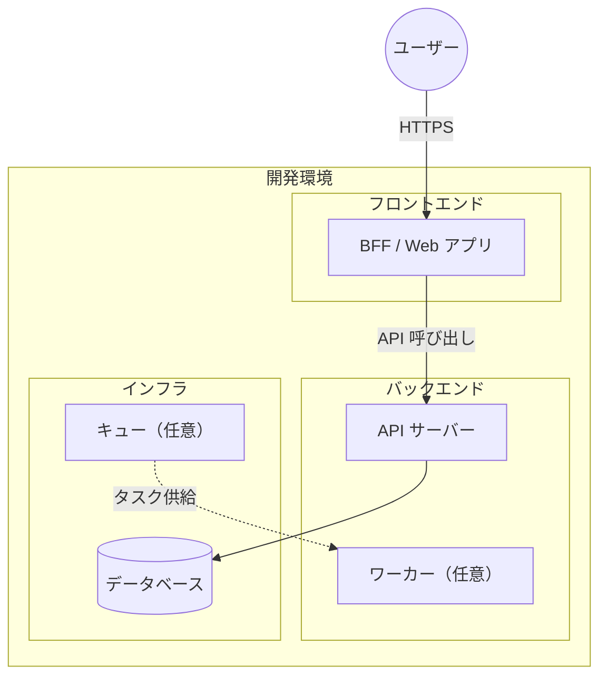

# 3. アーキテクチャ

## 3.1. システム構成図

本システムの開発環境における全体構成の例を以下に示す。プロジェクトに合わせてノード名・サブグラフを修正すること。

### 構成要素の説明

| 要素             | 説明                                                    |
| ---------------- | ------------------------------------------------------- |
| BFF / Web アプリ | （フロントエンドの役割。プロジェクトに合わせて記載）    |
| API サーバー     | （バックエンド API の役割。プロジェクトに合わせて記載） |
| ワーカー         | （非同期ジョブがある場合の役割。不要なら削除）          |
| データベース     | （使用する DB の種類と役割）                            |
| キュー           | （Celery / SQS 等を使う場合。不要なら削除）             |

---

## 3.2. 技術スタック

本システムで使用する技術スタックの記載例。プロジェクトに合わせて行の追加・削除を行う。

### フロントエンド

| 技術            | バージョン   | 用途                |
| --------------- | ------------ | ------------------- |
| （例: Next.js） | （例: 16.x） | フレームワーク・BFF |
| （例: React）   | （例: 19.x） | UI ライブラリ       |
| TypeScript      | 5.x          | 型安全性            |

### バックエンド

| 技術                      | バージョン           | 用途     |
| ------------------------- | -------------------- | -------- |
| （例: Python / Node.js）  | （例: 3.13 / 20.x）  | 実行環境 |
| （例: FastAPI / Express） | （例: 0.129+ / 4.x） | Web API  |
| （その他）                | -                    | （用途） |

### データベース・インフラ

| 技術               | バージョン | 用途              |
| ------------------ | ---------- | ----------------- |
| （例: PostgreSQL） | （例: 18） | リレーショナル DB |
| Docker             | -          | コンテナ化        |

---

## 3.3. BFF と API の連携（外部連携）

- （BFF から API への接続方法・認証方式を記載。例: 環境変数で API URL を指定、API キーや Cookie の扱い）
- （認証免除パス・必須パスの方針がある場合は記載）
- （プロジェクトに合わせて記載。該当しない場合は「該当なし」または削除）

---

## 3.4. セキュリティ

- （セキュリティヘッダー、認証・認可、API キー検証などの方針を記載）
- （プロジェクトに合わせて記載）

---

## 参考資料

- [01 プロジェクト概要](../01_プロジェクト概要/README.md)
- [04 ディレクトリ構成](../04_ディレクトリ構成/README.md)
- [02 画面設計](../../02_画面設計/README.md)
- [03 データ設計](../../03_データ設計/README.md)
- [04 機能設計](../../04_機能設計/README.md)

---

**最終更新**: YYYY 年 MM 月 DD 日
