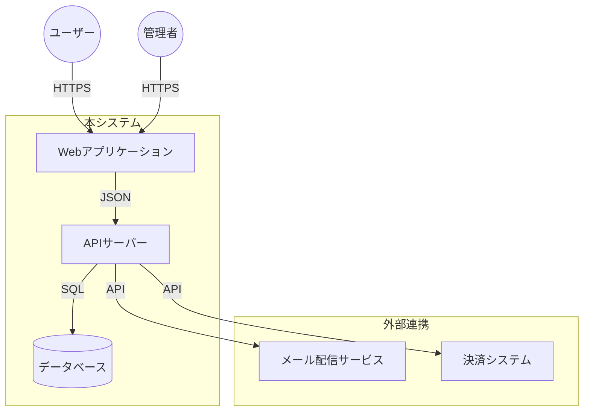
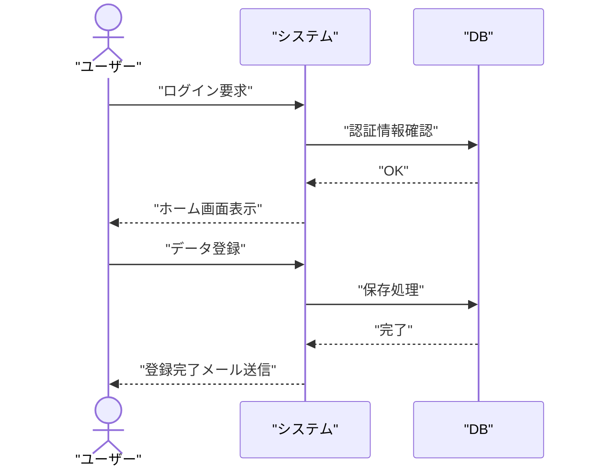

---
このドキュメントは、システムの全体像、構成、業務フローを定義します。  
システム仕様書作成ルールは [`AGENTS_DOCS_RULES.md`](../../../AGENTS_DOCS_RULES.md) を参照してください。  
Mermaid 図作成時は [`AGENTS_MERMAID_RULES.md`](../../../AGENTS_MERMAID_RULES.md) を必ず参照してください。

---

# 1. システム概要

## 1.1. システム構成図

本システムの全体構成と、外部システムとの連携関係を以下に示す。

### 構成要素の説明

| 要素                | 説明                                             |
| ------------------- | ------------------------------------------------ |
| Webアプリケーション | ユーザーが操作するフロントエンドアプリケーション |
| APIサーバー         | ビジネスロジックを処理するバックエンドAPI        |
| データベース        | データを永続化するデータベース                   |
| メール配信サービス  | メール送信を行う外部サービス                     |
| 決済システム        | 決済処理を行う外部サービス                       |

---

## 1.2. 業務フロー概要

ユーザーがシステムを利用する際の主な流れ。

### フロー説明

1. **ログイン**: ユーザーが認証情報を入力し、システムが認証を行う
2. **ホーム画面表示**: 認証成功後、ホーム画面を表示する
3. **データ登録**: ユーザーがデータを入力し、システムが保存処理を行う
4. **メール送信**: 登録完了後、確認メールを送信する

---

## 1.3. 技術スタック

本システムで使用する技術スタックを以下に示す。

### フロントエンド

| 技術       | バージョン | 用途              |
| ---------- | ---------- | ----------------- |
| React      | 18.x       | UI フレームワーク |
| TypeScript | 5.x        | 型安全性の確保    |
| Next.js    | 14.x       | フレームワーク    |

### バックエンド

| 技術       | バージョン | 用途               |
| ---------- | ---------- | ------------------ |
| Node.js    | 20.x       | 実行環境           |
| Express    | 4.x        | Web フレームワーク |
| TypeScript | 5.x        | 型安全性の確保     |

### データベース

| 技術       | バージョン | 用途                       |
| ---------- | ---------- | -------------------------- |
| PostgreSQL | 15.x       | リレーショナルデータベース |

### インフラ

| 技術   | バージョン | 用途             |
| ------ | ---------- | ---------------- |
| Docker | 24.x       | コンテナ化       |
| AWS    | -          | クラウドインフラ |

---

## 1.4. 外部システム連携

本システムが連携する外部システムを以下に示す。

### メール配信サービス

| 項目       | 内容       |
| ---------- | ---------- |
| サービス名 | SendGrid   |
| 連携方式   | REST API   |
| 用途       | メール送信 |

### 決済システム

| 項目       | 内容     |
| ---------- | -------- |
| サービス名 | Stripe   |
| 連携方式   | REST API |
| 用途       | 決済処理 |

---

## 1.5. セキュリティ要件

本システムのセキュリティ要件を以下に示す。

### 認証・認可

- ユーザー認証は JWT トークンを使用
- ロールベースのアクセス制御（RBAC）を実装
- セッション管理は HTTPOnly Cookie を使用

### データ保護

- 通信は HTTPS を使用
- 機密情報は暗号化して保存
- パスワードはハッシュ化して保存

### セキュリティ対策

- SQL インジェクション対策
- XSS（クロスサイトスクリプティング）対策
- CSRF（クロスサイトリクエストフォージェリ）対策

---

## 参考資料

### プロジェクトドキュメント

- [02 画面設計](../02_画面設計/README.md) - 画面設計の詳細
- [03 データ設計](../03_データ設計/README.md) - データ設計の詳細
- [04 機能設計](../04_機能設計/README.md) - 機能設計の詳細

---

**最終更新**: YYYY 年 MM 月 DD 日
