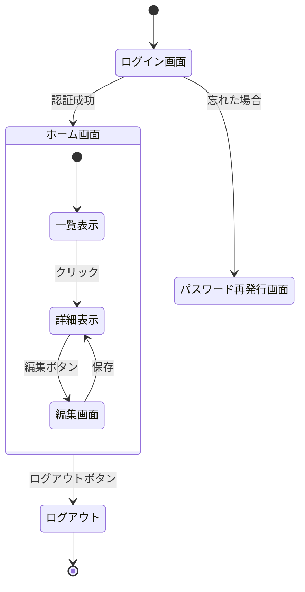

---
このドキュメントは、画面の動きと、各画面の項目を定義します。  
システム仕様書作成ルールは [`AGENTS_DOCS_RULES.md`](../../../AGENTS_DOCS_RULES.md) を参照してください。  
Mermaid 図作成時は [`AGENTS_MERMAID_RULES.md`](../../../AGENTS_MERMAID_RULES.md) を必ず参照してください。

---

# 2. 画面設計

## 2.1. 画面遷移図

画面間の移動経路を定義する。

### 遷移ルール

| 遷移元       | 遷移先               | 条件                                       |
| ------------ | -------------------- | ------------------------------------------ |
| ログイン画面 | ホーム画面           | 認証成功時                                 |
| ログイン画面 | パスワード再発行画面 | 「パスワードを忘れた場合」リンククリック時 |
| 一覧表示     | 詳細表示             | リスト項目クリック時                       |
| 詳細表示     | 編集画面             | 「編集」ボタンクリック時                   |
| 編集画面     | 詳細表示             | 「保存」ボタンクリック時                   |
| ホーム画面   | ログアウト           | 「ログアウト」ボタンクリック時             |

---

## 2.2. 画面詳細定義

### G001: ログイン画面

ユーザーがシステムにログインするための画面。

**画面ID**: `G001`  
**画面名**: ログイン画面  
**URL**: `/login`

#### 入力項目仕様

| 項目名         | 物理名     | 型       | 必須 | 制約・備考                      |
| -------------- | ---------- | -------- | ---- | ------------------------------- |
| メールアドレス | `email`    | Email    | 〇   | 最大255文字、メールアドレス形式 |
| パスワード     | `password` | Password | 〇   | 最小8文字、最大128文字          |

#### イベント仕様

| イベント                       | 動作                                                                                                             |
| ------------------------------ | ---------------------------------------------------------------------------------------------------------------- |
| ログインボタンクリック         | 入力チェックを行い、エラーがなければ認証処理を実行。認証成功時はホーム画面に遷移、失敗時はエラーメッセージを表示 |
| パスワード再発行リンククリック | パスワード再発行画面に遷移                                                                                       |

#### バリデーション

| 項目           | ルール             | エラーメッセージ                            |
| -------------- | ------------------ | ------------------------------------------- |
| メールアドレス | 必須               | 「メールアドレスを入力してください」        |
| メールアドレス | メールアドレス形式 | 「有効なメールアドレスを入力してください」  |
| パスワード     | 必須               | 「パスワードを入力してください」            |
| パスワード     | 最小8文字          | 「パスワードは8文字以上で入力してください」 |

---

### G002: ホーム画面

ユーザーがログイン後に表示されるメイン画面。

**画面ID**: `G002`  
**画面名**: ホーム画面  
**URL**: `/`

#### 画面構成

- **ヘッダー**: ログアウトボタン、ユーザー名表示
- **メインコンテンツ**: 一覧表示エリア
- **フッター**: コピーライト表示

#### イベント仕様

| イベント                 | 動作                                       |
| ------------------------ | ------------------------------------------ |
| ログアウトボタンクリック | ログアウト処理を実行し、ログイン画面に遷移 |
| リスト項目クリック       | 詳細表示画面に遷移                         |

---

### G003: 会員登録画面

ユーザーが新規会員登録を行う画面。

**画面ID**: `G003`  
**画面名**: 会員登録画面  
**URL**: `/register`

#### 入力項目仕様

| 項目名             | 物理名             | 型       | 必須 | 制約・備考                           |
| ------------------ | ------------------ | -------- | ---- | ------------------------------------ |
| 氏名               | `user_name`        | Text     | 〇   | 全角20文字以内                       |
| メールアドレス     | `email`            | Email    | 〇   | 重複不可、最大255文字                |
| パスワード         | `password`         | Password | 〇   | 半角英数8文字以上、最大128文字       |
| パスワード（確認） | `password_confirm` | Password | 〇   | パスワードと一致すること             |
| 性別               | `gender`           | Radio    | -    | 1:男性, 2:女性, 9:その他（初期値:1） |

#### イベント仕様

| イベント                 | 動作                                                                             |
| ------------------------ | -------------------------------------------------------------------------------- |
| 登録ボタンクリック       | 入力チェックを行い、エラーがなければ確認ダイアログを表示。確認後、登録処理を実行 |
| キャンセルボタンクリック | ログイン画面に遷移                                                               |

#### バリデーション

| 項目               | ルール             | エラーメッセージ                             |
| ------------------ | ------------------ | -------------------------------------------- |
| 氏名               | 必須               | 「氏名を入力してください」                   |
| 氏名               | 最大20文字         | 「氏名は20文字以内で入力してください」       |
| メールアドレス     | 必須               | 「メールアドレスを入力してください」         |
| メールアドレス     | メールアドレス形式 | 「有効なメールアドレスを入力してください」   |
| メールアドレス     | 重複チェック       | 「このメールアドレスは既に登録されています」 |
| パスワード         | 必須               | 「パスワードを入力してください」             |
| パスワード         | 最小8文字          | 「パスワードは8文字以上で入力してください」  |
| パスワード（確認） | 必須               | 「パスワード（確認）を入力してください」     |
| パスワード（確認） | パスワードと一致   | 「パスワードが一致しません」                 |

---

## 2.3. UI コンポーネント仕様

### 共通コンポーネント

#### ボタン

| 種類             | 用途                 | スタイル             |
| ---------------- | -------------------- | -------------------- |
| プライマリボタン | 主要な操作           | 青色背景、白文字     |
| セカンダリボタン | 補助的な操作         | 白背景、青文字、青枠 |
| 危険ボタン       | 削除などの危険な操作 | 赤色背景、白文字     |

#### 入力フィールド

| 種類           | 用途               | スタイル                             |
| -------------- | ------------------ | ------------------------------------ |
| テキスト入力   | 文字列入力         | 白背景、グレー枠                     |
| パスワード入力 | パスワード入力     | 白背景、グレー枠、入力内容を非表示   |
| メール入力     | メールアドレス入力 | 白背景、グレー枠、メール形式チェック |

#### エラーメッセージ

| 種類             | 用途                   | スタイル                           |
| ---------------- | ---------------------- | ---------------------------------- |
| フィールドエラー | 入力フィールドのエラー | 赤文字、フィールド下に表示         |
| フォームエラー   | フォーム全体のエラー   | 赤背景、白文字、フォーム上部に表示 |

---

## 参考資料

### プロジェクトドキュメント

- [01 システム概要](../01_システム概要/README.md) - システム概要の詳細
- [03 データ設計](../03_データ設計/README.md) - データ設計の詳細
- [04 機能設計](../04_機能設計/README.md) - 機能設計の詳細

---

**最終更新**: YYYY 年 MM 月 DD 日
