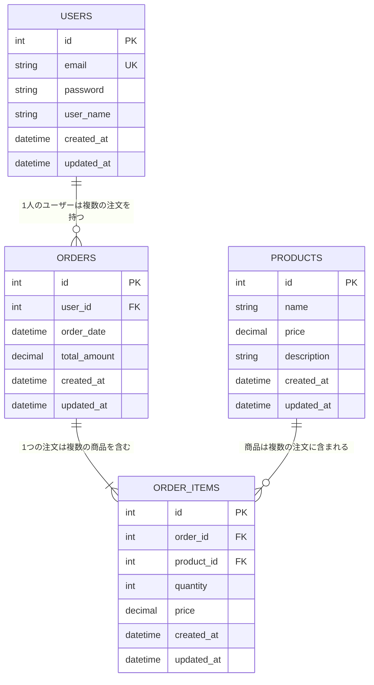

---

このドキュメントは、ER図とテーブル定義を定義します。  
システム仕様書作成ルールは [`AGENTS_DOCS_RULES.md`](../../../AGENTS_DOCS_RULES.md) を参照してください。  
Mermaid 図作成時は [`AGENTS_MERMAID_RULES.md`](../../../AGENTS_MERMAID_RULES.md) を必ず参照してください。

---

# 3. データ設計

## 3.1. ER図 (Entity Relationship Diagram)

各テーブルのリレーションシップを以下に示す。

### リレーションシップの説明

| リレーション           | 説明                                     |
| ---------------------- | ---------------------------------------- |
| USERS → ORDERS         | 1人のユーザーは複数の注文を持つ（1対多） |
| ORDERS → ORDER_ITEMS   | 1つの注文は複数の商品を含む（1対多）     |
| PRODUCTS → ORDER_ITEMS | 商品は複数の注文に含まれる（1対多）      |

---

## 3.2. テーブル定義書

### T01: USERS (ユーザーマスタ)

システムを利用するユーザー情報を管理する。

| No  | 論理名         | 物理名       | 型           | NULL | Key | デフォルト        | 備考                                            |
| --- | -------------- | ------------ | ------------ | ---- | --- | ----------------- | ----------------------------------------------- |
| 1   | ID             | `id`         | INT          | NG   | PK  | AUTO_INC          | 自動採番                                        |
| 2   | メールアドレス | `email`      | VARCHAR(255) | NG   | UK  | -                 | ログインIDとして使用、重複不可                  |
| 3   | パスワード     | `password`   | VARCHAR(255) | NG   | -   | -                 | ハッシュ化して保存                              |
| 4   | 氏名           | `user_name`  | VARCHAR(100) | NG   | -   | -                 | 全角20文字以内                                  |
| 5   | 性別           | `gender`     | TINYINT      | OK   | -   | 1                 | 1:男性, 2:女性, 9:その他                        |
| 6   | 作成日時       | `created_at` | DATETIME     | NG   | -   | CURRENT_TIMESTAMP | レコード作成日時                                |
| 7   | 更新日時       | `updated_at` | DATETIME     | NG   | -   | CURRENT_TIMESTAMP | レコード更新日時（ON UPDATE CURRENT_TIMESTAMP） |
| 8   | 削除フラグ     | `is_deleted` | TINYINT      | NG   | -   | 0                 | 0:有効, 1:削除済み                              |

#### インデックス

| インデックス名         | カラム       | 種類   | 説明                         |
| ---------------------- | ------------ | ------ | ---------------------------- |
| `idx_users_email`      | `email`      | UNIQUE | メールアドレスの一意性を保証 |
| `idx_users_is_deleted` | `is_deleted` | INDEX  | 削除フラグでの検索を高速化   |

#### 制約

| 制約名             | 種類        | 内容                  |
| ------------------ | ----------- | --------------------- |
| `pk_users`         | PRIMARY KEY | `id`                  |
| `uk_users_email`   | UNIQUE      | `email`               |
| `chk_users_gender` | CHECK       | `gender` IN (1, 2, 9) |

---

### T02: ORDERS (注文マスタ)

ユーザーの注文情報を管理する。

| No  | 論理名     | 物理名         | 型            | NULL | Key | デフォルト        | 備考                                                 |
| --- | ---------- | -------------- | ------------- | ---- | --- | ----------------- | ---------------------------------------------------- |
| 1   | ID         | `id`           | INT           | NG   | PK  | AUTO_INC          | 自動採番                                             |
| 2   | ユーザーID | `user_id`      | INT           | NG   | FK  | -                 | USERS.id への外部キー                                |
| 3   | 注文日時   | `order_date`   | DATETIME      | NG   | -   | CURRENT_TIMESTAMP | 注文日時                                             |
| 4   | 合計金額   | `total_amount` | DECIMAL(10,2) | NG   | -   | 0.00              | 注文の合計金額                                       |
| 5   | ステータス | `status`       | VARCHAR(20)   | NG   | -   | 'pending'         | pending:保留中, confirmed:確定, cancelled:キャンセル |
| 6   | 作成日時   | `created_at`   | DATETIME      | NG   | -   | CURRENT_TIMESTAMP | レコード作成日時                                     |
| 7   | 更新日時   | `updated_at`   | DATETIME      | NG   | -   | CURRENT_TIMESTAMP | レコード更新日時（ON UPDATE CURRENT_TIMESTAMP）      |
| 8   | 削除フラグ | `is_deleted`   | TINYINT       | NG   | -   | 0                 | 0:有効, 1:削除済み                                   |

#### インデックス

| インデックス名          | カラム       | 種類  | 説明                       |
| ----------------------- | ------------ | ----- | -------------------------- |
| `idx_orders_user_id`    | `user_id`    | INDEX | ユーザーIDでの検索を高速化 |
| `idx_orders_order_date` | `order_date` | INDEX | 注文日時での検索を高速化   |
| `idx_orders_status`     | `status`     | INDEX | ステータスでの検索を高速化 |
| `idx_orders_is_deleted` | `is_deleted` | INDEX | 削除フラグでの検索を高速化 |

#### 制約

| 制約名              | 種類        | 内容                                              |
| ------------------- | ----------- | ------------------------------------------------- |
| `pk_orders`         | PRIMARY KEY | `id`                                              |
| `fk_orders_user_id` | FOREIGN KEY | `user_id` REFERENCES `USERS`(`id`)                |
| `chk_orders_status` | CHECK       | `status` IN ('pending', 'confirmed', 'cancelled') |

---

### T03: ORDER_ITEMS (注文明細)

注文に含まれる商品情報を管理する。

| No  | 論理名   | 物理名       | 型            | NULL | Key | デフォルト        | 備考                                            |
| --- | -------- | ------------ | ------------- | ---- | --- | ----------------- | ----------------------------------------------- |
| 1   | ID       | `id`         | INT           | NG   | PK  | AUTO_INC          | 自動採番                                        |
| 2   | 注文ID   | `order_id`   | INT           | NG   | FK  | -                 | ORDERS.id への外部キー                          |
| 3   | 商品ID   | `product_id` | INT           | NG   | FK  | -                 | PRODUCTS.id への外部キー                        |
| 4   | 数量     | `quantity`   | INT           | NG   | -   | 1                 | 注文数量（1以上）                               |
| 5   | 単価     | `price`      | DECIMAL(10,2) | NG   | -   | -                 | 注文時の商品単価                                |
| 6   | 作成日時 | `created_at` | DATETIME      | NG   | -   | CURRENT_TIMESTAMP | レコード作成日時                                |
| 7   | 更新日時 | `updated_at` | DATETIME      | NG   | -   | CURRENT_TIMESTAMP | レコード更新日時（ON UPDATE CURRENT_TIMESTAMP） |

#### インデックス

| インデックス名               | カラム       | 種類  | 説明                   |
| ---------------------------- | ------------ | ----- | ---------------------- |
| `idx_order_items_order_id`   | `order_id`   | INDEX | 注文IDでの検索を高速化 |
| `idx_order_items_product_id` | `product_id` | INDEX | 商品IDでの検索を高速化 |

#### 制約

| 制約名                      | 種類        | 内容                                     |
| --------------------------- | ----------- | ---------------------------------------- |
| `pk_order_items`            | PRIMARY KEY | `id`                                     |
| `fk_order_items_order_id`   | FOREIGN KEY | `order_id` REFERENCES `ORDERS`(`id`)     |
| `fk_order_items_product_id` | FOREIGN KEY | `product_id` REFERENCES `PRODUCTS`(`id`) |
| `chk_order_items_quantity`  | CHECK       | `quantity` >= 1                          |

---

### T04: PRODUCTS (商品マスタ)

商品情報を管理する。

| No  | 論理名     | 物理名        | 型            | NULL | Key | デフォルト        | 備考                                            |
| --- | ---------- | ------------- | ------------- | ---- | --- | ----------------- | ----------------------------------------------- |
| 1   | ID         | `id`          | INT           | NG   | PK  | AUTO_INC          | 自動採番                                        |
| 2   | 商品名     | `name`        | VARCHAR(255)  | NG   | -   | -                 | 商品名                                          |
| 3   | 価格       | `price`       | DECIMAL(10,2) | NG   | -   | -                 | 商品価格（0以上）                               |
| 4   | 説明       | `description` | TEXT          | OK   | -   | -                 | 商品説明                                        |
| 5   | 在庫数     | `stock`       | INT           | NG   | -   | 0                 | 在庫数（0以上）                                 |
| 6   | 作成日時   | `created_at`  | DATETIME      | NG   | -   | CURRENT_TIMESTAMP | レコード作成日時                                |
| 7   | 更新日時   | `updated_at`  | DATETIME      | NG   | -   | CURRENT_TIMESTAMP | レコード更新日時（ON UPDATE CURRENT_TIMESTAMP） |
| 8   | 削除フラグ | `is_deleted`  | TINYINT       | NG   | -   | 0                 | 0:有効, 1:削除済み                              |

#### インデックス

| インデックス名            | カラム       | 種類  | 説明                       |
| ------------------------- | ------------ | ----- | -------------------------- |
| `idx_products_name`       | `name`       | INDEX | 商品名での検索を高速化     |
| `idx_products_is_deleted` | `is_deleted` | INDEX | 削除フラグでの検索を高速化 |

#### 制約

| 制約名               | 種類        | 内容         |
| -------------------- | ----------- | ------------ |
| `pk_products`        | PRIMARY KEY | `id`         |
| `chk_products_price` | CHECK       | `price` >= 0 |
| `chk_products_stock` | CHECK       | `stock` >= 0 |

---

## 3.3. データ型の定義

### 数値型

| 型            | 説明                                      | 使用例             |
| ------------- | ----------------------------------------- | ------------------ |
| INT           | 整数型（-2,147,483,648 ～ 2,147,483,647） | ID、数量           |
| TINYINT       | 小さな整数型（-128 ～ 127）               | フラグ、ステータス |
| DECIMAL(10,2) | 固定小数点型（10桁、小数点以下2桁）       | 金額               |

### 文字列型

| 型         | 説明                      | 使用例               |
| ---------- | ------------------------- | -------------------- |
| VARCHAR(n) | 可変長文字列（最大n文字） | 名前、メールアドレス |
| TEXT       | 長い文字列                | 説明文               |

### 日時型

| 型       | 説明   | 使用例             |
| -------- | ------ | ------------------ |
| DATETIME | 日時型 | 作成日時、更新日時 |

---

## 参考資料

### プロジェクトドキュメント

- [01 システム概要](../01_システム概要/README.md) - システム概要の詳細
- [02 画面設計](../02_画面設計/README.md) - 画面設計の詳細
- [04 機能設計](../04_機能設計/README.md) - 機能設計の詳細

---

**最終更新**: YYYY 年 MM 月 DD 日
