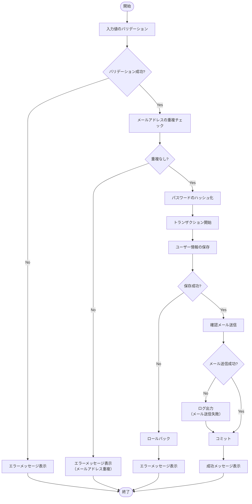
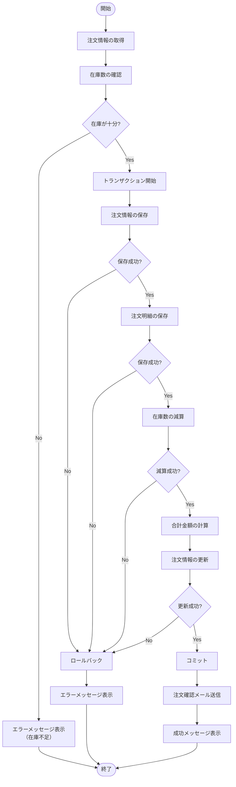
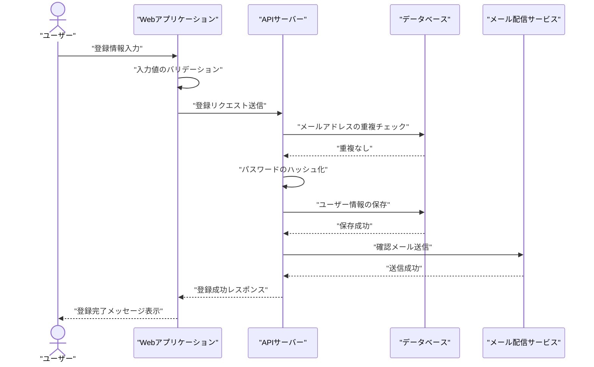
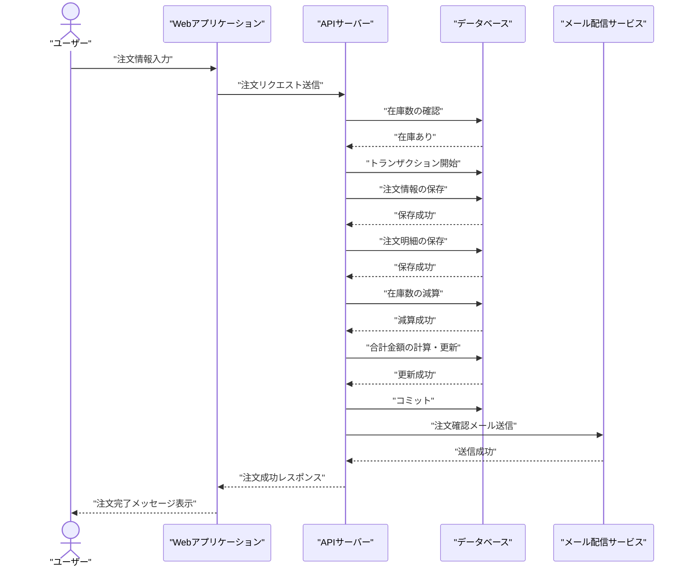
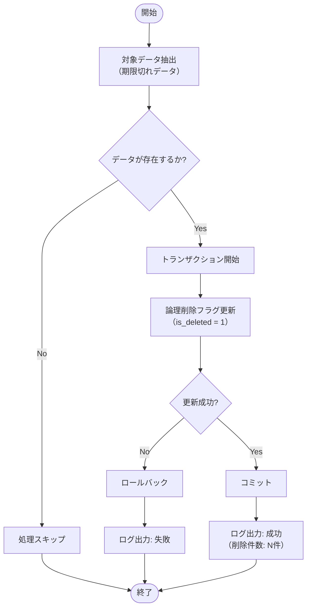

---

このドキュメントは、複雑なロジックやバッチ処理を定義します。  
システム仕様書作成ルールは [`AGENTS_DOCS_RULES.md`](../../../AGENTS_DOCS_RULES.md) を参照してください。  
Mermaid 図作成時は [`AGENTS_MERMAID_RULES.md`](../../../AGENTS_MERMAID_RULES.md) を必ず参照してください。

---

# 4. 機能設計

## 4.1. 機能フロー

### F001: ユーザー登録処理

ユーザーが新規登録を行う際の処理フロー。



### 処理説明

1. **入力値のバリデーション**: 入力された値が仕様に適合しているかチェック
2. **メールアドレスの重複チェック**: 既存のユーザーとメールアドレスが重複していないかチェック
3. **パスワードのハッシュ化**: セキュリティのため、パスワードをハッシュ化
4. **ユーザー情報の保存**: データベースにユーザー情報を保存
5. **確認メール送信**: 登録完了の確認メールを送信

---

### F002: 注文処理

ユーザーが商品を注文する際の処理フロー。



### 処理説明

1. **注文情報の取得**: ユーザーが入力した注文情報を取得
2. **在庫数の確認**: 注文する商品の在庫が十分かチェック
3. **注文情報の保存**: データベースに注文情報を保存
4. **注文明細の保存**: データベースに注文明細を保存
5. **在庫数の減算**: 注文した商品の在庫数を減算
6. **合計金額の計算**: 注文の合計金額を計算
7. **注文確認メール送信**: 注文完了の確認メールを送信

---

## 4.2. シーケンス図

### S001: ユーザー登録シーケンス

ユーザー登録処理のシーケンス図。



---

### S002: 注文処理シーケンス

注文処理のシーケンス図。



---

## 4.3. バッチ処理仕様

### B001: 期限切れデータ削除処理

夜間に実行される「期限切れデータ削除処理」のロジック。



### 処理仕様

| 項目               | 内容                                      |
| ------------------ | ----------------------------------------- |
| 実行タイミング     | 毎日 02:00（JST）                         |
| 対象データ         | 期限切れデータ（`expired_at` < 現在日時） |
| 処理内容           | 論理削除フラグ（`is_deleted`）を 1 に更新 |
| エラーハンドリング | エラー発生時はロールバックし、ログに記録  |

---

## 4.4. API 仕様

### API001: ユーザー登録API

ユーザーを新規登録するAPI。

**エンドポイント**: `POST /api/users/register`

#### リクエスト

**ヘッダー**:
```
Content-Type: application/json
```

**ボディ**:
```json
{
  "user_name": "山田太郎",
  "email": "yamada@example.com",
  "password": "password123",
  "password_confirm": "password123",
  "gender": 1
}
```

#### レスポンス

**成功時（200 OK）**:
```json
{
  "success": true,
  "message": "ユーザー登録が完了しました",
  "data": {
    "user_id": 1
  }
}
```

**エラー時（400 Bad Request）**:
```json
{
  "success": false,
  "message": "バリデーションエラー",
  "errors": [
    {
      "field": "email",
      "message": "このメールアドレスは既に登録されています"
    }
  ]
}
```

---

### API002: 注文作成API

注文を作成するAPI。

**エンドポイント**: `POST /api/orders`

#### リクエスト

**ヘッダー**:
```
Content-Type: application/json
Authorization: Bearer {token}
```

**ボディ**:
```json
{
  "items": [
    {
      "product_id": 1,
      "quantity": 2
    },
    {
      "product_id": 2,
      "quantity": 1
    }
  ]
}
```

#### レスポンス

**成功時（200 OK）**:
```json
{
  "success": true,
  "message": "注文が完了しました",
  "data": {
    "order_id": 1,
    "total_amount": 5000.00
  }
}
```

**エラー時（400 Bad Request）**:
```json
{
  "success": false,
  "message": "在庫が不足しています",
  "errors": [
    {
      "field": "items[0].quantity",
      "message": "在庫数が不足しています"
    }
  ]
}
```

---

## 参考資料

### プロジェクトドキュメント

- [01 システム概要](../01_システム概要/README.md) - システム概要の詳細
- [02 画面設計](../02_画面設計/README.md) - 画面設計の詳細
- [03 データ設計](../03_データ設計/README.md) - データ設計の詳細

---

**最終更新**: YYYY 年 MM 月 DD 日
