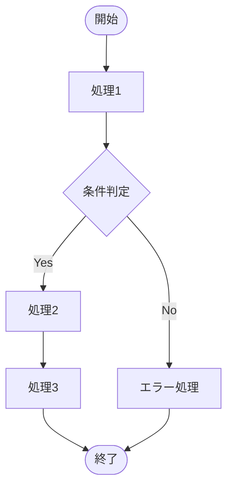
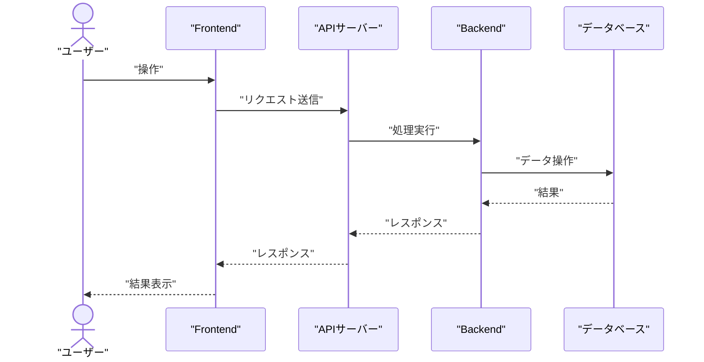

# {機能名}機能

## 機能フロー

### F001: {機能名}処理

{機能名}処理の説明。



### 処理説明 — {機能名}処理

1. **処理1**: 処理1の説明
2. **条件判定**: 条件判定の説明
3. **処理2**: 処理2の説明
4. **処理3**: 処理3の説明

---

## シーケンス図

### S001: {機能名}シーケンス

{機能名}処理のシーケンス図。



---

## API仕様

### API001: {機能名}API

{機能名}APIの説明。

**エンドポイント**: `POST /api/v1/{resource}`

#### リクエスト

**ヘッダー**:

```
Content-Type: application/json
Authorization: Bearer {token}
```

**ボディ**:

```json
{
  "field1": "value1",
  "field2": "value2"
}
```

#### レスポンス

**成功時（200 OK）**:

```json
{
  "success": true,
  "message": "処理が完了しました",
  "data": {
    "id": 1
  }
}
```

**エラー時（400 Bad Request）**:

```json
{
  "success": false,
  "message": "エラーメッセージ",
  "errors": [
    {
      "field": "field1",
      "message": "フィールド固有のエラーメッセージ"
    }
  ]
}
```

---

## 参考資料

### プロジェクトドキュメント

- [他の機能](../{他の機能名}/README.md) - 他の機能の詳細
- [共通機能](../共通機能/README.md) - 共通機能の詳細

---

**最終更新**: YYYY 年 MM 月 DD 日
