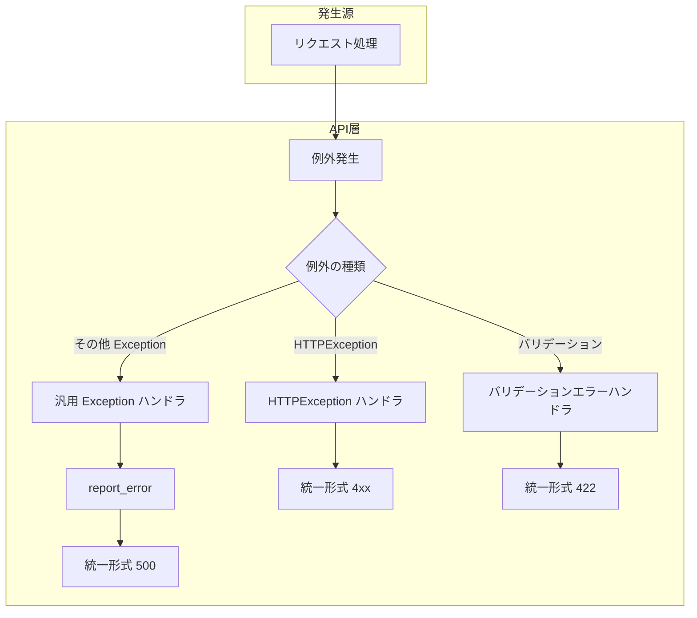
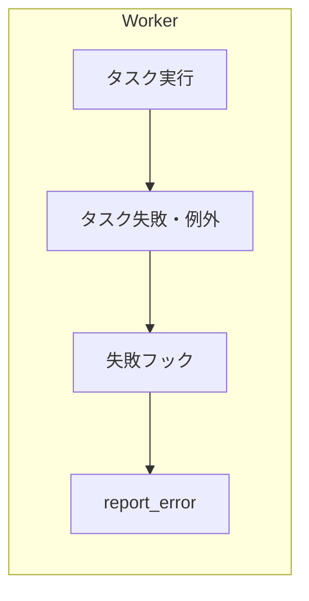

# 5. エラー処理と外部通知

本ドキュメントは、共通エラー処理・報告の一箇所化・二重防止・外部通知（Rollbar / Slack 等）の設計方針を定義する。実装箇所名はプロジェクトに合わせて記載すること。

---

## 5.1. 共通エラー処理の方針

### 原則

- **報告は 1 箇所のみ**: すべてのエラーが共通エラー処理に一度だけ流れ、その共通処理だけがログ出力・外部通知を行う。それ以外の層では report を呼ばない（二重送信の防止）。
- **二重処理の禁止**: 同じ例外について、例外ハンドラとミドルウェアの両方で report しない。報告は共通エラー処理の 1 箇所に限定する。

### HTTP 経路（API サーバー）

- **汎用 `Exception` ハンドラを 1 つだけ登録する**
  - 未処理の例外をすべてここで受け、統一エラー形式で 500 を返す。
  - **このハンドラ内でのみ**「ログ出力・Rollbar / Slack に送る」処理を呼ぶ（他では呼ばない）。
- **既存の `HTTPException` / バリデーションエラーハンドラ**
  - レスポンス形式の統一は維持する。
  - 外部通知を行う場合は、共通 report 関数を 1 回だけ呼ぶようにする（ビジネスエラーは送らない／送るなら共通関数経由でフラグ制御するなど、方針を 1 つにまとめる）。
- **ミドルウェア**
  - 例外の「報告」は行わない。報告は例外ハンドラ側に集約し、二重送信を防ぐ。

### ワーカー経路（非同期ジョブがある場合）

- **ワーカー用の共通エラー処理を 1 箇所に用意する**
  - 例: タスクのベースで `try/except Exception` して report、またはフレームワークのタスク失敗シグナル／`on_failure` で **1 回だけ** report。
  - タスク内で個別に report しない（共通フックだけが report する）。

### HTTP ステータスと error.code の対応（例）

| HTTP ステータス | error.code（例） |
|-----------------|------------------|
| 400 | VALIDATION_ERROR |
| 401 | AUTHENTICATION_ERROR |
| 403 | AUTHORIZATION_ERROR |
| 404 | NOT_FOUND |
| 409 | CONFLICT |
| 422 | UNPROCESSABLE_ENTITY |
| 429 | RATE_LIMIT_EXCEEDED |
| 503 | SERVICE_UNAVAILABLE |
| 500 以上 | INTERNAL_SERVER_ERROR |

プロジェクトに合わせてコード名・マッピングを定義すること。

---

## 5.2. エラー処理の流れ（図）

### HTTP 経路の例

### ワーカー経路の例（ワーカーがある場合）

---

## 5.3. 外部通知（Rollbar / Slack 等）の導入方針

- **共通 report 関数に集約する**
  - ログ出力・Rollbar / Slack 送信は「共通 report 関数」にまとめ、呼び出しはその関数のみとする。
  - 例外ハンドラ／ワーカー用フックの 1 箇所ずつからだけ呼ぶ。
- **実装箇所**
  - 共通 report 関数: （例: `app.core.error_reporting.report_error`。プロジェクトに合わせて記載）
  - HTTP 用: （例: `main.py` の汎用 `Exception` ハンドラ内で 1 回だけ `report_error` を呼ぶ。プロジェクトに合わせて記載）
  - ワーカー用: （例: タスク失敗シグナル／フックで 1 箇所だけ `report_error` を呼ぶ。プロジェクトに合わせて記載）

---

## 5.4. 実装時のチェックリスト

- [ ] API に汎用 `Exception` 用の例外ハンドラを 1 つ追加し、未処理例外をすべてここで受け、統一形式で返す。
- [ ] ログ・外部通知は「共通 report 関数」にまとめ、呼び出しはその関数のみ（例外ハンドラ／ワーカー用フックの 1 箇所ずつから呼ぶ）。
- [ ] ミドルウェアや個別の try/except では report を呼ばない（二重防止）。
- [ ] ワーカーを使う場合、タスク失敗フックで 1 箇所だけ report するようにする。

---

## 参考資料

- [01 システム概要](../01_システム概要/README.md)
- [03 アーキテクチャ](../01_システム概要/03_アーキテクチャ/README.md)

---

**最終更新**: YYYY 年 MM 月 DD 日
