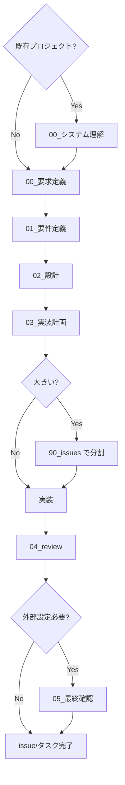
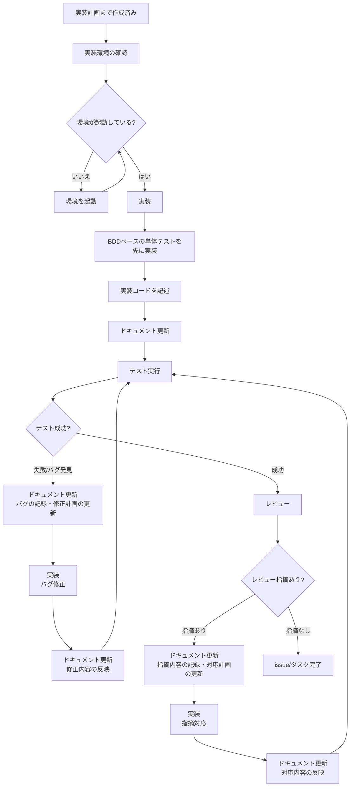

# AGENTS.md - 開発規約

> アジャイル＋ BDD 駆動の段階進行とファイル運用を強制する開発規約

> **LLM エージェント向け**: このドキュメントは人間向けの完全版です。LLM エージェントが機械的に守るべき実行ルールは [`AGENTS_AI_PLAYBOOK.md`](./AGENTS_AI_PLAYBOOK.md) を参照してください。**レビューフェーズ時は、[`AGENTS_REVIEW_RULE.md`](./AGENTS_REVIEW_RULE.md) を必ず参照してください。**

---

## クイックリファレンス

### この規約で「絶対に守ること」3 つ

1. **すべての対応は `.workflow/{YYYYMMDD_HHMMSS_issue_name}/00_要求定義.md` から始める**（既存プロジェクト導入時は `.workflow/00_システム理解.md` から）
2. **フェーズを飛ばさない（00*システム理解（既存プロジェクト時のみ）→ 00 → 01 → 02 → 03 → 実装 → 04_review → 05*最終確認（外部設定が必要な場合のみ））**
3. **ドキュメントと実装を常に同期させる（変更したら必ず該当 md を更新）**

### ワークフロー チートシート



### 必須ファイル一覧

- `00_システム理解.md` … 既存システムの全体像（既存プロジェクト導入時のみ）
- `00_要求定義.md` … 何のための issue/タスクか（背景・目的・制約）
- `01_要件定義.md` … ユーザーストーリー＋受け入れ基準＋ BDD Feature/Scenario
- `02_設計.md` … アーキテクチャ / DB / API / インターフェース設計
- `03_実装計画.md` … タスク分解・優先度・テスト方針
- `04_review.md` … レビュー結果・指摘・対応履歴
- `05_最終確認チェックリスト.md` … 外部設定の確認（コード対応不可項目がある場合のみ）
- `90_issues.md` … 大きい issue を分割する場合のみ使う

### ディレクトリ命名ルール

- `.workflow/20251115_143022_nextjs移行/`
  - プレフィックスは **開始日時 `YYYYMMDD_HHMMSS_`**（日時プレフィックス必須）
  - issue 名は日本語 OK（ローマ字混在も可）
  - **注意**: 日時は issue/タスク開始日時（要求定義書作成日時）を使用する。ファイル作成時にシステムの現在日時を取得して使用する

### 原則（エンジニアが常に意識するのはこれだけ）

- **KISS**: できるだけシンプルに
- **YAGNI**: 今いらないものは作らない
- それ以外（DRY, SOLID, クリーンアーキなど）は、複雑になってきたときに「道具箱から取り出す」（詳細は[実装原則](#実装原則)を参照）

---

## 目次

- [基本方針](#基本方針)
- [ワークフローとフェーズ進行](#ワークフローとフェーズ進行)
- [システム構成](#システム構成)
- [ファイルテンプレート](#ファイルテンプレート)
- [実装原則](#実装原則)
- [アーキテクチャ詳細](#アーキテクチャ詳細)
- [コーディング規約](#コーディング規約)
- [開発環境セットアップ](#開発環境セットアップ)
- [テスト実行方法](#テスト実行方法)
- [よく使うコマンド](#よく使うコマンド)
- [トラブルシューティング](#トラブルシューティング)
- [参考資料](#参考資料)

---

## 基本方針

このセクションでは、すべての issue/タスクで一貫して適用すべき基本方針を定義します。各フェーズの実施内容は、この基本方針に基づいて設計されています。

### 開発手法

- **振る舞い駆動**: 常に振る舞い（動作・機能）を中心に考え、振る舞いから実装を逆算する（[実装原則](#実装原則)の「思考原則」を参照）
- **解決したいことから逆算**: 解決したい問題や達成したい目標を明確にし、そこから逆算して必要なステップを洗い出す（[実装原則](#実装原則)の「思考原則」を参照）
- **アジャイル＋ BDD 駆動開発**: ユーザーストーリーと受け入れ基準を明確化し、BDD ユースケース（Feature）とシナリオ（Scenario）から実装を逆算（[ワークフローとフェーズ進行](#ワークフローとフェーズ進行)を参照）
- **テストファースト**: まず BDD ベースの単体テストを書く。一度テストを実行し「失敗すること」を確認してから実装に着手する。テストが通ることを確認してから次の実装ステップに進む（[テスト原則](#テスト原則)を参照）
- **プロダクションレディコードのみ**: 本番コードに「一時しのぎの仮実装」「TODO のままのスタブ」は残さない。すべてのコードは本番環境で動作可能であること。※テストコード内でのモック/スタブの利用はこの限りではない
- **ドキュメントは常に更新**: ドキュメントは「生きているドキュメント」として扱い、実装の進行や変更に合わせて常に更新し続ける。詳細は[実装原則](#実装原則)の「ドキュメント原則」を参照

### 外部連携

- **Github MCP 連携**: 使用するかどうかは、プロジェクトやチームの方針、または明示的な指示に従う。指示がない場合は、ローカルファイル管理を基本とする。
- **Issue 管理**: ローカルファイル（`.workflow/{YYYYMMDD_HHMMSS_issue_name}/90_issues.md`）で管理。各 issue（またはタスク）は個別のディレクトリで要求定義から開始すること。詳細は[ワークフローとフェーズ進行](#ワークフローとフェーズ進行)の「Issue 作成」フェーズを参照
- **認証**: Github MCP 認証の使用は、プロジェクトやチームの方針、または明示的な指示に従う。

### ファイル操作ポリシー

- **リセット**: 新規タスク開始時にファイル状態をリセット
- **編集前確認**: ファイル編集前に内容を確認すること

---

## ワークフローとフェーズ進行

### 用語定義

- **issue**: チケットや Pull Request と 1:1 で対応することを想定した「大きめの単位」。Git 管理やチケットツールと連動させる単位として使用する
- **タスク**: issue を分解した実作業単位。`03_実装計画.md` 内で洗い出す個別の作業項目
- **使い分け**: このドキュメントでは、特に区別が重要な場合以外は「issue/タスク」と併記してよい。規模や管理方法に応じて、適切な粒度で使い分けること

### Issue/タスク名の命名規則

**Issue またはタスク名は日本語を使用する**。ディレクトリ名として使用する場合は、**日時プレフィックス（YYYYMMDD_HHMMSS\_）を付与**し、必要に応じてローマ字や英語に変換する。

**日時プレフィックスの形式**: `YYYYMMDD_HHMMSS_`（例: `20251115_143022_`）

**例**:

- Issue/タスク名: `Next.js移行`
- ディレクトリ名: `20251115_143022_nextjs移行` または `20251115_143022_nextjs-migration`

**注意**:

- 日時は issue/タスク開始日時（要求定義書作成日時）を使用する
- **必須事項**: 日時は**ディレクトリ作成時にシステムの現在日時を取得して使用する**（ディレクトリ作成時に`date +"%Y%m%d_%H%M%S"`コマンド等で現在日時を取得し、その日時をディレクトリ名に使用する。ディレクトリ作成後にディレクトリ名を変更する必要はない）
- **禁止事項**:
  - `YYYYMMDD_`形式（日付のみ）のディレクトリ名は**絶対に使用しない**
  - 日時プレフィックスなしのディレクトリ名は**絶対に使用しない**
  - 推測や記憶に基づく日時の記載は**禁止**

**プロジェクトと Issue/タスクの関係**:

- **Issue/タスク**: ワークフローを適用する単位。1 つの issue/タスクが 1 つのプロジェクトである場合もあれば、1 つのプロジェクトが複数の issue/タスクに分割される場合もある。
- **プロジェクト**: 複数の issue/タスクをまとめる概念。プロジェクト全体を管理する場合は、プロジェクト名でディレクトリを作成し、その中に issue/タスクを配置することもできる。
- **使い分け**: プロジェクトという概念を使わず、issue/タスクのみで管理することも可能。プロジェクトの規模や管理方法に応じて、適切な粒度で使い分けること。

#### ディレクトリ命名規則まとめ

| 対象                  | 例                                                                      | 備考                                                                 |
| --------------------- | ----------------------------------------------------------------------- | -------------------------------------------------------------------- |
| issue/タスク直下      | `.workflow/20251115_143022_nextjs移行/`                                 | 先頭に開始日時の `YYYYMMDD_HHMMSS_` を付与（日時プレフィックス必須） |
| 親 issue 内の子 issue | `.workflow/20251115_143022_nextjs移行/90_issues/01_api-endpoint/`       | **優先度順に連番（2 桁）を付与**（例: `01_`, `02_`）                 |
| memo                  | `.workflow/20251115_143022_nextjs移行/memo/20251123_081010_調査結果.md` | `YYYYMMDD_HHMMSS_タイトル.md`                                        |

### フェーズ定義

各フェーズは順次進行し、**前フェーズの完了条件を満たした時点で次フェーズに進む**。

**フェーズ進行の手順**:

1. **前フェーズの完了条件を確認**: 各フェーズの「完了条件」を確認し、すべて満たしていることを確認する
2. **次フェーズに進む**: 完了条件を満たした時点で、次フェーズの実施内容に従って作業を開始する
3. **ドキュメントの更新**: 各フェーズの実施内容に従って、関連するドキュメントを更新する（[実装原則](#実装原則)の「ドキュメント原則」を参照）

**重要**: すべての issue/タスク対応は、必ず要求定義書から開始すること。複数の issue/タスクをまとめて管理する場合も、各 issue/タスクは個別に要求定義書から開始する。

**既存プロジェクト・他ベンダー製システムへの導入時**: 既存プロジェクトに途中から導入する場合や、他ベンダーが作成したシステムを改修する場合は、**システム理解フェーズ**を先に実施すること。詳細は[システム理解フェーズ](#システム理解フェーズ)を参照。

#### 0. システム理解（system_understanding）

**注意**: このフェーズは、**既存プロジェクトに途中から導入する場合**や**他ベンダーが作成したシステムを改修・機能追加する場合**にのみ実施する。新規プロジェクトの場合は、このフェーズをスキップして[要求定義](#0-要求定義requirements_definition)に進む。

**必須ファイル**: `.workflow/00_システム理解.md`（プロジェクトルート）

**実施内容**:

- 既存システムの全体像を把握する
- アーキテクチャ、技術スタック、データベース構造、API 設計などの現状を分析
- 既存ドキュメント（README、設計書、API 仕様書等）の確認
- 必要に応じてステークホルダーへのヒアリング実施
- システム理解の結果をドキュメント化
- **ドキュメント更新**: システム理解が深まった場合や、新たな情報が得られた場合は、`00_システム理解.md`を即座に更新する（[実装原則](#実装原則)の「ドキュメント原則」を参照）

**意識すべき原則**（詳細は [実装原則](#実装原則) を参照）:

- **必須**: KISS / YAGNI
- **余裕があれば**: DRY（既存ドキュメントの重複を避ける）

**完了条件**: システム理解ファイル（`00_システム理解.md`）が作成され、既存システムの全体像が把握できていること。完了条件を満たした時点で、次フェーズ（要求定義）に進む。

**各 issue/タスクでの参照**: 各 issue/タスクの要求定義書（`00_要求定義.md`）では、必要に応じて`00_システム理解.md`を参照すること。

#### 1. 要求定義（requirements_definition）

**必須ファイル**: `.workflow/{YYYYMMDD_HHMMSS_issue_name}/00_要求定義.md`

**実施内容**:

- issue/タスクごとのディレクトリを作成（`.workflow/{YYYYMMDD_HHMMSS_issue_name}/`）。ディレクトリ名には日時プレフィックス（`YYYYMMDD_HHMMSS_`）を付与する。日時はディレクトリ作成時にシステムの現在日時を取得して使用する。
- **既存システムの参照**: 既存プロジェクトの場合は、`00_システム理解.md`を参照し、既存システムの制約やアーキテクチャを考慮する
- ユーザー・ステークホルダーからの要求を整理
- 何を実現するかを明確化（目的・背景・期待される効果）
- 非機能要件の整理（パフォーマンス、セキュリティ、保守性等）
- 制約条件の明確化（既存システムの制約を含む）
- **ドキュメント更新**: 要求の変更や追加があった場合は、`00_要求定義.md`を即座に更新する（[実装原則](#実装原則)の「ドキュメント原則」を参照）

**意識すべき原則**（詳細は [実装原則](#実装原則) を参照）:

- **必須**: KISS / YAGNI
- **余裕があれば**: PoLA（ユーザーインターフェースに関連する場合）

**完了条件**: 要求定義ファイル（`00_要求定義.md`）が作成され、要求が明確化されていること。完了条件を満たした時点で、次フェーズ（要件定義）に進む。

#### 2. 要件定義（requirements）

**必須ファイル**: `.workflow/{YYYYMMDD_HHMMSS_issue_name}/01_要件定義.md`

**実施内容**:

- `00_要求定義.md`を読込後に開始
- 要求定義を基に技術的な要件を定義
- ユーザーストーリーの明確化
- 受け入れ基準の定義
- BDD ユースケース（Feature）とシナリオ（Scenario）の作成（Given-When-Then 形式）
- **ドキュメント更新**: 要件の変更や追加があった場合は、`01_要件定義.md`を即座に更新する（[実装原則](#実装原則)の「ドキュメント原則」を参照）

**意識すべき原則**（詳細は [実装原則](#実装原則) を参照）:

- **必須**: KISS / YAGNI
- **余裕があれば**: DRY / SOLID / GRASP / PoLA（複雑な機能要件がある場合）

**完了条件**: 要件定義ファイル（`01_要件定義.md`）が作成され、BDD ユースケース（Feature）とシナリオ（Scenario）が定義されていること。完了条件を満たした時点で、次フェーズ（設計）に進む。

#### 3. 設計（design）

**必須ファイル**: `.workflow/{YYYYMMDD_HHMMSS_issue_name}/02_設計.md`

**実施内容**:

- `01_要件定義.md`を読込後に開始
- BDD で定義された振る舞い（ユースケース・シナリオ）を設計レベルに落とし込む
- アーキテクチャ設計
- データベース設計
- API 設計
- **テスト戦略の定義（必須）**: 各コンポーネント/API/機能に対して、どのテストレベル（単体/結合/E2E）で何をテストするかの方針を定義
  - テストピラミッドを意識した配分（単体テスト多め、結合/API テストそこそこ、E2E 少なめ）
  - 各機能・コンポーネントごとのテストレベル方針
  - クリティカルな機能（課金、締め処理、削除系等）のテスト方針
  - バリデーション系のテスト方針（網羅的にテスト、サービス層で共通化）
  - 詳細は [`AGENTS_TEST_GUIDELINES.md`](./AGENTS_TEST_GUIDELINES.md) を参照
- **ドキュメント更新**: 設計の変更や追加があった場合は、`02_設計.md`を即座に更新する（[実装原則](#実装原則)の「ドキュメント原則」を参照）

**意識すべき原則**（詳細は [実装原則](#実装原則) を参照）:

- **必須**: KISS / YAGNI
- **余裕があれば**: クリーンアーキテクチャ（中規模以上） / SOLID / DRY / Law of Demeter / GRASP / CoC / PoLA / TDAE（複雑な設計やオブジェクト指向設計を行う場合）

**完了条件**: 設計ファイル（`02_設計.md`）が作成され、アーキテクチャ、データベース、API の設計とテスト戦略が完了していること。完了条件を満たした時点で、次フェーズ（実装計画）に進む。

#### 4. 実装計画（implementation_plan）

**必須ファイル**: `.workflow/{YYYYMMDD_HHMMSS_issue_name}/03_実装計画.md`

**実施内容**:

- `02_設計.md`読込後に開始
- 各タスクに対し BDD のユースケース・シナリオから**単体テスト仕様**を抽出
- **各タスクに紐づくテスト観点の定義（必須）**:
  - **単体テスト**: 各タスクで必要な単体テストの観点（正常系は最小限、異常系・境界値に重点）
  - **結合/API テスト**: コンポーネント間の契約チェック、代表的なフロー
  - **E2E/受け入れテスト**: BDD の Feature/Scenario をそのままテストに（重要機能に集中）
  - **バリデーション系**: 網羅的なテスト観点（すべてのルール、境界値、エラーメッセージ）
  - 詳細は [`AGENTS_TEST_GUIDELINES.md`](./AGENTS_TEST_GUIDELINES.md) を参照
- 実装前にテストコード雛形を用意
- タスク分解と優先順位付け
- テストの優先順位（クリティカルな機能は厚くテスト）
- **ドキュメント更新**: 実装計画の変更や追加があった場合は、`03_実装計画.md`を即座に更新する（[実装原則](#実装原則)の「ドキュメント原則」を参照）

**意識すべき原則**（詳細は [実装原則](#実装原則) を参照）:

- **必須**: KISS / YAGNI
- **余裕があれば**: SOLID / GRASP / Law of Demeter / CoC / PoLA / TDAE（複雑な実装がある場合）

**完了条件**: 実装計画ファイル（`03_実装計画.md`）が作成され、タスク分解と優先順位付け、各タスクのテスト観点が完了していること。完了条件を満たした時点で、次フェーズ（Issue 作成、該当する場合）または実装フェーズに進む。

#### 5. Issue 作成（issue_creation）

**注意**: このフェーズは、大きな issue/タスクを複数の小さな issue/タスクに分割する場合のみ実施する。issue/タスク自体が 1 つの単位として完結する場合は、このフェーズをスキップしてフェーズ 5（実装）に進む。

**必須ファイル**（issue/タスクを分割する場合）: `.workflow/{YYYYMMDD_HHMMSS_issue_name}/90_issues.md`

**Issue とタスクの関係**:

- **issue**: 大きな単位。複数のタスクを含むことがある。issue 自体が 1 つの単位として完結する場合は、実装計画書のタスクがそのまま issue として扱われる。
- **タスク**: 実装計画書（`03_実装計画.md`）で定義される個別の作業単位。
- **使い分け**: issue とタスクは必要に応じて置き換え可能。規模や管理方法に応じて、適切な粒度で使い分けること。小さな単位では「タスク」、大きな単位では「issue」として管理することが多い。
- **ネスト構造**: issue やタスクは、必要に応じてさらに細かい issue やタスクに分割することができる。大きな issue の中に `90_issues.md` と `90_issues/` ディレクトリを作成し、ネストされた issue やタスクを管理することができる。

**実施内容**:

- `03_実装計画.md`読込後に開始
- 実装計画を基に、実装可能な単位で issue（またはタスク）を分割
- 各 issue は個別のディレクトリ（`.workflow/{YYYYMMDD_HHMMSS_issue_name}/90_issues/{連番}_{nested_issue_name}/` または `.workflow/{YYYYMMDD_HHMMSS_issue_name}/90_tasks/{連番}_{task_name}/`）を作成
  - **連番の付け方**: 優先度順（高 → 中 → 低）に連番（2 桁）を付与する（例: `01_SSHポートの制限`、`02_Stateロック・暗号化の設定`）
  - 同じ優先度内では、`90_issues.md`の記載順に連番を付与する
- **各 issue は要求定義から開始**: 各 issue ディレクトリに`00_要求定義.md`を作成し、その issue 固有の要求を定義

**必須記載項目**（`90_issues.md`）:

- issue（またはタスク）一覧（issue 名、概要、優先順位、ステータス）
- 各 issue へのリンク

**各 issue ディレクトリの構成**:

```
.workflow/{YYYYMMDD_HHMMSS_issue_name}/90_issues/{連番}_{nested_issue_name}/
├── 00_要求定義.md       # 親 issue と同じテンプレートを使用
├── 01_要件定義.md       # 親 issue と同じテンプレートを使用
├── 02_設計.md           # 親 issue と同じテンプレートを使用
├── 03_実装計画.md        # 親 issue と同じテンプレートを使用
├── 90_issues.md         # ネストされた issue やタスクの一覧（該当する場合）
├── 90_issues/           # ネストされた issue やタスクのディレクトリ（該当する場合）
│   └── {nested_issue_name}/
│       ├── 00_要求定義.md
│       ├── 01_要件定義.md
│       ├── 02_設計.md
│       ├── 03_実装計画.md
│       └── （さらにネスト可能）
└── （実装ファイル）
```

**注意**:

- issue とタスクは必要に応じて置き換え可能です。issue/タスクで「タスク」を使用する場合は、ディレクトリ名を `90_tasks/` とすることもできます。

**完了条件**: すべてのタスクが issue（またはタスク）化され、各 issue の要求定義が作成されていること。完了条件を満たした時点で、次フェーズ（実装）に進む。

#### 6. 実装（execution）

**前提条件**: 実装計画（`03_実装計画.md`）まで作成済みであること

**実施内容**:

- **実装環境の確認**: 実装開始前に必ず実装環境が立ち上がっているか確認すること
  - **確認方法**: issue/タスクに応じた方法（Makefile、Docker Compose、npm スクリプト、直接実行等）を使用して開発環境を起動し、すべてのサービスが正常に起動していることを確認
  - **確認項目**:
    - 必要なサービスが起動しているか（バックエンド、API、フロントエンド等、issue/タスクに応じて異なる）
    - データベースが起動しているか（該当する場合）
    - 各サービスのログを確認し、エラーがないことを確認
  - **確認タイミング**: 実装開始前、実装中に問題が発生した場合
  - **環境が起動していない場合**: 環境を起動してから実装を開始する
- 各 issue に対応し、ローカルブランチ運用＋コミット＋ PR/マージ申請まで
- **各 issue は要求定義から開始**: issue ディレクトリの`00_要求定義.md`を読込後、順次進行
- **ネストされた issue やタスク**: 大きな issue の中にネストされた issue やタスクがある場合は、それらも同様に要求定義から開始し、順次進行する
- コーディング前に**BDD ベースの単体テスト**を実装
- テストファーストを徹底（テスト通過後のみ実装を進める）
- プロダクションレディコードのみ実装
- **ドキュメント更新**: 実装の進行に合わせて、関連するドキュメントを常に更新し続ける（[実装原則](#実装原則)の「ドキュメント原則」を参照）

**意識すべき原則**（詳細は [実装原則](#実装原則) を参照）:

- **必須**: KISS / YAGNI
- **余裕があれば**: クリーンアーキテクチャ（中規模以上） / DRY / SOLID / Law of Demeter / GRASP / CoC / PoLA / TDAE（複雑な実装やオブジェクト指向設計を行う場合）

**注意**: 過剰に原則を適用すると、逆にコードが複雑になる場合があります。バランスを保つことが重要です。

**実装フロー**:

以下のフローを繰り返し、issue（またはタスク）が完了するまで継続する。



**詳細な作業フロー**:

1. **実装環境の確認**

   - 実装開始前に必ず実装環境が立ち上がっているか確認する
   - issue/タスクに応じた方法（Makefile、Docker Compose、npm スクリプト、直接実行等）を使用して開発環境を起動
   - すべてのサービスが正常に起動していることを確認
   - 各サービスのログを確認し、エラーがないことを確認
   - 環境が起動していない場合は、環境を起動してから実装を開始する

2. **実装**

   - BDD ベースの単体テストを先に実装（テストファースト）
   - 実装コードを記述
   - プロダクションレディコードのみ実装（モック・一時的な回避策は禁止）

3. **ドキュメント更新**

   - 実装内容を実装計画書（`03_実装計画.md`）に反映
   - 必要に応じて設計書（`02_設計.md`）を更新
   - 進捗状況を記録

4. **テスト実行**

   - 単体テストを実行
   - E2E テストを実行（該当する場合）
   - すべてのテストが通過することを確認

5. **バグ修正サイクル**（テスト失敗/バグ発見時）

   - ドキュメント更新: バグの記録、修正計画の更新
   - 実装: バグ修正
   - ドキュメント更新: 修正内容の反映
   - テスト実行: 修正が正しく動作することを確認
   - バグがなくなるまで 5 を繰り返す

6. **レビュー**（テスト成功/バグなし時）

   - レビューフェーズ（`04_review.md`）に進む
   - レビューで指摘がある場合:
     - ドキュメント更新: 指摘内容の記録、対応計画の更新
     - 実装: 指摘対応
     - ドキュメント更新: 対応内容の反映
     - テスト実行: 対応が正しく動作することを確認
     - 指摘がなくなるまで 6 を繰り返す

7. **完了**
   - すべてのテストが通過
   - レビューで指摘がない
   - issue（またはタスク）が完了

**ドキュメント更新の原則**（実装フェーズ固有）:

実装フェーズでは、以下の原則に従ってドキュメントを更新する。基本的なドキュメント原則については、[実装原則](#実装原則)の「ドキュメント原則」を参照。

- **更新タイミング**: 実装の各ステップ（実装、テスト、バグ修正、レビュー対応）で、必ずドキュメントを更新する
- **更新内容**:
  - **実装計画書（`03_実装計画.md`）**: 実装内容の反映、進捗状況の更新、バグの記録、修正計画の更新（**常に更新**）
  - **設計書（`02_設計.md`）**: 実装時の設計変更があった場合に更新（**変更があった場合は必ず更新**）
  - **要件定義書（`01_要件定義.md`）**: 要件変更があった場合のみ更新（原則として変更しないが、変更があった場合は必ず更新）
  - **要求定義書（`00_要求定義.md`）**: 要求変更があった場合のみ更新（原則として変更しないが、変更があった場合は必ず更新）

**完了条件**: すべてのテストが通過し、実装が完了し、レビューで指摘がなく、issue（またはタスク）が完了していること。完了条件を満たした時点で、次フェーズ（レビュー）に進む。

#### 7. レビュー（review）

**前提条件**: 実装フェーズが完了し、すべてのテストが通過していること

**必須ファイル**: `.workflow/{YYYYMMDD_HHMMSS_issue_name}/04_review.md`（issue/タスク全体）または `.workflow/{YYYYMMDD_HHMMSS_issue_name}/90_issues/{nested_issue_name}/04_review.md`（ネストされた issue/タスク）

**実施内容**:

- 実装内容の確認
- テスト結果の確認
- コード品質の確認
- ドキュメントの確認
- 指摘事項の記録
- **ドキュメント更新**: レビューで発見した問題点や改善提案は、`04_review.md`に即座に記録し、対応内容も随時更新する（[実装原則](#実装原則)の「ドキュメント原則」を参照）

**レビューフロー**:

1. **レビュー実施**

   - 実装内容を確認
   - テスト結果を確認
   - コード品質を確認
   - ドキュメントを確認

2. **指摘事項の記録**

   - レビューで発見した問題点を記録
   - 改善提案を記録

3. **指摘対応**（指摘がある場合）

   - ドキュメント更新: 指摘内容の記録、対応計画の更新
   - 実装: 指摘対応
   - ドキュメント更新: 対応内容の反映
   - テスト実行: 対応が正しく動作することを確認
   - 再度レビューを実施

4. **完了**
   - レビューで指摘がない
   - issue（またはタスク）が完了

**完了条件**: レビューで指摘がなく、issue（またはタスク）が完了していること。完了条件を満たした時点で、次フェーズ（最終確認、該当する場合）または issue（またはタスク）完了とする。

#### 8. 最終確認（final_check）

**注意**: このフェーズは、**コードでは対応できない外部設定**（GTM 管理画面、GA4 管理画面、AWS Amplify コンソール、その他の外部サービス設定）が必要な場合のみ実施する。すべてのプロジェクトで必要とは限らない。

**前提条件**: 実装フェーズとレビューフェーズが完了し、すべてのテストが通過していること

**必須ファイル**（コード対応不可項目がある場合）: `.workflow/{YYYYMMDD_HHMMSS_issue_name}/05_最終確認チェックリスト.md`

**実施内容**:

- コードでは対応できない外部設定の確認
- GTM 管理画面、GA4 管理画面、AWS Amplify コンソール、その他の外部サービス設定の確認
- 環境変数の設定確認
- 動作確認
- **ドキュメント更新**: 外部設定の確認結果は、`05_最終確認チェックリスト.md`に即座に記録し、確認状況も随時更新する（[実装原則](#実装原則)の「ドキュメント原則」を参照）

**コード対応不可項目の管理方法**:

**重要**: プロジェクトによっては、コード実装だけでは完了せず、外部サービス（GTM、GA4、AWS Amplify 等）での手動設定が必要な場合があります。これらの項目は、コードでは対応できないため、別途管理する必要があります。

**管理方針**:

1. **最終確認チェックリストの作成**: コード実装完了後、外部設定が必要な項目を`05_最終確認チェックリスト.md`に記載
2. **Issue ごとの確認**: 各 Issue（またはタスク）で実装した機能について、コード実装完了後に必要な外部設定を確認
3. **チェックリスト形式**: 各外部設定項目をチェックリスト形式で記載し、確認状況を記録
4. **レビュー書への反映**: 各 Issue のレビュー書の「動作確認」セクションに確認結果を記録

**最終確認チェックリストの記載内容**:

- **各 Issue ごとのチェックリスト**: コード実装完了後に必要な外部設定を Issue ごとに記載
- **設定カテゴリ**: 環境変数、GTM 設定、GA4 設定、AWS Amplify 設定、その他の外部サービス設定など
- **確認方法**: 各設定項目の確認方法と設定方法を記載
- **重要事項**: 重要な注意事項や注意点を明記

**最終確認フロー**:

1. **最終確認チェックリストの作成**

   - コード実装完了後、外部設定が必要な項目を洗い出し
   - `05_最終確認チェックリスト.md`を作成し、各 Issue ごとのチェックリストを記載

2. **外部設定の確認**

   - 各チェック項目を順次確認
   - 設定が必要な項目を設定
   - 確認結果をチェックリストに記録

3. **動作確認**

   - 外部設定完了後、動作確認を実施
   - 問題がないことを確認

4. **レビュー書への反映**

   - 各 Issue のレビュー書の「動作確認」セクションに確認結果を記録
   - Issue のステータスを「完了」に更新

5. **完了**
   - すべてのチェック項目が確認済み
   - すべての Issue が完了

**完了条件**: すべてのチェック項目が確認済みで、すべての Issue（またはタスク）が完了していること。完了条件を満たした時点で、issue（またはタスク）は完了とする。

**注意**: すべてのプロジェクトで最終確認チェックリストが必要とは限りません。コード実装のみで完了するプロジェクトの場合は、このフェーズをスキップして構いません。

---

## ファイルテンプレート

各フェーズで作成するファイルのテンプレートは、`.workflow/templates/` ディレクトリに配置されている。新しい issue/タスクを開始する際は、これらのテンプレートをコピーして使用すること。

**重要**: すべての issue/タスクで、同じテンプレートを使用する。親 issue とネストされた issue/タスクでテンプレートを分ける必要はない。

### テンプレートの使用方法

1. **テンプレートのコピー**: 新しい issue/タスクを開始する際は、対応するテンプレートファイルをコピーして使用する
2. **プレースホルダーの置換**: テンプレート内のプレースホルダー（`{issue名}`、`{YYYY 年 MM 月 DD 日}`など）を実際の値に置き換える
3. **フォーマットの維持**: テンプレートのフォーマット（セクション構造、見出し形式、必須セクションなど）を維持する
4. **定期的な確認**: ドキュメントを更新する際は、テンプレートとの整合性を確認する

### フォーマット確認のチェックリスト

ワークフロードキュメントを作成・更新する際は、以下の項目を確認すること：

- [ ] タイトル形式がテンプレートと一致しているか（例: 「要求定義書: {issue 名}」）
- [ ] メタデータ（issue 名、作成日、最終更新日）の形式がテンプレートと一致しているか
- [ ] セクション構造（番号付きセクションの有無、セクション名）がテンプレートと一致しているか
- [ ] 必須セクション（「前のステップ」「次のステップ」など）が含まれているか
- [ ] 参考資料セクションの形式がテンプレートと一致しているか
- [ ] リンク形式が正しいか（Markdown リンク形式を使用しているか）

### テンプレート一覧

#### `00_システム理解.md` テンプレート

**テンプレートファイル**: [`.workflow/templates/00_システム理解.md`](.workflow/templates/00_システム理解.md)（実際のプロジェクトでは `.cursor_workflow/templates/00_システム理解.md` または `.workflow/templates/00_システム理解.md`）

**注意**: このテンプレートは、既存プロジェクトに途中から導入する場合や、他ベンダーが作成したシステムを改修・機能追加する場合のみ使用する。新規プロジェクトの場合は、このファイルは不要。

既存システムの全体像を把握するために使用。

**必須セクション**: 「参考資料」セクションに既存ドキュメント（README、設計書、API 仕様書等）へのリンクを含める。前のステップ/次のステップセクションは不要（プロジェクト全体の理解のため）。

#### `00_要求定義.md` テンプレート

**テンプレートファイル**: [`.workflow/templates/00_要求定義.md`](.workflow/templates/00_要求定義.md)（実際のプロジェクトでは `.cursor_workflow/templates/00_要求定義.md` または `.workflow/templates/00_要求定義.md`）

issue/タスクの要求定義に使用。

**重要**: 要求定義書は、issue/タスクの全体像を把握するためのものです。詳細な技術仕様や実装方法は要件定義書以降で記載します。必要最低限の情報に収めることを心掛けてください。

**必須セクション**:

- 「次のステップ」セクションに [`01_要件定義.md`](./01_要件定義.md) へのリンクを含める
- 既存プロジェクトの場合は、「参考資料」セクションに [`00_システム理解.md`](../00_システム理解.md) へのリンクを含める（最初のドキュメントのため「前のステップ」は不要）

#### `01_要件定義.md` テンプレート

**テンプレートファイル**: [`.workflow/templates/01_要件定義.md`](.workflow/templates/01_要件定義.md)（実際のプロジェクトでは `.cursor_workflow/templates/01_要件定義.md` または `.workflow/templates/01_要件定義.md`）

issue/タスクの要件定義に使用。

**必須セクション**: 「前のステップ」セクションに [`00_要求定義.md`](./00_要求定義.md) へのリンク、「次のステップ」セクションに [`02_設計.md`](./02_設計.md) へのリンクを含める。

#### `02_設計.md` テンプレート

**テンプレートファイル**: [`.workflow/templates/02_設計.md`](.workflow/templates/02_設計.md)（実際のプロジェクトでは `.cursor_workflow/templates/02_設計.md` または `.workflow/templates/02_設計.md`）

issue/タスクの設計に使用。

**必須セクション**: 「前のステップ」セクションに [`01_要件定義.md`](./01_要件定義.md) へのリンク、「次のステップ」セクションに [`03_実装計画.md`](./03_実装計画.md) へのリンクを含める。

#### `03_実装計画.md` テンプレート

**テンプレートファイル**: [`.workflow/templates/03_実装計画.md`](.workflow/templates/03_実装計画.md)（実際のプロジェクトでは `.cursor_workflow/templates/03_実装計画.md` または `.workflow/templates/03_実装計画.md`）

issue/タスクの実装計画に使用。

**必須セクション**: 「前のステップ」セクションに [`02_設計.md`](./02_設計.md) へのリンク、「次のステップ」セクションに [`90_issues.md`](./90_issues.md)（issue/タスク分割時）または実装フェーズへのリンクを含める。

#### `90_issues.md` テンプレート

**テンプレートファイル**: [`.workflow/templates/90_issues.md`](.workflow/templates/90_issues.md)（実際のプロジェクトでは `.cursor_workflow/templates/90_issues.md` または `.workflow/templates/90_issues.md`）

**注意**: このテンプレートは、大きな issue/タスクを複数の小さな issue（またはタスク）に分割する場合のみ使用する。issue/タスク自体が 1 つの単位として完結する場合は、このファイルは不要。issue とタスクの関係については、[ワークフローとフェーズ進行](#ワークフローとフェーズ進行)の「Issue 作成」フェーズを参照。

**必須セクション**: 「参考資料」セクションに「親 issue/タスクのドキュメント」サブセクションを設け、親 issue/タスクのドキュメント（`00_要求定義.md`、`01_要件定義.md`、`02_設計.md`、`03_実装計画.md`）へのリンクを含める。前のステップ/次のステップセクションは不要（issue 管理ファイルのため）。

#### `04_review.md` テンプレート

**テンプレートファイル**: [`.workflow/templates/04_review.md`](.workflow/templates/04_review.md)（実際のプロジェクトでは `.cursor_workflow/templates/04_review.md` または `.workflow/templates/04_review.md`）

issue/タスクのレビューに使用。

**必須セクション**: 「前のステップ」セクションに [`03_実装計画.md`](./03_実装計画.md) へのリンクを含める。次のステップセクションは不要（レビュー完了後は issue/タスク完了のため、または最終確認フェーズへ）。

#### `05_最終確認チェックリスト.md` テンプレート

**テンプレートファイル**: [`.workflow/templates/05_最終確認チェックリスト.md`](.workflow/templates/05_最終確認チェックリスト.md)（実際のプロジェクトでは `.cursor_workflow/templates/05_最終確認チェックリスト.md` または `.workflow/templates/05_最終確認チェックリスト.md`）

**注意**: このテンプレートは、コードでは対応できない外部設定（GTM 管理画面、GA4 管理画面、AWS Amplify コンソール、その他の外部サービス設定）が必要な場合のみ使用する。すべてのプロジェクトで必要とは限らない。

コード実装完了後に必要な外部設定を確認するために使用。

**必須セクション**: 「参考資料」セクションにプロジェクトドキュメント（`00_要求定義.md`、`01_要件定義.md`、`02_設計.md`、`03_実装計画.md`）へのリンクを含める。前のステップ/次のステップセクションは不要（最終確認チェックリストのため）。

---

## 実装原則

このセクションでは、[基本方針](#基本方針)で定義した開発手法を実践するための具体的な原則を説明します。各フェーズの「意識すべき原則」は、このセクションの原則を参照しています。

> **重要**: ここに列挙している原則は「必要なときに取り出す道具箱」です。日常的に常に意識すべきなのは **KISS / YAGNI** だけで、それ以外は「複雑さが増してきたときに取り出す」程度で構いません。

### 思考原則

1. **解決したいことを明確化**: 何を解決したいのか、何を達成したいのかを明確にする
2. **振る舞いを定義**: 解決のために必要な振る舞い（動作・機能）を定義する
3. **逆算でステップ洗い出し**: 解決したいことや振る舞いから逆算して必要なステップを洗い出す
4. **最適か/シンプルか自問**: 各ステップで最適性とシンプルさを検証
5. **統合**: すべてのステップを統合して結果を得る

### プログラミング原則

#### 基本原則

1. **要件明確化**: 実装前に要件を明確にする
2. **工程抽出**: 設計 → 実装 → テスト → リファクタ → デプロイを逆算で抽出
3. **工程ごとに自問**: 各工程で最適性を検証
4. **統合**: すべての工程を統合して高品質化

#### DRY 原則（Don't Repeat Yourself）

**主な焦点**: コードの重複排除

**適用場面**: 実装レベル

**目的**: コードの重複を減らし、再利用性を高めることで、保守性や可読性を向上させる。

**意味**: 同じ機能や情報を複数の場所で繰り返し記述するのではなく、一箇所にまとめて管理する。

**メリット**:

- 修正が容易（1 箇所を直せば済む）
- コード量が減り、可読性が上がる
- バグの発生リスクが減少

**注意点**:

- 過剰に DRY を追求すると、逆にコードが複雑になる場合がある（「抽象化のしすぎ」に注意）
- 類似しているが異なる要件を持つコードを無理やり統合しない

**ワークフローでの適用**:

- **要件定義**: 類似する機能要件の重複を避け、共通化できる要件を特定する
- **設計**: 共通化できるコンポーネントやモジュールを設計段階で特定する
- **実装**: 重複するコードを関数やコンポーネントに抽出する

#### SOLID 原則

**主な焦点**: オブジェクト指向設計

**適用場面**: 設計レベル

オブジェクト指向設計における 5 つの原則。柔軟で拡張性が高く、保守しやすいコードを書くためのガイドライン。

**1. S - 単一責任の原則（Single Responsibility Principle）**

- **定義**: 1 つのクラスやモジュールは、1 つの責任だけを持つべきである
- **目的**: クラスが複数の役割を持つと、変更が必要になったときに影響範囲が広がりやすくなる。それを防ぐ

**2. O - オープン・クローズドの原則（Open/Closed Principle）**

- **定義**: クラスは拡張に対して開いており、修正に対して閉じているべき
- **目的**: 既存のコードを変更せずに新しい機能を追加できるようにする

**3. L - リスコフの置換原則（Liskov Substitution Principle）**

- **定義**: 派生クラスは基底クラスと置換可能でなければならない
- **目的**: 継承を使用する際に、基底クラスの機能を壊さないようにする

**4. I - インターフェース分離の原則（Interface Segregation Principle）**

- **定義**: クライアントは、使用しないインターフェースに依存してはならない
- **目的**: 不要な依存関係を排除し、インターフェースを小さく保つ

**5. D - 依存性逆転の原則（Dependency Inversion Principle）**

- **定義**: 上位モジュールは下位モジュールに依存してはならない。両方とも抽象に依存すべきである
- **目的**: 具体的な実装ではなく、抽象（インターフェース）に依存することで、柔軟性を高める

**ワークフローでの適用**:

- **要件定義**: 各機能要件が単一の責任を持つように分割する
- **設計**: クラスやモジュールの責任を明確にし、インターフェースを設計する
- **実装計画**: 拡張性を考慮した実装順序を計画する
- **実装**: 各クラスやモジュールが単一責任を持つように実装する

#### KISS 原則（Keep It Simple, Stupid）

**主な焦点**: シンプルさ

**適用場面**: 実装・設計全般

**目的**: コードを可能な限りシンプルに保つ。

**意味**: 複雑な解決策よりも、シンプルで理解しやすい解決策を選ぶ。

**メリット**:

- コードの理解が容易
- バグの発生リスクが減少
- 保守性が向上

**ワークフローでの適用**:

- **要求定義**: 複雑な要件をシンプルに分解する
- **要件定義**: シンプルで理解しやすいユーザーストーリーを定義する
- **設計**: 複雑な設計よりもシンプルな設計を選ぶ
- **実装計画**: シンプルな実装手順を計画する
- **実装**: 複雑なコードよりもシンプルなコードを書く

#### YAGNI 原則（You Aren't Gonna Need It）

**主な焦点**: 必要性に基づく開発

**適用場面**: 要件定義・実装

**目的**: 現在必要のない機能は実装しない。

**意味**: 将来必要になるかもしれない機能を事前に実装するのではなく、実際に必要になったときに実装する。

**メリット**:

- 開発時間の短縮
- コードの複雑化を防ぐ
- 要件変更への柔軟な対応

**ワークフローでの適用**:

- **要求定義**: 現在必要な要求のみを定義し、将来の要求は除外する
- **要件定義**: 現在必要な機能要件のみを定義する
- **設計**: 将来の拡張性を過剰に考慮しない
- **実装計画**: 現在必要なタスクのみを計画する
- **実装**: 将来必要になるかもしれない機能は実装しない

#### デメテルの法則（Law of Demeter）

**主な焦点**: 依存関係の削減

**適用場面**: オブジェクト間通信

**目的**: オブジェクト間の結合度を下げ、変更に強い設計にする。

**意味**: オブジェクトは、直接的な友人のみと通信すべきで、友人を通じて間接的にアクセスすべきではない。

**例**:

```typescript
// デメテルの法則に違反
order.getCustomer().getAddress();

// 改善例
order.getCustomerAddress();
```

**メリット**: コードの結合度が下がり、変更に強い設計になる。

**ワークフローでの適用**:

- **設計**: オブジェクト間の依存関係を最小限にする設計を行う
- **実装計画**: オブジェクト間の通信方法を計画する
- **実装**: 深い依存チェーンを避け、直接的なメソッド呼び出しを実装する

#### GRASP（General Responsibility Assignment Software Patterns）

**主な焦点**: 責務の割り当て

**適用場面**: オブジェクト指向設計

**概要**: オブジェクト指向設計における責任の割り当てに関するパターン集。SOLID と補完的。

**主なパターン**:

- **情報エキスパート（Information Expert）**: データを持つオブジェクトにそのデータを扱う責任を与える
- **クリエイター（Creator）**: オブジェクトを作成する責任を、そのオブジェクトと密接に関連するクラスに与える
- **低結合（Low Coupling）**: クラス間の依存関係を最小限にする
- **高凝集（High Cohesion）**: クラスの責任を関連性の高いものに集中させる

**目的**: 責務の割り当てを明確にし、SOLID を具体的に実践する指針を提供。

**ワークフローでの適用**:

- **要件定義**: 各機能要件の責任を明確にする
- **設計**: 各クラスやモジュールの責任を適切に割り当てる
- **実装計画**: 責任に基づいて実装順序を計画する
- **実装**: 各クラスやモジュールが適切な責任を持つように実装する

#### 規約による設定（Convention over Configuration, CoC）

**主な焦点**: 規約の活用

**適用場面**: フレームワーク開発

**概要**: 「設定より規約」という原則で、デフォルトの規約を優先し、明示的な設定を最小限にする。

**目的**: 開発者が考えるべきことを減らし、生産性を向上。

**例**:

- Next.js では、`app/` ディレクトリ構造が規約として定義されている
- ファイル名やディレクトリ構造に従うことで、設定不要で動作する

**ワークフローでの適用**:

- **設計**: フレームワークの規約に従った設計を行う
- **実装計画**: 規約に従った実装手順を計画する
- **実装**: フレームワークの規約に従って実装する

#### 驚き最小の原則（Principle of Least Astonishment, PoLA）

**主な焦点**: 直感性・予測可能性

**適用場面**: API/UI 設計

**概要**: コードやインターフェースが直感的で、ユーザーの期待を裏切らないようにする。

**目的**: 使いやすさと予測可能性を高める。

**例**:

```typescript
// 驚く例
function add(a: number, b: number): string {
  return String(a) + String(b); // "23"
}

// 期待通り
function add(a: number, b: number): number {
  return a + b; // 5
}
```

**適用**: API 設計や UI デザインにも関連。

**ワークフローでの適用**:

- **要求定義**: ユーザーの期待に沿った要求を定義する
- **要件定義**: 直感的なユーザーストーリーを定義する
- **設計**: API や UI が直感的で予測可能な設計を行う
- **実装計画**: ユーザーの期待に沿った実装手順を計画する
- **実装**: 直感的で予測可能なコードを実装する

#### Tell, Don't Ask（TDAE）

**主な焦点**: カプセル化

**適用場面**: オブジェクト指向実装

**概要**: 「聞かずに命令しろ」。オブジェクトの状態を問い合わせるのではなく、直接命令を送る。

**目的**: カプセル化を強化し、制御の逆転を防ぐ。

**例**:

```typescript
// Ask（聞く）
if (light.isOn()) {
  // 何もしない
} else {
  light.turnOn();
}

// Tell（命令）
light.ensureOn();
```

**メリット**: 呼び出し側が内部状態を気にする必要がなくなる。

**ワークフローでの適用**:

- **設計**: オブジェクトのインターフェースを「命令型」で設計する
- **実装計画**: 状態を問い合わせるのではなく、命令を送る実装手順を計画する
- **実装**: オブジェクトの状態を問い合わせず、直接命令を送る実装を行う

#### クリーンアーキテクチャ

**主な焦点**: 依存関係の方向と層の分離

**適用場面**: 中規模以上の issue/タスク、特にビジネスロジックが複雑な場合

**概要**: ロバート・C・マーティン（Uncle Bob）が提唱したアーキテクチャパターン。依存関係の方向を明確化し、ビジネスロジックを外部依存（フレームワーク、データベース、UI）から独立させる。

**層の構成**:

1. **Entities（エンティティ）**: ビジネスルールの核心。最も内側の層
2. **Use Cases（ユースケース）**: アプリケーション固有のビジネスルール
3. **Interface Adapters（インターフェースアダプター）**: データ変換層（コントローラー、プレゼンター、ゲートウェイ）
4. **Frameworks & Drivers（フレームワークとドライバー）**: 最も外側の層（UI、データベース、フレームワーク）

**依存関係のルール**:

- 外側の層は内側の層に依存する
- 内側の層は外側の層に依存しない
- 依存性逆転の原則（DIP）を活用し、抽象（インターフェース）に依存する

**メリット**:

- ビジネスロジックの独立性が保たれる
- フレームワークやデータベースの変更に強い
- テスト容易性が向上（ビジネスロジックを外部依存なしでテスト可能）
- 長期的な保守性が向上

**注意点**:

- 小規模な issue/タスクでは過剰設計になる可能性がある
- フレームワークの規約と衝突する場合がある（CoC とのバランスが必要）
- 実装コストが高くなる場合がある

**ワークフローでの適用**:

- **設計**: 依存関係の方向を明確化し、層を分離する設計を行う（中規模以上の issue/タスクで推奨）
- **実装計画**: 層ごとに実装順序を計画する
- **実装**: 依存関係の方向を守り、ビジネスロジックを外部依存から独立させる

#### 原則の使い分け

これらの原則は、状況や issue/タスクの規模、チームの文化によって**臨機応変に選択**して使い分けます。

**基本原則（常に意識すべき）**:

- **KISS 原則**: すべての issue/タスクで基本原則として適用
- **YAGNI 原則**: すべての issue/タスクで基本原則として適用

**規模による使い分け**:

- **小規模なスクリプト・プロトタイプ**: KISS、YAGNI を重視。DRY は適度に適用
- **中規模なアプリケーション**: KISS、YAGNI、DRY を重視。SOLID は必要に応じて適用。クリーンアーキテクチャは検討
- **大規模なシステム**: SOLID、GRASP、クリーンアーキテクチャを重視。Law of Demeter は必要に応じて適用
- **フレームワーク開発**: CoC、PoLA を重視。クリーンアーキテクチャは検討

**適用の判断基準**:

- **複雑さ**: issue/タスクが複雑になるほど、より多くの原則を適用する
- **チーム規模**: チームが大きいほど、一貫性のためにより多くの原則を適用する
- **長期保守**: 長期保守が必要な issue/タスクでは、SOLID やクリーンアーキテクチャを重視
- **開発速度**: 開発速度が重要な場合は、過剰な原則適用を避け、KISS と YAGNI を優先

**注意**:

- **過剰な原則適用は避ける**: すべての原則を常に適用する必要はない。issue/タスクの状況に応じて選択的に適用する
- **バランスが重要**: 原則を適用することでコードが複雑になる場合は、適用を見直す
- **実用性を優先**: 原則よりも実用性を優先する場合がある。臨機応変に対応する

#### 原則の適用場面まとめ

各原則の主な焦点、適用場面、およびワークフローでの適用フェーズをまとめた表です。

| 原則                   | 主な焦点             | 適用場面                  | 適用推奨度             | ワークフローでの適用フェーズ             |
| ---------------------- | -------------------- | ------------------------- | ---------------------- | ---------------------------------------- |
| KISS                   | シンプルさ           | 実装・設計全般            | **常に適用**           | 要求定義、要件定義、設計、実装計画、実装 |
| YAGNI                  | 必要性に基づく開発   | 要件定義・実装            | **常に適用**           | 要求定義、要件定義、設計、実装計画、実装 |
| DRY                    | コードの重複排除     | 実装レベル                | 適度に適用             | 要件定義、設計、実装                     |
| クリーンアーキテクチャ | 依存関係と層の分離   | 中規模以上の issue/タスク | 中規模以上で検討       | 設計、実装計画、実装                     |
| SOLID                  | オブジェクト指向設計 | 設計レベル                | 複雑な設計で適用       | 要件定義、設計、実装計画、実装           |
| GRASP                  | 責務の割り当て       | オブジェクト指向設計      | 複雑な設計で適用       | 要件定義、設計、実装計画、実装           |
| Law of Demeter         | 依存関係の削減       | オブジェクト間通信        | 必要に応じて適用       | 設計、実装計画、実装                     |
| CoC                    | 規約の活用           | フレームワーク開発        | フレームワーク使用時   | 設計、実装計画、実装                     |
| PoLA                   | 直感性・予測可能性   | API/UI 設計               | UI/API 設計時          | 要求定義、要件定義、設計、実装計画、実装 |
| TDAE                   | カプセル化           | オブジェクト指向実装      | オブジェクト指向設計時 | 設計、実装計画、実装                     |

**重要**:

- **基本原則（KISS、YAGNI）**: すべての issue/タスクで常に意識すべき基本原則です
- **選択的適用**: その他の原則は、規模や状況に応じて**臨機応変に選択**して適用してください
- **過剰適用の回避**: すべての原則を常に適用する必要はありません。過剰に原則を適用すると、逆にコードが複雑になる場合があります
- **実用性を優先**: 原則よりも実用性を優先する場合があります。バランスを保つことが重要です
- **ワークフロー全体での意識**: これらの原則は、ワークフローの各フェーズ（要求定義、要件定義、設計、実装計画、実装）で意識すべきです。実装フェーズだけでなく、要求定義や要件定義の段階から原則を意識することで、より良い設計と実装が可能になります

### ドキュメント原則

- **ドキュメントは常に更新**: ドキュメントは「生きているドキュメント」として扱い、実装の進行や変更に合わせて常に更新し続ける。ドキュメントと実装内容は常に同期させる
- **更新タイミング**: 実装、設計変更、要件変更、バグ修正、レビュー対応など、issue/タスクの進行に合わせて即座にドキュメントを更新する
- **シンプルで人間が分かりやすいように自問自答**: ドキュメント作成時は、常に「この表現はシンプルか？」「人間が理解しやすいか？」と自問自答し、必要に応じて改善する
- **テンプレートとの整合性確認**: ワークフロードキュメント（`00_要求定義.md`、`01_要件定義.md`、`02_設計.md`、`03_実装計画.md`、`04_review.md`）を作成・更新する際は、必ず対応するテンプレートファイル（`.workflow/templates/`）とフォーマットが一致しているか確認すること
  - **確認タイミング**: ドキュメント作成時、更新時、レビュー時
  - **確認項目**:
    - タイトル形式（「要求定義書: {issue 名}」など）
    - セクション構造（番号付きセクションの有無、セクション名）
    - 必須セクションの有無（「前のステップ」「次のステップ」など）
    - メタデータ（プロジェクト名、作成日、最終更新日の形式）
    - 参考資料セクションの形式
  - **修正方法**: テンプレートと異なる場合は、テンプレートのフォーマットに合わせて修正する
  - **例外**: issue/タスクの特性上、テンプレートの一部セクションが不要な場合は、その旨を明記する
- **必要最低限の情報に収める**: 各ドキュメントはそのフェーズに必要な情報のみを記載する
  - **要求定義書**: issue/タスクの全体像を把握するための情報のみ。詳細な技術仕様や実装方法は記載しない（1-2 文で簡潔に、機能の一覧程度で詳細は不要）
  - **要件定義書**: 技術的な要件とユーザーストーリー、BDD ユースケース（Feature）とシナリオ（Scenario）を記載
  - **設計書**: アーキテクチャ、データモデル、API 設計などの技術設計を記載
  - **実装計画書**: タスク分解、スケジュール、テスト計画を記載
- **参照元明示**: 出典がない場合は理由を注記
- **Mermaid 図を積極活用**: フローチャート、シーケンス図等を適切に使用する
  - **Mermaid 図作成時は [`AGENTS_MERMAID_RULES.md`](./AGENTS_MERMAID_RULES.md) を必ず参照する**: Mermaid 図を生成・提案する際は、ノード ID の命名規則（英数字とアンダースコアのみ）、ラベルの引用符ルール（ダブルクォート必須）、エッジラベルの引用符ルール、改行の扱い（`<br/>` タグ使用）、特殊文字の扱いを厳守する
  - **システムアーキテクチャ**: `flowchart` や `graph` を使用
  - **データフロー・処理フロー**: `sequenceDiagram` や `flowchart` を使用
  - **データモデル**: `erDiagram` を使用
  - **画面遷移**: `stateDiagram-v2` を使用
  - **実装スケジュール**: `gantt` を使用
  - **タスク依存関係**: `graph` を使用
  - テンプレートファイル（`.workflow/templates/`）に使用例を記載
- **共通項目は別ファイル化**: include 運用で再利用
- **見出しに連番を付けない**: Markdown の自動番号付けに任せる
- **コード生成ドキュメントは推測排除**: 事実準拠のみ記載
- **`tree`でディレクトリ構成**: 構成図に Mermaid は使わない
- **README は概要のみ**: 詳細は別ファイルに記載
- **実コードで確認できる事実のみ記載**: 推測や仮定は記載しない
- **ドキュメント間のリンク**: 同じ issue/タスクディレクトリ内のドキュメントを参照する際は、必ず Markdown リンク形式を使用する
  - **正しい形式**: [`ファイル名.md`](./ファイル名.md)（例: [`00_要求定義.md`](./00_要求定義.md)）
  - **誤った形式**: `00_要求定義.md`（コードブロック形式ではリンクにならない）
  - **相対パス**: 同じディレクトリ内のファイルは `./ファイル名.md` を使用
  - **参照セクション**: 各ドキュメントの「参照」セクションもリンク形式で記載
  - **参考資料セクション**: 「参考資料」セクションのドキュメント参照もリンク形式で記載
- **前のステップ・次のステップセクション**: ワークフロードキュメント（`00_要求定義.md`、`01_要件定義.md`、`02_設計.md`、`03_実装計画.md`、`04_review.md`）には「前のステップ」と「次のステップ」セクションを必ず含める（`00_要求定義.md`は最初のドキュメントのため「前のステップ」は不要、`04_review.md`は最後のドキュメントのため「次のステップ」は不要）
  - **目的**: ワークフローの進行を明確化し、前後のドキュメントを明示する
  - **形式**: 「前のステップ」セクションに前のフェーズのドキュメントへのリンク、「次のステップ」セクションに次のフェーズのドキュメントへのリンクを記載
  - **リンク形式**: [`ファイル名.md`](./ファイル名.md) の形式で記載
  - **各ドキュメントの前後のステップ**:
    - `00_要求定義.md`: 前なし → [`01_要件定義.md`](./01_要件定義.md)
    - `01_要件定義.md`: [`00_要求定義.md`](./00_要求定義.md) → [`02_設計.md`](./02_設計.md)
    - `02_設計.md`: [`01_要件定義.md`](./01_要件定義.md) → [`03_実装計画.md`](./03_実装計画.md)
    - `03_実装計画.md`: [`02_設計.md`](./02_設計.md) → [`90_issues.md`](./90_issues.md)（issue/タスク分割時）または実装フェーズ
    - `04_review.md`: [`03_実装計画.md`](./03_実装計画.md) → なし（レビュー完了後は issue/タスク完了）
  - **例外**: `90_issues.md`は issue（またはタスク）管理ファイルのため、前のステップ/次のステップセクションは不要。代わりに「参考資料」セクションに親 issue/タスクのドキュメントへのリンクを含める
- **日付の記載方法**:
  - 日付を記載する際は、必ず現在の日付を確認してから記載すること
  - 形式: `YYYY年MM月DD日`（例: `2025年11月15日`）
  - 最終更新日など、日付が重要な情報の場合は、システムの現在日付を確認してから記載すること
  - 推測や記憶に基づく日付の記載は禁止
- **メモ**:
  - **配置場所**: メモ（調査結果、検証結果、バックログ課題案、ステークホルダー対応方針など）は、issue/タスクディレクトリ内の`memo/`ディレクトリに作成する
  - **ファイル名の命名規則**: 連番をつけないドキュメントでは、作成順序がわかるように、日付と時間をプレフィックスとして付ける
    - **形式**: `YYYYMMDD_HHMMSS_ファイル名.md`（例: `20251123_081010_調査結果サマリー.md`）
    - **日時の取得方法**: ファイルの更新時刻（`stat`コマンドなど）を使用するか、作成時の日時を使用する
    - **目的**: ファイル名のソートで作成順序がわかるようにする
  - **ディレクトリ構造**:
    ```
    .workflow/{YYYYMMDD_HHMMSS_issue_name}/
    ├── 00_要求定義.md
    ├── 01_要件定義.md
    ├── 02_設計.md
    ├── 03_実装計画.md
    ├── 04_review.md
    └── memo/                    # メモ
        ├── 20251123_081010_調査結果サマリー.md
        ├── 20251123_081349_調査結果比較.md
        └── ...
    ```

### 実行ポリシー

- **開発手法**: アジャイル＋ BDD 駆動開発
- **段階的進行**: インクリメンタルに実装
- **並列実行禁止**: 一度に一つのタスクに集中
- **エラー処理**: エラー発生時は報告し、次に進む前に解決
- **追加機能禁止**: 要件外の機能は実装しない

### テスト原則

**重要**: テスト作成・レビューについては、詳細なガイドラインを [`AGENTS_TEST_GUIDELINES.md`](./AGENTS_TEST_GUIDELINES.md) に記載しています。必ず参照すること。

- **テストファースト**: 実装前にテストを書く
- **BDD ベース**: Given-When-Then 形式でユースケース（Feature）とシナリオ（Scenario）を定義。ユースケースの中に複数のシナリオを含める
- **単体テスト必須**: すべての機能に単体テストを実装
- **プロダクションレディ**: テストは本番環境と同じ条件で実行
- **正常系は動いて当たり前**: 異常系・境界値に重点を置く。正常系は最小限で OK
- **バリデーションは網羅的に**: バリデーション系のテストは漏れなく実施
- **運用保守に耐えうるテスト**: 実装の詳細に依存せず、値の変更に強いテスト設計
- **テストコード内での BDD 形式コメント**: すべてのテストコード内で、BDD 形式（Given-When-Then-And）のコメントを記載する
  - **Given**: テストの前提条件（初期状態、準備データ等）
  - **When**: テスト対象の動作（実行する操作、関数呼び出し等）
  - **Then**: 期待される結果（アサーション、期待値等）
  - **And**: 追加の前提条件や期待結果（複数の条件がある場合）
  - **記載形式**: コメントとして `// Given: ...`, `// When: ...`, `// Then: ...`, `// And: ...` の形式で記載
  - **目的**: テストの意図を明確化し、保守性と可読性を向上させる

---

## システム構成

### Issue/タスク構造

リポジトリのルートディレクトリに `.workflow/` ディレクトリを作成し、ワークフローファイルを管理します。

```
リポジトリルート/
├── （ソースコード）
└── .workflow/             # ワークフローファイル
    ├── 00_システム理解.md  # システム理解（既存プロジェクト導入時のみ）
    └── {YYYYMMDD_HHMMSS_issue_name}/  # issue/タスクディレクトリ（日時プレフィックス付き）
        ├── 00_要求定義.md        # 要求定義（必ず最初に作成）
        ├── 01_要件定義.md        # 要件定義
        ├── 02_設計.md            # 設計
        ├── 03_実装計画.md        # 実装計画
        ├── 04_review.md          # レビュー（実装完了後）
        ├── 05_最終確認チェックリスト.md  # 最終確認チェックリスト（コード対応不可項目がある場合のみ）
        ├── 90_issues.md          # issue 一覧（大きな issue/タスクを分割する場合のみ）
        ├── memo/                 # メモ（調査結果、検証結果、バックログ課題案など）
        │   └── YYYYMMDD_HHMMSS_ファイル名.md  # 日時プレフィックス付きファイル名
        └── 90_issues/            # 各 issue のディレクトリ（issue/タスクを分割する場合のみ）
            └── {nested_issue_name}/
                ├── 00_要求定義.md    # 親 issue と同じテンプレートを使用
                ├── 01_要件定義.md    # 親 issue と同じテンプレートを使用
                ├── 02_設計.md        # 親 issue と同じテンプレートを使用
                ├── 03_実装計画.md    # 親 issue と同じテンプレートを使用
                ├── 04_review.md      # 親 issue と同じテンプレートを使用
                ├── 90_issues.md     # ネストされた issue やタスクの一覧（該当する場合）
                └── 90_issues/       # ネストされた issue やタスクのディレクトリ（該当する場合）
                    └── {nested_issue_name}/
                        ├── 00_要求定義.md
                        ├── 01_要件定義.md
                        ├── 02_設計.md
                        ├── 03_実装計画.md
                        ├── 04_review.md
                        └── （さらにネスト可能）
```

**注意**:

- `00_システム理解.md`は、既存プロジェクトに途中から導入する場合や、他ベンダーが作成したシステムを改修・機能追加する場合のみ作成する。新規プロジェクトの場合は不要。
- `05_最終確認チェックリスト.md`は、コードでは対応できない外部設定（GTM、GA4、AWS Amplify 等）が必要な場合のみ作成する。すべてのプロジェクトで必要とは限らない。
- issue/タスクディレクトリ名は日時プレフィックス（`YYYYMMDD_HHMMSS_`）を付与する（例: `20251115_143022_nextjs移行`）。日時はディレクトリ作成時にシステムの現在日時を取得して使用する。
- issue/タスク自体が 1 つの単位として完結する場合は、`90_issues.md` と `90_issues/`（または `90_tasks/`）ディレクトリは不要。issue/タスクを複数の小さな issue/タスクに分割する場合のみ使用する。
- issue やタスクは、必要に応じてさらに細かい issue やタスクに分割することができる。大きな issue の中に `90_issues.md` と `90_issues/` ディレクトリを作成し、ネストされた issue やタスクを管理することができる。

---

## 開発環境セットアップ

使用する技術スタックに応じて、適切な開発環境をセットアップしてください。

### 一般的なセットアップ手順

1. **必要環境の確認**

   - 使用する言語・フレームワークのバージョンを確認
   - 必要なツール（Node.js、Docker、データベース等）をインストール

2. **開発環境の起動**

   - 使用する技術スタックに応じた方法で開発環境を起動
   - Makefile、Docker Compose、npm スクリプト、直接実行等、技術スタックによって異なる

3. **依存関係のインストール**

   - パッケージマネージャー（npm、composer、pip 等）を使用して依存関係をインストール
   - Docker Compose を使用する場合は、コンテナ内で実行

4. **開発サーバーの起動**

   - 使用する技術スタックに応じた開発サーバーを起動
   - Docker Compose を使用する場合は、コンテナ内で実行または自動起動

5. **データベースのセットアップ**（該当する場合）

   - データベースの作成
   - マイグレーションの実行
   - シードデータの投入（開発環境のみ）

6. **環境変数の設定**
   - `.env` ファイル等で環境変数を設定

### 技術スタック固有のセットアップ

使用する技術スタックに応じて、以下のようなセットアップが必要になる場合があります：

- **フロントエンド**: ビルドツール、開発サーバー、API プロキシ設定等
- **バックエンド**: アプリケーションサーバー、データベース、キューシステム等
- **インフラ**: Docker、Docker Compose、Kubernetes、クラウドサービス等

各リポジトリの README やセットアップドキュメントを参照してください。

### 開発環境起動の例

技術スタックによっては、以下のような方法で開発環境を起動することがあります：

- **Makefile**: `make up` 等のコマンドで起動
- **Docker Compose**: `docker compose up -d` で起動
- **npm スクリプト**: `npm run dev` 等で起動
- **直接実行**: フレームワークのコマンドを直接実行

各リポジトリの README やドキュメントを確認し、適切な方法で開発環境を起動してください。

---

## テスト実行方法

使用するテストフレームワークに応じて、適切なテストを実行してください。

### テストの種類

一般的に、以下の種類のテストを実装します：

1. **単体テスト（Unit Test）**

   - 個別の関数やクラスの動作を検証
   - テストフレームワーク: Jest、Vitest、PHPUnit、pytest 等

2. **統合テスト（Integration Test）**

   - 複数のコンポーネントやモジュールの連携を検証

3. **E2E テスト（End-to-End Test）**

   - ユーザーの操作フロー全体を検証
   - テストフレームワーク: Playwright、Cypress、Selenium 等

4. **視覚的テスト（Visual Test）**
   - UI コンポーネントの見た目を検証
   - テストフレームワーク: Storybook、Chromatic 等

### テスト実行の原則

- **テストファースト**: 実装前にテストを書く
- **BDD ベース**: Given-When-Then 形式でユースケースとシナリオを定義
- **プロダクションレディ**: テストは本番環境と同じ条件で実行
- **カバレッジ**: 可能な限り高いカバレッジを目指す
- **環境の一貫性**: 開発環境と同じ環境でテストを実行することで、環境の違いによる問題を防ぐ
- **テストコード内での BDD 形式コメント**: すべてのテストコード内で、BDD 形式（Given-When-Then-And）のコメントを記載する
  - **Given**: テストの前提条件（初期状態、準備データ等）
  - **When**: テスト対象の動作（実行する操作、関数呼び出し等）
  - **Then**: 期待される結果（アサーション、期待値等）
  - **And**: 追加の前提条件や期待結果（複数の条件がある場合）
  - **記載形式**: コメントとして `// Given: ...`, `// When: ...`, `// Then: ...`, `// And: ...` の形式で記載
  - **目的**: テストの意図を明確化し、保守性と可読性を向上させる

### テストファイルの配置

リポジトリの構造に応じて、以下のような配置が一般的です：

- **単体テスト**: テスト対象と同じディレクトリに `*.test.*` として配置
- **統合テスト・E2E テスト**: `tests/` ディレクトリに配置

### テスト環境の設定

- **テストデータベース**: 開発環境とは別のデータベースを使用（SQLite 等）
- **モック・スタブ**: 外部依存をモック化してテストの独立性を保つ
- **環境変数**: テスト専用の環境変数を設定

各リポジトリの README やテストドキュメントを参照してください。

### テスト実行の例

技術スタックによっては、以下のような方法でテストを実行することがあります：

- **直接実行**: `npm test`、`composer test`、`pytest` 等
- **Docker Compose**: `docker compose exec <service_name> npm test` 等
- **Makefile**: `make test` 等

各リポジトリの README やドキュメントを確認し、適切な方法でテストを実行してください。

---

## アーキテクチャ詳細

アーキテクチャは、使用する技術スタックや要件に応じて設計します。

### アーキテクチャパターン

一般的に、以下のようなアーキテクチャパターンが使用されます：

1. **レイヤードアーキテクチャ**

   - プレゼンテーション層: UI、API エンドポイント
   - ビジネスロジック層: ドメインロジック
   - データアクセス層: データベースアクセス

2. **クリーンアーキテクチャ**

   - **依存関係の方向**: 外側の層（フレームワーク、UI、データベース）は内側の層（ビジネスロジック、ドメイン）に依存する。内側の層は外側の層に依存しない
   - **ビジネスロジックの独立性**: ドメインロジックはフレームワークやインフラストラクチャから独立させる
   - **層の分離**: Entities（エンティティ）、Use Cases（ユースケース）、Interface Adapters（インターフェースアダプター）、Frameworks & Drivers（フレームワークとドライバー）を明確に分離
   - **依存性逆転**: 抽象（インターフェース）に依存し、具体的な実装に依存しない
   - **テスト容易性**: ビジネスロジックを外部依存なしでテスト可能にする

3. **マイクロサービスアーキテクチャ**
   - サービスを独立した単位に分割
   - サービス間通信を API で実現

### ディレクトリ構造

アプリケーションの種類に応じて、適切なディレクトリ構造を選択します：

- **フロントエンド**: コンポーネント、ページ、フック、ユーティリティ等を整理
- **バックエンド**: コントローラー、サービス、モデル、ミドルウェア等を整理
- **フルスタック**: フロントエンドとバックエンドを適切に分離

### データベース設計

- **主キー設計**: UUID または auto-incrementing integer を選択
- **命名規則**: テーブル名、カラム名の命名規則を統一
- **リレーション**: 一対一、一対多、多対多のリレーションを適切に設計

### API 設計

- **RESTful API**: リソース指向の API 設計
- **GraphQL**: 柔軟なクエリを提供する API
- **認証・認可**: Bearer Token、JWT、OAuth 等を適切に選択
- **レート制限**: API の過剰な利用を防ぐ

### ストレージ設計

- **ファイルストレージ**: ローカルストレージ、S3 互換ストレージ等
- **キャッシュ**: Redis、Memcached 等
- **セッション**: サーバーサイドセッション、JWT 等

各 issue/タスクの設計書を参照してください。

---

## コーディング規約

使用する言語・フレームワークに応じて、適切なコーディング規約を設定します。

### 一般的な原則

- **一貫性**: リポジトリ全体で一貫したコーディングスタイルを維持
- **可読性**: コードが読みやすく、理解しやすいように記述
- **保守性**: 将来の変更に備えて、保守しやすいコードを書く

### 言語別の規約

#### TypeScript/JavaScript

- **strict mode**: 可能な限り有効にする
- **型定義**: 明示的な型定義を推奨
- **命名規則**: camelCase（変数・関数）、PascalCase（クラス・コンポーネント）

#### Python

- **PEP 8**: Python のコーディング規約に準拠
- **型ヒント**: 型アノテーションを使用
- **命名規則**: snake_case（変数・関数）、PascalCase（クラス）

#### PHP

- **PSR-12**: PHP のコーディング規約に準拠
- **型宣言**: すべてのメソッドで型宣言を使用
- **DocBlock**: すべてのクラス・メソッドで DocBlock を記載

#### その他の言語

- 各言語の標準的なコーディング規約に準拠
- リポジトリ固有の規約がある場合は、それを優先

### フレームワーク別の規約

使用するフレームワークの規約に従います：

- **React**: 関数コンポーネント、Hooks パターン
- **Vue**: コンポーネント構造、Composition API
- **Laravel**: 命名規則、ディレクトリ構造
- **Django**: アプリケーション構造、モデル設計

### テスト

- **テストファイル**: テスト対象と同じディレクトリまたは `tests/` ディレクトリに配置
- **テスト命名**: 明確で理解しやすい名前を使用
- **テスト構造**: Given-When-Then 形式で記述
- **テストコード内での BDD 形式コメント**: すべてのテストコード内で、BDD 形式（Given-When-Then-And）のコメントを記載する
  - **Given**: テストの前提条件（初期状態、準備データ等）
  - **When**: テスト対象の動作（実行する操作、関数呼び出し等）
  - **Then**: 期待される結果（アサーション、期待値等）
  - **And**: 追加の前提条件や期待結果（複数の条件がある場合）
  - **記載形式**: コメントとして `// Given: ...`, `// When: ...`, `// Then: ...`, `// And: ...` の形式で記載
  - **目的**: テストの意図を明確化し、保守性と可読性を向上させる

各リポジトリのコーディング規約ドキュメントを参照してください。

---

## よく使うコマンド

使用する技術スタックに応じて、適切なコマンドを使用します。

### 一般的なコマンド

- **開発サーバー起動**: プロジェクトに応じた開発サーバーを起動
- **テスト実行**: 単体テスト、統合テスト、E2E テストを実行
- **コード品質チェック**: リンティング、フォーマット、型チェック
- **ビルド**: プロダクションビルドの実行

### 技術スタック固有のコマンド

各リポジトリの README やドキュメントに記載されているコマンドを参照してください。

一般的に、以下のようなコマンドが使用されます：

- **パッケージ管理**: npm、composer、pip 等
- **データベース操作**: マイグレーション、シード等
- **Docker 操作**: コンテナの起動、停止、ビルド等（該当する場合）
- **コード生成**: API 型定義、スキャフォールディング等

### コマンド実行の例

技術スタックによっては、以下のような方法でコマンドを実行することがあります：

- **直接実行**: フレームワークやツールのコマンドを直接実行
- **npm スクリプト**: `npm run <script>` 等
- **Docker Compose**: `docker compose exec <service_name> <command>` 等
- **Makefile**: `make <target>` 等

各リポジトリの README やドキュメントを確認し、適切な方法でコマンドを実行してください。

---

## トラブルシューティング

発生する問題は、使用する技術スタックに応じて対処方法が異なります。

### 一般的なトラブルシューティング手順

1. **エラーメッセージの確認**

   - エラーメッセージをよく読む
   - ログファイルを確認
   - Docker Compose を使用する場合は、ログを確認: `docker compose logs -f`

2. **サービスの状態確認**

   - サービスが起動しているか確認
   - サービスが正常に動作しているか確認
   - Docker Compose を使用する場合は、コンテナの状態を確認: `docker compose ps`

3. **依存関係の確認**

   - パッケージのバージョンを確認
   - 依存関係を再インストール
   - Docker Compose を使用する場合は、コンテナを再ビルド: `docker compose build --no-cache`

4. **環境変数の確認**

   - `.env` ファイルの設定を確認
   - 環境変数が正しく読み込まれているか確認
   - Docker Compose を使用する場合は、コンテナ内で環境変数を確認: `docker compose exec <service_name> env`

5. **キャッシュのクリア**

   - ビルドキャッシュをクリア
   - パッケージマネージャーのキャッシュをクリア
   - Docker Compose を使用する場合は、Docker のキャッシュをクリア: `docker system prune -a`（注意: すべての未使用リソースが削除されます）

6. **サービスの再起動**
   - サービスを再起動
   - Docker Compose を使用する場合は、コンテナを再起動: `docker compose restart`

### 技術スタック固有のトラブルシューティング

各リポジトリの README やトラブルシューティングドキュメントを参照してください。

一般的な問題：

- **ポートが使用中**: 別のポートを使用するか、使用中のプロセスを終了
- **データベース接続エラー**: データベースの起動状態と接続情報を確認
- **テストが失敗する**: テスト環境の設定とデータベースの状態を確認
- **ビルドエラー**: 依存関係とビルド設定を確認
- **サービスが起動しない**: ログを確認、設定ファイルを確認
- **サービス間の通信エラー**: ネットワーク設定を確認、サービス名が正しいか確認

---

## 参考資料

使用する技術スタックに応じて、適切な参考資料を参照してください。

### AGENTS 規約ドキュメント

- [`AGENTS_AI_PLAYBOOK.md`](./AGENTS_AI_PLAYBOOK.md) - LLM エージェント運用ルール
- [`AGENTS_REVIEW_RULE.md`](./AGENTS_REVIEW_RULE.md) - レビュー時の徹底的な品質調査ルール
- [`AGENTS_TEST_GUIDELINES.md`](./AGENTS_TEST_GUIDELINES.md) - テスト作成ガイドライン
- [`AGENTS_MERMAID_RULES.md`](./AGENTS_MERMAID_RULES.md) - Mermaid 図作成規約
- [`AGENTS_STORYBOOK_RULES.md`](./AGENTS_STORYBOOK_RULES.md) - Storybook / デザインシステム運用規約

### 一般的な参考資料

- **フレームワーク**: 使用するフレームワークの公式ドキュメント
- **言語**: 使用するプログラミング言語の公式ドキュメント
- **テスト**: 使用するテストフレームワークの公式ドキュメント
- **ツール**: 使用する開発ツールの公式ドキュメント

### リポジトリ固有の参考資料

各リポジトリの README やドキュメントに記載されている参考資料を参照してください。

---

**最終更新**: 2025 年 12 月 20 日（Storybook ルール（`AGENTS_STORYBOOK_RULES.md`）への参照を追加）
