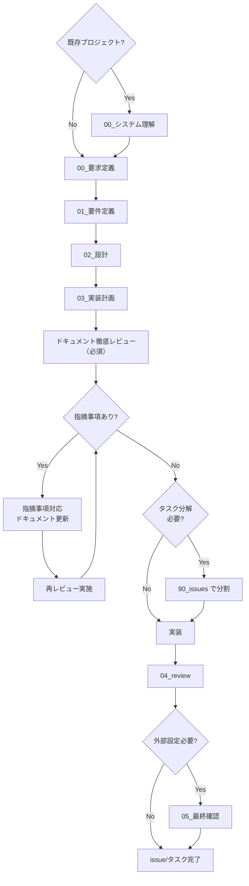

# AGENTS.md - 開発規約（AI 用）

> アジャイル＋ BDD 駆動の段階進行とファイル運用を強制する開発規約。**このドキュメントおよび `.agents/` 配下のルールは、すべて AI エージェントに伝えるためのものである。**

> 人間が背景・用語・原則の解説を読みたい場合は [`.agents/human/人間向け_開発規約.md`](./.agents/human/人間向け_開発規約.md) を参照。レビューフェーズ時は [`レビュールール.md`](./.agents/rules/レビュールール.md) を必ず参照すること。

---

## 本ドキュメントの責務

**AGENTS.md は規約の「入口」に限定する。** メイン・サブが実際に作業するのは CORE / LOAD_POLICY および委譲時に渡されるルールに従う。

- **メイン**: 最初に [CORE](.agents/boot/CORE.md) と [LOAD_POLICY](.agents/boot/LOAD_POLICY.md) を読む。フェーズごとに workers に Task/Constraints/OutputSpec で委譲する。詳細な実施手順は書かない。
- **フェーズの実施内容・完了条件・用語・命名規則**: [.agents/rules/ワークフローとフェーズ定義.md](.agents/rules/ワークフローとフェーズ定義.md) にあり、サブは委譲時に必要なルールを渡される。本ファイルにはフェーズの長文は書かず、参照のみとする。

---

## サブエージェント運用（MVP）— 本規約の動かし方

本規約は **サブエージェント基盤（MVP）** で運用する。チーム機能は後回しとする。

- **メインの入口**: 最初に [`.agents/boot/CORE.md`](./.agents/boot/CORE.md) と [`.agents/boot/LOAD_POLICY.md`](./.agents/boot/LOAD_POLICY.md) を読む。常時ロードは廃止し、LOAD_POLICY に従って必要なときだけ他のファイルを読む。
- **委譲**: フェーズごとの作業は workers に **Task / Constraints / OutputSpec** の 3 ブロックのみで委譲する。共通 I/F は [`.agents/boot/EXECUTION_CONTRACT.md`](./.agents/boot/EXECUTION_CONTRACT.md)、人格一覧は [`.agents/workers/README.md`](./.agents/workers/README.md)。委譲手順は [`.agents/skills/agent/delegate_to_sub.md`](./.agents/skills/agent/delegate_to_sub.md)。
- **トレーサビリティ（誰が何をしたか）**: **最初から必須**。各サブの実行後、メインはログ項目を**書記サブにだけ**委譲する。ログの記録は書記のみ。詳細は [`.agents/scribe/書記役とログ委譲.md`](./.agents/scribe/書記役とログ委譲.md)。ログ保存先・スキーマは [`.agents/ledger/README.md`](./.agents/ledger/README.md) および [`.agents/ledger/ワークフローログ_SQLiteスキーマ.md`](./.agents/ledger/ワークフローログ_SQLiteスキーマ.md) を参照。

以下「クイックリファレンス」以降は、上記サブエージェント運用に従いつつ参照すること。

---

## クイックリファレンス

### この規約で「絶対に守ること」4 つ

1. **「agentsに従う」＝応答は常に SILENT MODE**（会話への出力は**最大15行**、先頭に `🧠 Mode: SILENT MODE` を付与。詳細は `.workflow/` や `memo/` に書く。ユーザーが「詳細を」「全文を」と明示した場合を除く）
2. **すべての対応は `.workflow/{YYYYMMDD_HHMMSS_issue_name}/00_要求定義.md` から始める**（既存プロジェクト導入時は `.workflow/00_システム理解.md` から）
3. **フェーズを飛ばさない（00*システム理解（既存プロジェクト時のみ）→ 00 → 01 → 02 → 03 → 4.5 ドキュメント徹底レビュー（必須）→ 実装 → 04_review → 05*最終確認（外部設定が必要な場合のみ））**。各フェーズは**固定ゲート**とし、**提出物が揃うまで完了扱いにしない**。完了の定義（DoD）は証跡ベースで固定。詳細は [`.agents/rules/サブエージェント抜かし防止.md`](./.agents/rules/サブエージェント抜かし防止.md) を参照。
4. **ドキュメントと実装を常に同期させる（変更したら必ず該当 md を更新）**

### ワークフロー チートシート


```mermaid
flowchart TD
  START{"既存プロジェクト?"}
  SU["00_システム理解"]
  R0["00_要求定義"]
  R1["01_要件定義"]
  R2["02_設計"]
  R3["03_実装計画"]
  DR["ドキュメント徹底レビュー<br/>（必須）"]
  DR2{"指摘事項あり?"}
  DR3["指摘事項対応<br/>ドキュメント更新"]
  DR4["再レビュー実施"]
  TS{"タスク分解<br/>必要?"}
  R5["90_issues で分割"]
  E["実装"]
  RV["04_review"]
  FC{"外部設定必要?"}
  FC2["05_最終確認"]
  DONE["issue/タスク完了"]

  START -->|"Yes"| SU
  START -->|"No"| R0
  SU --> R0
  R0 --> R1
  R1 --> R2
  R2 --> R3
  R3 --> DR
  DR --> DR2
  DR2 -->|"Yes"| DR3
  DR3 --> DR4
  DR4 --> DR2
  DR2 -->|"No"| TS
  TS -->|"Yes"| R5
  TS -->|"No"| E
  R5 --> E
  E --> RV
  RV --> FC
  FC -->|"Yes"| FC2
  FC -->|"No"| DONE
  FC2 --> DONE
```

### 必須ファイル一覧

- `00_システム理解.md` … 既存システムの全体像（既存プロジェクト導入時のみ）
- `00_要求定義.md` … 何のための issue/タスクか（背景・目的・制約）
- `01_要件定義.md` … ユーザーストーリー＋受け入れ基準＋ BDD Feature/Scenario
- `02_設計.md` … アーキテクチャ / DB / API / インターフェース設計
- `03_実装計画.md` … タスク分解・優先度・テスト方針
- `04_review.md` … レビュー結果・指摘・対応履歴
- `05_最終確認チェックリスト.md` … 外部設定の確認（コード対応不可項目がある場合のみ）
- `90_issues.md` … 大きい issue を分割する場合のみ使う

### ディレクトリ命名ルール

- `.workflow/20251115_143022_nextjs移行/`
  - プレフィックスは **開始日時 `YYYYMMDD_HHMMSS_`**（日時プレフィックス必須）
  - issue 名は日本語 OK（ローマ字混在も可）
  - **注意**: 日時は issue/タスク開始日時（要求定義書作成日時）を使用する。ファイル作成時にシステムの現在日時を取得して使用する

### 原則（エンジニアが常に意識するのはこれだけ）

- **UNIX哲学（システム開発の土台）**: 一つのことをうまくやる・プログラム同士を組み合わせて動かす・入出力を標準化して疎結合に。設計・実装はこの考え方に基づく（詳細は[実装原則](#実装原則)を参照）。
- **KISS**: できるだけシンプルに
- **YAGNI**: 今いらないものは作らない
- それ以外（DRY, SOLID, クリーンアーキなど）は、複雑になってきたときに「道具箱から取り出す」（詳細は[実装原則](#実装原則)を参照）

---

## 基本方針

- **設計・実装の土台**: **UNIX哲学**（一つのことをうまくやる・組み合わせ可能・入出力を明確にして疎結合）。開発の基本方針はここに据える。
- **開発手法**: 振る舞い駆動・アジャイル＋BDD・テストファースト。プロダクションコードのみ。ドキュメントは常に更新。
- **抜かさない運用**: 工程を固定ゲート化し、各フェーズの**提出物（証跡）**を義務化する。提出物が揃わない限り完了扱いにしない。タスクは小さく切り、1 タスク＝1 成果物に寄せる。詳細は [`.agents/rules/サブエージェント抜かし防止.md`](./.agents/rules/サブエージェント抜かし防止.md) を参照。
- **外部連携**: Issue はローカルファイル（`.workflow/.../90_issues.md`）で管理。Github MCP は指示に従う。
- **ファイル操作**: 新規タスク開始時にリセット。編集前に内容を確認する。

---

## ワークフローとフェーズ進行

各フェーズの**実施内容・完了条件・用語定義・命名規則**は [.agents/rules/ワークフローとフェーズ定義.md](.agents/rules/ワークフローとフェーズ定義.md) を参照すること。メインは CORE と LOAD_POLICY に従い、フェーズごとに workers に委譲する。

---

## ファイルテンプレート

テンプレートは `.workflow/templates/` をコピーして使用する。必須セクション・フォーマットは各テンプレート先頭および [`.agents/ドキュメントルール.md`](./.agents/rules/ドキュメントルール.md) を参照。

### テンプレート一覧（要約）

| ファイル | 用途 | 備考 |
|----------|------|------|
| `00_システム理解.md` | 既存システムの全体像 | 既存プロジェクト導入時のみ |
| `00_要求定義.md` | 要求定義 | 次のステップ→01。既存時は参考資料に00_システム理解 |
| `01_要件定義.md` | 要件定義 | 前のステップ→00、次のステップ→02 |
| `02_設計.md` | 設計 | 前のステップ→01、次のステップ→03 |
| `03_実装計画.md` | 実装計画 | 前のステップ→02、次のステップ→90_issues または実装 |
| `90_issues.md` | issue 一覧 | 分割時のみ。参考資料に親の 00〜03 へのリンク |
| `04_review.md` | レビュー | 前のステップ→03 |
| `99_PR.md` | PR メッセージ | **参照パスは外部のみ**（完了後 issue 移動のため） |
| `05_最終確認チェックリスト.md` | 外部設定確認 | コード対応不可項目がある場合のみ |
| `指摘対応/` | PR 指摘一覧 | [GitHub_PR指摘取得.md](./.agents/GitHub_PR指摘取得.md) 参照 |
| `github/` | Copilot・CodeRabbit 用 | [GitHub_Copilot対応.md](./.agents/GitHub_Copilot対応.md)・[GitHub_CodeRabbit対応.md](./.agents/GitHub_CodeRabbit対応.md) 参照 |

---

## 実装原則

**システム開発では UNIX哲学を土台とする**（一つのことをうまくやる・組み合わせ可能・入出力を明確にして疎結合）。その上で原則は **KISS / YAGNI** を最優先する。それ以外（DRY, SOLID, クリーンアーキ等）は複雑になってきたときに「道具箱から取り出す」。各フェーズの「意識すべき原則」は下表を参照。詳細な解説は [`.agents/human/人間向け_実装原則.md`](./.agents/human/人間向け_実装原則.md)（人間向け）。

| 原則                   | 主な焦点             | 適用場面                  | 適用推奨度             | ワークフローでの適用フェーズ             |
| ---------------------- | -------------------- | ------------------------- | ---------------------- | ---------------------------------------- |
| **UNIX哲学**           | 単一責任・連携・疎結合 | 設計・実装全般（システムの形） | **常に適用**           | 要求定義、要件定義、設計、実装計画、実装 |
| KISS                   | シンプルさ           | 実装・設計全般            | **常に適用**           | 要求定義、要件定義、設計、実装計画、実装 |
| YAGNI                  | 必要性に基づく開発   | 要件定義・実装            | **常に適用**           | 要求定義、要件定義、設計、実装計画、実装 |
| DRY                    | コードの重複排除     | 実装レベル                | 適度に適用             | 要件定義、設計、実装                     |
| クリーンアーキテクチャ | 依存関係と層の分離   | 中規模以上の issue/タスク | 中規模以上で検討       | 設計、実装計画、実装                     |
| SOLID                  | オブジェクト指向設計 | 設計レベル                | 複雑な設計で適用       | 要件定義、設計、実装計画、実装           |
| GRASP                  | 責務の割り当て       | オブジェクト指向設計      | 複雑な設計で適用       | 要件定義、設計、実装計画、実装           |
| Law of Demeter         | 依存関係の削減       | オブジェクト間通信        | 必要に応じて適用       | 設計、実装計画、実装                     |
| CoC                    | 規約の活用           | フレームワーク開発        | フレームワーク使用時   | 設計、実装計画、実装                     |
| PoLA                   | 直感性・予測可能性   | API/UI 設計               | UI/API 設計時          | 要求定義、要件定義、設計、実装計画、実装 |
| TDAE                   | カプセル化           | オブジェクト指向実装      | オブジェクト指向設計時 | 設計、実装計画、実装                     |

### ドキュメント原則

- **常に更新**: ドキュメントと実装は同期させる。テンプレート（`.workflow/templates/`）との整合性、参照パス確認、前のステップ/次のステップセクション、メモは `memo/YYYYMMDD_HHMMSS_*.md` 形式を守る。
- **Mermaid**: 作成時は [`.agents/Mermaid図ルール.md`](./.agents/Mermaid図ルール.md) を参照。
- **会話出力**: SILENT MODE（最大15行・先頭に `🧠 Mode: SILENT MODE`）、長文は `.workflow/` や `memo/` に書く。詳細は [`.agents/実行ルール.md`](./.agents/rules/実行ルール.md) のハード制約を参照。
- **詳細（参照パス・前のステップ/次のステップ・日付・チェックリスト等）**: [`.agents/ドキュメントルール.md`](./.agents/rules/ドキュメントルール.md) および [`.agents/実行ルール.md`](./.agents/rules/実行ルール.md) を参照。

### 実行ポリシー

- **開発手法**: アジャイル＋ BDD 駆動開発
- **段階的進行**: インクリメンタルに実装
- **並列実行禁止**: 一度に一つのタスクに集中
- **エラー処理**: エラー発生時は報告し、次に進む前に解決
- **追加機能禁止**: 要件外の機能は実装しない

### テスト原則

**重要**: テスト作成・レビューについては、詳細なガイドラインを [`テストガイドライン.md`](./.agents/rules/テストガイドライン.md) に記載しています。必ず参照すること。

- **テストファースト**: 実装前にテストを書く
- **BDD ベース**: Given-When-Then 形式でユースケース（Feature）とシナリオ（Scenario）を定義。ユースケースの中に複数のシナリオを含める
- **単体テスト必須**: すべての機能に単体テストを実装
- **プロダクションレディ**: テストは本番環境と同じ条件で実行
- **正常系は動いて当たり前**: 異常系・境界値に重点を置く。正常系は最小限で OK
- **バリデーションは網羅的に**: バリデーション系のテストは漏れなく実施
- **運用保守に耐えうるテスト**: 実装の詳細に依存せず、値の変更に強いテスト設計
- **テストコード内での BDD 形式コメント**: すべてのテストコード内で、BDD 形式（Given-When-Then-And）のコメントを記載する
  - **Given**: テストの前提条件（初期状態、準備データ等）
  - **When**: テスト対象の動作（実行する操作、関数呼び出し等）
  - **Then**: 期待される結果（アサーション、期待値等）
  - **And**: 追加の前提条件や期待結果（複数の条件がある場合）
  - **記載形式**: コメントとして `// Given: ...`, `// When: ...`, `// Then: ...`, `// And: ...` の形式で記載
  - **目的**: テストの意図を明確化し、保守性と可読性を向上させる

---

## システム構成

### Issue/タスク構造

リポジトリのルートディレクトリに `.workflow/` ディレクトリを作成し、ワークフローファイルを管理します。

```
リポジトリルート/
├── （ソースコード）
└── .workflow/             # ワークフローファイル
    ├── 00_システム理解.md  # システム理解（既存プロジェクト導入時のみ）
    └── {YYYYMMDD_HHMMSS_issue_name}/  # issue/タスクディレクトリ（日時プレフィックス付き）
        ├── 00_要求定義.md        # 要求定義（必ず最初に作成）
        ├── 01_要件定義.md        # 要件定義
        ├── 02_設計.md            # 設計
        ├── 03_実装計画.md        # 実装計画
        ├── 04_review.md          # レビュー（実装完了後）
        ├── 05_最終確認チェックリスト.md  # 最終確認チェックリスト（コード対応不可項目がある場合のみ）
        ├── 90_issues.md          # issue 一覧（大きな issue/タスクを分割する場合のみ）
        ├── memo/                 # メモ（調査結果、検証結果、バックログ課題案など）
        │   └── YYYYMMDD_HHMMSS_ファイル名.md  # 日時プレフィックス付きファイル名
        └── 90_issues/            # 各 issue のディレクトリ（issue/タスクを分割する場合のみ）
            └── {nested_issue_name}/
                ├── 00_要求定義.md    # 親 issue と同じテンプレートを使用
                ├── 01_要件定義.md    # 親 issue と同じテンプレートを使用
                ├── 02_設計.md        # 親 issue と同じテンプレートを使用
                ├── 03_実装計画.md    # 親 issue と同じテンプレートを使用
                ├── 04_review.md      # 親 issue と同じテンプレートを使用
                ├── 90_issues.md     # ネストされた issue やタスクの一覧（該当する場合）
                └── 90_issues/       # ネストされた issue やタスクのディレクトリ（該当する場合）
                    └── {nested_issue_name}/
                        ├── 00_要求定義.md
                        ├── 01_要件定義.md
                        ├── 02_設計.md
                        ├── 03_実装計画.md
                        ├── 04_review.md
                        └── （さらにネスト可能）
```

**注意**:

- `00_システム理解.md`は、既存プロジェクトに途中から導入する場合や、他ベンダーが作成したシステムを改修・機能追加する場合のみ作成する。新規プロジェクトの場合は不要。
- `05_最終確認チェックリスト.md`は、コードでは対応できない外部設定（GTM、GA4、AWS Amplify 等）が必要な場合のみ作成する。すべてのプロジェクトで必要とは限らない。
- issue/タスクディレクトリ名は日時プレフィックス（`YYYYMMDD_HHMMSS_`）を付与する（例: `20251115_143022_nextjs移行`）。日時はディレクトリ作成時にシステムの現在日時を取得して使用する。
- issue/タスク自体が 1 つの単位として完結する場合は、`90_issues.md` と `90_issues/`（または `90_tasks/`）ディレクトリは不要。issue/タスクを複数の小さな issue/タスクに分割する場合のみ使用する。
- issue やタスクは、必要に応じてさらに細かい issue やタスクに分割することができる。大きな issue の中に `90_issues.md` と `90_issues/` ディレクトリを作成し、ネストされた issue やタスクを管理することができる。

### 規約ファイルの配置と優先順位

実行ルール（AGENTS_*.md）は次のように配置する。

- **`.agents/`** - 汎用ルール。テンプレートとしてそのまま使う（変更しない）。採用先ではコピーしたまま利用する。配下は役割別サブディレクトリ（boot, rules, scribe, ledger, prompts, guide, platform, human, workers, capabilities, skills）に整理する。構成・コピー手順は [.agents/README.md](./.agents/README.md) を参照。
- **`.agents-project/`** - プロジェクト固有ルールを置くディレクトリ。採用先でプロジェクトごとの規約を追加する場合は、ここにファイルを作成する。`.agents/` と分離することで扱いやすくする。

**優先順位**: **`.agents-project/` 配下のルールが `.agents/` のルールより優先される。** 同名または同目的のルールがある場合は、`.agents-project/` のファイルを採用する。該当ファイルが .agents-project にない場合は、`.agents/` の標準ルールに従う。これにより、テンプレートはそのまま使いつつ、プロジェクト固有の記述だけを .agents-project で管理でき、運用が楽になる。

詳細は [`.agents-project/README.md`](./.agents-project/README.md) を参照。

### 成果物ファイルの運用（オプショナル）

オプション。`docs/`（run/・tasks/・review 等）の運用は [`.agents/実行ルール.md`](./.agents/rules/実行ルール.md) 等を参照。

---

## 補足参照（AI は必要時のみ）

- **開発環境・テスト・コマンド・トラブルシューティング**: 各リポジトリの README および [`.agents/テストガイドライン.md`](./.agents/rules/テストガイドライン.md) を参照。
- **アーキテクチャ**: 各 issue の `02_設計.md` を参照。
- **コーディング規約**: [`.agents/コーディングルール.md`](./.agents/rules/コーディングルール.md) を参照。

---

## 参考資料

使用する技術スタックに応じて、適切な参考資料を参照してください。

### AGENTS 規約ドキュメント

- [`.agents-project/README.md`](./.agents-project/README.md) - プロジェクト固有ルールの配置場所。**.agents-project 配下のルールは .agents/ より優先される。**
- [`実行ルール.md`](./.agents/rules/実行ルール.md) - LLM エージェント運用ルール
- [`サイレントモードガイド.md`](./.agents/guide/サイレントモードガイド.md) - SILENT MODE 運用ガイド（省トークン運用）
- [`初期化プロンプト.md`](./.agents/prompts/初期化プロンプト.md) - 最短初期化プロンプト（Cursor / Claude Code 用）
- [`Issue実行テンプレート.md`](./.agents/prompts/Issue実行テンプレート.md) - Issue 実行テンプレート（1行指示パターン）
- [`コーディングルール.md`](./.agents/rules/コーディングルール.md) - コーディングルール（型安全性、テスト容易性、コード品質）
- [`ドキュメントルール.md`](./.agents/rules/ドキュメントルール.md) - システム仕様書（docs/）作成・更新ルール
- [`レビュールール.md`](./.agents/rules/レビュールール.md) - レビュー時の徹底的な品質調査ルール
- [`テストガイドライン.md`](./.agents/rules/テストガイドライン.md) - テスト作成ガイドライン
- [`Mermaid図ルール.md`](./.agents/rules/Mermaid図ルール.md) - Mermaid 図作成規約
- [`Storybookルール.md`](./.agents/rules/Storybookルール.md) - Storybook / デザインシステム運用規約
- [`GitHub_PR指摘取得.md`](./.agents/rules/GitHub_PR指摘取得.md) - GitHub PR 指摘取得ルール
- [`GitHub_Copilot対応.md`](./.agents/rules/GitHub_Copilot対応.md) - GitHub Copilot 対応（汎用版・リポジトリ指示の構成・フォーマット・運用）
- [`GitHub_CodeRabbit対応.md`](./.agents/rules/GitHub_CodeRabbit対応.md) - CodeRabbit レビュー対象外設定（.workflow / .agents / .agents-project）・応答言語（日本語）・テンプレート配置
- [`CLAUDE_サブエージェントとMCPおよびエージェントチーム.md`](./.agents/platform/CLAUDE_サブエージェントとMCPおよびエージェントチーム.md) - サブエージェント・MCP・エージェントチームの推奨設定とスコープ方針（グローバル＝MCP・サブエージェント、エージェントチームは方法のみ）
- **ワークフロー・フェーズ詳細**: [`.agents/rules/ワークフローとフェーズ定義.md`](./.agents/rules/ワークフローとフェーズ定義.md) - 各フェーズの実施内容・完了条件・用語・命名規則。
- **サブエージェント運用（MVP）**: [`.agents/boot/CORE.md`](./.agents/boot/CORE.md) - 絶対制約・入口。[`.agents/boot/LOAD_POLICY.md`](./.agents/boot/LOAD_POLICY.md) - いつ何を読むか・フェーズ→worker。[`.agents/boot/EXECUTION_CONTRACT.md`](./.agents/boot/EXECUTION_CONTRACT.md) - 委譲の入出力 3 ブロック。[`.agents/scribe/書記役とログ委譲.md`](./.agents/scribe/書記役とログ委譲.md) - ログは書記のみ・トレーサビリティ必須。[`.agents/ledger/README.md`](./.agents/ledger/README.md) - ログ保存（workflow.db）。[`.agents/workers/README.md`](./.agents/workers/README.md) - 6 人格の IN/OUT。

### 一般的な参考資料

- **フレームワーク**: 使用するフレームワークの公式ドキュメント
- **言語**: 使用するプログラミング言語の公式ドキュメント
- **テスト**: 使用するテストフレームワークの公式ドキュメント
- **ツール**: 使用する開発ツールの公式ドキュメント

### リポジトリ固有の参考資料

各リポジトリの README やドキュメントに記載されている参考資料を参照してください。

---

**最終更新**: 2026 年 3 月 3 日（サブエージェント運用 MVP を本流化：入口を boot/CORE・LOAD_POLICY に変更、委譲は Task/Constraints/OutputSpec、トレーサビリティ必須・書記へログ委譲。参考資料に boot・書記役・ledger を追加）
