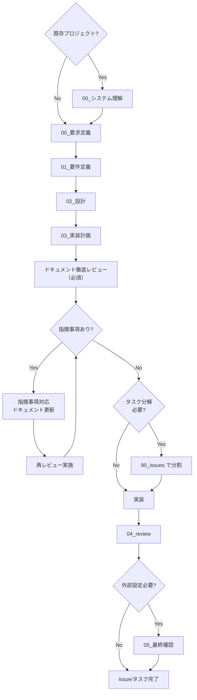

# AGENTS.md - 開発規約（AI 用）

> アジャイル＋ BDD 駆動の段階進行とファイル運用を強制する開発規約。**このドキュメントおよび `.agents/` 配下のルールは、すべて AI エージェントに伝えるためのものである。**
> **責務**: **AGENTS.md = プロジェクトルート入口、人間と AI の導線**。内部構造の詳細は [.agents/README.md](.agents/README.md) を参照。**定義しない**: boot/ の絶対制約・読込順、platforms の実行差分、RULES の判断観点の細則。

> 人間が背景・用語・原則の解説を読みたい場合は [`.agents/human/人間向け_開発規約.md`](./.agents/human/人間向け_開発規約.md) を参照。レビューフェーズ時は [RULES](.agents/RULES.md)（レビュー節）を参照すること。

**命題（全体を通じて）**: 本規約に従う**システム開発は常に UNIX 哲学に基づく**。要求定義から実装・レビューまで、あらゆる判断の前提とする。詳細は [CONCEPTS](.agents/CONCEPTS.md)。

---

## ⚠ 実行前契約（AI は必ず守ること）

**「agentsに従って」または本規約に従う場合、以下を破ってはならない。**

- **禁止**: 次の 4 ファイルを**読了するまで**、ワークフロー開始・フェーズ進行・コード変更・委譲・成果物作成を**行ってはならない**。未読のまま行ったアクションは規約上無効とする。
  1. [.agents/boot/CORE.md](.agents/boot/CORE.md)
  2. [.agents/boot/LOAD_POLICY.md](.agents/boot/LOAD_POLICY.md)
  3. [.agents/WORKFLOW.md](.agents/WORKFLOW.md)
  4. [.agents/CONCEPTS.md](.agents/CONCEPTS.md)
- **確認**: 読了したうえで着手する。着手時は応答冒頭で短く確認すること（例: `🧠 Mode: SILENT MODE` の次に「CORE/LOAD_POLICY/WORKFLOW/CONCEPTS に従い、…」と 1 行）。ユーザーが「規約は読んだ前提で」と明示した場合のみ省略可。
- **目的**: 思想・方法論・フォーマット・成果物を AI が確実に認識し、規約を守ったうえでだけ動作させる。

---

## どこを変えれば何が変わるか（変更マップ）

肥大化を避けるため、**変更したい対象ごとに見るファイルを1つに絞る**。

| 変えたいもの | 見る・編集するファイル |
|--------------|-------------------------|
| 絶対制約・委譲の境界・出力形式 | [.agents/boot/CORE.md](.agents/boot/CORE.md) |
| いつ何を読むか・誰に委譲するか | [.agents/boot/LOAD_POLICY.md](.agents/boot/LOAD_POLICY.md) |
| 委譲の形（Task/Constraints/OutputSpec） | [.agents/boot/EXECUTION_CONTRACT.md](.agents/boot/EXECUTION_CONTRACT.md)、[delegate_to_sub](.agents/skills/agent/delegate_to_sub.md) |
| **ワークフロー・フェーズ・必須成果物・DoD・監査観点** | [.agents/WORKFLOW.md](.agents/WORKFLOW.md) |
| **思想・概念・哲学・観点・アーキテクチャ** | [.agents/CONCEPTS.md](.agents/CONCEPTS.md) |
| 実行・ドキュメント・テスト・レビュー（要約） | [.agents/RULES.md](.agents/RULES.md)。詳細は RULES.md / WORKFLOW.md で足りる。必要時は .review/ を参照。 |
| 実行基盤ごとの差分（Cursor/Claude Code/OpenAI/Gemini） | [.agents/platforms/README.md](.agents/platforms/README.md) および該当 platform ファイル |

守るべきものは**ワークフロー・思想・概念・アーキテクチャ・哲学・フォーマット・成果物**。これらは CORE / WORKFLOW / CONCEPTS に集約している。

---

## 本ドキュメントの責務

**AGENTS.md は規約の「入口」に限定する。** メイン・サブが実際に従う絶対制約と読込順は CORE と LOAD_POLICY にあり、委譲時には Task/Constraints/OutputSpec で渡されるルールに従う。

- **メイン**: 実行前契約に従い、CORE → LOAD_POLICY → WORKFLOW → CONCEPTS の 4 つを必ず読了してから作業する。フェーズごとに workers に Task/Constraints/OutputSpec で委譲する。

---

## サブエージェント運用（MVP）— 本規約の動かし方

本規約は **サブエージェント基盤（MVP）** で運用する。

- **入口**: 実行前契約の 4 ファイル（CORE → LOAD_POLICY → WORKFLOW → CONCEPTS）を読了するまで作業開始禁止。読了後は LOAD_POLICY に従い必要なときだけ他を読む。
- **委譲**: フェーズごとの作業は workers に **Task / Constraints / OutputSpec** の 3 ブロックのみで委譲する。共通 I/F は [EXECUTION_CONTRACT](.agents/boot/EXECUTION_CONTRACT.md)。委譲手順は [delegate_to_sub](.agents/skills/agent/delegate_to_sub.md)。人格一覧は [workers/README](.agents/workers/README.md)。
- **トレーサビリティ**: 各サブの実行後、メインはログ項目を**書記サブにだけ**委譲する。**ログは workflow.db（SQLite）への保存を強制**。書記のみが workflow.db に記録する。書記未使用時は memo に暫定記録（のちに workflow.db へ移行前提）。詳細は [書記役とログ委譲](.agents/scribe/書記役とログ委譲.md)、[ledger/README](.agents/ledger/README.md)。

以下「クイックリファレンス」は、上記に従いつつ必要に応じて参照すること。

---

## クイックリファレンス

### 判断時の問い

1. シンプルにできないか
2. 今のスコープに本当に必要か
3. 責務が混ざっていないか
4. 変更影響を局所化できているか
5. 証跡で説明できるか

### 絶対に守ること

**CORE に書かれた絶対制約に従う。** 要約は [CORE](.agents/boot/CORE.md) を参照。

### ワークフロー チートシート

```mermaid
flowchart TD
  START{"既存プロジェクト?"}
  SU["00_システム理解"]
  R0["00_要求定義"]
  R1["01_要件定義"]
  R2["02_設計"]
  R3["03_実装計画"]
  DR["ドキュメント徹底レビュー<br/>（必須）"]
  DR2{"指摘事項あり?"}
  DR3["指摘事項対応<br/>ドキュメント更新"]
  DR4["再レビュー実施"]
  TS{"タスク分解<br/>必要?"}
  R5["90_issues で分割"]
  E["実装"]
  RV["04_review"]
  FC{"外部設定必要?"}
  FC2["05_最終確認"]
  DONE["issue/タスク完了"]

  START -->|"Yes"| SU
  START -->|"No"| R0
  SU --> R0
  R0 --> R1
  R1 --> R2
  R2 --> R3
  R3 --> DR
  DR --> DR2
  DR2 -->|"Yes"| DR3
  DR3 --> DR4
  DR4 --> DR2
  DR2 -->|"No"| TS
  TS -->|"Yes"| R5
  TS -->|"No"| E
  R5 --> E
  E --> RV
  RV --> FC
  FC -->|"Yes"| FC2
  FC -->|"No"| DONE
  FC2 --> DONE
```

### 必須ファイル・ディレクトリ命名・原則（要約）

- **必須ファイル**: `00_要求定義.md`（必ず最初）、`01_要件定義.md`、`02_設計.md`、`03_実装計画.md`、`04_review.md`。既存時は `00_システム理解.md`。分割時は `90_issues.md`。外部設定時は `05_最終確認チェックリスト.md`。一覧は [WORKFLOW](.agents/WORKFLOW.md)。
- **ディレクトリ命名**: `.workflow/{YYYYMMDD_HHMMSS_issue_name}/`。日時プレフィックス必須。
- **原則**: UNIX哲学・KISS・YAGNI を土台に。思想・観点は [CONCEPTS](.agents/CONCEPTS.md) を参照。

---

## 基本方針（要約）

- **設計・実装の土台**: UNIX哲学（単一責任・連携・疎結合）。KISS / YAGNI 最優先。
- **抜かさない運用**: 工程を固定ゲート化し、提出物（証跡）を義務化。詳細は [WORKFLOW](.agents/WORKFLOW.md)。
- **その他**: 開発手法・外部連携・ファイル操作の詳細は [RULES](.agents/RULES.md) を参照。

---

## ワークフローとフェーズ進行

各フェーズの**実施内容・完了条件・用語・命名規則**は [WORKFLOW](.agents/WORKFLOW.md) を参照すること。メインは CORE と LOAD_POLICY に従い、フェーズごとに workers に委譲する。

---

## ファイルテンプレート（強制）

**テンプレートが存在する場合は必ずテンプレートを使用する。** `.workflow/templates/` の該当ファイルをコピーしたうえで編集し、必須セクション・フォーマットを維持する。一から作成してはならない。テスト・各種ドキュメントのフォーマットも [RULES テンプレート・フォーマット強制](.agents/RULES.md) に従う。

---

## 実装・ドキュメント・テスト・実行（要約）

- **実装原則**: UNIX哲学を土台に KISS/YAGNI 最優先。原則の一覧・適用場面は [人間向け_実装原則](.agents/human/人間向け_実装原則.md) を参照。
- **ドキュメント・実行・テスト**: ドキュメントと実装の同期、Mermaid、SILENT MODE、テストファースト・BDD 等の詳細は [RULES](.agents/RULES.md) を参照。

---

## システム構成（要約）

- **Issue/タスク構造**: `.workflow/{YYYYMMDD_HHMMSS_issue_name}/` 配下に 00〜04、memo、90_issues 等。構成の詳細は [WORKFLOW](.agents/WORKFLOW.md) を参照。
- **規約の配置**: `.agents/` は汎用ルール、`.agents-project/` はプロジェクト固有（.agents-project が優先）。詳細は [.agents/README](.agents/README.md)、[.agents-project/README](.agents-project/README.md) を参照。

---

## 補足参照（AI は必要時のみ）

- 開発環境・テスト・コーディング規約・アーキテクチャ: 各リポジトリの README および [RULES](.agents/RULES.md)。各 issue の `02_設計.md`。

---

## 参考資料

- **変更マップ・ワークフロー・思想**: [WORKFLOW](.agents/WORKFLOW.md)、[CONCEPTS](.agents/CONCEPTS.md)（まずここで「どこを変えるか」を把握）
- **入口・絶対制約・読込順**: [CORE](.agents/boot/CORE.md)、[LOAD_POLICY](.agents/boot/LOAD_POLICY.md)、[EXECUTION_CONTRACT](.agents/boot/EXECUTION_CONTRACT.md)
- **委譲・書記・ledger**: [delegate_to_sub](.agents/skills/agent/delegate_to_sub.md)、[書記役とログ委譲](.agents/scribe/書記役とログ委譲.md)、[ledger/README](.agents/ledger/README.md)、[workers/README](.agents/workers/README.md)
- **実行・ドキュメント・レビュー・テスト・その他**: [RULES](.agents/RULES.md)、[WORKFLOW](.agents/WORKFLOW.md)、[CONCEPTS](.agents/CONCEPTS.md)。詳細は RULES.md / WORKFLOW.md で足りる。必要時は .review/ を参照。

---

**最終更新**: 2026 年 3 月 6 日（入口スリム化：絶対制約は CORE 参照に集約、クイックリファレンス縮約、長文は他ファイル参照に寄せた）
