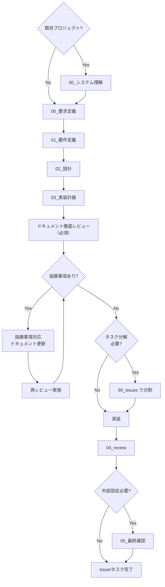
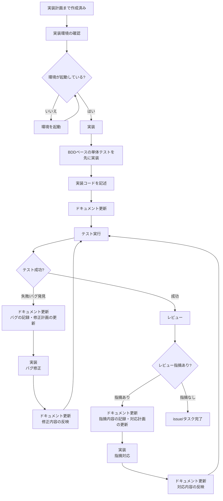

# AGENTS.md - 開発規約（AI 用）

> アジャイル＋ BDD 駆動の段階進行とファイル運用を強制する開発規約。**このドキュメントおよび `.agents/` 配下のルールは、すべて AI エージェントに伝えるためのものである。**

> 人間が背景・用語・原則の解説を読みたい場合は [`.agents/人間向け_開発規約.md`](./.agents/人間向け_開発規約.md) を参照。レビューフェーズ時は [`レビュールール.md`](./.agents/レビュールール.md) を必ず参照すること。

---

## クイックリファレンス

### この規約で「絶対に守ること」4 つ

1. **「agentsに従う」＝応答は常に SILENT MODE**（会話への出力は**最大15行**、先頭に `🧠 Mode: SILENT MODE` を付与。詳細は `.workflow/` や `memo/` に書く。ユーザーが「詳細を」「全文を」と明示した場合を除く）
2. **すべての対応は `.workflow/{YYYYMMDD_HHMMSS_issue_name}/00_要求定義.md` から始める**（既存プロジェクト導入時は `.workflow/00_システム理解.md` から）
3. **フェーズを飛ばさない（00*システム理解（既存プロジェクト時のみ）→ 00 → 01 → 02 → 03 → 実装 → 04_review → 05*最終確認（外部設定が必要な場合のみ））**
4. **ドキュメントと実装を常に同期させる（変更したら必ず該当 md を更新）**

### ワークフロー チートシート


```mermaid
flowchart TD
  START{"既存プロジェクト?"}
  SU["00_システム理解"]
  R0["00_要求定義"]
  R1["01_要件定義"]
  R2["02_設計"]
  R3["03_実装計画"]
  DR["ドキュメント徹底レビュー<br/>（必須）"]
  DR2{"指摘事項あり?"}
  DR3["指摘事項対応<br/>ドキュメント更新"]
  DR4["再レビュー実施"]
  TS{"タスク分解<br/>必要?"}
  R5["90_issues で分割"]
  E["実装"]
  RV["04_review"]
  FC{"外部設定必要?"}
  FC2["05_最終確認"]
  DONE["issue/タスク完了"]

  START -->|"Yes"| SU
  START -->|"No"| R0
  SU --> R0
  R0 --> R1
  R1 --> R2
  R2 --> R3
  R3 --> DR
  DR --> DR2
  DR2 -->|"Yes"| DR3
  DR3 --> DR4
  DR4 --> DR2
  DR2 -->|"No"| TS
  TS -->|"Yes"| R5
  TS -->|"No"| E
  R5 --> E
  E --> RV
  RV --> FC
  FC -->|"Yes"| FC2
  FC -->|"No"| DONE
  FC2 --> DONE
```

### 必須ファイル一覧

- `00_システム理解.md` … 既存システムの全体像（既存プロジェクト導入時のみ）
- `00_要求定義.md` … 何のための issue/タスクか（背景・目的・制約）
- `01_要件定義.md` … ユーザーストーリー＋受け入れ基準＋ BDD Feature/Scenario
- `02_設計.md` … アーキテクチャ / DB / API / インターフェース設計
- `03_実装計画.md` … タスク分解・優先度・テスト方針
- `04_review.md` … レビュー結果・指摘・対応履歴
- `05_最終確認チェックリスト.md` … 外部設定の確認（コード対応不可項目がある場合のみ）
- `90_issues.md` … 大きい issue を分割する場合のみ使う

### ディレクトリ命名ルール

- `.workflow/20251115_143022_nextjs移行/`
  - プレフィックスは **開始日時 `YYYYMMDD_HHMMSS_`**（日時プレフィックス必須）
  - issue 名は日本語 OK（ローマ字混在も可）
  - **注意**: 日時は issue/タスク開始日時（要求定義書作成日時）を使用する。ファイル作成時にシステムの現在日時を取得して使用する

### 原則（エンジニアが常に意識するのはこれだけ）

- **KISS**: できるだけシンプルに
- **YAGNI**: 今いらないものは作らない
- それ以外（DRY, SOLID, クリーンアーキなど）は、複雑になってきたときに「道具箱から取り出す」（詳細は[実装原則](#実装原則)を参照）

---

## 基本方針

- **開発手法**: 振る舞い駆動・アジャイル＋BDD・テストファースト。プロダクションコードのみ。ドキュメントは常に更新。
- **外部連携**: Issue はローカルファイル（`.workflow/.../90_issues.md`）で管理。Github MCP は指示に従う。
- **ファイル操作**: 新規タスク開始時にリセット。編集前に内容を確認する。

---

## ワークフローとフェーズ進行

### 用語定義

- **issue**: チケットや Pull Request と 1:1 で対応することを想定した「大きめの単位」。Git 管理やチケットツールと連動させる単位として使用する
- **タスク**: issue を分解した実作業単位。`03_実装計画.md` 内で洗い出す個別の作業項目
- **使い分け**: このドキュメントでは、特に区別が重要な場合以外は「issue/タスク」と併記してよい。規模や管理方法に応じて、適切な粒度で使い分けること

### Issue/タスク名の命名規則

**Issue またはタスク名は日本語を使用する**。ディレクトリ名として使用する場合は、**日時プレフィックス（YYYYMMDD_HHMMSS\_）を付与**し、必要に応じてローマ字や英語に変換する。

**日時プレフィックスの形式**: `YYYYMMDD_HHMMSS_`（例: `20251115_143022_`）

**例**:

- Issue/タスク名: `Next.js移行`
- ディレクトリ名: `20251115_143022_nextjs移行` または `20251115_143022_nextjs-migration`

**注意**:

- 日時は issue/タスク開始日時（要求定義書作成日時）を使用する
- **必須事項**: 日時は**ディレクトリ作成時にシステムの現在日時を取得して使用する**（ディレクトリ作成時に`date +"%Y%m%d_%H%M%S"`コマンド等で現在日時を取得し、その日時をディレクトリ名に使用する。ディレクトリ作成後にディレクトリ名を変更する必要はない）
- **禁止事項**:
  - `YYYYMMDD_`形式（日付のみ）のディレクトリ名は**絶対に使用しない**
  - 日時プレフィックスなしのディレクトリ名は**絶対に使用しない**
  - 推測や記憶に基づく日時の記載は**禁止**

**プロジェクトと Issue/タスクの関係**:

- **Issue/タスク**: ワークフローを適用する単位。1 つの issue/タスクが 1 つのプロジェクトである場合もあれば、1 つのプロジェクトが複数の issue/タスクに分割される場合もある。
- **プロジェクト**: 複数の issue/タスクをまとめる概念。プロジェクト全体を管理する場合は、プロジェクト名でディレクトリを作成し、その中に issue/タスクを配置することもできる。
- **使い分け**: プロジェクトという概念を使わず、issue/タスクのみで管理することも可能。プロジェクトの規模や管理方法に応じて、適切な粒度で使い分けること。

#### ディレクトリ命名規則まとめ

| 対象                  | 例                                                                      | 備考                                                                 |
| --------------------- | ----------------------------------------------------------------------- | -------------------------------------------------------------------- |
| issue/タスク直下      | `.workflow/20251115_143022_nextjs移行/`                                 | 先頭に開始日時の `YYYYMMDD_HHMMSS_` を付与（日時プレフィックス必須） |
| 親 issue 内の子 issue | `.workflow/20251115_143022_nextjs移行/90_issues/01_api-endpoint/`       | **優先度順に連番（2 桁）を付与**（例: `01_`, `02_`）                 |
| memo                  | `.workflow/20251115_143022_nextjs移行/memo/20251123_081010_調査結果.md` | `YYYYMMDD_HHMMSS_タイトル.md`                                        |

### フェーズ定義

各フェーズは順次進行し、**前フェーズの完了条件を満たした時点で次フェーズに進む**。

**フェーズ進行の手順**:

1. **前フェーズの完了条件を確認**: 各フェーズの「完了条件」を確認し、すべて満たしていることを確認する
2. **次フェーズに進む**: 完了条件を満たした時点で、次フェーズの実施内容に従って作業を開始する
3. **ドキュメントの更新**: 各フェーズの実施内容に従って、関連するドキュメントを更新する（[実装原則](#実装原則)の「ドキュメント原則」を参照）

**重要**: すべての issue/タスク対応は、必ず要求定義書から開始すること。複数の issue/タスクをまとめて管理する場合も、各 issue/タスクは個別に要求定義書から開始する。

**既存プロジェクト・他ベンダー製システムへの導入時**: 既存プロジェクトに途中から導入する場合や、他ベンダーが作成したシステムを改修する場合は、**システム理解フェーズ**を先に実施すること。詳細は[システム理解フェーズ](#システム理解フェーズ)を参照。

#### 0. システム理解（system_understanding）

**注意**: このフェーズは、**既存プロジェクトに途中から導入する場合**や**他ベンダーが作成したシステムを改修・機能追加する場合**にのみ実施する。新規プロジェクトの場合は、このフェーズをスキップして[要求定義](#0-要求定義requirements_definition)に進む。

**必須ファイル**: `.workflow/00_システム理解.md`（プロジェクトルート）

**実施内容**:

- 既存システムの全体像を把握する
- アーキテクチャ、技術スタック、データベース構造、API 設計などの現状を分析
- 既存ドキュメント（README、設計書、API 仕様書等）の確認
- 必要に応じてステークホルダーへのヒアリング実施
- システム理解の結果をドキュメント化
- **ドキュメント更新**: システム理解が深まった場合や、新たな情報が得られた場合は、`00_システム理解.md`を即座に更新する（[実装原則](#実装原則)の「ドキュメント原則」を参照）

**意識すべき原則**（詳細は [実装原則](#実装原則) を参照）:

- **必須**: KISS / YAGNI
- **余裕があれば**: DRY（既存ドキュメントの重複を避ける）

**完了条件**: システム理解ファイル（`00_システム理解.md`）が作成され、既存システムの全体像が把握できていること。完了条件を満たした時点で、次フェーズ（要求定義）に進む。

**各 issue/タスクでの参照**: 各 issue/タスクの要求定義書（`00_要求定義.md`）では、必要に応じて`00_システム理解.md`を参照すること。

#### 1. 要求定義（requirements_definition）

**必須ファイル**: `.workflow/{YYYYMMDD_HHMMSS_issue_name}/00_要求定義.md`

**実施内容**:

- issue/タスクごとのディレクトリを作成（`.workflow/{YYYYMMDD_HHMMSS_issue_name}/`）。ディレクトリ名には日時プレフィックス（`YYYYMMDD_HHMMSS_`）を付与する。日時はディレクトリ作成時にシステムの現在日時を取得して使用する。
- **既存システムの参照**: 既存プロジェクトの場合は、`00_システム理解.md`を参照し、既存システムの制約やアーキテクチャを考慮する
- ユーザー・ステークホルダーからの要求を整理
- 何を実現するかを明確化（目的・背景・期待される効果）
- 非機能要件の整理（パフォーマンス、セキュリティ、保守性等）
- 制約条件の明確化（既存システムの制約を含む）
- **ドキュメント更新**: 要求の変更や追加があった場合は、`00_要求定義.md`を即座に更新する（[実装原則](#実装原則)の「ドキュメント原則」を参照）

**意識すべき原則**（詳細は [実装原則](#実装原則) を参照）:

- **必須**: KISS / YAGNI
- **余裕があれば**: PoLA（ユーザーインターフェースに関連する場合）

**完了条件**: 要求定義ファイル（`00_要求定義.md`）が作成され、要求が明確化されていること。完了条件を満たした時点で、次フェーズ（要件定義）に進む。

#### 2. 要件定義（requirements）

**必須ファイル**: `.workflow/{YYYYMMDD_HHMMSS_issue_name}/01_要件定義.md`

**実施内容**:

- `00_要求定義.md`を読込後に開始
- 要求定義を基に技術的な要件を定義
- ユーザーストーリーの明確化
- 受け入れ基準の定義
- BDD ユースケース（Feature）とシナリオ（Scenario）の作成（Given-When-Then 形式）
- **ドキュメント更新**: 要件の変更や追加があった場合は、`01_要件定義.md`を即座に更新する（[実装原則](#実装原則)の「ドキュメント原則」を参照）

**意識すべき原則**（詳細は [実装原則](#実装原則) を参照）:

- **必須**: KISS / YAGNI
- **余裕があれば**: DRY / SOLID / GRASP / PoLA（複雑な機能要件がある場合）

**完了条件**: 要件定義ファイル（`01_要件定義.md`）が作成され、BDD ユースケース（Feature）とシナリオ（Scenario）が定義されていること。完了条件を満たした時点で、次フェーズ（設計）に進む。

#### 3. 設計（design）

**必須ファイル**: `.workflow/{YYYYMMDD_HHMMSS_issue_name}/02_設計.md`

**実施内容**:

- `01_要件定義.md`を読込後に開始
- BDD で定義された振る舞い（ユースケース・シナリオ）を設計レベルに落とし込む
- アーキテクチャ設計
- データベース設計
- API 設計
- **テスト戦略の定義（必須）**: 各コンポーネント/API/機能に対して、どのテストレベル（単体/結合/E2E）で何をテストするかの方針を定義
  - テストピラミッドを意識した配分（単体テスト多め、結合/API テストそこそこ、E2E 少なめ）
  - 各機能・コンポーネントごとのテストレベル方針
  - クリティカルな機能（課金、締め処理、削除系等）のテスト方針
  - バリデーション系のテスト方針（網羅的にテスト、サービス層で共通化）
  - 詳細は [`テストガイドライン.md`](./.agents/テストガイドライン.md) を参照
- **ドキュメント更新**: 設計の変更や追加があった場合は、`02_設計.md`を即座に更新する（[実装原則](#実装原則)の「ドキュメント原則」を参照）

**意識すべき原則**（詳細は [実装原則](#実装原則) を参照）:

- **必須**: KISS / YAGNI
- **余裕があれば**: クリーンアーキテクチャ（中規模以上） / SOLID / DRY / Law of Demeter / GRASP / CoC / PoLA / TDAE（複雑な設計やオブジェクト指向設計を行う場合）

**完了条件**: 設計ファイル（`02_設計.md`）が作成され、アーキテクチャ、データベース、API の設計とテスト戦略が完了していること。完了条件を満たした時点で、次フェーズ（実装計画）に進む。

#### 4. 実装計画（implementation_plan）

**必須ファイル**: `.workflow/{YYYYMMDD_HHMMSS_issue_name}/03_実装計画.md`

**実施内容**:

- `02_設計.md`読込後に開始
- 各タスクに対し BDD のユースケース・シナリオから**単体テスト仕様**を抽出
- **各タスクに紐づくテスト観点の定義（必須）**:
  - **単体テスト**: 各タスクで必要な単体テストの観点（正常系は最小限、異常系・境界値に重点）
  - **結合/API テスト**: コンポーネント間の契約チェック、代表的なフロー
  - **E2E/受け入れテスト**: BDD の Feature/Scenario をそのままテストに（重要機能に集中）
  - **バリデーション系**: 網羅的なテスト観点（すべてのルール、境界値、エラーメッセージ）
  - 詳細は [`テストガイドライン.md`](./.agents/テストガイドライン.md) を参照
- 実装前にテストコード雛形を用意
- タスク分解と優先順位付け
- テストの優先順位（クリティカルな機能は厚くテスト）
- **ドキュメント更新**: 実装計画の変更や追加があった場合は、`03_実装計画.md`を即座に更新する（[実装原則](#実装原則)の「ドキュメント原則」を参照）

**意識すべき原則**（詳細は [実装原則](#実装原則) を参照）:

- **必須**: KISS / YAGNI
- **余裕があれば**: SOLID / GRASP / Law of Demeter / CoC / PoLA / TDAE（複雑な実装がある場合）

**完了条件**: 実装計画ファイル（`03_実装計画.md`）が作成され、タスク分解と優先順位付け、各タスクのテスト観点が完了していること。完了条件を満たした時点で、次フェーズ（ドキュメント作成後の徹底レビューワークフロー）に進む。

#### 4.5. ドキュメント作成後の徹底レビューワークフロー（必須）

**重要**: `03_実装計画.md` まで作成完了後、実装に進む前に、**必ずこのワークフローを実施すること**。

**前提条件**: `00_要求定義.md`、`01_要件定義.md`、`02_設計.md`、`03_実装計画.md` がすべて作成済みであること。

**実施内容**:

1. **徹底的なレビューの実施**

   - 要件・設計・計画のドキュメントを徹底的にレビューする
   - **重要**: フォーマット・参照パス・テンプレート整合の確認**のみでは不十分**である。以下の**実質的観点**を必ず含めて自問自答を繰り返し、すべての指摘事項を洗い出す。詳細は [`レビュールール.md`](./.agents/レビュールール.md) の「イシュードキュメント（00〜03）の徹底レビュー観点」を参照すること。
   - **必須のレビュー観点**:
     - **齟齬がないか**: 要求定義と要件定義、要件定義と設計、設計と実装計画の間に矛盾や不整合がないか
     - **実装との照合（既存実装がある場合）**: 設計・実装方針が既存の実装（ソースコード・`docs/`・設定）と一致しているか。実装で確認できる事実とドキュメントの記述に齟齬がないか
     - **規約・ルール準拠**: AGENTS 規約・[`実行ルール.md`](./.agents/実行ルール.md)・[`コーディングルール.md`](./.agents/コーディングルール.md)・[`ドキュメントルール.md`](./.agents/ドキュメントルール.md)・プロジェクト固有ルール（`.agents-project/`）に沿っているか
     - **既存アーキテクチャとの整合**: 既存のディレクトリ構成・技術スタック・採用パターン・コンポーネント構成と矛盾していないか。既存コードベースのデファクトに反していないか
     - **デファクトスタンダード**: 採用技術・フレームワークの業界デファクトや公式推奨に沿っているか。非推奨の記述・設計になっていないか
     - **記述のベストプラクティス**: 採用している記述スタイル・用語・構成・BDD/Feature の書き方が、プロジェクトで採用しているベストプラクティスやテンプレートと整合しているか
     - **最新のベストプラクティスか**: 設計や実装方針が最新のベストプラクティスに沿っているか
     - **矛盾はないか**: ドキュメント内やドキュメント間で矛盾がないか
     - **実現可能か**: 技術的に実現可能か、リソース的に実現可能か
     - **保守性・再利用性は十分か**: 保守しやすい設計か、再利用可能な設計か
     - **考慮不足はないか**: エッジケース、エラーハンドリング、セキュリティ、パフォーマンス、テスト観点などが考慮されているか
     - **フォーマット・参照パス・テンプレート**: テンプレートとの整合、参照パス正しさ、必須セクションの有無（これらは必須だが、上記実質観点とあわせて実施すること）

2. **レビュー結果の保存**

   - レビュー結果を `memo/YYYYMMDD_HHMMSS_ドキュメント徹底レビュー結果_第N回.md` 形式で保存する
   - **厳守事項**: 日時プレフィックスは `YYYYMMDD_HHMMSS` 形式（例: `20251231_143022`）で**必ず**含める
   - **禁止事項**:
     - `YYYYMMDD_`形式（日付のみ）のファイル名は**絶対に使用しない**
     - 日時プレフィックスなしのファイル名は**絶対に使用しない**
     - 推測や記憶に基づく日時の記載は**禁止**
   - **必須事項**: 日時は**ファイル作成時にシステムの現在日時を取得して使用する**（ファイル作成時に`date +"%Y%m%d_%H%M%S"`コマンド等で現在日時を取得し、その日時をファイル名に使用する。ファイル作成後にファイル名を変更する必要はない）
   - **レビュー結果の記載内容**:
     - レビュー実施日時
     - レビュー対象ドキュメント（`00_要求定義.md`、`01_要件定義.md`、`02_設計.md`、`03_実装計画.md`）
     - 前回レビュー結果へのリンク（2 回目以降の場合）
     - 指摘事項の一覧（重要度、指摘内容、対応方針）
     - 前回指摘事項への対応確認（2 回目以降の場合）
     - 総合評価と次のステップ

3. **指摘事項への対応**

   - すべての指摘事項（重要度に関係なく）に対応する
   - 対応内容を該当するドキュメント（`00_要求定義.md`、`01_要件定義.md`、`02_設計.md`、`03_実装計画.md`）に反映する
   - 対応内容をレビュー結果ファイルに記録する

4. **再レビューの実施**

   - 指摘事項への対応完了後、再度徹底的なレビューを実施する
   - レビュー結果を `memo/YYYYMMDD_HHMMSS_ドキュメント徹底レビュー結果_第N回.md` 形式で保存する（N をインクリメント）
   - 前回のレビュー結果へのリンクを含める

5. **繰り返し**

   - 指摘事項がなくなるまで、3 と 4 を繰り返す
   - **重要**: 指摘事項がなくても**最低 3 回**はレビューを実施すること。見落としがないか複数回確認する
   - 指摘事項がなくなり、かつ 3 回以上のレビューを実施した時点で、ドキュメント作成フェーズを完了とする

6. **タスク分解の判断**

   - ドキュメント作成フェーズ完了後、タスクの分解が必要かどうかを自問自答する
   - 以下の観点から判断する：
     - **規模**: 1 つの issue/タスクとして完結できる規模か
     - **複雑さ**: 複数の独立したタスクに分割できるか
     - **優先度**: 優先度が異なるタスクが混在していないか
     - **依存関係**: タスク間に明確な依存関係があるか
   - タスク分解が必要と判断した場合、[Issue 作成フェーズ](#5-issue-作成issue_creation)に進む
   - タスク分解が不要と判断した場合、実装フェーズに進む

**意識すべき原則**（詳細は [実装原則](#実装原則) を参照）:

- **必須**: KISS / YAGNI（指摘事項は必要最小限に絞る。過剰な指摘は避ける）
- **余裕があれば**: DRY（前回のレビュー結果を参照し、重複する指摘を避ける）

**完了条件**: 指摘事項がなくなり、かつ**最低 3 回**のレビューを実施し、ドキュメントが実装可能な状態になっていること。完了条件を満たした時点で、次フェーズ（Issue 作成、該当する場合）または実装フェーズに進む。

#### 5. Issue 作成（issue_creation）

**注意**: このフェーズは、大きな issue/タスクを複数の小さな issue/タスクに分割する場合のみ実施する。issue/タスク自体が 1 つの単位として完結する場合は、このフェーズをスキップしてフェーズ 5（実装）に進む。

**必須ファイル**（issue/タスクを分割する場合）: `.workflow/{YYYYMMDD_HHMMSS_issue_name}/90_issues.md`

**Issue とタスクの関係**:

- **issue**: 大きな単位。複数のタスクを含むことがある。issue 自体が 1 つの単位として完結する場合は、実装計画書のタスクがそのまま issue として扱われる。
- **タスク**: 実装計画書（`03_実装計画.md`）で定義される個別の作業単位。
- **使い分け**: issue とタスクは必要に応じて置き換え可能。規模や管理方法に応じて、適切な粒度で使い分けること。小さな単位では「タスク」、大きな単位では「issue」として管理することが多い。
- **ネスト構造**: issue やタスクは、必要に応じてさらに細かい issue やタスクに分割することができる。大きな issue の中に `90_issues.md` と `90_issues/` ディレクトリを作成し、ネストされた issue やタスクを管理することができる。

**実施内容**:

- `03_実装計画.md`読込後に開始
- 実装計画を基に、実装可能な単位で issue（またはタスク）を分割
- 各 issue は個別のディレクトリ（`.workflow/{YYYYMMDD_HHMMSS_issue_name}/90_issues/{連番}_{nested_issue_name}/` または `.workflow/{YYYYMMDD_HHMMSS_issue_name}/90_tasks/{連番}_{task_name}/`）を作成
  - **連番の付け方**: 優先度順（高 → 中 → 低）に連番（2 桁）を付与する（例: `01_SSHポートの制限`、`02_Stateロック・暗号化の設定`）
  - 同じ優先度内では、`90_issues.md`の記載順に連番を付与する
- **各 issue は要求定義から開始**: 各 issue ディレクトリに`00_要求定義.md`を作成し、その issue 固有の要求を定義

**必須記載項目**（`90_issues.md`）:

- issue（またはタスク）一覧（issue 名、概要、優先順位、ステータス）
- 各 issue へのリンク

**各 issue ディレクトリの構成**:

```
.workflow/{YYYYMMDD_HHMMSS_issue_name}/90_issues/{連番}_{nested_issue_name}/
├── 00_要求定義.md       # 親 issue と同じテンプレートを使用
├── 01_要件定義.md       # 親 issue と同じテンプレートを使用
├── 02_設計.md           # 親 issue と同じテンプレートを使用
├── 03_実装計画.md        # 親 issue と同じテンプレートを使用
├── 90_issues.md         # ネストされた issue やタスクの一覧（該当する場合）
├── 90_issues/           # ネストされた issue やタスクのディレクトリ（該当する場合）
│   └── {nested_issue_name}/
│       ├── 00_要求定義.md
│       ├── 01_要件定義.md
│       ├── 02_設計.md
│       ├── 03_実装計画.md
│       └── （さらにネスト可能）
└── （実装ファイル）
```

**注意**:

- issue とタスクは必要に応じて置き換え可能です。issue/タスクで「タスク」を使用する場合は、ディレクトリ名を `90_tasks/` とすることもできます。

**完了条件**: すべてのタスクが issue（またはタスク）化され、各 issue の要求定義が作成されていること。完了条件を満たした時点で、次フェーズ（実装）に進む。

#### 6. 実装（execution）

**前提条件**: 実装計画（`03_実装計画.md`）まで作成済みであること

**実施内容**:

- **実装環境の確認**: 実装開始前に必ず実装環境が立ち上がっているか確認すること
  - **確認方法**: issue/タスクに応じた方法（Makefile、Docker Compose、npm スクリプト、直接実行等）を使用して開発環境を起動し、すべてのサービスが正常に起動していることを確認
  - **確認項目**:
    - 必要なサービスが起動しているか（バックエンド、API、フロントエンド等、issue/タスクに応じて異なる）
    - データベースが起動しているか（該当する場合）
    - 各サービスのログを確認し、エラーがないことを確認
  - **確認タイミング**: 実装開始前、実装中に問題が発生した場合
  - **環境が起動していない場合**: 環境を起動してから実装を開始する
- 各 issue に対応し、ローカルブランチ運用＋コミット＋ PR/マージ申請まで
- **各 issue は要求定義から開始**: issue ディレクトリの`00_要求定義.md`を読込後、順次進行
- **ネストされた issue やタスク**: 大きな issue の中にネストされた issue やタスクがある場合は、それらも同様に要求定義から開始し、順次進行する
- コーディング前に**BDD ベースの単体テスト**を実装
- テストファーストを徹底（テスト通過後のみ実装を進める）
- プロダクションレディコードのみ実装
- **ドキュメント更新**: 実装の進行に合わせて、関連するドキュメントを常に更新し続ける（[実装原則](#実装原則)の「ドキュメント原則」を参照）

**意識すべき原則**（詳細は [実装原則](#実装原則) を参照）:

- **必須**: KISS / YAGNI
- **余裕があれば**: クリーンアーキテクチャ（中規模以上） / DRY / SOLID / Law of Demeter / GRASP / CoC / PoLA / TDAE（複雑な実装やオブジェクト指向設計を行う場合）

**注意**: 過剰に原則を適用すると、逆にコードが複雑になる場合があります。バランスを保つことが重要です。

**実装フロー**:

以下のフローを繰り返し、issue（またはタスク）が完了するまで継続する。


```mermaid
flowchart TD
    A["実装計画まで作成済み"]
    B["実装環境の確認"]
    C{"環境が起動している?"}
    D["環境を起動"]
    E["実装"]
    F["BDDベースの単体テストを先に実装"]
    G["実装コードを記述"]
    H["ドキュメント更新"]
    I["テスト実行"]
    J{"テスト成功?"}
    K["ドキュメント更新<br/>バグの記録・修正計画の更新"]
    L["実装<br/>バグ修正"]
    M["ドキュメント更新<br/>修正内容の反映"]
    N["レビュー"]
    O{"レビュー指摘あり?"}
    P["ドキュメント更新<br/>指摘内容の記録・対応計画の更新"]
    Q["実装<br/>指摘対応"]
    R["ドキュメント更新<br/>対応内容の反映"]
    S["issue/タスク完了"]

    A --> B
    B --> C
    C -->|"いいえ"| D
    D --> C
    C -->|"はい"| E
    E --> F
    F --> G
    G --> H
    H --> I
    I --> J
    J -->|"失敗/バグ発見"| K
    K --> L
    L --> M
    M --> I
    J -->|"成功"| N
    N --> O
    O -->|"指摘あり"| P
    P --> Q
    Q --> R
    R --> I
    O -->|"指摘なし"| S
```

**詳細な作業フロー**:

1. **実装環境の確認**

   - 実装開始前に必ず実装環境が立ち上がっているか確認する
   - issue/タスクに応じた方法（Makefile、Docker Compose、npm スクリプト、直接実行等）を使用して開発環境を起動
   - すべてのサービスが正常に起動していることを確認
   - 各サービスのログを確認し、エラーがないことを確認
   - 環境が起動していない場合は、環境を起動してから実装を開始する

2. **実装**

   - BDD ベースの単体テストを先に実装（テストファースト）
   - 実装コードを記述
   - プロダクションレディコードのみ実装（モック・一時的な回避策は禁止）

3. **ドキュメント更新**

   - 実装内容を実装計画書（`03_実装計画.md`）に反映
   - 必要に応じて設計書（`02_設計.md`）を更新
   - 進捗状況を記録

4. **テスト実行**

   - 単体テストを実行
   - E2E テストを実行（該当する場合）
   - すべてのテストが通過することを確認

5. **バグ修正サイクル**（テスト失敗/バグ発見時）

   - ドキュメント更新: バグの記録、修正計画の更新
   - 実装: バグ修正
   - ドキュメント更新: 修正内容の反映
   - テスト実行: 修正が正しく動作することを確認
   - バグがなくなるまで 5 を繰り返す

6. **レビュー**（テスト成功/バグなし時）

   - レビューフェーズ（`04_review.md`）に進む
   - レビューで指摘がある場合:
     - ドキュメント更新: 指摘内容の記録、対応計画の更新
     - 実装: 指摘対応
     - ドキュメント更新: 対応内容の反映
     - テスト実行: 対応が正しく動作することを確認
     - 指摘がなくなるまで 6 を繰り返す

7. **完了**
   - すべてのテストが通過
   - レビューで指摘がない
   - issue（またはタスク）が完了

**ドキュメント更新の原則**（実装フェーズ固有）:

実装フェーズでは、以下の原則に従ってドキュメントを更新する。基本的なドキュメント原則については、[実装原則](#実装原則)の「ドキュメント原則」を参照。

- **更新タイミング**: 実装の各ステップ（実装、テスト、バグ修正、レビュー対応）で、必ずドキュメントを更新する
- **更新内容**:
  - **実装計画書（`03_実装計画.md`）**: 実装内容の反映、進捗状況の更新、バグの記録、修正計画の更新（**常に更新**）
  - **設計書（`02_設計.md`）**: 実装時の設計変更があった場合に更新（**変更があった場合は必ず更新**）
  - **要件定義書（`01_要件定義.md`）**: 要件変更があった場合のみ更新（原則として変更しないが、変更があった場合は必ず更新）
  - **要求定義書（`00_要求定義.md`）**: 要求変更があった場合のみ更新（原則として変更しないが、変更があった場合は必ず更新）

**完了条件**: すべてのテストが通過し、実装が完了し、レビューで指摘がなく、issue（またはタスク）が完了していること。完了条件を満たした時点で、次フェーズ（レビュー）に進む。

#### 7. レビュー（review）

**前提条件**: 実装フェーズが完了し、すべてのテストが通過していること

**必須ファイル**: `.workflow/{YYYYMMDD_HHMMSS_issue_name}/04_review.md`（issue/タスク全体）または `.workflow/{YYYYMMDD_HHMMSS_issue_name}/90_issues/{nested_issue_name}/04_review.md`（ネストされた issue/タスク）

**実施内容**:

- 実装内容の確認
- テスト結果の確認
- コード品質の確認
- ドキュメントの確認
- 指摘事項の記録
- **ドキュメント更新**: レビューで発見した問題点や改善提案は、`04_review.md`に即座に記録し、対応内容も随時更新する（[実装原則](#実装原則)の「ドキュメント原則」を参照）

**レビューフロー**:

1. **レビュー実施**

   - 実装内容を確認
   - テスト結果を確認
   - コード品質を確認
   - ドキュメントを確認

2. **指摘事項の記録**

   - レビューで発見した問題点を記録
   - 改善提案を記録

3. **指摘対応**（指摘がある場合）

   - ドキュメント更新: 指摘内容の記録、対応計画の更新
   - 実装: 指摘対応
   - ドキュメント更新: 対応内容の反映
   - テスト実行: 対応が正しく動作することを確認
   - 再度レビューを実施

4. **完了**
   - レビューで指摘がない
   - issue（またはタスク）が完了

**完了条件**: レビューで指摘がなく、issue（またはタスク）が完了していること。完了条件を満たした時点で、次フェーズ（最終確認、該当する場合）または issue（またはタスク）完了とする。

#### 8. 最終確認（final_check）

**注意**: このフェーズは、**コードでは対応できない外部設定**（GTM 管理画面、GA4 管理画面、AWS Amplify コンソール、その他の外部サービス設定）が必要な場合のみ実施する。すべてのプロジェクトで必要とは限らない。

**前提条件**: 実装フェーズとレビューフェーズが完了し、すべてのテストが通過していること

**必須ファイル**（コード対応不可項目がある場合）: `.workflow/{YYYYMMDD_HHMMSS_issue_name}/05_最終確認チェックリスト.md`

**実施内容**:

- コードでは対応できない外部設定の確認
- GTM 管理画面、GA4 管理画面、AWS Amplify コンソール、その他の外部サービス設定の確認
- 環境変数の設定確認
- 動作確認
- **ドキュメント更新**: 外部設定の確認結果は、`05_最終確認チェックリスト.md`に即座に記録し、確認状況も随時更新する（[実装原則](#実装原則)の「ドキュメント原則」を参照）

**コード対応不可項目の管理方法**:

**重要**: プロジェクトによっては、コード実装だけでは完了せず、外部サービス（GTM、GA4、AWS Amplify 等）での手動設定が必要な場合があります。これらの項目は、コードでは対応できないため、別途管理する必要があります。

**管理方針**:

1. **最終確認チェックリストの作成**: コード実装完了後、外部設定が必要な項目を`05_最終確認チェックリスト.md`に記載
2. **Issue ごとの確認**: 各 Issue（またはタスク）で実装した機能について、コード実装完了後に必要な外部設定を確認
3. **チェックリスト形式**: 各外部設定項目をチェックリスト形式で記載し、確認状況を記録
4. **レビュー書への反映**: 各 Issue のレビュー書の「動作確認」セクションに確認結果を記録

**最終確認チェックリストの記載内容**:

- **各 Issue ごとのチェックリスト**: コード実装完了後に必要な外部設定を Issue ごとに記載
- **設定カテゴリ**: 環境変数、GTM 設定、GA4 設定、AWS Amplify 設定、その他の外部サービス設定など
- **確認方法**: 各設定項目の確認方法と設定方法を記載
- **重要事項**: 重要な注意事項や注意点を明記

**最終確認フロー**:

1. **最終確認チェックリストの作成**

   - コード実装完了後、外部設定が必要な項目を洗い出し
   - `05_最終確認チェックリスト.md`を作成し、各 Issue ごとのチェックリストを記載

2. **外部設定の確認**

   - 各チェック項目を順次確認
   - 設定が必要な項目を設定
   - 確認結果をチェックリストに記録

3. **動作確認**

   - 外部設定完了後、動作確認を実施
   - 問題がないことを確認

4. **レビュー書への反映**

   - 各 Issue のレビュー書の「動作確認」セクションに確認結果を記録
   - Issue のステータスを「完了」に更新

5. **完了**
   - すべてのチェック項目が確認済み
   - すべての Issue が完了

**完了条件**: すべてのチェック項目が確認済みで、すべての Issue（またはタスク）が完了していること。完了条件を満たした時点で、issue（またはタスク）は完了とする。

**注意**: すべてのプロジェクトで最終確認チェックリストが必要とは限りません。コード実装のみで完了するプロジェクトの場合は、このフェーズをスキップして構いません。

---

## ファイルテンプレート

テンプレートは `.workflow/templates/` をコピーして使用する。必須セクション・フォーマットは各テンプレート先頭および [`.agents/ドキュメントルール.md`](./.agents/ドキュメントルール.md) を参照。

### テンプレート一覧（要約）

| ファイル | 用途 | 備考 |
|----------|------|------|
| `00_システム理解.md` | 既存システムの全体像 | 既存プロジェクト導入時のみ |
| `00_要求定義.md` | 要求定義 | 次のステップ→01。既存時は参考資料に00_システム理解 |
| `01_要件定義.md` | 要件定義 | 前のステップ→00、次のステップ→02 |
| `02_設計.md` | 設計 | 前のステップ→01、次のステップ→03 |
| `03_実装計画.md` | 実装計画 | 前のステップ→02、次のステップ→90_issues または実装 |
| `90_issues.md` | issue 一覧 | 分割時のみ。参考資料に親の 00〜03 へのリンク |
| `04_review.md` | レビュー | 前のステップ→03 |
| `99_PR.md` | PR メッセージ | **参照パスは外部のみ**（完了後 issue 移動のため） |
| `05_最終確認チェックリスト.md` | 外部設定確認 | コード対応不可項目がある場合のみ |
| `指摘対応/` | PR 指摘一覧 | [GitHub_PR指摘取得.md](./.agents/GitHub_PR指摘取得.md) 参照 |
| `github/` | Copilot 用 | [GitHub_Copilot対応.md](./.agents/GitHub_Copilot対応.md) 参照 |

---

## 実装原則

原則は **KISS / YAGNI** を最優先する。それ以外（DRY, SOLID, クリーンアーキ等）は複雑になってきたときに「道具箱から取り出す」。各フェーズの「意識すべき原則」は下表を参照。詳細な解説は [`.agents/人間向け_実装原則.md`](./.agents/人間向け_実装原則.md)（人間向け）。

| 原則                   | 主な焦点             | 適用場面                  | 適用推奨度             | ワークフローでの適用フェーズ             |
| ---------------------- | -------------------- | ------------------------- | ---------------------- | ---------------------------------------- |
| KISS                   | シンプルさ           | 実装・設計全般            | **常に適用**           | 要求定義、要件定義、設計、実装計画、実装 |
| YAGNI                  | 必要性に基づく開発   | 要件定義・実装            | **常に適用**           | 要求定義、要件定義、設計、実装計画、実装 |
| DRY                    | コードの重複排除     | 実装レベル                | 適度に適用             | 要件定義、設計、実装                     |
| クリーンアーキテクチャ | 依存関係と層の分離   | 中規模以上の issue/タスク | 中規模以上で検討       | 設計、実装計画、実装                     |
| SOLID                  | オブジェクト指向設計 | 設計レベル                | 複雑な設計で適用       | 要件定義、設計、実装計画、実装           |
| GRASP                  | 責務の割り当て       | オブジェクト指向設計      | 複雑な設計で適用       | 要件定義、設計、実装計画、実装           |
| Law of Demeter         | 依存関係の削減       | オブジェクト間通信        | 必要に応じて適用       | 設計、実装計画、実装                     |
| CoC                    | 規約の活用           | フレームワーク開発        | フレームワーク使用時   | 設計、実装計画、実装                     |
| PoLA                   | 直感性・予測可能性   | API/UI 設計               | UI/API 設計時          | 要求定義、要件定義、設計、実装計画、実装 |
| TDAE                   | カプセル化           | オブジェクト指向実装      | オブジェクト指向設計時 | 設計、実装計画、実装                     |

### ドキュメント原則

- **常に更新**: ドキュメントと実装は同期させる。テンプレート（`.workflow/templates/`）との整合性、参照パス確認、前のステップ/次のステップセクション、メモは `memo/YYYYMMDD_HHMMSS_*.md` 形式を守る。
- **Mermaid**: 作成時は [`.agents/Mermaid図ルール.md`](./.agents/Mermaid図ルール.md) を参照。
- **会話出力**: SILENT MODE（最大15行・先頭に `🧠 Mode: SILENT MODE`）、長文は `.workflow/` や `memo/` に書く。詳細は [`.agents/実行ルール.md`](./.agents/実行ルール.md) のハード制約を参照。
- **詳細（参照パス・前のステップ/次のステップ・日付・チェックリスト等）**: [`.agents/ドキュメントルール.md`](./.agents/ドキュメントルール.md) および [`.agents/実行ルール.md`](./.agents/実行ルール.md) を参照。

### 実行ポリシー

- **開発手法**: アジャイル＋ BDD 駆動開発
- **段階的進行**: インクリメンタルに実装
- **並列実行禁止**: 一度に一つのタスクに集中
- **エラー処理**: エラー発生時は報告し、次に進む前に解決
- **追加機能禁止**: 要件外の機能は実装しない

### テスト原則

**重要**: テスト作成・レビューについては、詳細なガイドラインを [`テストガイドライン.md`](./.agents/テストガイドライン.md) に記載しています。必ず参照すること。

- **テストファースト**: 実装前にテストを書く
- **BDD ベース**: Given-When-Then 形式でユースケース（Feature）とシナリオ（Scenario）を定義。ユースケースの中に複数のシナリオを含める
- **単体テスト必須**: すべての機能に単体テストを実装
- **プロダクションレディ**: テストは本番環境と同じ条件で実行
- **正常系は動いて当たり前**: 異常系・境界値に重点を置く。正常系は最小限で OK
- **バリデーションは網羅的に**: バリデーション系のテストは漏れなく実施
- **運用保守に耐えうるテスト**: 実装の詳細に依存せず、値の変更に強いテスト設計
- **テストコード内での BDD 形式コメント**: すべてのテストコード内で、BDD 形式（Given-When-Then-And）のコメントを記載する
  - **Given**: テストの前提条件（初期状態、準備データ等）
  - **When**: テスト対象の動作（実行する操作、関数呼び出し等）
  - **Then**: 期待される結果（アサーション、期待値等）
  - **And**: 追加の前提条件や期待結果（複数の条件がある場合）
  - **記載形式**: コメントとして `// Given: ...`, `// When: ...`, `// Then: ...`, `// And: ...` の形式で記載
  - **目的**: テストの意図を明確化し、保守性と可読性を向上させる

---

## システム構成

### Issue/タスク構造

リポジトリのルートディレクトリに `.workflow/` ディレクトリを作成し、ワークフローファイルを管理します。

```
リポジトリルート/
├── （ソースコード）
└── .workflow/             # ワークフローファイル
    ├── 00_システム理解.md  # システム理解（既存プロジェクト導入時のみ）
    └── {YYYYMMDD_HHMMSS_issue_name}/  # issue/タスクディレクトリ（日時プレフィックス付き）
        ├── 00_要求定義.md        # 要求定義（必ず最初に作成）
        ├── 01_要件定義.md        # 要件定義
        ├── 02_設計.md            # 設計
        ├── 03_実装計画.md        # 実装計画
        ├── 04_review.md          # レビュー（実装完了後）
        ├── 05_最終確認チェックリスト.md  # 最終確認チェックリスト（コード対応不可項目がある場合のみ）
        ├── 90_issues.md          # issue 一覧（大きな issue/タスクを分割する場合のみ）
        ├── memo/                 # メモ（調査結果、検証結果、バックログ課題案など）
        │   └── YYYYMMDD_HHMMSS_ファイル名.md  # 日時プレフィックス付きファイル名
        └── 90_issues/            # 各 issue のディレクトリ（issue/タスクを分割する場合のみ）
            └── {nested_issue_name}/
                ├── 00_要求定義.md    # 親 issue と同じテンプレートを使用
                ├── 01_要件定義.md    # 親 issue と同じテンプレートを使用
                ├── 02_設計.md        # 親 issue と同じテンプレートを使用
                ├── 03_実装計画.md    # 親 issue と同じテンプレートを使用
                ├── 04_review.md      # 親 issue と同じテンプレートを使用
                ├── 90_issues.md     # ネストされた issue やタスクの一覧（該当する場合）
                └── 90_issues/       # ネストされた issue やタスクのディレクトリ（該当する場合）
                    └── {nested_issue_name}/
                        ├── 00_要求定義.md
                        ├── 01_要件定義.md
                        ├── 02_設計.md
                        ├── 03_実装計画.md
                        ├── 04_review.md
                        └── （さらにネスト可能）
```

**注意**:

- `00_システム理解.md`は、既存プロジェクトに途中から導入する場合や、他ベンダーが作成したシステムを改修・機能追加する場合のみ作成する。新規プロジェクトの場合は不要。
- `05_最終確認チェックリスト.md`は、コードでは対応できない外部設定（GTM、GA4、AWS Amplify 等）が必要な場合のみ作成する。すべてのプロジェクトで必要とは限らない。
- issue/タスクディレクトリ名は日時プレフィックス（`YYYYMMDD_HHMMSS_`）を付与する（例: `20251115_143022_nextjs移行`）。日時はディレクトリ作成時にシステムの現在日時を取得して使用する。
- issue/タスク自体が 1 つの単位として完結する場合は、`90_issues.md` と `90_issues/`（または `90_tasks/`）ディレクトリは不要。issue/タスクを複数の小さな issue/タスクに分割する場合のみ使用する。
- issue やタスクは、必要に応じてさらに細かい issue やタスクに分割することができる。大きな issue の中に `90_issues.md` と `90_issues/` ディレクトリを作成し、ネストされた issue やタスクを管理することができる。

### 規約ファイルの配置と優先順位

実行ルール（AGENTS_*.md）は次のように配置する。

- **`.agents/`** - 汎用ルール。テンプレートとしてそのまま使う（変更しない）。採用先ではコピーしたまま利用する。
- **`.agents-project/`** - プロジェクト固有ルールを置くディレクトリ。採用先でプロジェクトごとの規約を追加する場合は、ここにファイルを作成する。`.agents/` と分離することで扱いやすくする。

**優先順位**: **`.agents-project/` 配下のルールが `.agents/` のルールより優先される。** 同名または同目的のルールがある場合は、`.agents-project/` のファイルを採用する。該当ファイルが .agents-project にない場合は、`.agents/` の標準ルールに従う。これにより、テンプレートはそのまま使いつつ、プロジェクト固有の記述だけを .agents-project で管理でき、運用が楽になる。

詳細は [`.agents-project/README.md`](./.agents-project/README.md) を参照。

### 成果物ファイルの運用（オプショナル）

オプション。`docs/`（run/・tasks/・review 等）の運用は [`.agents/実行ルール.md`](./.agents/実行ルール.md) 等を参照。

---

## 補足参照（AI は必要時のみ）

- **開発環境・テスト・コマンド・トラブルシューティング**: 各リポジトリの README および [`.agents/テストガイドライン.md`](./.agents/テストガイドライン.md) を参照。
- **アーキテクチャ**: 各 issue の `02_設計.md` を参照。
- **コーディング規約**: [`.agents/コーディングルール.md`](./.agents/コーディングルール.md) を参照。

---

## 参考資料

使用する技術スタックに応じて、適切な参考資料を参照してください。

### AGENTS 規約ドキュメント

- [`.agents-project/README.md`](./.agents-project/README.md) - プロジェクト固有ルールの配置場所。**.agents-project 配下のルールは .agents/ より優先される。**
- [`実行ルール.md`](./.agents/実行ルール.md) - LLM エージェント運用ルール
- [`サイレントモードガイド.md`](./.agents/サイレントモードガイド.md) - SILENT MODE 運用ガイド（省トークン運用）
- [`初期化プロンプト.md`](./.agents/初期化プロンプト.md) - 最短初期化プロンプト（Cursor / Claude Code 用）
- [`Issue実行テンプレート.md`](./.agents/Issue実行テンプレート.md) - Issue 実行テンプレート（1行指示パターン）
- [`コーディングルール.md`](./.agents/コーディングルール.md) - コーディングルール（型安全性、テスト容易性、コード品質）
- [`ドキュメントルール.md`](./.agents/ドキュメントルール.md) - システム仕様書（docs/）作成・更新ルール
- [`レビュールール.md`](./.agents/レビュールール.md) - レビュー時の徹底的な品質調査ルール
- [`テストガイドライン.md`](./.agents/テストガイドライン.md) - テスト作成ガイドライン
- [`Mermaid図ルール.md`](./.agents/Mermaid図ルール.md) - Mermaid 図作成規約
- [`Storybookルール.md`](./.agents/Storybookルール.md) - Storybook / デザインシステム運用規約
- [`GitHub_PR指摘取得.md`](./.agents/GitHub_PR指摘取得.md) - GitHub PR 指摘取得ルール
- [`GitHub_Copilot対応.md`](./.agents/GitHub_Copilot対応.md) - GitHub Copilot 対応（汎用版・リポジトリ指示の構成・フォーマット・運用）
- [`CLAUDE_サブエージェントとMCPおよびエージェントチーム.md`](./.agents/CLAUDE_サブエージェントとMCPおよびエージェントチーム.md) - サブエージェント・MCP・エージェントチームの推奨設定とスコープ方針（グローバル＝MCP・サブエージェント、エージェントチームは方法のみ）

### 一般的な参考資料

- **フレームワーク**: 使用するフレームワークの公式ドキュメント
- **言語**: 使用するプログラミング言語の公式ドキュメント
- **テスト**: 使用するテストフレームワークの公式ドキュメント
- **ツール**: 使用する開発ツールの公式ドキュメント

### リポジトリ固有の参考資料

各リポジトリの README やドキュメントに記載されている参考資料を参照してください。

---

**最終更新**: 2026 年 2 月 9 日（通常モードの行数制限を撤廃、レビュー規約にスコープ定義のガードレール追加、`# type: ignore`を原則禁止に変更し例外を制度化、SILENT MODEをデフォルト動作モードに変更、最短初期化プロンプト追加、Issue実行テンプレート追加、レビュー時自動昇格条件明確化）
