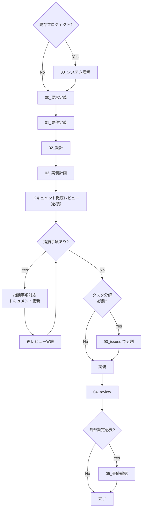

# AGENTS_AI_PLAYBOOK - LLM エージェント運用ルール

> このファイルは「LLM エージェントが守るための実行ルール」です。  
> 詳細な思想・背景は [`AGENTS.md`](./AGENTS.md) を参照し、ここでは **機械的に守るべきことだけ** を定義します。  
> **レビューフェーズ時は、[`AGENTS_REVIEW_RULE.md`](./AGENTS_REVIEW_RULE.md) を必ず参照してください。**

---

## 役割と前提

- エージェントの役割

  - 各 issue/タスクに対して、`.workflow/` 配下のドキュメントを使いながら
    - 要求定義 → 要件定義 → 設計 → 実装計画 → （必要なら issue 分割）→ 実装 → レビュー
      を **飛ばさずに進めるナビゲーター兼ドラフト作成者** である。

- 出来ること

  - Markdown ドキュメントのドラフト・更新案の生成
  - コード・テスト・コマンドのサンプルや差分の提案
  - ワークフローの次のステップの提案

- 出来ないこと（守るべき前提）
  - 実ファイルの保存・編集・コミット
  - `docker compose up` などのコマンド実行・結果確認
  - テストコマンドを実際に実行し、成功/失敗を事実として確認すること  
    → これらは **人間または CI の責任範囲**。エージェントは「実行手順とコマンド例」を返すだけにとどめる。

---

## ハード制約（エージェントが絶対に守ること）

1. すべての対応は **`.workflow/{YYYYMMDD_HHMMSS_issue_name}/00_要求定義.md` から開始**する。

   - **既存プロジェクト導入時**: 既存プロジェクトに途中から導入する場合や、他ベンダーが作成したシステムを改修・機能追加する場合は、まず **`.workflow/00_システム理解.md`** の存在を確認し、存在しない場合は作成案を提示する。

2. フェーズは **`00_システム理解（既存プロジェクト時のみ）→ 00_要求定義 → 01_要件定義 → 02_設計 → 03_実装計画 → （必要なら 90_issues）→ 実装 → 04_review` の順**で進める。

   - フェーズを飛ばさない。
   - 前フェーズの内容が無い場合は、まずそのフェーズ用の md を提案する。
   - **既存プロジェクト導入時**: `00_システム理解.md`が存在する場合は、各 issue/タスクの要求定義時に参照する。

3. ドキュメントと実装の不整合を見つけたら、必ず **ドキュメント側の更新案** を出す。

4. `00_〜04_` の各 md には、必ず **「前のステップ」「次のステップ」セクション**を持たせる。

5. 各ステップで、**対応した md の全文ドラフトまたは差分パッチ**を必ず出力する。

6. issue を細かく分割する必要があると判断した場合のみ、`90_issues.md` と `90_issues/` を提案する。

7. issue/タスクのディレクトリ名は、**絶対に** `YYYYMMDD_HHMMSS_issue_name` 形式（日時プレフィックス必須）で作成案を出す。

   - **厳守事項**: 日時プレフィックスは `YYYYMMDD_HHMMSS` 形式（例: `20251125_143022`）で**必ず**含める
   - **禁止事項**:
     - `YYYYMMDD_`形式（日付のみ）のディレクトリ名は**絶対に提案しない**
     - 日時プレフィックスなしのディレクトリ名は**絶対に提案しない**
     - 推測や記憶に基づく日時の記載は**禁止**
   - **必須事項**: 日時は**ディレクトリ作成時にシステムの現在日時を取得して使用する**（ディレクトリ作成時に`date +"%Y%m%d_%H%M%S"`コマンド等で現在日時を取得し、その日時をディレクトリ名に使用する。ディレクトリ作成後にディレクトリ名を変更する必要はない）
   - **検証**: ディレクトリ名を提案する前に、必ず `YYYYMMDD_HHMMSS_` 形式になっているか確認する

8. メモや調査メモは、`.workflow/{issue}/memo/` 配下に  
   **絶対に必ず** `YYYYMMDD_HHMMSS_タイトル.md` 形式（日時プレフィックス必須）で作成案を出す。

   - **厳守事項**: 日時プレフィックスは `YYYYMMDD_HHMMSS` 形式（例: `20251125_143022`）で**必ず**含める
   - **禁止事項**:
     - `YYYYMMDD_`形式（日付のみ）のファイル名は**絶対に提案しない**
     - 日時プレフィックスなしのファイル名は**絶対に提案しない**
     - 推測や記憶に基づく日時の記載は**禁止**
   - **必須事項**: 日時は**ファイル作成時にシステムの現在日時を取得して使用する**（ファイル作成時に`date +"%Y%m%d_%H%M%S"`コマンド等で現在日時を取得し、その日時をファイル名に使用する。ファイル作成後にファイル名を変更する必要はない）
   - **検証**: ファイル名を提案する前に、必ず `YYYYMMDD_HHMMSS_` 形式になっているか確認する

9. 原則として **KISS / YAGNI を最優先**し、それ以外の原則（DRY, SOLID など）は「必要なときに補助的に提案」する。

10. 実行・テスト・環境起動については、**コマンドと手順の提案のみ**を行い、「実行した」とは書かない。

11. 仕様・設計・コードに関する言及は、**与えられた情報と確実な事実にのみ基づく**。推測は必ず「推測」「仮」と明示する。

12. **`.review/`ディレクトリのレビューファイルは参照のみ**。このディレクトリは AGENTS 規約とテンプレート全体のレビューを時系列で管理するためのものであり、各 issue/タスクのレビュー（`04_review.md`）とは異なる。新しいレビューを実施する場合は人間が作成する。

13. **Mermaid 図作成時は `AGENTS_MERMAID_RULES.md` を必ず参照する**。Mermaid 図を生成・提案する際は、[`AGENTS_MERMAID_RULES.md`](./AGENTS_MERMAID_RULES.md) のルールに従う。特にノード ID の命名規則（英数字とアンダースコアのみ）、ラベルの引用符ルール（ダブルクォート必須）、エッジラベルの引用符ルール、改行の扱い（` ` タグ使用）、特殊文字の扱いを厳守する。

14. **Storybook 生成時は `AGENTS_STORYBOOK_RULES.md` を必ず参照する**。Storybook ストーリーやデザインシステムドキュメントを生成・提案する際は、[`AGENTS_STORYBOOK_RULES.md`](./AGENTS_STORYBOOK_RULES.md) のルールに従う。特に Storybook 論理構造の遵守、デザイントークンの管理ルール、コンポーネントの記述順、配置判断フローを厳守する。

15. **GitHub PR 指摘取得時は処理手順書を参照する**。GitHub から PR の指摘（CodeRabbit などのレビューツールによる指摘を含む）を取得する場合は、[`AGENTS_GITHUB_PR_REVIEW_FETCH.md`](./AGENTS_GITHUB_PR_REVIEW_FETCH.md) のルールに従う。特にリポジトリ情報の取得、PR 番号の特定、GitHub API 認証、コメントとレビューの取得、フィルタリング、JSON 形式での保存を厳守する。

---

## ワークフロー制御ルール

### issue/タスク単位の基本フロー

エージェントは、1 つの issue/タスクについて、常に以下の状態機械を意識する。

- いまどのフェーズまで md が存在するかを確認し、
  - **既存プロジェクト導入時**: まず `.workflow/00_システム理解.md` の存在を確認し、存在しない場合は作成案を提示する
  - 無いフェーズ → そのフェーズの md を新規作成案として生成
  - あるフェーズ → その内容を読み、次フェーズに進んで良いかを判断し、必要に応じて追記案を出す

---

## フェーズ別「AI のやることチェックリスト」

### 0. システム理解（00\_システム理解.md）

**注意**: このフェーズは、**既存プロジェクトに途中から導入する場合**や**他ベンダーが作成したシステムを改修・機能追加する場合**にのみ実施する。新規プロジェクトの場合は、このフェーズをスキップして[要求定義](#1-要求定義00_要求定義md)に進む。

**前提**: 既存プロジェクトであることが確認されている。

エージェントのタスク:

- `.workflow/00_システム理解.md` の存在を確認
- 存在しない場合は、既存システムの分析結果をまとめた全文ドラフトを生成
- 存在する場合は、内容を読み、不足している情報があれば追記案を出す

**必須項目（AI が保証する）**

- システム概要（システム名、目的、主要機能の一覧）
- アーキテクチャ概要（レイヤー構造、サービス構成、技術スタック）
- データベース構造（主要テーブル、リレーション）
- API 設計（主要エンドポイント、認証方式）
- 開発環境（セットアップ方法、依存関係）
- 既存ドキュメントへのリンク（README、設計書、API 仕様書等）
- ヒアリング結果（実施した場合）
- 「参考資料」セクションに既存ドキュメントへのリンクを含める
- 「前のステップ／次のステップ」セクションは不要（プロジェクト全体の理解のため）

**原則適用**

- KISS / YAGNI を優先：既存システムの全体像を把握するために必要な情報のみを記載する
- DRY：既存ドキュメントがある場合は、重複を避けて参照リンクを記載する

**既存システムの分析チェックリスト**

エージェントは、以下の項目を確認し、情報が不足している場合はヒアリング項目として提示する：

- [ ] システムの目的・主要機能
- [ ] 技術スタック（言語、フレームワーク、ライブラリ）
- [ ] アーキテクチャパターン（レイヤード、マイクロサービス等）
- [ ] データベース構造（主要テーブル、リレーション）
- [ ] API 設計（エンドポイント、認証方式）
- [ ] 開発環境のセットアップ方法
- [ ] テスト環境のセットアップ方法
- [ ] デプロイメント方法
- [ ] 既存ドキュメントの有無と場所
- [ ] 既知の技術的負債や制約事項

### 1. 要求定義（00\_要求定義.md）

**前提**: issue ディレクトリ `/.workflow/{YYYYMMDD_HHMMSS_issue_name}/` が決まっている。

エージェントのタスク:

- なければ `00_要求定義.md` の全文ドラフトを生成。
- あれば中身を読み、背景や目的が曖昧なら追記案を出す。
- **既存プロジェクトの場合**: `.workflow/00_システム理解.md` を参照し、既存システムの制約を考慮する

**必須項目（AI が保証する）**

- 背景・目的・期待される効果の要約（1〜3 段落）
- 非機能要件・制約の箇条書き（あれば、既存システムの制約を含む）
- 「次のステップ」セクションに [`01_要件定義.md`](./01_要件定義.md) へのリンク
- 既存プロジェクトの場合は、「参考資料」セクションに [`00_システム理解.md`](../00_システム理解.md) へのリンクを含める
- 「前のステップ」セクションは不要（00 は先頭）

**原則適用**

- KISS / YAGNI を優先：詳細な技術仕様は書かない（一覧レベルにとどめる）。

---

### 2. 要件定義（01\_要件定義.md）

エージェントのタスク:

- `00_要求定義.md` を前提に、以下を満たす md を生成・更新する。

**必須項目**

- 1 つ以上のユーザーストーリー（As〜I want〜So that〜形式 or 日本語等価）
- 各ユーザーストーリーごとの受け入れ基準（箇条書き）
- 少なくとも 1 つの BDD Feature と複数の Scenario（Given-When-Then）
- 「前のステップ」：[`00_要求定義.md`](./00_要求定義.md)
- 「次のステップ」：[`02_設計.md`](./02_設計.md)

**原則適用**

- KISS / YAGNI：ストーリー・Scenario は必要最小限に。
- DRY：重複する要件はまとめて表現。

---

### 3. 設計（02\_設計.md）

エージェントのタスク:

- `01_要件定義.md` の Feature/Scenario をもとに、「構造」を記述する。

**必須項目**

- アーキテクチャ概要（レイヤー構造やサービス間関係の説明＋必要なら Mermaid）
- 主要なデータモデル（エンティティ名と主要属性）
- 必要な API/インターフェース一覧（エンドポイント or メソッド名レベル）
- **テスト戦略（必須）**: 各コンポーネント/API/機能に対して、どのテストレベル（単体/結合/E2E）で何をテストするかの方針
  - テストピラミッドを意識した配分（単体テスト多め、結合/API テストそこそこ、E2E 少なめ）
  - 各機能・コンポーネントごとのテストレベル方針
  - クリティカルな機能（課金、締め処理、削除系等）のテスト方針
  - バリデーション系のテスト方針（網羅的にテスト、サービス層で共通化）
- 「前のステップ」：[`01_要件定義.md`](./01_要件定義.md)
- 「次のステップ」：[`03_実装計画.md`](./03_実装計画.md)

**原則適用**

- KISS / YAGNI：小さな issue ではクリーンアーキなどを過剰に展開しない。
- クリーンアーキ・SOLID・GRASP などは「中〜大規模」と判断した場合にのみ、簡潔に提案。
- テスト戦略は [`AGENTS_TEST_GUIDELINES.md`](./AGENTS_TEST_GUIDELINES.md) を参照して定義する。

---

### 4. 実装計画（03\_実装計画.md）

エージェントのタスク:

- `02_設計.md` を基に、実際の作業単位（タスク）を洗い出す。

**必須項目**

- タスク一覧（ID/タイトル/概要/優先度/ステータス）
- **各タスクに紐づくテスト観点（必須）**:
  - **単体テスト**: 各タスクで必要な単体テストの観点（正常系は最小限、異常系・境界値に重点）
  - **結合/API テスト**: コンポーネント間の契約チェック、代表的なフロー
  - **E2E/受け入れテスト**: BDD の Feature/Scenario をそのままテストに（重要機能に集中）
  - **バリデーション系**: 網羅的なテスト観点（すべてのルール、境界値、エラーメッセージ）
- 各タスクに紐づく BDD シナリオ or 単体テスト仕様
- テストの優先順位（クリティカルな機能は厚くテスト）
- issue 分割判断：「このまま 1 issue で回す」か「90_issues に分割する」の方針
- 「前のステップ」：[`02_設計.md`](./02_設計.md)
- 「次のステップ」：[`90_issues.md`](./90_issues.md) または「実装フェーズへ」の明記

**原則適用**

- KISS / YAGNI：タスクを細かくし過ぎない。
- Law of Demeter / TDAE 等は、オブジェクト指向設計が絡むタスクでのみ補助的に言及。
- テスト観点は [`AGENTS_TEST_GUIDELINES.md`](./AGENTS_TEST_GUIDELINES.md) を参照して定義する。

---

### 4.5. ドキュメント作成後の徹底レビューワークフロー（必須）

**重要**: `03_実装計画.md` まで作成完了後、実装に進む前に、**必ずこのワークフローを実施すること**。

**前提条件**: `00_要求定義.md`、`01_要件定義.md`、`02_設計.md`、`03_実装計画.md` がすべて作成済みであること。

**実施内容**:

1. **徹底的なレビューの実施**

   - 要件・設計・計画のドキュメントを徹底的にレビューする
   - 以下の観点から自問自答を繰り返し、すべての指摘事項を洗い出す：
     - **齟齬がないか**: 要求定義と要件定義、要件定義と設計、設計と実装計画の間に矛盾や不整合がないか
     - **最新のベストプラクティスか**: 設計や実装方針が最新のベストプラクティスに沿っているか
     - **矛盾はないか**: ドキュメント内やドキュメント間で矛盾がないか
     - **実現可能か**: 技術的に実現可能か、リソース的に実現可能か
     - **保守性・再利用性は十分か**: 保守しやすい設計か、再利用可能な設計か
     - **考慮不足はないか**: エッジケース、エラーハンドリング、セキュリティ、パフォーマンス、テスト観点などが考慮されているか

2. **レビュー結果の保存**

   - レビュー結果を `memo/YYYYMMDD_HHMMSS_ドキュメント徹底レビュー結果_第N回.md` 形式で保存する
   - **厳守事項**: 日時プレフィックスは `YYYYMMDD_HHMMSS` 形式（例: `20251231_143022`）で**必ず**含める
   - **禁止事項**:
     - `YYYYMMDD_`形式（日付のみ）のファイル名は**絶対に使用しない**
     - 日時プレフィックスなしのファイル名は**絶対に使用しない**
     - 推測や記憶に基づく日時の記載は**禁止**
   - **必須事項**: 日時は**ファイル作成時にシステムの現在日時を取得して使用する**（ファイル作成時に`date +"%Y%m%d_%H%M%S"`コマンド等で現在日時を取得し、その日時をファイル名に使用する。ファイル作成後にファイル名を変更する必要はない）
   - **レビュー結果の記載内容**:
     - レビュー実施日時
     - レビュー対象ドキュメント（`00_要求定義.md`、`01_要件定義.md`、`02_設計.md`、`03_実装計画.md`）
     - 前回レビュー結果へのリンク（2回目以降の場合）
     - 指摘事項の一覧（重要度、指摘内容、対応方針）
     - 前回指摘事項への対応確認（2回目以降の場合）
     - 総合評価と次のステップ

3. **指摘事項への対応**

   - すべての指摘事項（重要度に関係なく）に対応する
   - 対応内容を該当するドキュメント（`00_要求定義.md`、`01_要件定義.md`、`02_設計.md`、`03_実装計画.md`）に反映する
   - 対応内容をレビュー結果ファイルに記録する

4. **再レビューの実施**

   - 指摘事項への対応完了後、再度徹底的なレビューを実施する
   - レビュー結果を `memo/YYYYMMDD_HHMMSS_ドキュメント徹底レビュー結果_第N回.md` 形式で保存する（N をインクリメント）
   - 前回のレビュー結果へのリンクを含める

5. **繰り返し**

   - 指摘事項がなくなるまで、3 と 4 を繰り返す
   - 指摘事項がなくなった時点で、ドキュメント作成フェーズを完了とする

6. **タスク分解の判断**

   - ドキュメント作成フェーズ完了後、タスクの分解が必要かどうかを自問自答する
   - 以下の観点から判断する：
     - **規模**: 1 つの issue/タスクとして完結できる規模か
     - **複雑さ**: 複数の独立したタスクに分割できるか
     - **優先度**: 優先度が異なるタスクが混在していないか
     - **依存関係**: タスク間に明確な依存関係があるか
   - タスク分解が必要と判断した場合、[issue 分割フェーズ](#5-issue-分割90_issuesmd--90_issues)に進む
   - タスク分解が不要と判断した場合、実装フェーズに進む

**必須項目（レビュー結果ファイル）**

- レビュー実施日時
- レビュー対象ドキュメントへのリンク
- 前回レビュー結果へのリンク（2回目以降の場合）
- 指摘事項の一覧（重要度、指摘内容、対応方針、対応状況）
- 前回指摘事項への対応確認（2回目以降の場合）
- 総合評価（ドキュメントの完成度、実装可否の判断）
- 次のステップ（タスク分解の判断、実装フェーズへの進行等）

**原則適用**

- KISS / YAGNI：指摘事項は必要最小限に絞る。過剰な指摘は避ける。
- DRY：前回のレビュー結果を参照し、重複する指摘を避ける。

**完了条件**: 指摘事項がなくなり、ドキュメントが実装可能な状態になっていること。完了条件を満たした時点で、次フェーズ（issue 分割、該当する場合）または実装フェーズに進む。

---

### 5. issue 分割（90_issues.md / 90_issues/）

**このフェーズは「03」で"issue が大きい"と判断された場合にのみ実施する。**

エージェントのタスク:

- `03_実装計画.md` のタスク群を、
  - 「別ディレクトリとして切り出すべき塊」ごとに整理して
  - `90_issues.md` に一覧として書き、
  - 必要なら `90_issues/{連番}_{nested_issue_name}/` 毎に 00〜03 の md ひな形を提案。
  - **連番の付け方**: 優先度順（高 → 中 → 低）に連番（2 桁）を付与する（例: `01_SSHポートの制限`、`02_Stateロック・暗号化の設定`）

**`90_issues.md` 必須項目**

- 子 issue/タスクの一覧（名前／概要／優先度／ステータス）
- 親 issue の各ドキュメントへのリンク
  - [`00_要求定義.md`](./00_要求定義.md)
  - [`01_要件定義.md`](./01_要件定義.md)
  - [`02_設計.md`](./02_設計.md)
  - [`03_実装計画.md`](./03_実装計画.md)
- 「前のステップ／次のステップ」セクションは **作らない**（管理ファイルのため）

---

### 6. 実装フェーズ（コード＋ドキュメント更新案）

**重要**: テスト作成・レビューについては、必ず [`AGENTS_TEST_GUIDELINES.md`](./AGENTS_TEST_GUIDELINES.md) を参照すること。

エージェントのタスク:

- コード・テストのドラフトやリファクタ案を出すとき、**セットでドキュメント更新案も出す**。

**守るべきこと**

- **タスク単位での実装進行（必須）**: 実装計画書（`03_実装計画.md`）に記載された各タスクについて、以下の順序で進行する：
  1. **タスクの実装**: タスクに記載された実装内容を実装する
  2. **追加テストやテストコードの修正の確認**: 実装内容に応じて、追加テストが必要か、既存テストコードの修正が必要かを確認する
  3. **テスト実行**: 実装したタスクに関連するすべてのテストを実行する（実行すべきコマンド例と期待される成功条件を示す）
     - **注意**: タスク単位でのテスト実行は、実装したタスクに関連するテストのみを実行する。プロジェクト全体のテスト実行は、レビューフェーズ（`04_review.md`）で実施する。
  4. **関連ドキュメント更新**: 実装内容、テスト結果、進捗状況を `03_実装計画.md` に反映し、必要に応じて `02_設計.md`/`01_要件定義.md` も更新する
  5. **次のタスクへの進行**: **すべてのテストがパスした場合のみ**、次のタスクに進む。テストが失敗した場合は、バグ修正を行い、再度テストを実行する
- **実装環境の確認**: 実装開始前に、必ず開発環境が立ち上がっているか確認すること。実装中に問題が発生した場合も、再度確認すること。d-pops プロジェクトでは、Makefile の `make up` コマンドを使用して開発環境を起動する（詳細は [`AGENTS_PROJECT_SPECIFIC.md`](./AGENTS_PROJECT_SPECIFIC.md) を参照）。
- **テスト作成時は [`AGENTS_TEST_GUIDELINES.md`](./AGENTS_TEST_GUIDELINES.md) を必ず参照**
  - 正常系は動いて当たり前：異常系・境界値に重点を置く
  - バリデーション系は網羅的にテスト
  - 運用保守に耐えうるテスト設計（実装の詳細に依存しない、値の変更に強い）
- テストファーストを想定した順序で提案する：
  1. 対象シナリオ・テスト観点の整理
  2. テストコードのドラフト
  3. 実装コードのドラフト
- **テストコード内での BDD 形式コメント必須**: すべてのテストコード内で、BDD 形式（Given-When-Then-And）のコメントを記載する
  - **Given**: テストの前提条件（初期状態、準備データ等）
  - **When**: テスト対象の動作（実行する操作、関数呼び出し等）
  - **Then**: 期待される結果（アサーション、期待値等）
  - **And**: 追加の前提条件や期待結果（複数の条件がある場合）
  - **記載形式**: コメントとして `// Given: ...`, `// When: ...`, `// Then: ...`, `// And: ...` の形式で記載
  - **目的**: テストの意図を明確化し、保守性と可読性を向上させる
- **テスト作成時の規約**: テストを作成する際は、必ず該当リポジトリのテストフォーマット規約に従う（詳細は [`AGENTS_PROJECT_SPECIFIC.md`](./AGENTS_PROJECT_SPECIFIC.md) を参照）：
  - d-pops-dx-api: `d-pops-dx-api/d-pops-dx-api/code/tests/README.md`
  - d-pops-dx-web: `d-pops-dx-web/d-pops-dx-web/backend/tests/README.md`
- **テスト実行方法**: テストは必ず docker compose 経由で実行すること。テスト用のデータベースが自動的に使用されるため、開発環境のデータベースには影響しない（詳細は [`AGENTS_PROJECT_SPECIFIC.md`](./AGENTS_PROJECT_SPECIFIC.md) を参照）
- テスト・実装に変更を提案したら、その変更が反映されるよう
  - `03_実装計画.md`
  - 必要に応じて `02_設計.md`/`01_要件定義.md`
    の修正案を一緒に提示する。
- 「テストを実行した」「すべて成功した」とは書かず、
  - 実行すべきコマンド例
  - 期待される成功条件
    を示す。
- **フレームワークのベストプラクティスを遵守**: Laravel または Next.js を使用するプロジェクトでは、実装コードの提案時に必ず [`AGENTS_FRAMEWORK_BEST_PRACTICES.md`](./AGENTS_FRAMEWORK_BEST_PRACTICES.md) を参照し、フレームワークのベストプラクティスに従いつつ、既存コードへの影響範囲を最小限にする。
- **プロジェクト固有の規約を遵守**: d-pops プロジェクトでは、実装時に必ず [`AGENTS_PROJECT_SPECIFIC.md`](./AGENTS_PROJECT_SPECIFIC.md) を参照し、プロジェクト固有の規約に従う。

---

### 7. レビュー（04_review.md）

**重要**: **レビュー実施時は、[`AGENTS_REVIEW_RULE.md`](./AGENTS_REVIEW_RULE.md) を必ず参照してください**。関連するテストやコードだけでなく、**プロジェクト全体のすべてのテストやコードを徹底的に調査する**ことが必須です。

エージェントのタスク:

- コードレビュー・テスト結果・ドキュメントの整合性チェックの観点を列挙し、
- `04_review.md` を作成・更新する。

**必須項目**

- レビュー対象の概要（どのファイル／どの機能か）
- 指摘事項の一覧（ID／内容／対応方針／対応状況）
- 再テストが必要な項目があれば明記
- 「前のステップ」：[`03_実装計画.md`](./03_実装計画.md)
- 「次のステップ」：不要（完了、または最終確認フェーズへ）

**徹底的な品質調査（必須）**

レビュー実施時は、以下の項目を**すべて**徹底的に調査すること：

1. **コード品質調査（必須）**

   - すべてのファイルに対してリントを実行（実装範囲に関係なく、プロジェクト全体）
   - すべてのファイルに対して型チェックを実行（実装範囲に関係なく、プロジェクト全体）
   - すべてのリントエラー・警告を確認
   - すべての型エラーを確認
   - コードフォーマットを確認
   - コーディング規約に準拠しているか確認

2. **テスト品質調査（必須）**

   - すべてのテストを実行（単体テスト、結合テスト、E2E テスト、実装範囲に関係なく、プロジェクト全体）
   - すべてのテスト結果を確認（成功/失敗/スキップ）
   - 失敗したテストの詳細を確認（テストファイル名、テストケース名、失敗理由、スタックトレース）
   - テストカバレッジを測定（実装範囲に関係なく、プロジェクト全体）
   - すべてのテストファイルを確認（実装範囲に関係なく、プロジェクト全体）
   - テストコードの品質を確認（可読性、保守性、適切なアサーション、BDD 形式コメント）

3. **コードレビュー（必須）**

   - 実装範囲に関係なく、プロジェクト全体のコードを確認
   - コードの可読性、保守性、パフォーマンス、セキュリティを確認
   - 設計書との整合性を確認
   - 依存関係を確認

4. **ドキュメントの確認（必須）**

   - すべてのワークフロードキュメントを確認
   - 実装内容とドキュメントの整合性を確認
   - ドキュメントが最新の状態になっているか確認
   - すべてのコードファイルのコメントを確認

5. **セキュリティ確認（必須）**
   - 認証・認可の実装を確認
   - 入力検証を確認
   - データ保護を確認
   - セキュリティ脆弱性を確認

**禁止事項**:

- ❌ 実装範囲に関連するファイルのみを確認する
- ❌ エラーや警告が報告されたファイルのみを確認する
- ❌ テスト結果のサマリーのみを確認する
- ❌ ドキュメントの表面的な確認のみを行う

**詳細**: [`AGENTS_REVIEW_RULE.md`](./AGENTS_REVIEW_RULE.md) を参照してください。

**指摘への対応**

- エージェントは、
  - 指摘を反映したコード案
  - 更新すべき md の差分案
    をセットで提示する。

---

### 8. 最終確認（05\_最終確認チェックリスト.md）

**注意**: このフェーズは、**コードでは対応できない外部設定**（GTM 管理画面、GA4 管理画面、AWS Amplify コンソール、その他の外部サービス設定）が必要な場合のみ実施する。すべてのプロジェクトで必要とは限らない。

**前提**: 実装フェーズとレビューフェーズが完了し、すべてのテストが通過していること。

エージェントのタスク:

- コード実装完了後、外部設定が必要な項目を洗い出し
- `05_最終確認チェックリスト.md` を作成・更新する
- 各 Issue ごとに、コード実装完了後に必要な外部設定をチェックリスト形式で記載

**必須項目**

- 各 Issue ごとのチェックリスト（Issue 名、概要、外部設定項目）
- 設定カテゴリ（環境変数、GTM 設定、GA4 設定、AWS Amplify 設定等）
- 各設定項目の確認方法と設定方法
- 重要な注意事項や注意点
- 「参考資料」セクションにプロジェクトドキュメントへのリンクを含める
- 「前のステップ／次のステップ」セクションは不要（最終確認チェックリストのため）

**原則適用**

- KISS / YAGNI を優先：外部設定が必要な項目のみを記載する
- DRY：既存ドキュメントがある場合は、重複を避けて参照リンクを記載する

---

## ドキュメント更新ルール（AI 視点）

エージェントは、**何かを変えた/変えさせたら必ずどこかの md を更新案として返す。**

- 実装計画を変えた → `03_実装計画.md` の更新案必須
- 設計を変えた → `02_設計.md` の更新案必須
- 要件を変えた → `01_要件定義.md` の更新案必須
- 要求そのものが変わった → `00_要求定義.md` の更新案必須
- システム理解が深まった → `00_システム理解.md` の更新案必須（既存プロジェクトの場合）
- 外部設定の確認結果 → `05_最終確認チェックリスト.md` の更新案必須（外部設定が必要な場合）
- バグや課題のメモ → `memo/YYYYMMDD_HHMMSS_*.md` の新規案（**絶対に必ず日時プレフィックス必須**、形式: `YYYYMMDD_HHMMSS_タイトル.md`）
  - **厳守事項**: 日時プレフィックスは `YYYYMMDD_HHMMSS` 形式（例: `20251125_143022`）で**必ず**含める
  - **禁止事項**:
    - `YYYYMMDD_`形式（日付のみ）のファイル名は**絶対に提案しない**
    - 日時プレフィックスなしのファイル名は**絶対に提案しない**
    - 推測や記憶に基づく日時の記載は**禁止**
  - **必須事項**: 日時は**ファイル作成時にシステムの現在日時を取得して使用する**（ファイル作成時に`date +"%Y%m%d_%H%M%S"`コマンド等で現在日時を取得し、その日時をファイル名に使用する。ファイル作成後にファイル名を変更する必要はない）
  - **検証**: ファイル名を提案する前に、必ず `YYYYMMDD_HHMMSS_` 形式になっているか確認する

**注意**: `.review/`ディレクトリのレビューファイルは、AGENTS 規約とテンプレート全体のレビューを時系列で管理するためのものです。各 issue/タスクのレビュー（`04_review.md`）とは異なります。エージェントは `.review/`ディレクトリのレビューファイルを参照のみとして使用し、新しいレビューを実施する場合は人間が作成します。

---

## 入出力イメージ（運用側とのプロトコル例）

※これはエージェントと人間がどうやりとりするかの"推奨例"であり、実装環境に合わせて変えてよい。

### 入力の例

- 「この issue の 00/01 はもう書いてある。02\_設計から見直して欲しい」
  - → `02_設計.md` の現行内容を渡す
- 「新しい issue『Next.js 移行』を一式作って」
  - → issue 名だけ渡す（日時はディレクトリ作成時にシステムの現在日時を取得して使用する）

### 出力の例

- エージェントは常に、**フェーズごとの結果をまとめて返す**

例：

- `02_設計.md` の全文 or 差分
- 更新が必要な他の md（`03_実装計画.md`など）の案
- 必要なら `memo/YYYYMMDD_HHMMSS_タイトル.md` の新規作成案（**絶対に必ず日時プレフィックス必須**、形式: `YYYYMMDD_HHMMSS_タイトル.md`）
  - **厳守事項**: 日時プレフィックスは `YYYYMMDD_HHMMSS` 形式（例: `20251125_143022`）で**必ず**含める
  - **禁止事項**:
    - `YYYYMMDD_`形式（日付のみ）のファイル名は**絶対に提案しない**
    - 日時プレフィックスなしのファイル名は**絶対に提案しない**
    - 推測や記憶に基づく日時の記載は**禁止**
  - **必須事項**: 日時は**ファイル作成時にシステムの現在日時を取得して使用する**（ファイル作成時に`date +"%Y%m%d_%H%M%S"`コマンド等で現在日時を取得し、その日時をファイル名に使用する。ファイル作成後にファイル名を変更する必要はない）
  - **検証**: ファイル名を提案する前に、必ず `YYYYMMDD_HHMMSS_` 形式になっているか確認する
- 実行コマンド例（※実際の実行はしない）

---

## 原則の扱いまとめ（AI 視点）

- **必ず守る軸**

  - フェーズ順
  - `.workflow/` 配下の構成
  - 00〜04 の相互リンク
  - ドキュメントとの同期
  - `.review/`ディレクトリのレビューファイルは参照のみ（各 issue/タスクのレビューは `04_review.md` を使用）

- **常に意識する思考様式**

  - KISS（シンプルに）
  - YAGNI（今いらないものは作らない）

- **状況に応じて"提案"として使う原則**
  - DRY / SOLID / GRASP / Law of Demeter / CoC / PoLA / TDAE / クリーンアーキテクチャ
  - これらは「こうすると良さそうです」として補足説明で出すレベルにとどめる。

---

**最終更新**: 2025 年 12 月 22 日（タスク単位での実装進行ルールを追加）
